# 5 Ways To Move An Image Or Layer Between Photoshop Documents

> Source: [https://www.photoshopessentials.com/basics/5-ways-move-images-photoshop-documents/](https://www.photoshopessentials.com/basics/5-ways-move-images-photoshop-documents/)
> Downloaded and converted to Markdown.

This tutorial shows you how to move an image or a layer from one Photoshop document to another. You'll learn how to copy and paste an image between documents, how to duplicate a layer, and three ways to drag and drop images between documents.

When it comes to blending and compositing images, Adobe Photoshop is the undisputed champ. In fact, Photoshop gives us so many interesting and powerful ways to combine images that our creativity is limited only by our skills and imagination. But before we can start combining images, we first need to know how to get multiple images into the same document. If you're new to Photoshop, blending even two photos together can seem like an impossible task. That's because Photoshop opens each image in its own separate document. To blend or composite the images, they need to be in the *same* document. 

In a previous tutorial, we learned all about [tabbed and floating document windows](/basics/tabbed-and-floating-documents-in-photoshop/ "Learn more about Photoshop tabbed documents and floating windows.") in Photoshop. We also learned how to view and arrange multiple open images on the screen using Photoshop's [multi-document layouts](/basics/view-multiple-images-photoshop/ "Learn about Photoshop multi-document layouts"). In this tutorial, we'll take what we've learned and explore five different ways to easily move images between documents. 

## What You'll Learn

We'll start with your basic **copy and paste** method. Then, we'll learn how to **duplicate a layer** from one document into another. Finally, we'll look at three ways to **drag and drop** an image between documents. We'll learn how to drag and drop images between tabbed documents, between documents in a multi-document layout, and between two floating document windows. Once you've seen how they all work, you can pick the method you like the best! I'll be using [Photoshop CC](https://prf.hn/l/dlXjD2w) but this tutorial is fully compatible with Photoshop CS6.

This is lesson 8 of 10 in our [Learning the Photoshop Interface](/basics/learning-the-photoshop-interface/ "Complete Guide to Learning the Photoshop Interface") series.

Let's get started!

## Opening The Images Into Photoshop

To follow along, you'll need two images. Here, I've used [Adobe Bridge](/basics/what-is-adobe-bridge/ "Learn how to use Adobe Bridge") to navigate to the folder containing the photos I'll be using. To open them into Photoshop, I'll click on the first image on the left to select it. Then, to select the second image as well, I'll press and hold my **Shift** key and click on the second image. With both photos selected, I'll double-click on either image to [open them into Photoshop](/basics/opening-images-photoshop/ "Learn how to open images into Photoshop"):

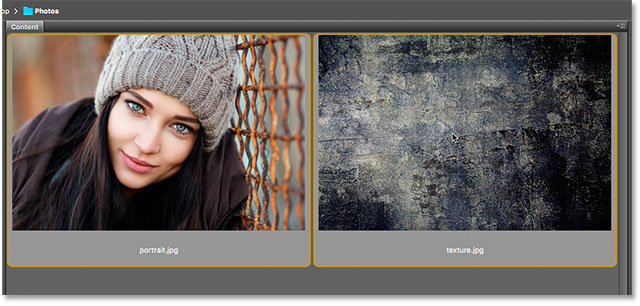
*Selecting and opening two images into Photoshop from Adobe Bridge.*

By default, Photoshop opens the images as tabbed documents, with only one document visible at a time. Here's my first image ([portrait photo](https://prf.hn/l/20Pa4aj) from Adobe Stock):

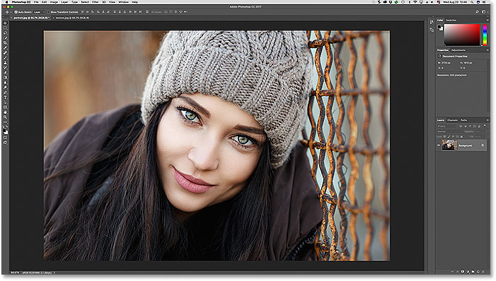
*The first of two photos open in Photoshop. Photo credit: Adobe Stock.*

To switch between open images, we click on the **tabs** along the top of the document windows. I'll switch to my second image by clicking its tab:

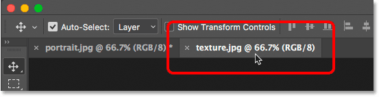
*Clicking the document tab to view the second open image.*

And now we see my second image. I'll use this image as a texture to blend in with the original image. We'll learn how to quickly blend images together at the end of this tutorial ([texture photo](https://prf.hn/l/OVRD0Dj) from Adobe Stock):

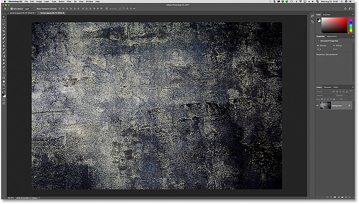
*The second image. Photo credit: Adobe Stock.*

## How To Move An Image Between Documents

### Method 1: Copy And Paste

The first method we'll learn for moving images between documents is how to copy and paste an image from one document into another. To copy and paste an image, first select the document that holds the image you want to move. With the document active, select the image inside the document by going up to the **Select** menu in the Menu Bar and choosing **All**. To copy the image, go up to the **Edit** menu and choose **Copy**. Switch to the document where you want to paste the image. Then, go up to the **Edit** menu and choose **Paste**. The pasted image will appear on its own separate layer above the original image in the Layers panel.

#### Step 1: Select The First Document

Let's go through the steps for copying and pasting an image between documents using my images as an example. I want to move my texture image into the same document as my portrait image. So the first thing I'll do is select my "texture.jpg" document by clicking on its **tab**:

*Selecting the document that holds the image to be copied.*

#### Step 2: Select The Image

To select the image itself, I'll go up to the **Select** menu in the Menu Bar along the top of the screen. Then, I'll choose **All**. This places a selection outline around my image, letting me know that the image is selected:

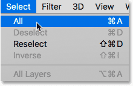
*Going to Select > All.*

#### Step 3: Copy The Image

With the image selected, I'll copy it to the clipboard by going up to the **Edit** menu in the Menu Bar and choosing **Copy**:

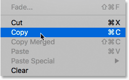
*Going to Edit > Copy*

#### Step 4: Switch To The Second Document

Next, I'll switch over to my "portrait.jpg" document by clicking on its **tab**:

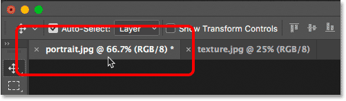
*Selecting the document where I want to paste the image.*

Before I paste the image into the document, let's first look in my [Layers panel](/basics/layers/layers-panel/ "Learn more about the Layers panel in Photoshop"). The Layers panel is where we can see all the layers in our document. We'll learn all about [layers](/photoshop-layers-learning-guide/ "Photoshop Layers learning guide") in other tutorials. For now, notice that the image is sitting on the [Background layer](/basics/background-layer-photoshop-cc/ "Learn more about the Background layer in Photoshop"). The Background layer is currently the only layer in the document:

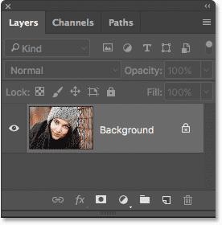
*The Layers panel showing the document's original image.*

#### Step 5: Paste The Image

To paste my texture image, I'll go up to the **Edit** menu in the Menu Bar. Then, I'll choose **Paste**:

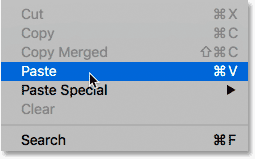
*Going to Edit > Paste.*

Photoshop pastes the texture image into the document. It looks like my texture photo is now the *only* photo in the document. That's because the texture photo is sitting in front of the portrait photo. Since both photos are the same size, the texture image is blocking the portrait image from view:

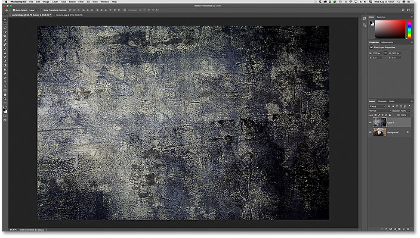
*The "texture.jpg" image has been pasted into the "portrait.jpg" image's document.*

To confirm that the document does in fact hold both images, let's look again in the Layers panel. This time, we see that we now have not one but *two* layers. The original portrait image is still sitting on the Background layer. And, Photoshop placed the texture image on a brand new layer, named "Layer 1", above it. Sure enough, both images are now in the same document:

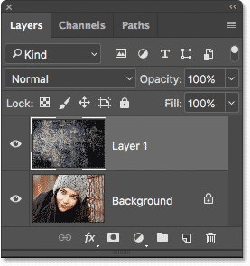
*The Layers panel now showing both images in the same Photoshop document.*

### Resetting The Documents

So that's the first way of moving images between documents. If you want to follow along with the next methods, you'll first need to reset your two documents back to their original states. First, we'll reset the document where you pasted the image. Make sure the document is still active. Then, go up to the **Edit** menu in the Menu Bar and choose **Undo Paste**. This removes the pasted image from the document, leaving you with just the original image:

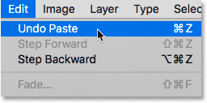
*Going to Edit > Undo Paste.*

Then, switch over to the document that holds the image you copied. To remove the selection outline from around the image, go up to the **Select** menu and choose **Deselect**. And with that, you're ready to move on to the next method:

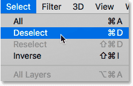
*Going to Select > Deselect.*

### Method 2: Duplicating The Layer

Next, we'll learn how to move an image from one Photoshop document to another by duplicating the layer. First, make sure the document that holds the image to want to move is selected. Go up to the **Layer** menu in the Menu Bar and choose **Duplicate Layer**. In the Duplicate Layer dialog box, give the layer a name (optional). In the **Destination** section of the dialog box, choose the other document as the destination. Then, click OK. The image will appear on a new layer in the other document.

#### Step 1: Select The Document That Holds The Image To Be Moved

Let's go through the steps in more detail. First, since I want to move my texture image into the portrait photo's document, I'll select my "texture.jpg" document by clicking its tab:

*Selecting the document that holds the image to be moved.*

If we look in the Layers panel, we see my texture image sitting on the Background layer. This is the layer we're going to duplicate:

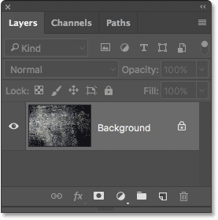
*The Layers panel showing the texture photo.*

#### Step 2: Select "Duplicate Layer" From The Layer Menu

To duplicate the layer, I'll go up to the **Layer** menu in the Menu Bar. Then, I'll choose **Duplicate Layer**:

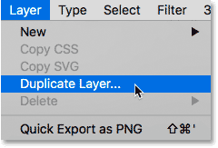
*Going to Layer > Duplicate Layer.*

#### Step 3: Set The Other Document As The Destination

This opens Photoshop's Duplicate Layer dialog box. At the top of the dialog box, it shows the name of the layer you'll be duplicating. In my case, it's the Background layer. By default, Photoshop simply adds the word "copy" to the end of the layer's original name. This will become the name of the layer ("Background copy") when it's moved into the other document. But you can give the duplicate layer a more descriptive name. Since this layer holds my texture image, I'll change the layer's name to "Texture".

In the **Destination** section, choose the document you want to move the image into as the destination. I'll choose my "portrait.jpg" document. When you're ready, click OK. Photoshop duplicates the layer and sends it over to the other document:

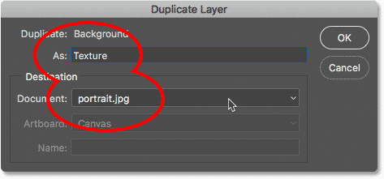
*Setting the other document as the destination for the layer.*

#### Step 4: Switch To The Other Document

I'll switch over to my "portrait.jpg" document by clicking its tab:

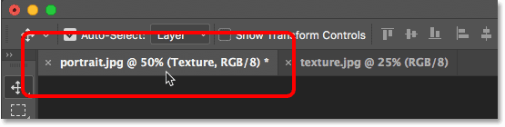
*Clicking the tab to switch documents.*

And if we look in the Layers panel, we see my "Texture" layer, which holds my texture image, now sitting above the portrait photo on the Background layer. Both images are now in the same document:

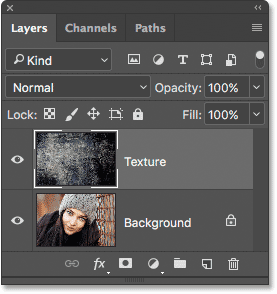
*The texture layer has been duplicated into the portrait document.*

[Related: How to open multiple images as layers in Photoshop](/basics/open-multiple-images-as-layers-in-photoshop/ "Read tutorial")

### Resetting The Document

Again if you're following along with each method, you'll need to reset your documents before you continue. This time, the only document we need to reset is the one we moved the image into (in my case, the "portrait.jpg" document). To remove the duplicate layer from the document, go up to the **Edit** menu in the Menu Bar and choose **Undo Duplicate Layer**:

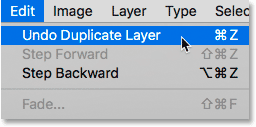
*Going to Edit > Undo Duplicate Layer.*

### Method 3: Drag And Drop Between Tabbed Documents

The next few ways we'll look at for moving images between documents all involve dragging and dropping the image. We'll start by learning how to drag and drop an image between tabbed documents. First, select the document that holds the image you want to move. Select the **Move Tool** from the **Toolbar**. Click on the image and drag it up and onto the **tab** of the other document. Wait for Photoshop to switch documents. Then, drag the image from the tab down into the document window. Press and hold your **Shift** key and release your mouse button to drop and center the image in the document.

#### Step 1: Select The Document With The Image You Want To Move

Once again, I'll start by selecting the document that contains my texture image. I'll do that by clicking on the document tab:

*Selecting the "texture.jpg" document.*

#### Step 2: Select The Move Tool

To drag and drop the image, we'll need Photoshop's **Move Tool**. I'll select the Move Tool from the [Toolbar](/basics/photoshop-tools-toolbar-overview/ "Learn about the Toolbar and Photoshop's tools") along the left of the screen:

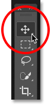
*Selecting the Move Tool.*

#### Step 3: Drag The Image Onto The Other Document's Tab

With the Move Tool in hand, I'll click on my texture image. Then, I'll drag it up and onto the **tab** for my "portrait.jpg" document:

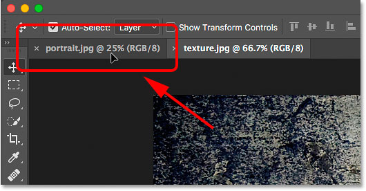
*Clicking and dragging the texture image onto the portrait document's tab.*

#### Step 4: Drag From The Tab Into The Document

Keep your mouse button held down and your mouse cursor directly over the tab until you see Photoshop switch documents. In my case, I'll wait for it to switch from my texture image to my portrait image. Then, I'll drag the texture image from the tab down into the portrait document's window:

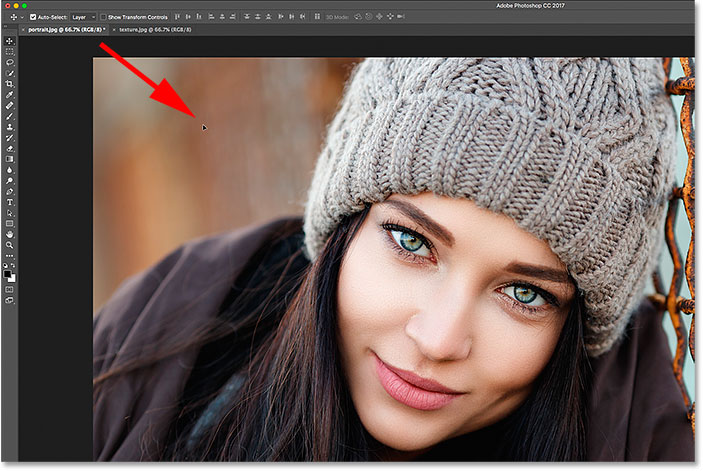
*Once Photoshop switches documents, drag the image into the document.*

#### Step 5: Release Your Mouse Button

To drop the image into the document, I'll press and hold my **Shift** key. Then, I'll release my mouse button. The Shift key tells Photoshop to center the image within the document. If you don't need to center the image, release your mouse button without holding Shift. If you look in your Layers panel, you'll see that both images are now in the same document:

*Hold Shift and release your mouse button to drop and center the image.*

### Resetting The Document

Let's reset the document so we can move on to the fourth method. To remove the image that you dragged into the document, go up to the **Edit** menu and choose **Undo Drag Layer**:

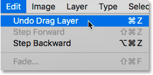
*Going to Edit > Undo Drag Layer.*

### Method 4: Drag And Drop Using A Multi-Document Layout

We've seen how to drag and drop between two tabbed documents. Now let's learn how to drag and drop an image between documents using one of Photoshop's multi-document layouts. We learned all about [multi-document layouts](/basics/view-multiple-images-photoshop/ "Learn how to view multiple images at once in Photoshop") in the previous tutorial. 

Go up to the **Window** menu in the Menu Bar, choose **Arrange**, and then choose the **2-up Vertical** layout. This places your two documents side by side on the screen. Select the **Move Tool** from the Toolbar. Click on the image you want to move and drag it into the other document window. Press and hold **Shift** and release your mouse button to drop and center the image in the document. Go up to the **Window** menu, choose **Arrange**, then choose **Consolidate All to Tabs** to switch back to the default tabbed document view.

#### Step 1: Select The "2-up Vertical" Layout

I'll start by going up to the **Window** menu in the Menu Bar and choosing **Arrange**. From there, I'll select the **2-up Vertical** layout:

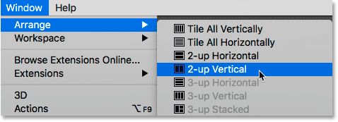
*Going to Window > Arrange > 2-up Vertical.*

This places both of my documents side by side each other, allowing me to see both images at once:

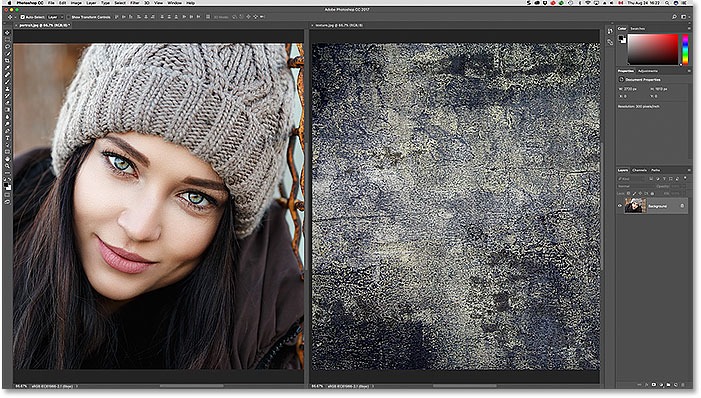
*Both images are now visible on the screen.*

#### Step 2: Select The Move Tool

Next, I'll select the **Move Tool** from the Toolbar:

*Selecting the Move Tool.*

#### Step 3: Click And Drag The Image Into The Other Document

With the Move Tool selected, I'll click on my texture image and, with my mouse button held down, I'll drag it into the portrait photo's document window:

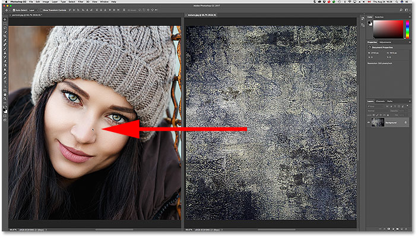
*Dragging the texture photo into the other document beside it.*

#### Step 4: Release Your Mouse Button

To drop and center the texture image, I'll press and hold **Shift**, then I'll release my mouse button. Photoshop copies the texture image from its original document into the portrait document:

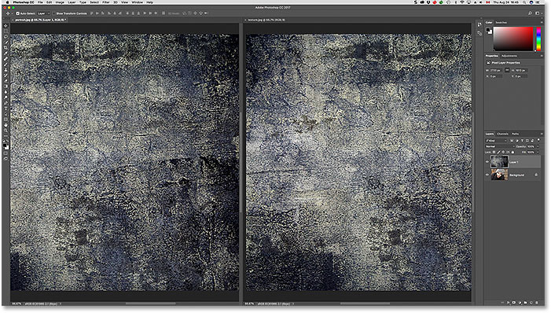
*Dragging the texture photo into the other document beside it.*

#### Step 5: Choose "Consolidate All to Tabs"

To switch your view from the "2-up Vertical" layout back to the default, tabbed document view, go up to the **Window** menu, choose **Arrange**, then choose **Consolidate All to Tabs**:

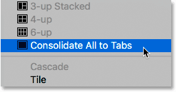
*Going to Window > Arrange > Consolidate All to Tabs.*

And now we're back to the default view, with both images in the same document:

*Back to the default tabbed document view.*

### Resetting The Document

Once again, to reset the document back to its original state so we can look at the final way of moving images between documents, go up to the **Edit** menu and choose **Undo Drag Layer**:

*Going to Edit > Undo Drag Layer.*

### Method 5: Drag And Drop Between Floating Windows

Finally, let's learn how to move an image from one document to another in Photoshop by dragging it between two [floating windows](/basics/tabbed-and-floating-documents-in-photoshop/ "Learn more about floating document windows in Photoshop"). Go up to the **Window** menu, choose **Arrange**, and then choose **Float All in Windows**. Both images will be visible inside their own floating document. Select the **Move Tool**. Click inside the window of the image you want to move and drag it into the other window. Press and hold **Shift** and release your mouse button to drop and center the image inside the document. To revert back to the tabbed document view, go up to the **Window** menu, choose **Arrange**, and then choose **Consolidate All to Tabs**.

#### Step 1: Float All in Windows

To switch my view from tabbed documents to floating windows, I'll go up to the **Window** menu and choose **Arrange**. Then, I'll choose **Float All in Windows**:

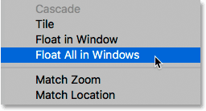
*Going to Window > Arrange > Float All in Windows.*

This places each image inside a floating document window. Click on the gray tab area along the top of the windows to drag and reposition them on the screen so that it's easy to drag an image from one window to the other:

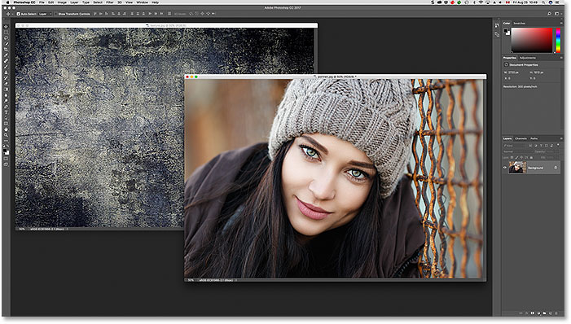
*Each photo appears in its own floating window.*

#### Step 2: Select The Move Tool

Next, I'll select the **Move Tool** from the Toolbar:

*Selecting the Move Tool.*

### Step 3: Drag The Image Into The Other Floating Window

With the Move Tool selected, I'll click on my texture image and drag it into the window that holds my portrait image:

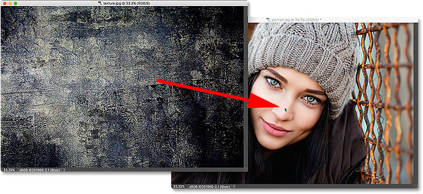
*Dragging the image from one window into the other.*

#### Step 4: Release Your Mouse Button

To drop and center the image inside the portrait document, I'll press and hold my **Shift** key, then I'll release my mouse button:

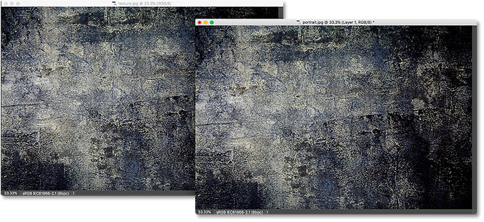
*The texture photo now appears in both windows.*

#### Step 5: Switch Back To The Tabbed Documents View

With both images now in the same document, I'll switch from floating windows back to tabbed documents by going up to the **Window** menu, choosing **Arrange**, and then choosing **Consolidate All to Tabs**:

*Going to Window > Arrange > Consolidate All to Tabs.*

Both images are now in the same tabbed document:

*Back to the tabbed document view once again.*

## Blending The Images Together

Now that we know how to move images into the same Photoshop document, how do we blend them together? At the moment, my texture image is completely blocking my portrait photo from view. To blend the two images, we can use one of Photoshop's [layer blend modes](/photo-editing/layer-blend-modes/intro/ "Learn more about Photoshop layer blend modes"). I'll go through this quickly here, but you can learn more about blending images in our [How To Blend Textures With Photos](/photo-effects/how-to-blend-textures-with-photos-in-photoshop/ "Learn how to blend textures with photos in Photoshop") tutorial.

If we look in my Layers panel, we see my texture image (on "Layer 1") sitting above my portrait image (on the Background layer). The reason the texture is blocking the portrait from view is because the texture layer's **blend mode** is currently set to **Normal**. The Blend Mode option is found in the upper left of the Layers panel:

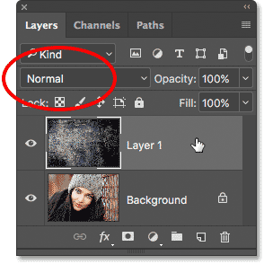
*The blend mode for the texture layer is set to Normal.*

The Normal blend mode is Photoshop's default blend mode. "Normal" means that the layer is not blending at all with the layer below it. To blend my texture in with the portrait image, all I need to do is change the blend mode to something different. I'll click on the word "Normal" to open a list of other blend modes. You can try out the different blend modes with your images to see which one works best. I'll go with **Soft Light**:

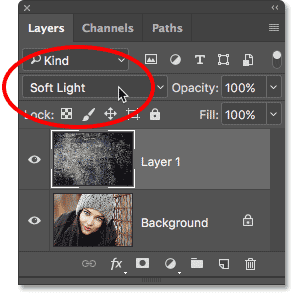
*Changing the blend mode of the texture layer to Soft Light.*

And here we see that just by changing the blend mode from Normal to Soft Light, my texture now blends in nicely with the portrait, creating an interesting effect. You can learn even more about blend modes, including tips for easily switching between them, in our [Flip, Mirror and Rotate Designs and Patterns](/photo-effects/flip-mirror/ "Read tutorial") tutorial:

*The result after changing the blend mode of the texture layer to Soft Light.*