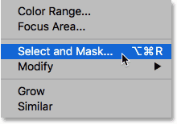
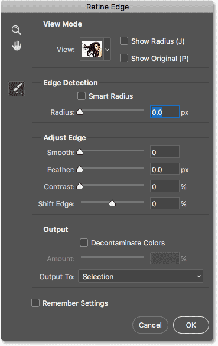

# How To Access Refine Edge In Photoshop CC 2018

> Source: [https://www.photoshopessentials.com/basics/access-refine-edge-photoshop-cc-2018/](https://www.photoshopessentials.com/basics/access-refine-edge-photoshop-cc-2018/)
> Downloaded and converted to Markdown.

Not a fan of Select and Mask? This tutorial shows you where to find the Refine Edge command in the latest versions of Photoshop, including Photoshop CC 2018.

Back in Photoshop CS3, Adobe introduced a promising new feature known as **Refine Edge**, designed to improve upon our initial selections. In Photoshop CS5, Adobe updated Refine Edge with new tools and features. Suddenly, complex selections like hair and fur were now as easy as dragging a brush, and Refine Edge became the standard tool for removing a subject from its background. Refine Edge worked great, and everyone was happy.

But in Photoshop CC 2015.5, Adobe replaced Refine Edge with **Select and Mask**, a new all-in-one workspace for both making *and* refining selections. Adobe claimed that Select and Mask was better than Refine Edge, but not everyone agreed. Many Photoshop users argued that Select and Mask was in fact *worse*, as they were unable to achieve the same results as before. To their credit, Adobe listened, and continued work on the Select and Mask engine. An enhanced version of Select and Mask was released with Photoshop CC 2017, and the latest update is included with CC 2018.

But many Photoshop users remain upset that Refine Edge was taken from them, still convinced that Refine Edge worked better. So, Adobe now admits to a little secret. As it turns out, Refine Edge was never actually removed from Photoshop. Adobe simply removed any obvious way to *access* it. If you're a die hard Refine Edge fan, good news! Refine Edge is still available, even in the [latest version of Photoshop](https://prf.hn/l/dlXjD2w). Here's how to find it!

## How To Access Refine Edge In Photoshop CC 2018

### Step 1: Make An Initial Selection

To access Refine Edge in the latest versions of Photoshop CC, we need to remember that, unlike the Select and Mask workspace, Refine Edge does not include a way for us to create our initial selection. It can *refine* the selection, but it can't create one. So, we first need to make an initial selection using one of Photoshop's [selection tools](basics/make-selections-photoshop/). Here, I've used the [Color Range](https://www.photoshopessentials.com/basics/selections/quick-selection-tool/) command to make an initial selection of the woman and her hair (photo from [Adobe Stock](https://prf.hn/l/20xwoJy)):

*Before you access Refine Edge, make your initial selection.*

### Step 2: Hold "Shift" And Choose "Select and Mask"

With your initial selection in place, here's the secret trick to access Refine Edge. Press and hold the **Shift** key on your keyboard as you go up to the **Select** menu in the Menu Bar and choose **Select and Mask**:

*Hold Shift while going to Select > Select and Mask.*

Instead of opening the Select and Mask workspace, Photoshop opens the **Refine Edge** dialog box, just like we had before Adobe pretended to take it away. Remember, though, that you need to make an initial selection first, otherwise Photoshop will still open Select and Mask. For a detailed tutorial on how to use Refine Edge, see [Selecting Hair with Refine Edge](https://www.photoshopessentials.com/photo-editing/selecting-hair/):

*The much-loved Refine Edge command was never far away.*

[Related: Select your subject with ONE CLICK in Photoshop CC 2018!](https://www.photoshopessentials.com/basics/select-subject-select-and-mask-photoshop-cc-2018/)

And there we have it! That's how to bring back the Refine Edge command in Photoshop CC 2018! And speaking of CC 2018, be sure to check out our step-by-step guide to learning the new [Curvature Pen Tool](https://www.photoshopessentials.com/basics/use-curvature-pen-tool-photoshop-cc-2018/), and how to [upscale your images](https://www.photoshopessentials.com/basics/upscale-images-photoshop-cc-2018/) in CC 2018 with amazing results! Or visit our [Photoshop Basics](https://www.photoshopessentials.com/basics/) section for more tutorials!