# How to Add Copyright and Contact Info to Images with Photoshop

> Source: [https://www.photoshopessentials.com/basics/add-contact-copyright-info-photoshop/](https://www.photoshopessentials.com/basics/add-contact-copyright-info-photoshop/)
> Downloaded and converted to Markdown.

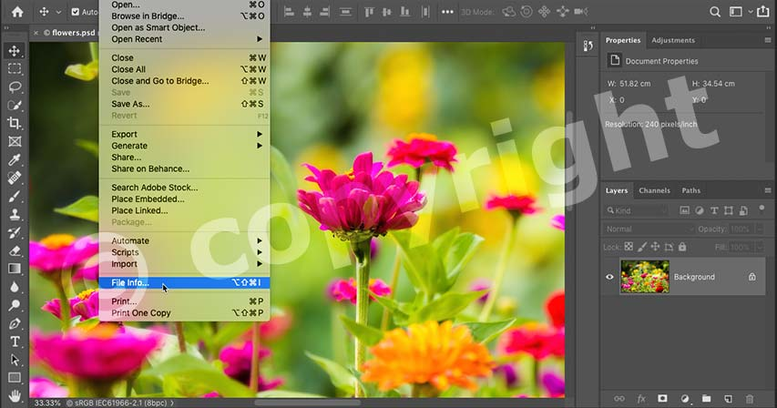

Before sharing your photos online, learn how to protect and promote your work by adding copyright and contact information to your images with Photoshop!

In this tutorial, I show you how to add copyright and contact information to images with Photoshop, an important step before uploading and sharing your photos online. While it won't stop someone from using your images without permission, adding copyright and contact info is still something you should do because it gives people a way to contact you if they are interested in your work.

I’ll start by showing you how to add copyright and contact info using Photoshop’s File Info dialog box, and how to save the details as a template that can be quickly applied to other images. I’ll also show you one important edit you should make to the template to avoid overwriting some important information. And finally, I’ll show you how to use the template to apply the information to other images, including ho to apply it to multiple images at once.

And with that, let’s get started!

## Which version of Photoshop do I need?

I’m using Photoshop 2022 but these steps will work with any recent version. You can [get the latest Photoshop version here](https://adobe.prf.hn/click/camref:1100lrdjJ/destination:https%3A%2F%2Fwww.adobe.com%2Fproducts%2Fphotoshop.html).

But to apply copyright and contact info to multiple images at once, you will also need Adobe Bridge. Bridge is a separate program that’s included with all Creative Cloud subscriptions. So if you haven’t done so already, you’ll want to open the Creative Cloud desktop app and download Adobe Bridge before you continue.

## Step 1: Open an image in Photoshop

Start by [opening an image into Photoshop](/basics/open-images-photoshop-cc/). We’ll add our copyright and contact info to this image, but we’ll also save it as a template so we can quickly apply it to other images:

*Opening an image in Photoshop.*

## Step 2: Open the File Info dialog box

Then go up to the **File** menu in the Menu Bar and choose **File Info**:

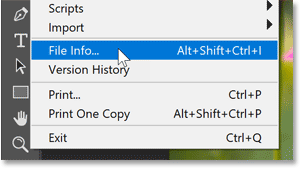
*Going to File > File Info.*

Make sure the File Info dialog box is set to the **Basic** category which is where we enter our copyright information. The categories are listed along the left:

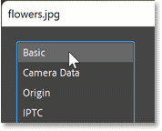
*Basic should open by default.*

## Step 3: Enter your copyright details

Since we are going to save the information as a template, we want to include only the details that will be the same for every image. So we’ll skip things like Document Title, Description and Keywords. Instead, we’ll add only the author and the copyright information.

Enter your name into the **Author** field. But don't press Enter (Win) / Return (Mac) on your keyboard when you’re done or you’ll close the File Info dialog box. Instead, just click outside the Author field to accept it:

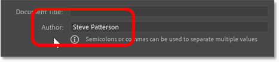
*Entering my name in the Author field.*

Then move down to the Copyright details and change the **Copyright Status** to **Copyrighted**:

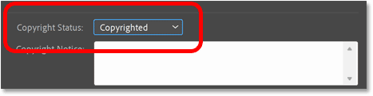
*Changing the Copyright Status to Copyrighted.*

In the **Copyright Notice** field below it, enter a **copyright symbol**. On a Windows PC, type the copyright symbol by holding the **Alt** key on your keyboard and typing **0169** on the numeric keypad. On a Mac, hold the **Option** key and press the letter **G**.

Then follow the copyright symbol with your name and any additional information you want to add (like your business name, location, etc.):

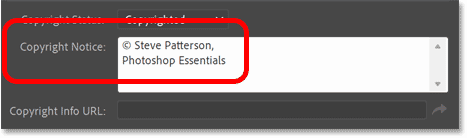
*Entering the copyright details.*

Finally, enter your website URL into the **Copyright Info URL** box. If you have a page on your website that holds your copyright details, you can link directly to that page. And if you don’t have a website, you could enter the URL of your social media page.

Click the **arrow button** on the right to open the URL in your web browser and make sure you entered it correctly:

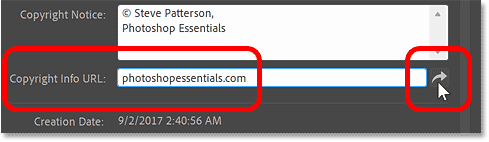
*Entering my website address and clicking the arrow to test it.*

## Step 4: Enter your contact details

We’ve added our copyright information, so now we'll enter our website’s URL into the Contact details.

Since we've tested the link to make sure it works, highlight your website address and press **Ctrl+C** (Win) / **Command+C** (Mac) on your keyboard to copy it:

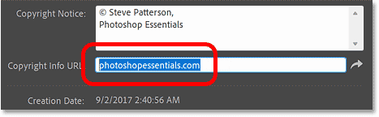
*Copying the website address from the Copyright Info URL field.*

Then in the column on the left, switch from Basic to the **IPTC** category:

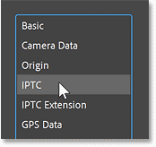
*Switching to the IPTC category.*

In the IPTC Contact section, click inside the **Website(s)** field and paste your website’s URL by pressing **Ctrl+V** (Win) / **Command+V** (Mac) on your keyboard:

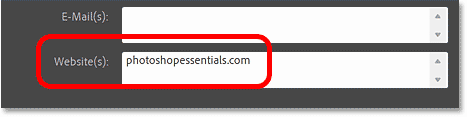
*Pasting my website URL into the Website(s) field.*

You *could* enter additional information in the IPTC Contact section, like your email address. But if people can already contact you through your website, it’s best to leave everything else blank (other than your name which should already be entered in the **Creator** field:

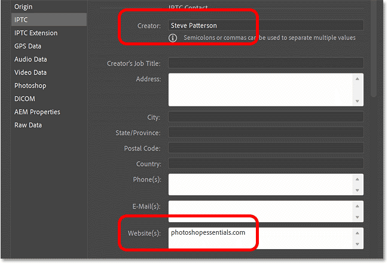
*Only the Creator and Website(s) fields are filled in.*

## Step 5: Save the information as a template

With all of your copyright and contact details entered, save them as a template by clicking the **Template Folder** box at the bottom of the dialog box:

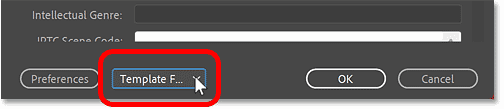
*Clicking the Template Folder option.*

And choosing **Export**:

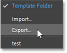
*Clicking the Export option.*

But rather than saving the template in Photoshop’s default template folder, save it somewhere else like in a new folder on your Desktop. This will make it easier to edit the template, which we’ll do next.

I’ll save my template in a new folder named <q>File info</q> on my Desktop. I’ll name the template <q>Steve.xmp</q> and I’ll click **Save**:

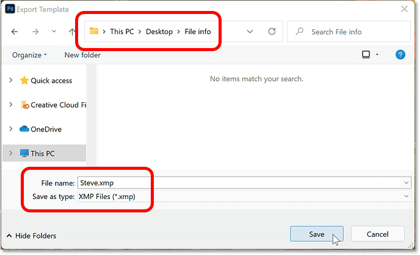
*Naming and saving the template.*

## Step 6: Switch back to the Basic category

Switch from the IPTC category back to the **Basic** category:

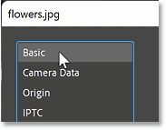
*Switching back to the Basic category.*

Now that we’ve saved our details as a template, we’ll be able to easily apply them to other images. But before we do, there’s one quick edit to the template that we need to make.

Notice the **Creation Date** directly below the Copyright Info URL field. This is the date that the image we are currently working with was created. The problem is that this date was saved as part of the template, which means that when we apply the template to other images, we run the risk of replacing all of their creation dates with this date. So to avoid doing that, we’ll edit the template and remove the date:

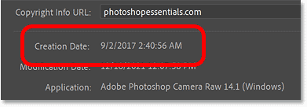
*The image's creation date was saved as part of the template.*

## Step 7: Click Cancel to close the File Info dialog box

We can’t edit the template directly in Photoshop. So for now, click **Cancel** to close the File Info dialog box:

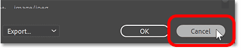
*Clicking Cancel to close the dialog box.*

## Step 8: Hide Photoshop

Then hide Photoshop by clicking the **minimize icon** at the top:

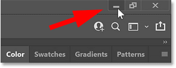
*Clicking the minimize icon.*

## Step 9: Edit the template

Navigate to the folder that holds your template. In my case, it’s in my <q>File info</q> folder on my Desktop:

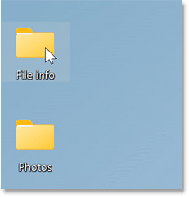
*Opening the folder that holds the template.*

Click on the template file to highlight it. Then on a Windows PC, **right-click** on the file, choose **Open With**, and then choose **Notepad**. On a Mac, **Control-click** on the file, choose **Open With**, and then choose **TextEdit**:

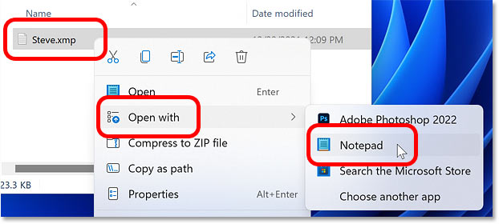
*Open the template in Notepad (Win) or TextEdit (Mac).*

When the file opens, you’ll see all of the metadata that’s included in the template. And the line we want to remove starts with &lt;xmp:CreateDate&gt; which is not far down from the top. Click and drag over the entire line to highlight it, and then press **Delete** on your keyboard to remove it. You may need to press the Delete key a few more times to remove any remaining blank space:

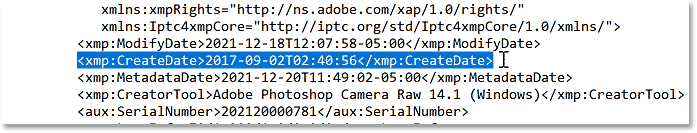
*Highlight and delete the CreateDate line.*

Once you’ve deleted the line, save the template by going up to the **File** menu and choosing **Save**:

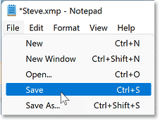
*Saving the edited template.*

Then on a Windows PC, close Notepad by going up to the **File** menu and choosing **Exit**. On a Mac, close TextEdit by going up to the **File** menu and choosing **Close**:

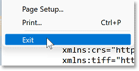
*Closing Notepad or TextEdit.*

## Step 10: Switch back to Photoshop

Switch back over to Photoshop where your image should still be open:

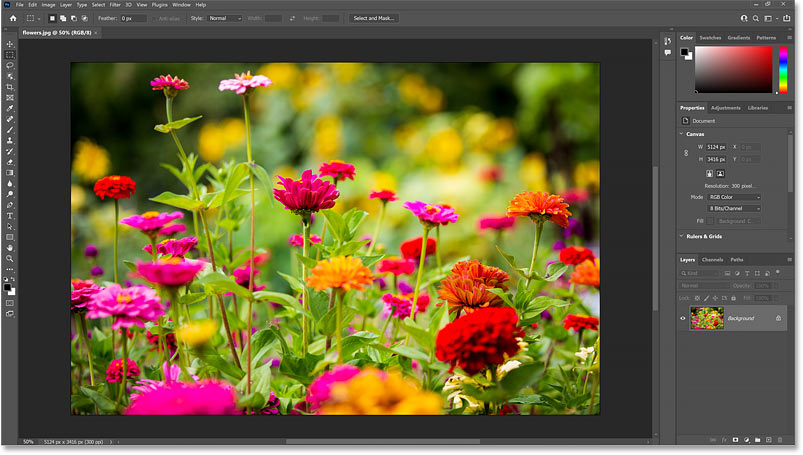
*Back in Photoshop.*

## Step 11: Re-open the File Info dialog box

Then go back up to the **File** menu and once again choose **File Info**:

*Going to File > File Info.*

## Step 12: Apply the template to the image

To apply your template to the image, click the **Template Folder** icon at the bottom of the File Info dialog box and choose **Import**:

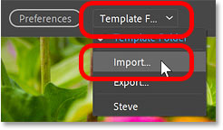
*Clicking the Template Folder box and choosing Import.*

Navigate to the folder where your template is saved. Then click on the template to select it and click **Open**:

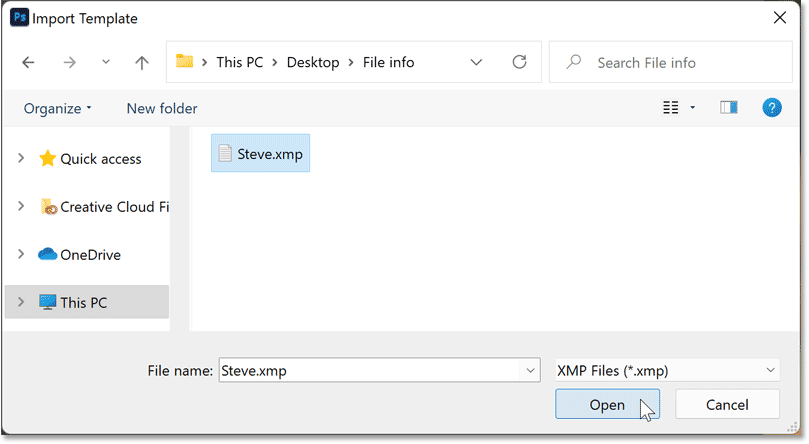
*Selecting and opening the template.*

In the **Import Options** dialog box, choose **Keep original metadata, but replace matching properties from template** and click OK:

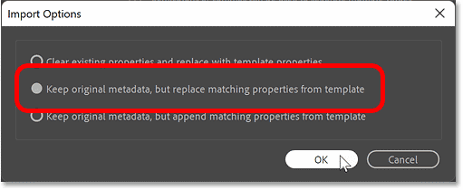
*Choosing the middle import option.*

And your copyright and contact details are instantly added to the image:

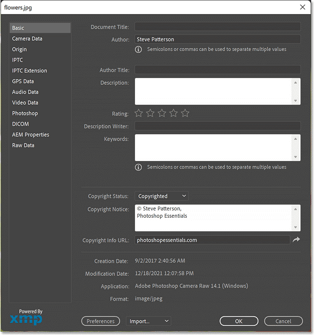
*The details from the template are added to the image.*

Click OK to accept it and close the File Info dialog box:

*Clicking OK to close the dialog box.*

And in the document’s **tab**, a **copyright symbol** appears next to the file’s name, telling us that the image now has copyright info applied:

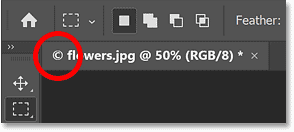
*A copyright symbol appears in the document tab.*

## Step 13: Save your image

If we were to close the image at this point without saving it first, the copyright and contact info would be lost. So let’s save the file, and while we’re saving it, we’ll make sure that the copyright and contact info will be included.

Go up to **File** menu, choose **Export**, and then **Export As**:

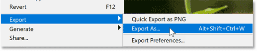
*Going to File > Export > Export As.*

This opens the **Export As** dialog box:

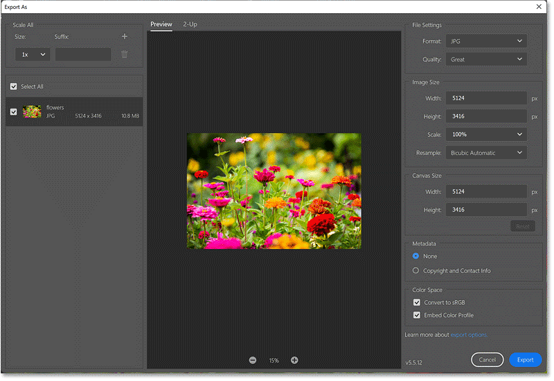
*Photoshop's Export As dialog box.*

In the **File Settings** options in the upper right, I’ll set the **Format** to **JPG**. And since I want to keep the quality as high as possible, I’ll set the **Quality** to **Great**:

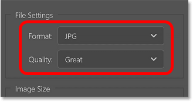
*Setting the file format and quality.*

I don’t need to resize the image so I’ll leave the Image Size and Canvas Size options alone. But I do want to make sure that my copyright and contact info is included with the saved file. So I’ll change the **Metadata** option from None to **Copyright and Contact Info**:

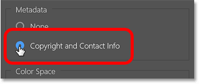
*Setting the Metadata option to Copyright and Contact Info.*

To save the image, click the **Export** button:

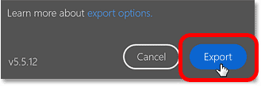
*Clicking the Export button.*

And then in the **Save As** dialog box, choose where you want to save the image (I’ll overwrite my original “flowers.jpg” image) and click **Save**:

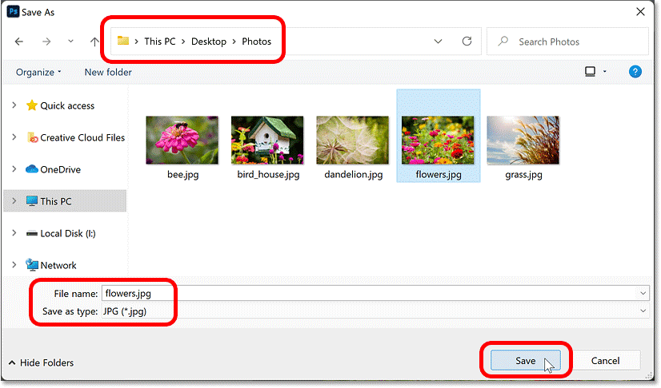
*Saving the image with the copyright and contact info applied.*

When Photoshop asks if I want to replace the existing image, I’ll choose **Yes**:

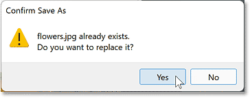
*Confirming that I want to overwrite the original image.*

## Step 14: Close your image

At this point, we can close the image by going up to the **File** menu and choosing **Close**:

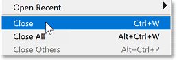
*Going to File > Close.*

When Photoshop asks if we want to save our changes, choose **No** because we’ve already saved them. And that’s how to add your copyright and contact info, save it as a template, and then apply the template to your image:

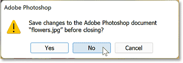
*Choosing No to close the image without saving it.*

## How to save copyright and contact info with Quick Export

If you save images using Photoshop’s Quick Export command and you want your copyright and contact info to be saved along with the image, you’ll need to edit the Export Preferences.

Go up to the **File** menu, choose **Export** and then **Export Preferences**:

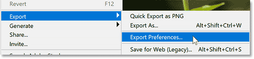
*Going to File > Export > Export Preferences.*

Change **Quick Export Metadata** from None to **Copyright and Contact Info**, and then click OK. The next time you choose the Quick Export command, the information will be saved with the image:

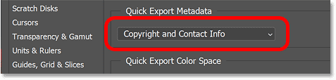
*Setting the Quick Export Metadata option to Copyright and Contact Info.*

## Adding copyright and contact info to multiple images at once

So far, we’ve learned how to add copyright and contact info to one image at a time. But if you have saved the details as a template, then you can add it to multiple images at once using Photoshop’s companion program, [Adobe Bridge](/basics/what-is-adobe-bridge/). Bridge is included with your Creative Cloud subscription and can be downloaded using the Creative Cloud desktop app. You’ll need to download and install Bridge before you continue.

### Step 1: Open Adobe Bridge

To open Adobe Bridge from within Photoshop, go to the **File** menu (in Photoshop) and choose **Browse in Bridge**:

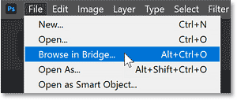
*Going to File > Browse in Bridge.*

### Step 2: Navigate to a folder of images

Then in Bridge, use the **Favorites** or **Folders** panel on the left to navigate to a folder containing your images. In my case, the images are in a folder named <q>Photos</q> on my Desktop.

Open the folder to view thumbnails of your images in the **Content panel** in the middle:

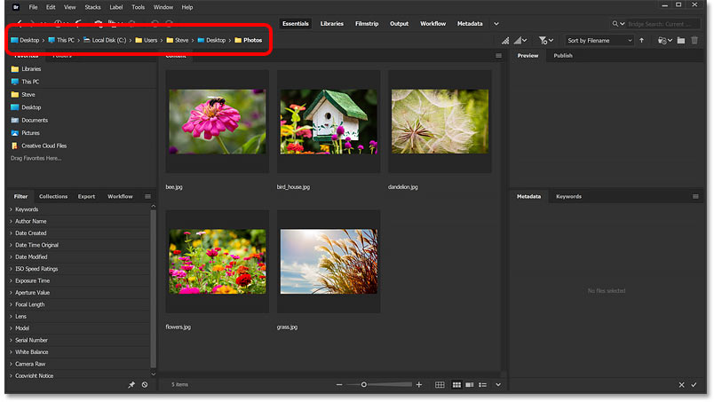
*Navigating to the folder that holds my images.*

### Step 3: Select all images

Select all images in the folder by going up to the **Edit** menu and choosing **Select All**. Or press **Ctrl+A** (Win) / **Command+A** (Mac) on your keyboard:

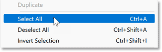
*Going to Edit > Select All.*

### Step 4: Open the File Info dialog box

Then just like we did in Photoshop, go up to the **File** menu (in Bridge) and choose **File Info**:

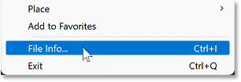
*Going to File > File Info.*

### Step 5: Apply your copyright and contact info template

In the File Info dialog box, click the **Template Folder** box at the bottom and choose **Import**:

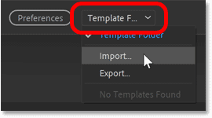
*Clicking the Template Folder box and choosing Import.*

Then navigate to where you saved your template, click on it to select it and click **Open**:

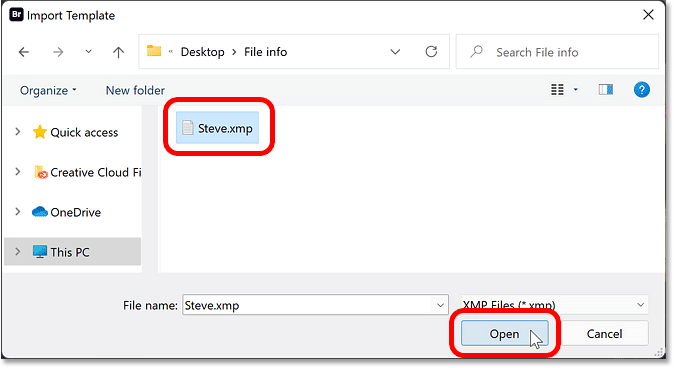
*Selecting and opening the template.*

In the Import Options dialog box, choose **Keep original metadata but replace matching properties from template** and click OK:

*Choosing the middle import option.*

### Step 6: Close the File Info dialog box

When you’re done, click OK to close the File Info dialog box:

*Clicking OK.*

### Step 7: Open an image in Photoshop to confirm

A great benefit to adding your contact and copyright info in Adobe Bridge is that we did not need to open and then re-save the images. Bridge is able to add the info to the files without opening them.

To confirm that your copyright and contact info was added, first deselect all images by clicking on an empty gray area in the Content panel:

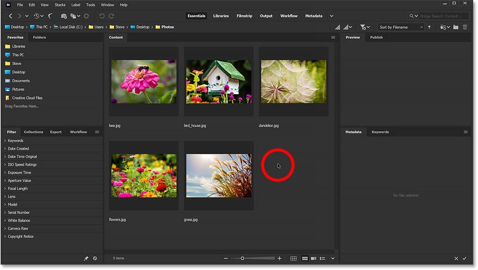
*Clicking on an empty area to deselect the image thumbnails.*

Then open one of the images into Photoshop by double-clicking on its thumbnail:

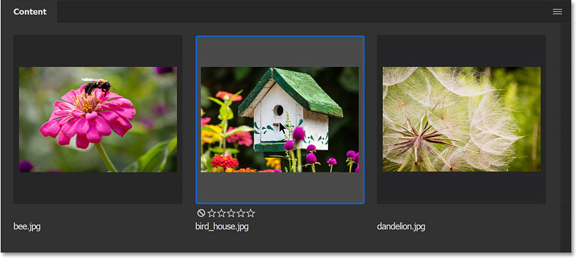
*Double-clicking on an image to open it in Photoshop.*

The image open in Photoshop. And right away, we see the copyright symbol in the document tab:

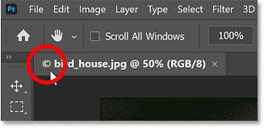
*The copyright symbol appears in the document tab.*

Go up to the **File** menu and choose **File Info**:

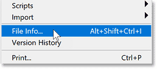
*Going to File > File Info.*

And in the File Info dialog box, we see that all of our details from the template have been added. Click **Cancel** to close the dialog box:

*The details from the template were added to the image.*

And there we have it! That's how to add contact and copyright information to a single image and to multiple images at once in Photoshop!

Check out our [Photoshop Basics](/basics/) section for more tutorials! And don't forget, all of our tutorials are now available to [download as PDFs](/print-ready-pdfs)!