# Photoshop Shapes – Add, Subtract, Intersect and Exclude

> Source: [https://www.photoshopessentials.com/basics/shapes/add-subtract/](https://www.photoshopessentials.com/basics/shapes/add-subtract/)
> Downloaded and converted to Markdown.

In this **Photoshop Basics** tutorial, we'll learn how we can combine two or more shapes in interesting ways using the **Add**, **Subtract**, **Intersect** and **Exclude** options that are available to us when drawing **Shape Layers** in Photoshop! We looked at these options briefly in the [Vectors, Paths and Pixels](/basics/shapes/vectors-paths-pixels/) tutorial, but we'll cover them in more detail here.

This tutorial assumes you already have a solid understanding of how to draw vector shapes, which you can learn all about in the first tutorial in this series - [Photoshop Shapes and Shape Layers Essentials](/basics/shapes/).

I've gone ahead and created a new Photoshop document, with white as my background color, and I've used the **Ellipse Tool** to draw a single circular shape (I held down my **Alt** (Win) / **Option** (Mac) key as I was dragging out the shape to force it into a perfect circle):

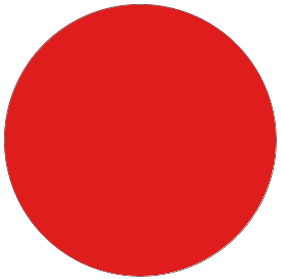
*A circular shape drawn with the Ellipse Tool.*

If we look in my [Layers panel](/basics/layers/layers-panel/), we see that my document currently contains two layers - the white-filled [**Background layer**](/basics/layers/background-layer/) on the bottom and the Shape layer (Shape 1) for my shape directly above it:

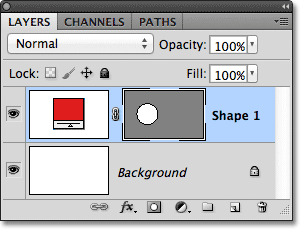
*The Layers panel showing the Shape layer sitting above the Background layer.*

With the Ellipse Tool still selected, I'll draw a second similar shape partly overlapping the original:

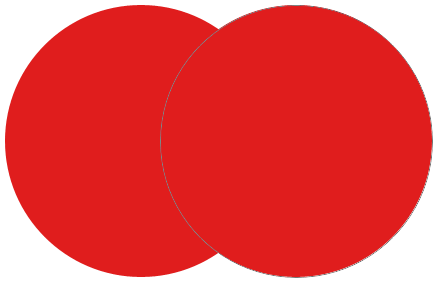
*Adding a second shape to the document.*

By default, Photoshop assumes that each time we draw a new shape, we want to draw a separate, independent shape, and it places the new shape on its own Shape layer. If we look again in my Layers panel, we see that I now have a second Shape layer (Shape 2) sitting above the original. Both shapes are completely separate from each other:

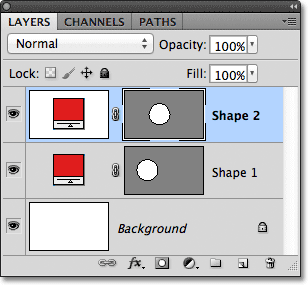
*Each of the two shapes in the document appears on its own Shape layer.*

This default behavior of creating a new Shape layer for each shape we draw is often what we want, but there are other, more interesting things we can do with shapes in Photoshop than simply adding new ones all the time. For instance, we can combine two shapes together by adding the new shape to an existing one, or we can use the new shape to remove part of the original shape. We can intersect two shapes so only the areas that overlap remain visible in the document, or we can do the opposite, hiding the overlapping areas from view.

Officially, these options I just described are called **Add to Shape Area**, **Subtract from Shape Area**, **Intersect Shape Areas**, and **Exclude Overlapping Shape Areas**, and they're represented as a series of icons in the Options Bar when we have one of Photoshop's Shape tools selected. There's also a fifth option, **Create New Shape Layer**, which is selected for us by default:

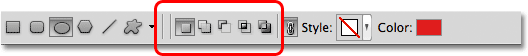
*From left to right - Create New Shape Layer, Add to Shape Area, Subtract from Shape Area, Intersect Shape Areas, and Exclude Overlapping Shape Areas.*

If you've selected a Shape tool from the Tools panel but don't see these options in the Options Bar, check to make sure you have **Shape Layers**, not Paths or Fill Pixels, selected in the far left of the Options Bar:

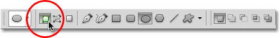
*Make sure Shape Layers is chosen in the Options Bar.*

### Add To Shape Area

As I mentioned, the **Create New Shape Layer** option is selected for us by default, which is why Photoshop always places each new shape we draw on its own independent Shape Layer:

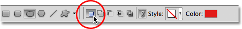
*The Create New Shape Layer option is selected by default.*

I'll delete the second shape I added a moment ago by dragging its Shape layer (Shape 2) down to the **Trash Bin** at the bottom of the Layers panel:

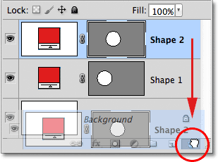
*Dragging the Shape 2 layer on to the Trash Bin to delete it.*

And now I'm back to having just my original Shape layer (Shape 1) sitting above the Background layer:

*The second shape has been deleted.*

Before I do anything else, notice that a **white highlight border** is appearing around the **vector mask thumbnail** on my Shape layer:

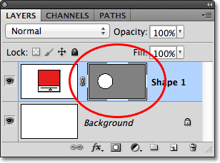
*A highlight border is visible around the vector mask thumbnail.*

This is important because it means the shape's **vector mask** is currently selected. The vector mask is what defines the look of the shape (the **color swatch** to the left of the vector mask thumbnail defines the color of the shape). If the vector mask is not selected, the Add, Subtract, Intersect and Exclude options will be grayed out and unavailable in the Options Bar. If you see them grayed out, check to make sure a white highlight border is appearing around the Shape layer's vector mask thumbnail. If it's not, click on the thumbnail to select it.

Now that I've made sure the vector mask is selected, I'll choose the **Add to Shape Area** option by clicking on its icon in the Options Bar:

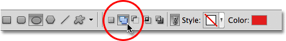
*Selecting the Add to Shape Area option (second icon from the left).*

A small **plus sign** (**+**) will appear in the lower right of my mouse cursor letting me know that any shape I draw next will be added to my existing shape rather than appearing on its own Shape layer. I've enlarged the mouse cursor here to make it easier to see:

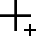
*The small plus sign in the lower right lets us know we're in the Add to Shape Area mode.*

I'll draw another circular shape with the Ellipse Tool, again overlapping the original shape as I did before:

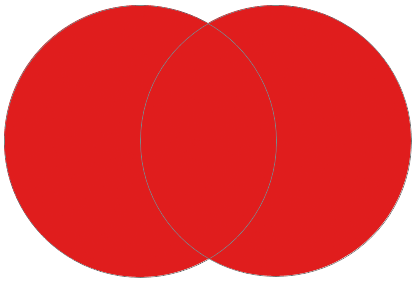
*Drawing a second circular shape with the Add to Shape Area option selected.*

The result doesn't look much different than it did last time, but if we look in the Layers panel, we see that instead of having two separate Shape layers, both shapes now appear on the *same* vector mask on the *same* Shape layer, which means that even though they may look like separate shapes in the document, they're actually one single shape:

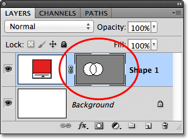
*The vector mask thumbnail shows both shapes on the same Shape layer.*

At the moment, we can see the thin path outline around the shapes. The path is visible because the vector mask is selected and active. To hide the path outline, all we need to do is deselect the vector mask by clicking on its thumbnail. The white highlight border around the thumbnail will disappear when you click on it, indicating that the vector mask is no longer active:

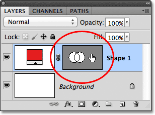
*Click on the vector mask thumbnail when the highlight border is visible to deselect the vector mask.*

With the vector mask deselected, the path outline is no longer visible around the shape:

*The path outline is only visible when the vector mask is active (selected).*

Remember, though, that a Shape layer's vector mask must be selected if we want access to the Add, Subtract, Intersect and Exclude options in the Options Bar. Now that I've deselected the vector mask, the options in my Options Bar are grayed out and unavailable to me. Only the default Create New Shape Layer option remains available:

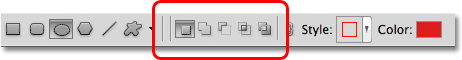
*The Add, Subtract, Intersect and Exclude options are no longer available with the vector mask deselected.*

To re-select the vector mask and make it active again, just click on its thumbnail. The white highlight border around it will re-appear, and the options will again become available in the Options Bar:

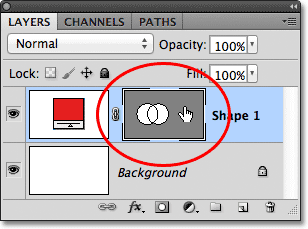
*Click again on the vector mask thumbnail to re-select it.*

### Subtract From Shape Area

I'll undo my last step and remove the second shape I added by pressing **Ctrl+Z** (Win) / **Command+Z** (Mac) on my keyboard, and this time, I'll select the **Subtract from Shape Area** option in the Options Bar:

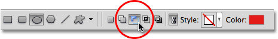
*Selecting the Subtract from Shape Area option (third icon from the left).*

A small **minus sign** (**-**) appears in the lower right of my mouse cursor letting me know I'm in the Subtract from Shape Area mode:

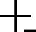
*The small minus sign indicates we're in Subtract from Shape Area mode.*

I'll draw another circular shape with the Ellipse Tool, again overlapping the original, and this time we get a different result. Instead of adding the new shape to the existing one, the new shape has been used to remove, or cut away, part of the initial shape where the two shapes overlap. As we can see by the path outlines, both shapes are there in the document, but only the part of the original shape that is not being overlapped by the second shape remains visible:

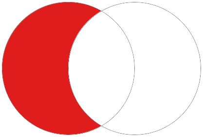
*In Subtract from Shape Area mode, the second shape is used to remove part of the initial shape.*

Just as we saw with the Add to Shape Area option, both shapes have been added to the same vector mask on the same Shape layer in the Layers panel:

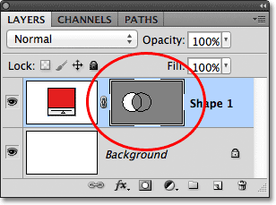
*Both shapes again appear in the same vector mask thumbnail.*

I'll click on the vector mask thumbnail to deselect it, which removes the path outline from around the shape and makes it easier to see the result. With part of it removed, the original circular shape now looks more like a moon:

*Hide the path outline by deselecting the vector mask to see the results more clearly.*

So far, we've learned how to add and subtract shapes. Up next, we'll learn how the Intersect and Exclude options work, as well as how to easily switch between these four drawing modes after we've already drawn the shape!

### Intersect Shape Areas

I'll again press **Ctrl+Z** (Win) / **Command+Z** (Mac) to undo my last step and remove the second shape, then I'll select the **Intersect Shape Areas** option in the Options Bar:

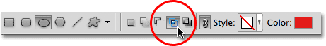
*Selecting the Intersect Shape Areas option (fourth icon from the left).*

A small **x** appears in the lower right of my mouse cursor, telling me that I'm now in the Intersect Shape Areas mode:

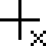
*The small x appears when the Intersect Shape Areas option is selected.*

I'll draw my second shape, and this time, only the area where the two shapes intersect remains visible:

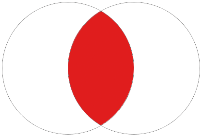
*Both shapes are hidden except for the area where they overlap each other.*

Again we can see in the Layers panel that both shapes were added to the same vector mask. Just like a normal [layer mask](/basics/layers/layer-masks/), the small white area on the vector mask thumbnail represents the part of the shape that's visible in the document:

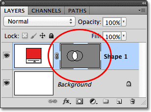
*White areas on a vector mask represent the visible area of the shape in the document.*

### Exclude Overlapping Shape Areas

I'll remove the second shape by pressing **Ctrl+Z** (Win) / **Command+Z** (Mac), and finally, I'll select the **Exclude Overlapping Shape Areas** option in the Options Bar:

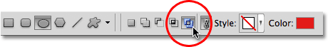
*Selecting the Exclude Overlapping Shape Areas option (the icon on the right).*

We know we're in the Exclude Overlapping Shape Areas mode because a small **circle** with an **x** in the center of it appears in the lower right of the mouse cursor:

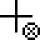
*A small circle with an x inside tells us we have the Exclude Overlapping Shape Areas option selected.*

I'll draw my second shape, and this time, we get the exact opposite result from what we saw when the Intersect Shape Areas option was selected. With Exclude Overlapping Shape Areas, the overlapping area of the shapes is hidden, while the rest remains visible:

*The Exclude Overlapping Shape Areas mode hides areas of the shapes that overlap.*

And once again, we see in the Layers panel that both shapes were added to the same vector mask on the same Shape layer:

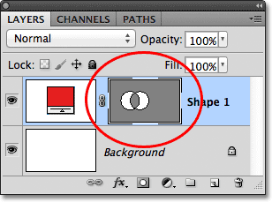
*All four options (Add, Subtract, Intersect and Exclude) add the new shape to the same vector mask as the initial shape.*

### Switching Between Options After Drawing The Shape

What if, after drawing my second shape in the Exclude Overlapping Shape Areas mode as I just did, I realize I had the wrong option chosen in the Options Bar? What if I meant to draw the second shape in, say, the Subtract from Shape Area mode instead? I *could* undo my last step to remove the shape, choose the correct option from the Options Bar and then draw the second shape again, or I could simply select the second shape and switch the option for it!

To select the shape, we need the **Path Selection Tool** (the black arrow) from the Tools panel:

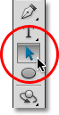
*Selecting the Path Selection Tool from the Tools panel.*

With the Path Selection Tool in hand, I'll simply click inside the shape I need to select. Even though the two shapes are part of the same vector mask on the same Shape layer, we can still select them individually just by clicking on them. Here, I've clicked on the second shape (the one on the right), and we can see the path's **anchor points** (the small squares) that have appeared around it letting us know the shape is now selected and active:

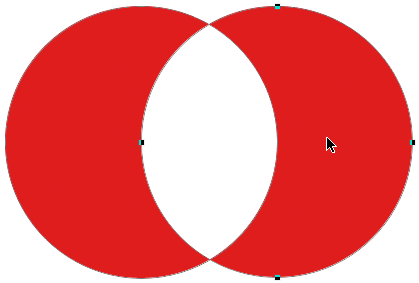
*Select the shape you need by clicking on it with the Path Selection Tool.*

If we look in the Options Bar, we see that the Path Selection Tool gives us access to the same Add, Subtract, Intersect and Exclude options that we're given when we have any of the Shape tools selected. The only option we don't get with the Path Selection Tool is the Create New Shape Layer option, since we can't actually draw a shape with the Path Selection Tool. We *can*, however, use the Path Selection Tool to easily switch an existing shape from one mode to another.

With my second shape selected in the document, I'll click on the **Subtract from Shape Area** option in the Options Bar (second icon from the left):

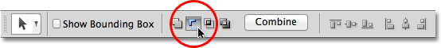
*The Path Selection Tool gives us the same Add, Subtract, Intersect and Exclude options.*

And just like that, the shape switches from its initial Exclude Overlapping Shape Areas mode to the Subtract from Shape Area mode in the document:

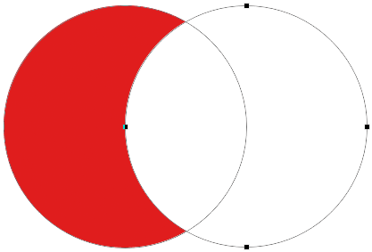
*The second shape is now in Subtract from Shape Area mode. No need to delete and re-draw it.*

### Deleting Shapes On The Same Shape Layer

Finally, what if I wanted to delete the second shape entirely and go back to just my initial circular shape? I couldn't simply drag the Shape layer down on to the Trash Bin because that would delete the entire Shape layer. Instead, I'd select the second shape by clicking on it with the Path Selection Tool, just as I did a moment ago, then I'd press **Backspace** (Win) / **Delete** (Mac) on my keyboard. This will delete the selected shape without deleting the entire Shape layer.