# How To Change File Type Associations In Adobe Bridge

> Source: [https://www.photoshopessentials.com/basics/adobe-bridge-file-type-associations/](https://www.photoshopessentials.com/basics/adobe-bridge-file-type-associations/)
> Downloaded and converted to Markdown.

Learn how to use the File Type Associations options in the Adobe Bridge Preferences to fix the problem when Bridge is opening images either in the wrong program or in the wrong version of Photoshop.

In the [previous tutorial](/basics/open-images-photoshop-adobe-bridge/ "How to open images into Photoshop from Adobe Bridge"), we learned how to open images into Photoshop from Bridge. To quickly recap, we learned that Adobe Bridge is a file browser that's included with every copy of Photoshop and with every Creative Cloud subscription. We learned how to install Bridge using the Creative Cloud app. And we learned how to use Bridge to browse to our files, select the image we need, and open it into Photoshop.

Most of the time, Adobe Bridge will open your images into Photoshop as you'd expect and without any problems. But depending on the type of file you're trying to open (JPEG, PNG, TIFF, etc), you may run into a situation where Bridge opens the image not into Photoshop but into some other program that's installed on your computer. Or, if you have multiple versions of Photoshop installed (as I do), Bridge may open the image in an earlier version of Photoshop instead of in the newest version.

As we'll see, fixing the problem is easy. All we need to do is tell Bridge to open the file, along with all future files of the same type, into the latest version of Photoshop. We do that using the **File Type Associations** option in the Bridge Preferences. Let's see how it works.

This tutorial picks up where the previous one left off, so if you're not yet familiar with Adobe Bridge or you're not sure how to install it, you'll want to check out the previous [How To Open Images From Bridge](/basics/open-images-photoshop-adobe-bridge/) tutorial.

This lesson is part of my [Getting Images into Photoshop](/basics/opening-images-photoshop/ "How to open images in Photoshop") Complete Guide.

Let's get started!

## Opening Images Into Photoshop From Bridge

Here we see that I already have Adobe Bridge open on my screen and I've browsed to the folder that holds my images. Thumbnails of the images appear in the **Content** panel in the center:

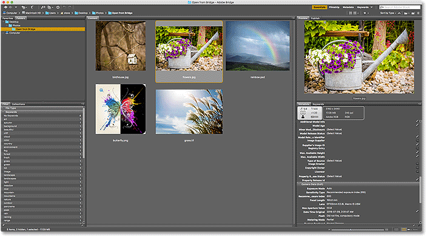
*The Adobe Bridge CC interface.*

If we look at the **file extension** at the end of the name of each image, we see that I have a few different types of files. There's a couple of JPEG images (with a .jpg extension), a TIFF file (.tif), a PNG file (.png), and a PSD file (.psd) which is Photoshop's native file format. All of these file types are supported by Photoshop and can be opened into Photoshop from Bridge:

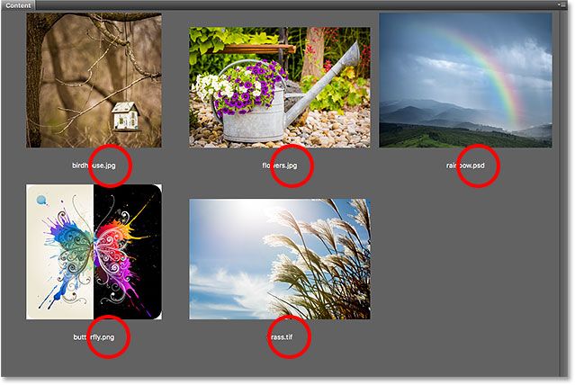
*The file type extensions appear at the end of the file names.*

### When Things Go Right

For example, I'll open the first image in the top left, "birdhouse.jpg", which is a JPEG file. To open it, I'll double-click on its thumbnail:

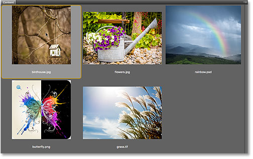
*Double-clicking on a JPEG file to open it into Photoshop.*

Bridge sends the image over to Photoshop, ready for editing:

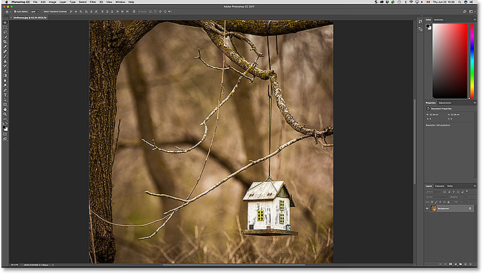
*The JPEG file opens in Photoshop. © Steve Patterson.*

Not only did it open in Photoshop, but it also opened in the *latest version* of Photoshop (which at the time I'm writing this is Photoshop CC 2017). I know I'm looking at the latest version because I can see the name in the top center of Photoshop's interface:

*Photoshop's name and version number appear at the top of the screen.*

To close the image and return to Bridge, I'll go up to the **File** menu in the Menu Bar at the top of the screen and choose **Close and Go to Bridge**:

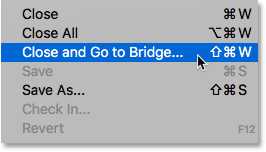
*Going to File > Close and Go to Bridge.*

This closes the image and returns me to the Bridge interface:

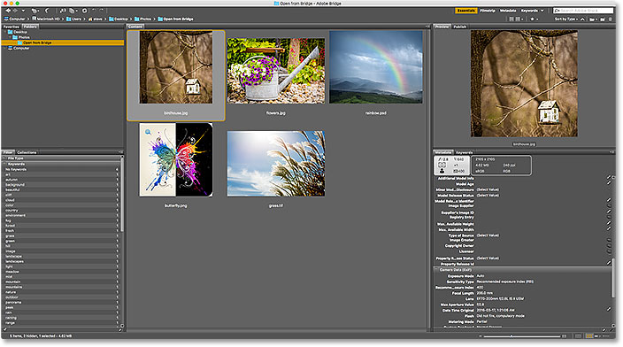
*Back to Bridge.*

### When Things Go Wrong

So far, we've seen that Adobe Bridge is sending my JPEG files over to the newest version of Photoshop without any issues. I also happen to know that my TIFF file and my PSD file will open as expected, so I won't bother opening them.

However, let's see what happens when I try opening my PNG file from Bridge into Photoshop. Now before we go any further, I should point out that PNG files are not necessarily going to give you any problems. I'm only using my PNG file as an example of what *could* go wrong with any file type so we can then learn how to fix it. So, just to be clear, I'm not purposely picking on PNG.

To open my "butterfly.png" file, I'll double-click on its thumbnail, just like I did with the JPEG image:

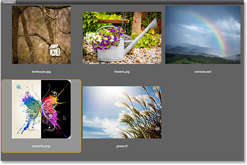
*Opening the PNG file from Bridge into Photoshop.*

But rather than opening in the newest version of Photoshop as my JPEG file did, something unexpected happens. The PNG file does open in Photoshop, but in the *wrong version*.

I like to keep older versions of Photoshop installed on my computer along with the latest version, but this actually caused a problem. Bridge knew enough to open the PNG file into Photoshop, but rather than choosing Photoshop CC 2017 (the latest version), it chose the older Photoshop CS6 (butterfly vector art from [Adobe Stock](https://prf.hn/l/A3PwXR5 "View the buttfly image on Adobe Stock")):

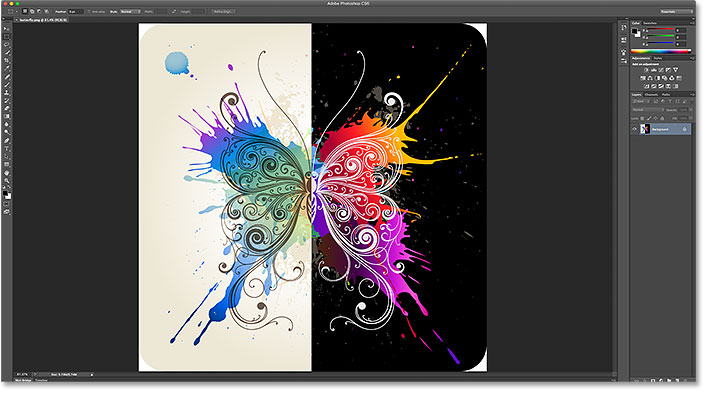
*The PNG file opens in an older version of Photoshop. Image credit: Adobe Stock.*

Again, I know I'm looking at Photoshop CS6, not CC 2017, from the version name in the top center of Photoshop's interface:

*The name at the top of Photoshop confirms it's the wrong version.*

To close not only the image but out of Photoshop CS6 completely, on a Windows PC, I would go up to the **File** menu in the Menu Bar and I'd choose **Exit**. Since I'm currently on a Mac, I'll go up to the **Photoshop** menu and choose **Quit Photoshop**:

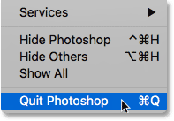
*Closing Photoshop CS6.*

## Changing The File Type Associations In Bridge

So, what went wrong? Why was Bridge able to open my JPEG file in the latest version of Photoshop, yet it opened my PNG file in an older version? For the answer to that, we need to look at Bridge's **File Type Associations** which we'll find in the Bridge Preferences.

### Step 1: Open The Bridge Preferences

To open the Preferences, on a Windows PC, go up to the **Edit** menu (in Bridge) and choose **Preferences**. On a Mac, go up to the **Adobe Bridge** menu and choose **Preferences**:

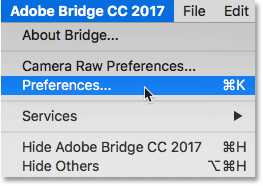
*Go to Edit > Preferences (Win) / Adobe Bridge > Preferences (Mac).*

### Step 2: Choose "File Type Associations"

In the Preferences dialog box, choose **File Type Associations** from the list of categories along the left:

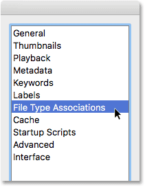
*Choosing the File Type Associations category.*

### Step 3: Scroll To The File Type You Need To Change

This brings up a very long list of all the file types that Bridge can open. To the right of each file type, you'll find the name of the program that Bridge is currently using to open that particular type of file.

For example, if scroll down to **JPEG** in the list, we see that Bridge is currently set to open all JPEG files in **Adobe Photoshop CC 2017**. That's why Bridge opened my JPEG file in the correct version:

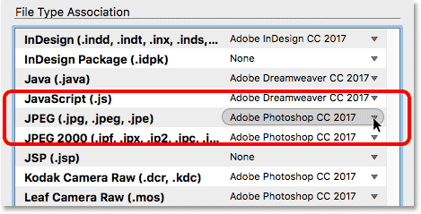
*Bridge is set to open all JPEG files in the newest version of Photoshop.*

However, if I scroll down to **PNG** (**Portable Network Graphics**), we see that there's a problem. Bridge is set to open PNG files in the wrong program. Instead of CC 2017, Bridge is sending PNG files to the older **Photoshop CS6:**

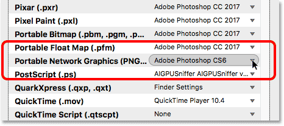
*Bridge is currently associating PNG files with the older version of Photoshop.*

### Step 4: Choose The New Program To Associate With The File Type

To fix the problem, all I need to do is click on "Adobe Photoshop CS6" and then choose the correct version, **Adobe Photoshop CC 2017**, from the list.

In my case, it actually says "Finder Settings: Adobe Photoshop CC 2017" because I'm on a Mac and I've set Mac OS X to use Photoshop CC 2017 as my [default image editor](/basics/default-image-editor-mac/ "Make Photoshop your default image editor in Mac OS X"):

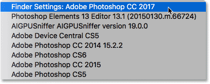
*Setting Adobe Photoshop CC 2017 as the new app for opening PNG files from Bridge.*

And here we see that after making the change, any PNG file I open from Adobe Bridge will now open in the correct version of Photoshop. I'll click OK at the bottom of the Preferences dialog box to close out of it and accept the change:

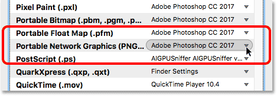
*PNG files are now set to open correctly.*

## Testing It Out

Now that I've told Bridge to open all PNG files in Photoshop CC 2017, let's test things out. I'll double-click on the "butterfly.png" image to open it, just as I did before:

*Opening the PNG file after changing the Bridge Preferences.*

And sure enough, this time the PNG file opens in Photoshop CC 2017:

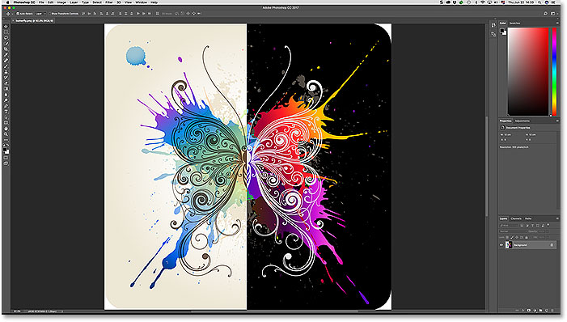
*The PNG file now opens in the correct version of Photoshop.*

Again, we know that because we can see "Adobe Photoshop CC 2017" at the top of the screen:

*Everything now works as expected.*