# Align and Distribute Layers In Photoshop

> Source: [https://www.photoshopessentials.com/basics/layers/align-layers/](https://www.photoshopessentials.com/basics/layers/align-layers/)
> Downloaded and converted to Markdown.

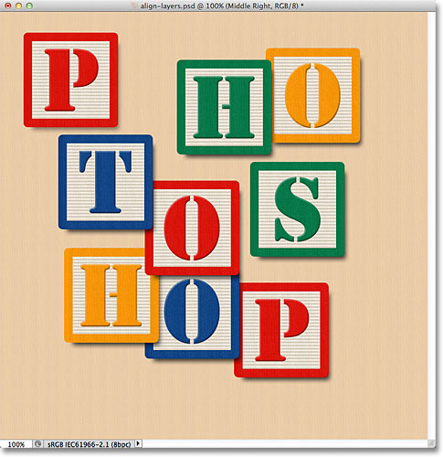
*The original document.*

At the moment, the blocks are scattered all over the place, but what I'd like to do is arrange them in more of a 3x3 grid pattern. If we look in my [Layers panel](/basics/layers/layers-panel/), we see that each block is sitting on its own layer above the [Background layer](/basics/layers/background-layer/). I've gone ahead and renamed each layer based on where I want each block to appear in the grid ("Top Left", "Top Right", "Bottom Right", etc.):

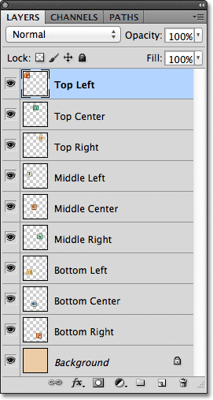
*Each block appears on its own layer in the Layers panel.*

So how can I re-arrange the blocks inside the document and line them up with each other? Well, I could try to drag them into place manually using the Move Tool, but that would take time and I doubt I'd be able to get them all lined up perfectly just by "eyeballing" it. A better way, and a much easier way, would be to let Photoshop do the work for me automatically using its **Align** and **Distribute** options!

To access the Align and Distribute options, we need to have the **Move Tool** selected, so I'll select it from the top of the Tools panel:

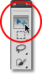
*Select the Move Tool.*

With the Move Tool selected, the Align and Distribute options appear as a series of icons in the **Options Bar** along the top of the screen. At the moment, the icons are grayed out and unavailable because I only have one layer selected in my Layers panel, and there's not much point trying to align or distribute a layer with itself:

*With the Move Tool selected, the Align and Distribute options appear in the Options Bar.*

Let's see what happens if I select multiple layers. I already have the Top Left layer selected at the top of the layer stack:

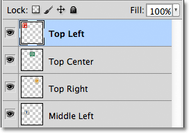
*The Top Left layer is currently selected.*

I'll select the Top Center and Top Right layers as well by holding down my **Shift** key and clicking on the Top Right layer. This keeps the Top Left layer selected, adds the Top Right layer to the selection, and also selects the Top Center layer in between them, so now all three layers are selected at once:

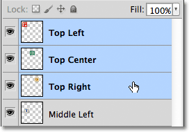
*Selecting the Top Left, Top Center and Top Right layers in the Layers panel.*

With more than one layer now selected, the Align and Distribute options become available. Let's take a closer look at them.

### The Align Options

The first six icons in the row are the Align options. From left to right, we have **Align Top Edges**, **Align Vertical Centers**, **Align Bottom Edges**, **Align Left Edges**, **Align Horizontal Centers**, and **Align Right Edges**. These options will line up the contents of two or more layers based on either the edges of the content or the centers of the content:

*The six Align options - Top Edges, Vertical Centers, Bottom Edges, Left Edges, Horizontal Centers, and Right Edges.*

### The Distribute Options

Next are the six Distribute options, which will take the contents of multiple layers and space them out equally. From left to right, we have **Distribute Top Edges**, **Distribute Vertical Centers**, **Distribute Bottom Edges**, **Distribute Left Edges**, **Distribute Horizontal Centers**, and finally, **Distribute Right Edges**. Note that you'll need to have three or more layers selected at once in the Layers panel for the Distribute options to become available:

*The six Distribute options - Top Edges, Vertical Centers, Bottom Edges, Left Edges, Horizontal Centers, and Right Edges.*

Let's see how I can use these Align and Distribute options to easily re-arrange the blocks in my document. As we saw a moment ago, I selected the Top Left, Top Center, and Top Right layers in the Layers panel. I'm going to temporarily turn off the other blocks in the document by clicking on each layer's **visibility icon**. You don't need to turn off other layers to use the Align and Distribute options. I'm only doing this to make it easier for us to see what's happening in the document:

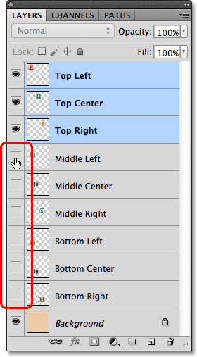
*Turning off the other blocks by clicking on their layer visibility icons.*

With the other blocks turned off, only the blocks on the three layers I selected remain visible. Again, I've turned the other blocks off here just to make it easier for us to see what's happening. There's no need to turn layers on and off to use these options:

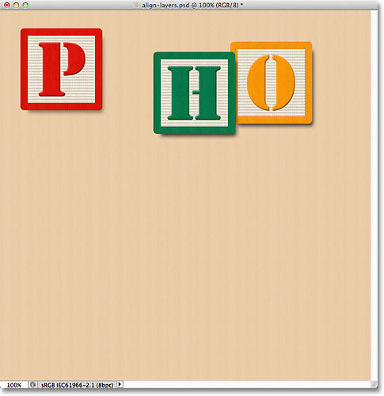
*The blocks on the Top Left, Top Center and Top Right layers remain visible.*

The first thing I want to do is line these three blocks up horizontally based on the top edges of the blocks. To do that, with the three layers selected in the Layers panel, all I need to do is click on the **Align Top Edges** option in the Options Bar:

*Clicking on the Align Top Edges option.*

Photoshop looks at the three blocks, figures out which one is closest to the top of the document, then moves the other two blocks up to align the top edges of all three, and it's all done instantly:

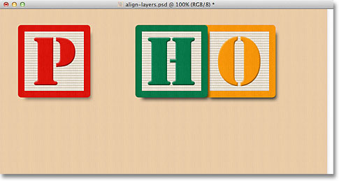
*The three blocks are now aligned to their top edges.*

I also want to distribute the three blocks horizontally so they're spaced equally apart from each other, so this time (again with the three layers selected in the Layers panel), I'll click on the **Distribute Horizontal Centers** option in the Options Bar:

*Clicking on the Distribute Horizontal Centers option.*

Photoshop again looks at the three blocks, looks at where the block on the left is and where the block on the right is, then moves the center block into position to create an equal amount of space between them. The blocks on either side don't move. Only the block between them is moved:

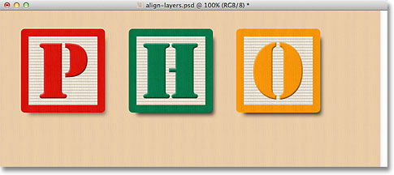
*The blocks are now spaced equally apart horizontally.*

With the top three layers now in place, I'll turn on the Middle Left and Bottom Left layers by clicking on their visibility icons in the Layers panel:

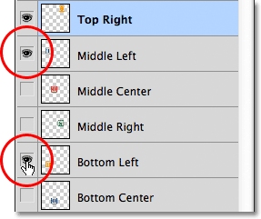
*Clicking on the visibility icons for the Middle Left and Bottom left layers.*

This turns those two new blocks on in the document. The blue "T" block is on the Middle Left layer and the orange "H" is on the Bottom Left layer:

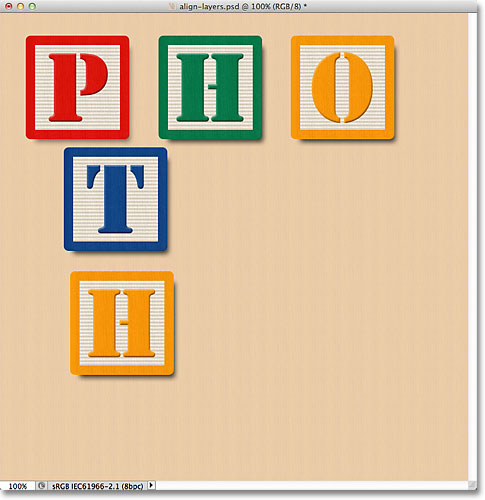
*Two more blocks appear in the document.*

I want to align the left edges of these two new blocks with the left edge of the "P" block in the top left corner, so the first thing I need to do is select those three layers in the Layers panel. I'll start by clicking on the Top Left layer to select it, then I'll hold down my **Ctrl** (Win) / **Command** (Mac) key as I click on the Middle Left and Bottom Left layers. This will select all three layers at once:

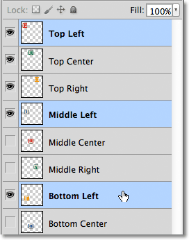
*Selecting the Top Left, Middle Left and Bottom Left layers.*

With the three layers selected, I'll click on the **Align Left Edges** option in the Options Bar:

*Clicking on the Align Left Edges option.*

Photoshop looks at the three blocks, figures out which one is closest to the left side of the document, then moves the other two blocks to the left to line up the left edges of all three:

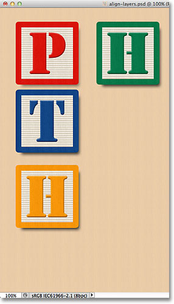
*The left edges of the blocks are now aligned.*

I still need to correct the spacing between the three blocks, but I'll come back to them in a moment. I'm going to turn on the Bottom Center and Bottom Right layers by clicking on their visibility icons:

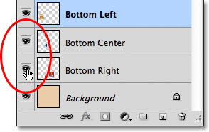
*Clicking the visibility icon for the Bottom Center and Bottom Right layers.*

This turns on the blue "O" (Bottom Center) and red "P" (Bottom Right) blocks along the bottom:

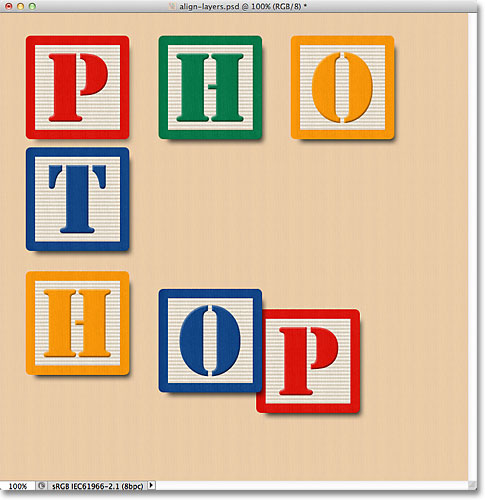
*Two new blocks along the bottom are now visible.*

I'll select all three layers at once by first clicking on the Bottom Left layer in the Layers panel, then holding down my **Shift** key and clicking on the Bottom Right layer. All three layers, including the Bottom Center layer in between, are now selected:

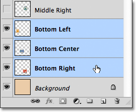
*Selecting the Bottom Left, Bottom Center and Bottom Right layers.*

I want to align the bottom edges of these layers, so I'll click on the **Align Bottom Edges** option in the Options Bar:

*Clicking on the Align Bottom Edges option.*

Photoshop figures out which of the three blocks is closest to the bottom of the document, then moves the other two blocks down to line up the bottom edges of all three:

*The bottom edges of the blocks are now aligned.*

Now that the "H" block in the bottom left corner is in place, I'll go back and fix the spacing between the blocks along the left. Again, I'll select the Top Left, Middle Left and Bottom Left layers in the Layers panel:

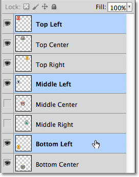
*Selecting the Top Left, Middle Left and Bottom Left layers.*

With the three layers selected, I'll click on the **Distribute Vertical Centers** option in the Options Bar:

*Clicking on the Distribute Vertical Centers option.*

Photoshop looks at the position of the top and bottom blocks, then moves the middle block to create an equal amount of space vertically between them:

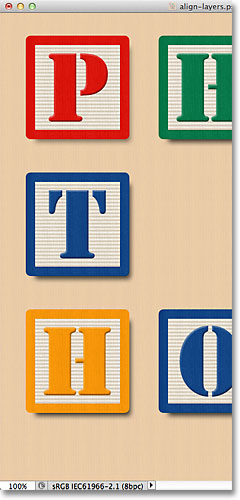
*The three blocks along the left are now equally spaced.*

So far so good. I'll turn on the Middle Right layer in the document by clicking on its visibility icon:

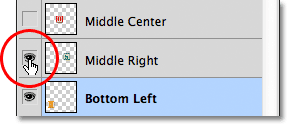
*Turning on the Middle Right layer.*

This turns on the green "S" block along the right side:

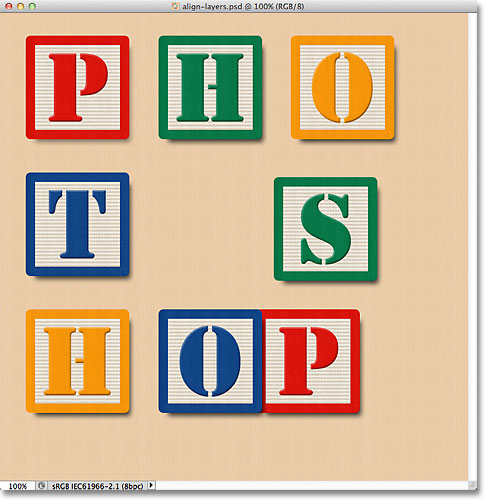
*The green "S" block on the Middle Right layer becomes visible.*

To line up the right edges of the three blocks along the right (the "O", "S" and "P" blocks), I'll first select the Top Right, Middle Right and Bottom Right layers in the Layers panel:

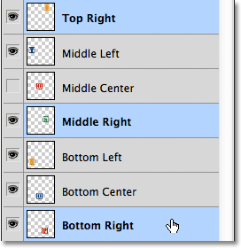
*Selecting the Top Right, Middle Right and Bottom Right layers.*

Then I'll click on the **Align Right Edges** option in the Options Bar:

*Clicking on the Align Right Edges option.*

Photoshop determines which of the three blocks is closest to the right side of the document, then moves the other two blocks to the right to line up the right edges of all three:

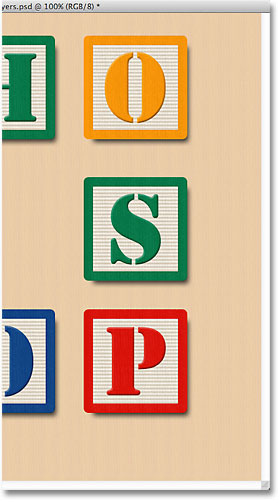
*The right edges of the three blocks are now aligned.*

I also need to space the three blocks equally from each other, so I'll click on the **Distribute Vertical Centers** option in the Options Bar, just as I did when I adjusted the spacing of the three blocks along the left:

*Clicking again on the Distribute Vertical Centers option.*

And now the three blocks on the right are equally spaced:

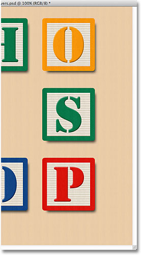
*The blocks after clicking the Distribute Vertical Centers option.*

Finally, I'll turn on the Middle Center layer by clicking on its visibility icon in the Layers panel:

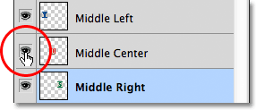
*Turning on the Middle Center layer.*

This turns on the red "O" block in the center:

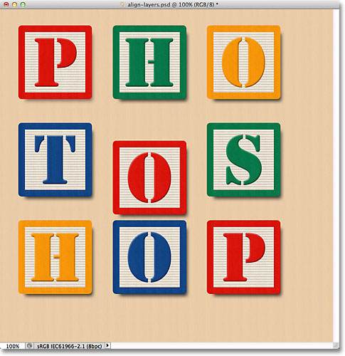
*The "O" block in the center is now visible.*

The center block needs to be aligned with the blocks on either side of it, so I'll select the Middle Left, Middle Center and Middle Right layers in the Layers panel:

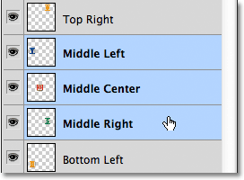
*Selecting the three middle layers.*

Then I'll click on the **Align Top Edges** option in the Options Bar:

*Clicking on the Align Top Edges option.*

Photoshop moves the middle block upward to align its top edge with the top edges of the "T" and "S" blocks beside it, and with that, the "grid" pattern is complete, all thanks to Photoshop's Align and Distribute options:

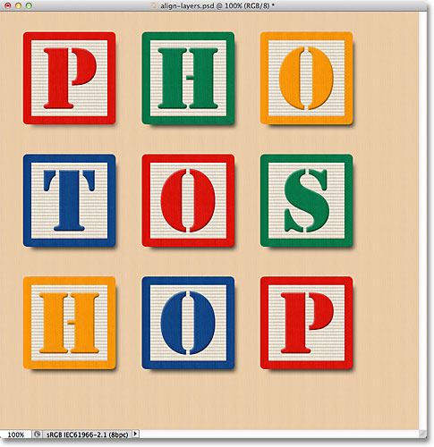
*The Align and Distribute options made it easy to rearrange the blocks.*

Of course, there's still one problem remaining. The blocks may be aligned and distributed among themselves, but the overall design still needs to be centered in the document. To do that, we need a way to move and align the blocks as a single unit, and the easiest way to do that is by placing them all inside a [layer group](/basics/layers/layer-groups/), which we looked at in the [previous tutorial](/basics/layers/layer-groups/).

To place the blocks inside a group, I first need to select all the layers I need, so I'll start by clicking on the Top Left layer at the top of the layer stack, then I'll hold down my **Shift** key and click on the Bottom Right layer directly above the Background layer. This will select the Top Left layer, the Bottom Right layer, plus every layer in between:

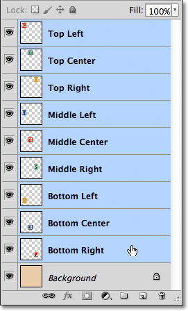
*Selecting all the blocks layers at once.*

With all the block layers selected, I'll click on the **menu icon** in the top right corner of the Layers panel (the menu icon will look like a small arrow in older versions of Photoshop)

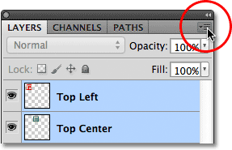
*Clicking on the menu icon in the top right corner of the Layers panel.*

I'll choose **New Group from Layers** from the menu that appears:

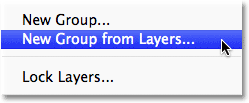
*Choosing New Group from Layers from the Layers panel menu.*

Photoshop will pop open a dialog box asking me for a name for the new layer group. I'll name it "Blocks", then I'll click OK to close out of the dialog box:

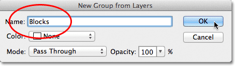
*Naming the new layer group.*

If we look in the Layers panel, we see that all of the block layers are now nested away inside a layer group named "Blocks":

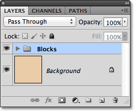
*The selected layers are now inside a layer group.*

One of the nice things about layer groups, besides being a great way to keep your Layers panel looking clean and organized, is that they allow us to move all of the layers inside them as if they were a single layer. The Blocks group is already selected in the Layers panel, so I'll hold down my Shift key as I click on the Background layer below it. This selects both the layer group and the Background layer at once:

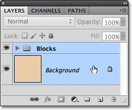
*Selecting the layer group and the Background layer at once.*

As we learned in the [Background layer tutorial](/basics/layers/background-layer/), Background layers are locked in place, which means they can't move around inside the document. The only thing I've selected that *can* move is the layer group. I'll click on the **Align Vertical Centers** option in the Options Bar:

*Clicking on the Align Vertical Centers option.*

Photoshop aligns the block layers inside the layer group vertically with the Background layer:

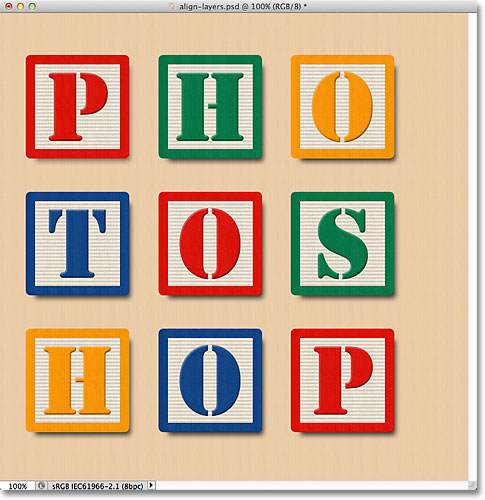
*The blocks inside the layer group are aligned as if they were on a single layer.*

And finally, I'll click on the **Align Horizontal Centers** option in the Options Bar:

*Clicking on the Align Horizontal Centers option.*

This aligns the blocks horizontally with the Background layer, centering the design in the document:

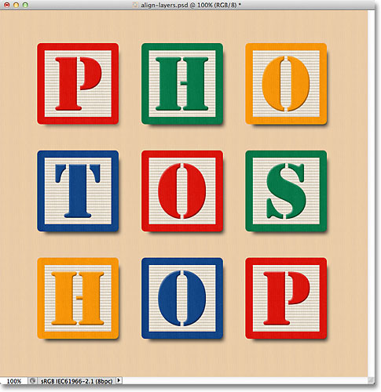
*The layer group made it easy to center the block design with the document.*

### Where to go from here...

And there we have it! In the next tutorial in our [Layers Learning Guide](/photoshop-layers-learning-guide/), we'll learn how to control the transparency of a layer using the [Opacity and Fill](/basics/layers/opacity-vs-fill/) options in the Layers panel! Or, check out our [Photoshop Basics](/basics/) section for more tutorials!