# Photoshop Point vs Area Type

> Source: [https://www.photoshopessentials.com/basics/type/area-type/](https://www.photoshopessentials.com/basics/type/area-type/)
> Downloaded and converted to Markdown.

In the previous tutorial, we learned the basics of [working with type in Photoshop](/basics/type/photoshop-type-essentials/). In that tutorial, I mentioned that Photoshop gives us two main kinds of text that we can add to a document - **point** type and **area** type. We covered point type in the previous tutorial. In this tutorial, we'll look at area type and how it allows us to easily add larger blocks of text on multiple lines inside a pre-selected area.

As we learned previously, to add any kind of text to a document, whether it's point type or area type, we use Photoshop's **Type Tool** which is found in the Tools panel. We can also select the Type Tool by pressing the letter **T** on the keyboard:

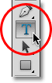
*Selecting the Type Tool from the Tools panel.*

With the Type Tool selected, we then choose our font up in the **Options Bar** along the top of the screen using the **font**, **font style** and **font size** options:

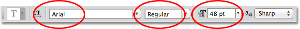
*From left to right - the font, font style and font size options.*

We can also choose a different color for our text by clicking on the **color swatch** in the Options Bar. The default text color is black, but clicking the color swatch will open Photoshop's **Color Picker**, allowing us to select a different text color if we prefer. I'll leave mine set to black:

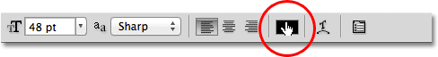
*Click the color swatch in the Options Bar to choose a new color for the text if needed.*

Lastly, we can choose the alignment we need for our text using the **Left Align Text**, **Center Text** and **Right Align Text** options in the Options Bar. The Left Align Text option is selected by default:

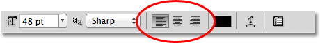
*From left to right - the Left Align Text, Center Text and Right Align Text options.*

### Point Type

The difference between point type (also known as **character** type) and area type (also known as **paragraph** type) is that with point type, Photoshop simply adds the text at the spot, or "point", where we clicked in the document with the Type Tool. This is by far the most common way of adding text to a document because in most cases, we're just adding small amounts of text on a single line, which is what point type is best suited for:

*With point type, we simply click with the Type Tool, then start typing.*

Unless we add a manual **line break** to our text when using point type, all of our text will be added to a single line and will even run right off the edge of the document if we keep on typing:

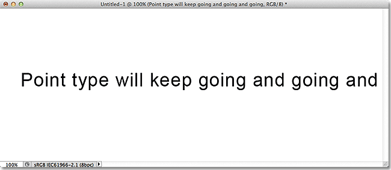
*Too much text on a single line can extend beyond the edge of the document with point type.*

To break the text up onto two or more lines, we need to add our own manual line breaks by pressing **Enter** (Win) / **Return** (Mac) on the keyboard, similar to using an old-fashioned typewriter:

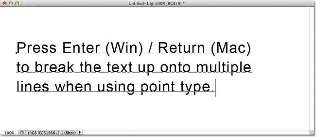
*Press Enter (Win) / Return (Mac) to add line breaks with point type.*

### Area Type

While we *can* use point type for adding larger blocks of text to a document, it would be a clumsy way to work. A better solution would be to use **area type** because it allows us to place the text inside a pre-selected "area" (a text box) and automatically wraps the text to the next line when we reach the edge of the box.

Area type doesn't require any special tools. We use the exact same Type Tool that we use for point type. The difference is in how we use the tool. To add point type, we simply click in the spot where we want the text to begin, then start typing. To add area type, we click with the Type Tool, but then, with the mouse button still held down, we drag out a text box, in much the same way that we'd draw a selection with the Rectangular Marquee Tool. You can force the text box into a perfect square if you need to by pressing and holding the **Shift** key on your keyboard as you drag:

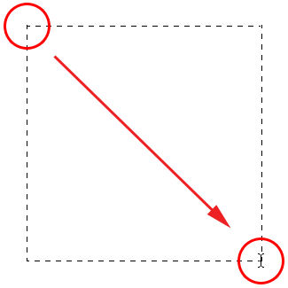
*To add area type, click with the Type Tool and drag out a container for the text.*

Release your mouse button when you're done dragging and Photoshop creates the text box, which looks very similar to a [Free Transform](/basics/free-transform/) box complete with **handles** (the little squares) for resizing it, as we'll see a bit later:

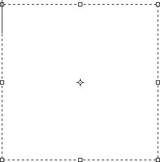
*Photoshop creates the text box when you release your mouse button.*

Once you've drawn your text box, you'll see the blinking **insertion marker** appear in the top left corner of the box (assuming you're using the default Left Align Text option). Simply begin typing to add your text:

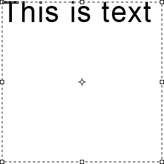
*By default, the text will begin in the top left corner of the text box.*

As we reach the edge of the box, Photoshop automatically wraps the text to the next line. There's no need to add manual line breaks ourselves:

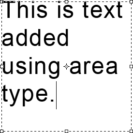
*Area type automatically wraps text to the next line.*

If you need to reposition the text box inside the document while you're adding your text, move your mouse cursor anywhere outside of the text box. You'll see the cursor change temporarily from the Type Tool's "I-beam" into the **Move Tool**. Click and drag the text box to its new location, then continue typing:

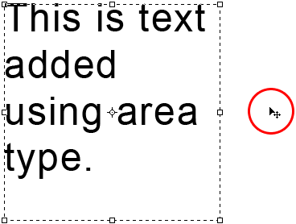
*Move your cursor outside the text box to temporarily switch to the Move Tool.*

To accept the text when you're done, click on the **checkmark** in the Options Bar. Or, if you have a numeric keypad on your keyboard, press the **Enter** key on the numeric keypad. If you don't have a numeric keypad, you can also press **Ctrl+Enter** (Win) / **Command+Return** (Mac). Remember, though, that simply pressing the normal Enter (Win) / Return (Mac) key will add a manual line break to the text, just as when we're using point type:

*Clicking the checkmark in the Options Bar is one way to accept the text.*

With the text accepted, the text box disappears, leaving only the text itself:

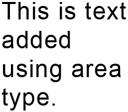
*The text box is only visible while we're adding or editing the text.*

Just as we saw with point type, Photoshop places area type on its own **Type layer** in the Layers panel, and it uses the first part of the text as the name of the layer:

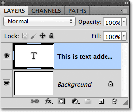
*Photoshop places the text on its own Type layer whether we're using point type or area type.*

To show the text box again, click anywhere inside the text with the Type Tool. This will place you back in text editing mode and the text box will re-appear around it:

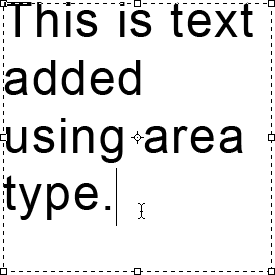
*Click inside the text with the Type Tool to bring back the text box.*

We can select text inside a text box the same way we select it using point type. To select a **single letter**, click either to the left or right of the letter with the Type Tool, then keep your mouse button held down and drag over the letter to highlight it resizeable:

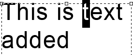
*Click and drag over a single letter to highlight it.*

To quickly select an **entire word**, double-click on the word:

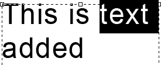
*Double-click on a word to instantly select it.*

To select an **entire line of text**, triple-click anywhere on the line:

*Triple-click to select an entire line of text.*

To select **all of the text** inside the text box, double-click on the Type layer's **thumbnail** in the Layers panel:

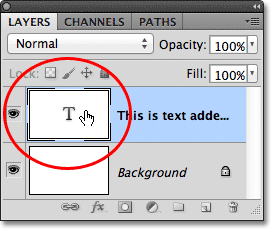
*Double-clicking on the Type layer's thumbnail.*

This will instantly highlight all of the text at once:

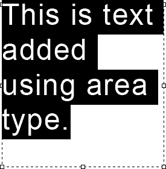
*All of the text inside the text box is now selected.*

With all of the text highlighted, I can easily replace it with different text just by typing over it. Once again, as I reach the edge of the text box, Photoshop automatically wraps the text to the next line:

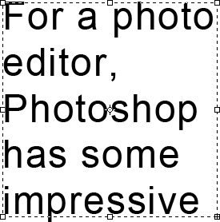
*Replacing the original text with new text.*

Notice, though, that not all of my new text was able to fit within the boundaries of my text box. How do we know that? Whenever our text flows beyond the boundaries of the text box, an **overflow symbol** appears in the bottom right corner of the box (it's the small plus sign inside the square). I've enlarged it here to make it easier to see:

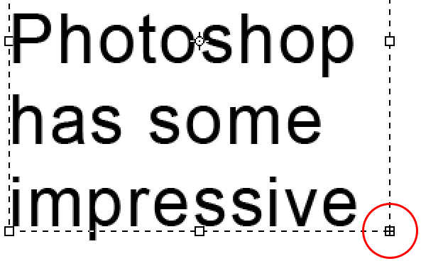
*An overflow symbol lets us know that some of the text is extending beyond the text box.*

There's a few things we can do to fix the problem. One would be to simply select and re-edit the text until it fits inside the text box. If that's not an option, we can easily **resize the text box** itself. You'll see a small **handle** (a little square) on the top, bottom, left and right of the text box, as well as one in each corner. Click on any of the handles and, with your mouse button held down, drag the handle to resize the text box until your text fits inside it. As you drag the handle, Photoshop will re-flow the text inside the box:

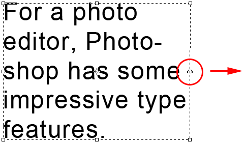
*Click and drag any of the handles to resize the text box.*

When you're done resizing the text box, click the **checkmark** in the Options Bar, press the **Enter** key on a numeric keypad, or press **Ctrl+Enter** (Win) / **Command+Enter** (Mac) on your keyboard to accept the change.

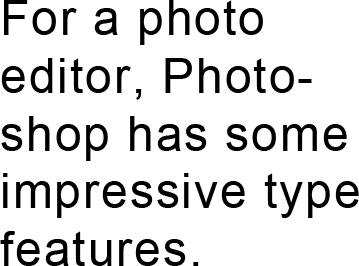
*Resizing the text box allowed all of the text to fit inside it.*

If editing the text is not an option and resizing the text box is also not an option, the other way to fit the text within the box would be to simply resize the text and make it smaller. To do that, I'll double-click on the Type layer's thumbnail in the Layers panel to select all of the text at once:

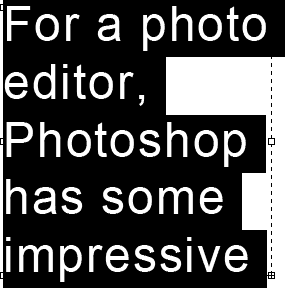
*All of the text is selected after double-clicking on the Type layer's thumbnail.*

With the text selected, we can go back up to the Options Bar and change any of the font options. I'll leave my font set to Arial Regular, but I'll lower its size down to 36 pt (it was originally set to 48 pt):

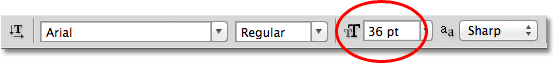
*Lowering the font size to fit the text within the text box.*

And now all of my text fits easily within the boundaries of the box. The overflow symbol in the bottom right corner of the text box is gone:

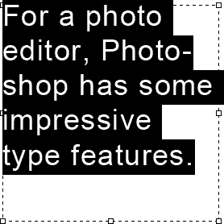
*Resizing the type allowed it to fit within the text box.*

And there we have it! To quickly summarize, to add **point type** to a document (best used for small amounts of text on a single line), **click** with the Type Tool, then begin typing. To add **area type** (best for larger amounts of text on multiple lines), **click and drag** with the Type Tool to draw a text box, then begin typing. You can then resize the text box as needed by dragging any of the handles.