# Photoshop CS4 New Features – Multi Document Layouts

> Source: [https://www.photoshopessentials.com/basics/photoshop-cs4/arrange-documents/](https://www.photoshopessentials.com/basics/photoshop-cs4/arrange-documents/)
> Downloaded and converted to Markdown.

In a previous tutorial, we looked at the new **[tabbed document windows feature in Photoshop CS4](/basics/photoshop-cs4/tabbed-document-windows/)**, which finally gives us an easy way to view and switch between multiple document windows when we have more than one image open at once in Photoshop. But Adobe didn't stop there. They took things even further with Photoshop CS4 and included lots of great new ways for us to arrange multiple documents on the screen, all of which can be accessed from the **Arrange Documents** option in the **[Application Bar](http://www.photoshopessentials.com/basics/photoshop-cs4/interface/)**, a new feature of the **[Photoshop CS4 interface](/basics/photoshop-cs4/interface/)**. In this Photoshop Basics tutorial, we'll take a quick look at some of the new layouts we can choose from, as well as how to navigate around images inside a layout.

During a recent trip to Alaska, I had the chance to visit a Native village which was home to some impressive looking totem poles. Three of the photos I took that day are currently open on my screen. Notice how each image appears in its own floating document window and that only one of the photos is visible while the other two hide behind it:

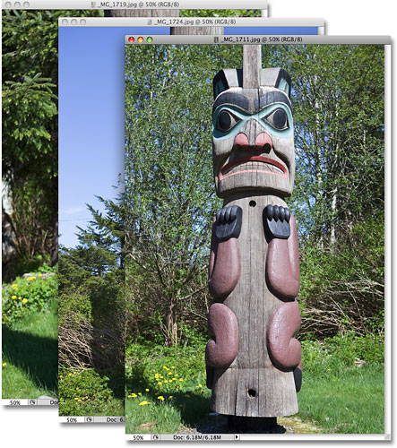
*Three images are open on the screen, each in its own floating document window.*

In earlier versions of Photoshop, this was typically how we worked, with each image in its own window, forcing us to click and drag documents out of the way to get to the one we want. As we looked at previously though, Photoshop CS4 allows us to view the images as a series of tabbed documents. One way to group the images into tabs is by going up to the **Window** menu at the top of the screen, choosing **Arrange**, and then choosing **Consolidate All to Tabs**, but there's an even faster way thanks to the new Arrange Documents feature.

### Consolidating All Open Images To Tabs

The Arrange Documents icon is found in the Application Bar, which on a Windows system is nested in with the Menu Bar at the top of the screen and on a Mac (which is what I'm using here), it's a separate feature located between the Menu Bar and the Options Bar:

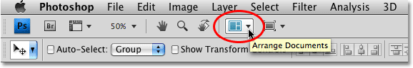
*The Arrange Documents icon is part of Photoshop CS4's Application Bar.*

Clicking on the Arrange Documents icon brings up a menu with all sorts of different options for viewing our images. The very first option in the top left corner is **Consolidate All**:

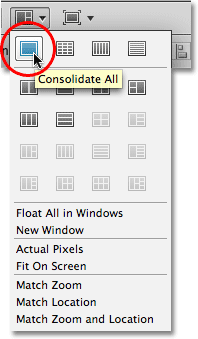
*Click the Consolidate All option in the Arrange Documents menu to quickly group all open images to tabbed documents.*

Clicking on this option quickly consolidates all open images to tabs, and if we look at my photos again, we can see that all three of them are now nested inside a single document window, and each one now has its own tab at the top of the window. Switching between the images is as simple as clicking on their tabs:

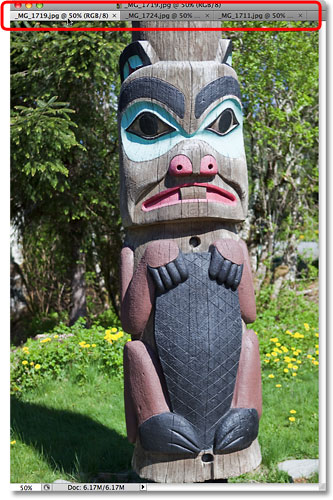
*The images now appear in a single document window with tabs at the top for switching between them.*

### The New Multi Document Layouts In Photoshop CS4

Being able to easily switch between images is great, but it still leaves us with the problem of seeing only one photo at a time. That's where the rest of the icons in the Arrange Documents menu come in. If you look closely, you'll see that the menu is divided into different sections. Most of the interesting multi document layouts are found in the second section from the top (I've highlighted them in yellow):

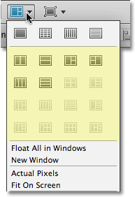
*Most of the multi document layouts are found in the second section of the menu.*

Here, you'll find different layouts for viewing your images depending on the number of images you currently have open on your screen. There's layouts for viewing between 2 and 6 images at once. You may notice that many of the icons in the screenshot above are grayed out. That's because I only have three images open and the layouts that are grayed out are for viewing four or more images. If I was to open more images, more of the layouts would become available to me.

You can tell how many images a certain layout is designed for and see a preview of what the layout will look like by looking at the little picture on each icon. For example, the first two icons in the top row are for viewing two images at once. The icon on the left will give us a vertical layout, placing each image in a vertical column, while the icon on the right will give us a horizontal layout, placing each image in a horizontal row. If you have Tool Tips enabled in Photoshop's Preferences (Tool Tips are enabled by default), you'll see a little pop up message telling you the number of images a certain layout was designed for (2 Up, 3 Up, 4 Up, 5 Up, or 6 Up) when you hover your mouse over it:

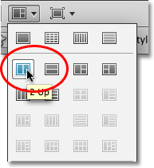
*The small picture on each icon shows a preview of what the layout will look like.*

There's only a couple of different ways you can display two images, but the more images you have open in Photoshop CS4, the more interesting the layouts become. I have three images open, and the Arrange Documents menu gives us four different layout options for arranging them on the screen. I won't bother going through each of them since it would be faster and easier for you to simply click on them yourself to see each layout, but the one I find most useful when working with images in portrait orientation is the 3 vertical columns layout, which is the first icon on the left, second row. Again, the small picture on the icon gives us a preview of what the layout will look like:

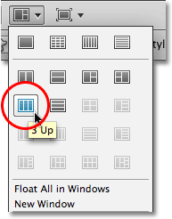
*More images open in Photoshop means a more interesting selection of layouts to choose from.*

I'll click on this layout to select it, and we can see that my images are now being displayed in a 3 column vertical layout, making it easy for me to view and compare them:

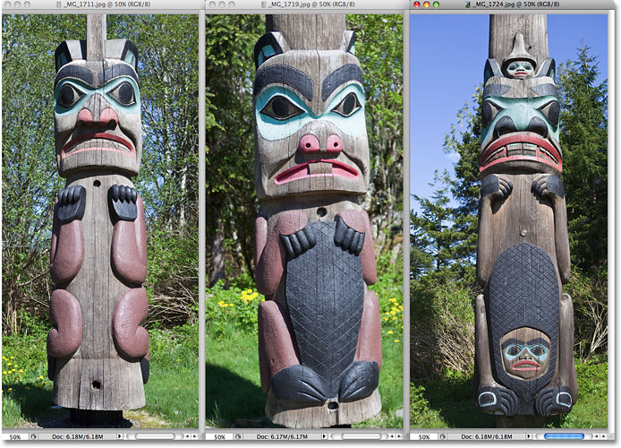
*Easily view and compare multiple images at once with the new layouts in Photoshop CS4.*

### Selecting Images In A Layout

To select one of the images in a layout, simply click on it. You can tell which image is currently selected because the other images have their document windows slightly faded out. In the screenshot above, the image on the right is selected. You can also select images using the same keyboard shortcuts available to us for moving through tabbed documents. **Ctrl+~** (Win) / **Command+~** (Mac) will cycle forward through the images in a layout, while **Ctrl+Shift+~** (Win) / **Command+Shift+~** (Mac) will cycle backwards through them. The older Photoshop keyboard shortcuts of **Ctrl+Tab** (Win) / **Control+Tab** (Mac) for cycling forward and **Ctrl+Shift+Tab** (Win) / **Control+Shift+Tab** (Mac) to cycle backwards will also work.

### Navigating Around A Single Image In A Layout

Navigating around inside an image that's part of a multi document layout in Photoshop CS4 is no different from navigating around a single image that's open on the screen. To zoom in on one of the images, simply click on it to select it, then hold **Ctrl+spacebar** (Win) / **Command+spacebar** (Mac) to temporarily access the **Zoom Tool** and click on the image at the spot you want to zoom in on. To zoom out, hold down **Alt+spacebar** (Win) / **Option+spacebar** (Mac) and click on the image. Of course, you can also grab the Zoom Tool from the Tools panel, but you'll probably find that the keyboard shortcut is faster and more convenient.

To pan an image around inside its document window, hold down the **spacebar** by itself, which gives you temporary access to Photoshop's **Hand Tool**, then click on the image and drag it around with your mouse. Again, you could grab the Hand Tool from the Tools panel, but unless you're getting paid by the hour, the keyboard shortcut is faster. Check out our **[Zooming and Panning in Photoshop tutorial](/basics/photoshop-zoom/)** if needed for much more information on navigating around your images.

### Navigating All Images In A Layout At Once

What if you want to zoom or pan all of the images in a layout at once? No problem! Simply add the **Shift** key to the single image shortcuts we just looked at! To zoom in on all images in a layout at once, hold down **Shift+Ctrl+spacebar** (Win) / **Shift+Command+spacebar** (Mac), then click on the image. Holding **Shift+Alt+spacebar** (Win) / **Shift+Option+spacebar** (Mac) and clicking on an image will zoom out of every image in the layout:

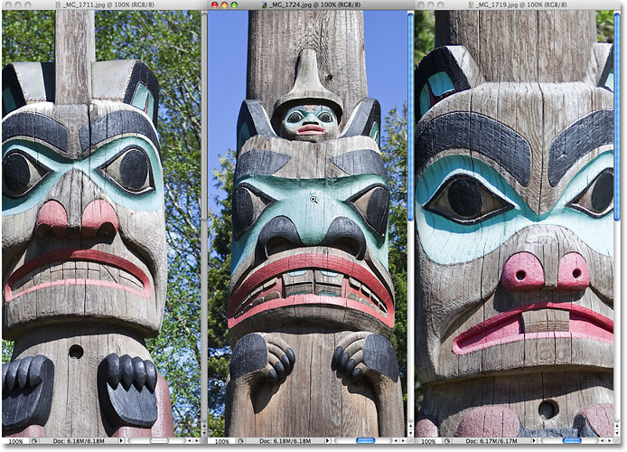
*Adding the Shift key to the standard Zoom keyboard shortcuts allows us to zoom in and out of all images in a layout at the same time.*

To pan all images in a layout at once, hold down **Shift+spacebar**, then click on any of the images and drag it around with your mouse. The other images in the layout will move around with it:

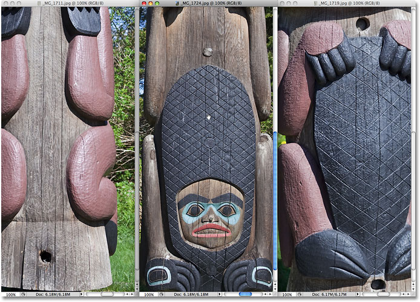
*Hold down Shift+spacebar, then click and drag any of the images to pan all images in a layout at once.*

### Matching The Zoom Level And Location Of The Images In A Layout

If you've zoomed in on one of the images and want to quickly match all of the other images in the layout to that same zoom level, first make sure the image with the zoom level you want is selected, then choose the **Match Zoom** option from the Arrange Documents menu:

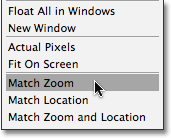
*The "Match Zoom" option will quickly match the zoom levels of all images in the layout to the currently selected image.*

If you've panned one of the images and want to quickly send all of the other images in the layout to that same area of the image, make sure the image you want to match the others to is selected, then choose the **Match Location** option from the Arrange Documents menu:

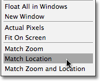
*The "Match Location" option pans all images in the layout to the same location as the selected image.*

You can also quickly match both the zoom and location of all images in a layout by first selecting the image you want to match the others to, then choosing the **Match Zoom and Location** option from the Arrange Documents menu:

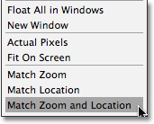
*The "Match Zoom and Location" option will instantly match the zoom and location of all images to the currently selected image.*

### Sending The Images Back To The Tabs

Finally, if you're done comparing your images and want to switch back to the tabbed document layout, simply click on the same **Consolidate All** option in the Arrange Documents menu that we looked at earlier:

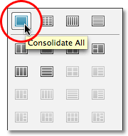
*The Consolidate All option exits the layout and switches back to the tabs.*