# Photoshop Layers Tip: How to Auto-Select Layers

> Source: [https://www.photoshopessentials.com/basics/auto-select-layers-photoshop/](https://www.photoshopessentials.com/basics/auto-select-layers-photoshop/)
> Downloaded and converted to Markdown.

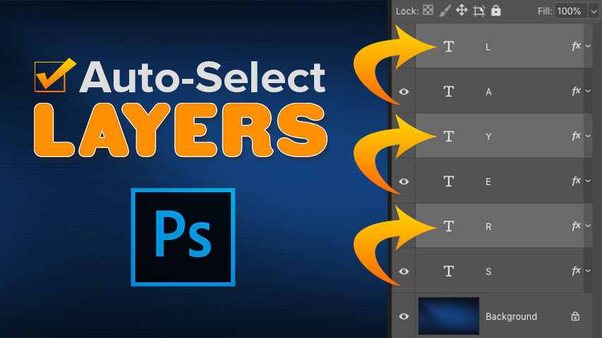

Work faster in Photoshop with Auto-Select! Learn how to auto-select layers, including multiple layers at once and even layer groups! You'll also learn the best ways to use this great feature.

Photoshop's Move Tool includes an **Auto-Select** feature that lets you automatically select layers just by clicking on their contents in the document. You can select an individual layer or multiple layers at once. And you can even select an entire layer group just by clicking on the contents of any layer *in* the group!

Auto-selecting layers is faster than switching between them in the Layers panel. But it also makes it easy to accidentally select the *wrong* layer. So in this tutorial, I'll walk you through how Photoshop's Auto-Select feature works, and I'll show you what I consider to be the best way to take advantage of it.

Auto-Select is available in all recent versions of Photoshop, but it's turned on by default in the [latest versions of Photoshop](https://prf.hn/l/dlXjD2w). Along with learning how it works, I'll show you how to turn Auto-Select off, and how to turn it back on only when you need it. Let's get started!

## How to auto-select a layer in Photoshop

To show how Auto-Select works, I've created this simple layout with a [background image](https://prf.hn/l/MDQ3GE1) and the word "LAYERS" in front of it:

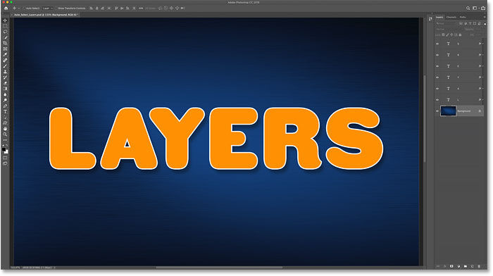
*My Photoshop document.*

In the [Layers panel](/basics/layers/layers-panel/), we see how my document is set up. The image is on the Background layer, and notice that I've split the word "LAYERS" into its individual letters, with each letter on its own Type layer.

Auto-Select works with most kinds of layers in Photoshop, including pixel layers, Shape layers, Type layers, and even [smart objects](/basics/how-to-create-smart-objects-in-photoshop/). I'm using Type layers here just to keep things simple:

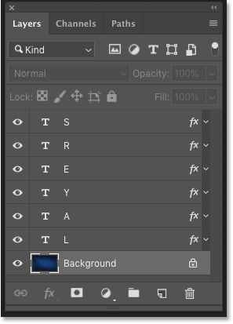
*The Layers panel showing the layers in the document.*

### Select the Move Tool

To auto-select layers, you first need to have the **Move Tool** selected. You can select the Move Tool from the top of the [toolbar](/basics/photoshop-tools-toolbar-overview/), or by pressing the letter "**V**" on your keyboard:

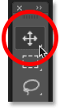
*Selecting the Move Tool.*

### How to turn Auto-Select on

With the Move Tool active, **Auto-Select** is found in the Options Bar. In the most recent versions of Photoshop CC, Auto-Select is turned on by default. In earlier versions, you can turn Auto-Select on by clicking inside the checkbox:

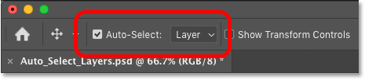
*The Auto-Select option in the Options Bar.*

#### How to switch Auto-Select between Layer and Group

Notice that by default, Auto-Select is set to automatically select [layers](/photoshop-layers-learning-guide/). But you can also auto-select entire *layer groups*. Just click in the box beside the words "Auto-Select" and choose either **Layer** or **Group** from the list.

We'll look at layer groups in a moment. For now, I'll leave Auto-Select set to Layer:

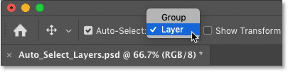
*Switching Auto-Select between Layer and Group.*

### Click on the contents of a layer to select it

To automatically select a layer, just click on the layer's contents in the document. I'll click on the letter "L", and notice in the Layers panel that Photoshop automatically highlights that layer:

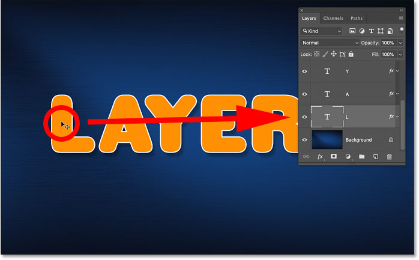
*Clicking on the content selects the layer.*

To auto-select a different layer, again click on its contents. If I click on the letter "A", Photoshop deselects the previous layer in the Layers panel and selects the "A" layer instead:

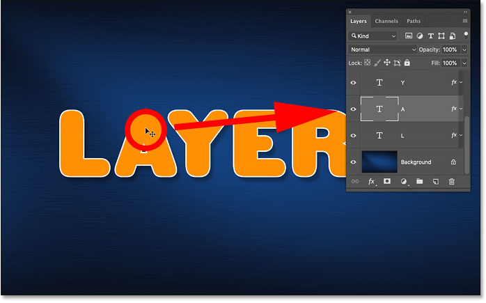
*Clicking on a different item in the document to auto-select its layer.*

### How to deselect all layers

The one layer you can't auto-select is the [Background layer](/basics/background-layer-photoshop-cc/). Instead, clicking on the background contents while Auto-Select is turned on will deselect any previously-selected layers:

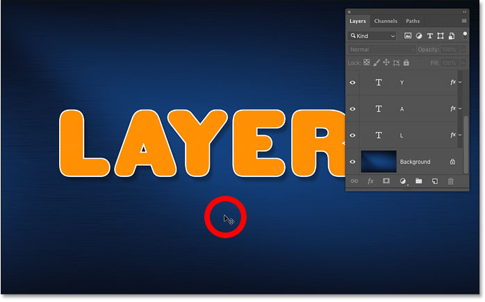
*Desleecting all layers by clicking the background contents.*

## How to auto-select multiple layers

So far, we've seen how easy it is to auto-select a single layer in your Photoshop document. But you can auto-select multiple layers as well. And there's a couple of ways to do it.

### Method 1: Drag a selection around the layers with the Move Tool

One way to auto-select two or more layers is to click and drag with the Move Tool to draw a [selection outline](/basics/make-selections-photoshop/) around the contents of the layers you want to select.

Here I'm dragging a selection around the first three letters. And in the Layers panel, we see that Photoshop has auto-selected all three layers. There's no need to draw your selection around the entire contents of a layer. As long as any part of the content falls within the selection outline, the layer will be selected:

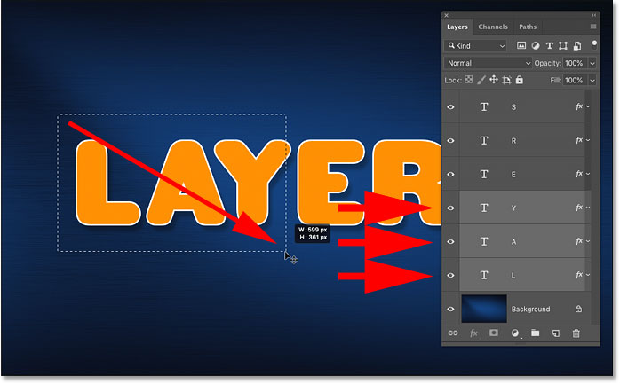
*Drawing a selection to auto-select layers.*

With all three layers selected, I can click with the Move Tool on the contents of any of the selected layers and drag all three layers together to reposition them:

*Moving all three layers at once after auto-selecting them.*

### Method 2: Shift-clicking on the layer contents

Another way to auto-select multiple layers is to press and hold your **Shift** key as you click on the contents of the layers you want to select.

Here I'm holding Shift while clicking the letters L, Y and R. And in the Layers panel, all three layers are now highlighted:

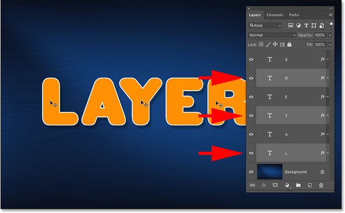
*Shift-clicking to auto-select multiple layers at once.*

Again, I can click on the contents of any of the selected layers to move all of them at the same time:

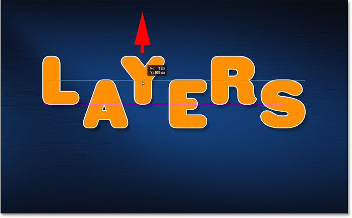
*Dragging the selected layers upward.*

## How to auto-select a layer group

Along with automatically selecting layers, Photoshop also lets us auto-select *layer groups*. Clicking on the contents of any layer in the group will auto-select the entire group.

In the Layers panel, we see that I've gone ahead and placed all six of my Type layers into a [layer group](/basics/layers/layer-groups/) ("Group 1"). And I've twirled the group open so we can see the layers inside it:

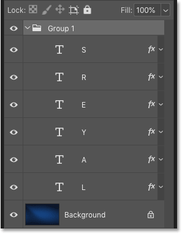
*All six Type layers are now inside a layer group.*

With Auto-Select still set to **Layer**, clicking on the contents of any layer in the group selects just that one layer:

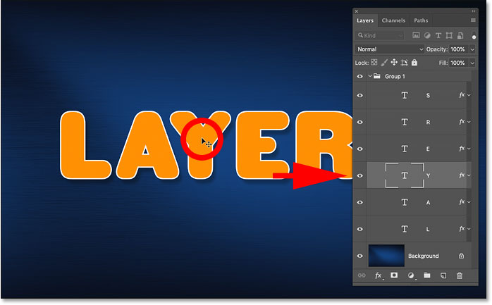
*Auto-selecting a single layer in the layer group.*

To auto-select layer groups, go to the Options Bar and change **Auto-Select** from Layer to **Group**:

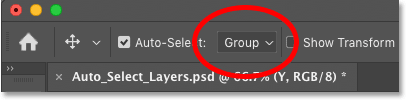
*Changing the Auto-Select option to Group.*

And now, if I click on the same contents again, this time I select the layer group itself:

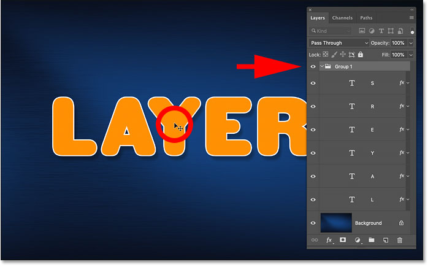
*Auto-selecting the layer group.*

## The problem with auto-selecting layers

So we've seen that Photoshop's Auto-Select feature is a fast and easy way to select a layer. But it also makes it easy to accidentally select the *wrong* layer.

To show you what I mean, I've ungrouped my layers, and I've set Auto-Select back to **Layer**:

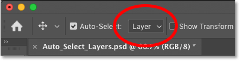
*Setting Auto-Select from Group back to Layer.*

In the Layers panel, I'll select the "L" layer by clicking on it, the way you would normally select a layer without using Auto-Select:

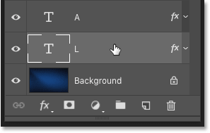
*Selecting a layer in the Layers panel.*

And then with the "L" layer active, if I click *directly* on the letter L in the document, and I drag with the Move Tool, I move the content I expected:

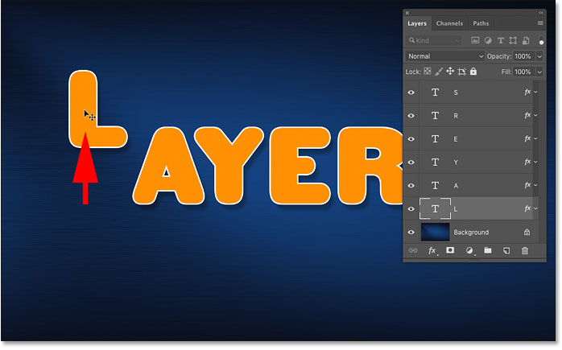
*Moving the correct layer in the document.*

But here's the problem. If I click on a *different* part of the document by mistake, like the letter A, and I drag with the Move Tool, I end up moving the wrong content. And that's because Photoshop auto-selected the new layer I clicked on, even though I didn't mean to do that:

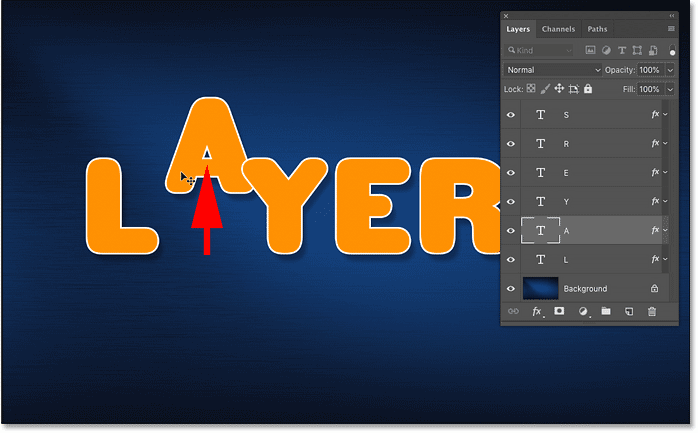
*Auto-selecting and moving the wrong content by mistake.*

Or, if I accidentally click and drag on the background contents, then instead of moving the letter L, or anything at all, I start drawing a selection outline, auto-selecting any layers that fall within the selection:

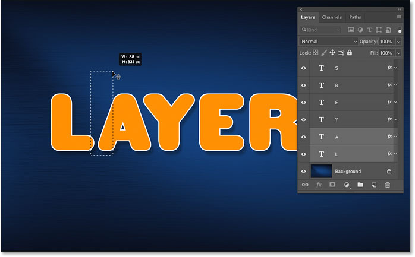
*Clicking and dragging on the background draws a selection outline instead of moving the layer.*

## The best way to use Auto-Select in Photoshop

So how we can use Photoshop's Auto-Select feature but avoid selecting the wrong layers by mistake? The best way is to turn Auto-Select on only when you need it. And you can do that using a simple [keyboard trick](/basics/layer-shortcuts/).

### How to turn off Auto-Select in Photoshop

With the Move Tool active, uncheck Auto-Select in the Options Bar to turn it off. It will remain off until you turn it back on again, so you only need to do this once:

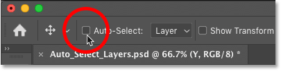
*Turning Auto-Select off.*

### How to temporarily turn Auto-Select back on

Then, any time you want to *temporarily* turn Auto-Select back on, press and hold the **Ctrl** (Win) / **Command** (Mac) key on your keyboard. Click on the contents of the layer you want to auto-select, and then release the Ctrl / Command key to turn Auto-Select back off.

To auto-select multiple layers, press and hold **Ctrl** (Win) / **Command** (Mac) to temporarily turn Auto-Select on, and then add the **Shift** key. Click in the document to select the layers you need, and then release the keys to turn Auto-Select back off. Note that you'll need to have the Move Tool active for these shortcuts to work.

You'll know that Auto-Select is on because the **checkmark** will reappear in the Options Bar. When you release the Ctrl / Command key, the checkmark will again disappear:

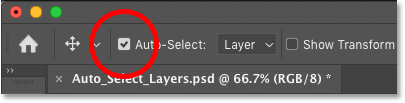
*The checkmark appears and disappears as you toggle Auto-Select on and off.*

And there we have it! That's how to use the Auto-Select feature to quickly select single layers, multiple layers and layer groups in Photoshop!

Check out our [Photoshop Basics](/basics/) section for more tutorials! And don't forget, all of our tutorials are now available to [download as PDFs](/print-ready-pdfs)!