# Photoshop CS6 New Features – Background Save and Auto Save

> Source: [https://www.photoshopessentials.com/basics/background-auto-save-cs6/](https://www.photoshopessentials.com/basics/background-auto-save-cs6/)
> Downloaded and converted to Markdown.

Photoshop CS6 brings with it two great new features designed to improve your workflow and minimize annoying interruptions.The first of these new features, **Background Save**, lets Photoshop save your file quietly in the background so you can continue working on the image even as it's being saved.

The second and more important new feature is **Auto Save**, which lets Photoshop CS6 save a backup copy of your work at regular intervals so that if Photoshop happens to crash while you're working on an image, rather than losing everything you've done and starting over, you can recover the file and continue working from where you left off! In this tutorial, we'll learn how both of these new features work.

## Background Save

If you've been using Photoshop for a while, you know that as we add more and more layers to a document, we increase the file size. You probably also know that the bigger the file size becomes, the longer it takes Photoshop to save your work. With Photoshop CS5 and earlier, saving a large file often meant taking a break, whether you wanted to or not, because Photoshop would essentially freeze as the file was being saved, locking you out of the program and preventing you from doing anything more until the saving process was completed. Thanks to the new Background Save feature in Photoshop CS6, that's no longer the case.

Here's an image that I currently have open in CS6:

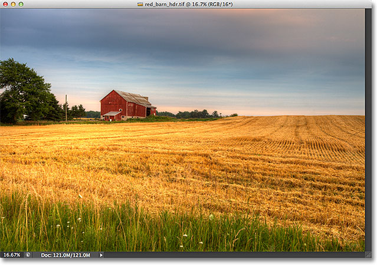
*A newly opened image.*

If we look in the bottom left of the document window, we see that the current file size is 121 MB, which is fairly small as far as Photoshop files go:

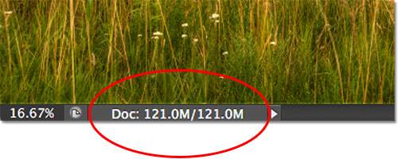
*The file size is displayed in the bottom left of the document window.*

If we look in my [Layers panel](/basics/layers/layers-panel/), we see that at the moment, my document contains only one layer, which is why the file size is relatively small:

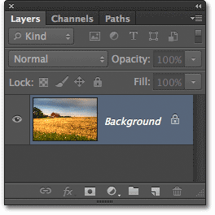
*The Layers panel in Photoshop CS6.*

With small file sizes like this, saving them isn't a problem. The process happens so quickly that you barely notice it. Where the new Background Save feature in Photoshop CS6 begins to shine is when we start working with files that are hundreds of megabytes or more in size.

To see how it works, I'll quickly increase the size of my file by making multiple copies of my image. To do that, I'll press the keyboard shortcut **Ctrl+J** (Win) / **Command+J** (Mac) several times. Each time I press it, I make a new copy of the layer that the image is sitting on. Here we can see that my document now contains 8 layers - the original image on the Background layer, plus 7 copies above it:

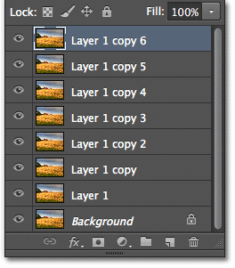
*The document now contains 8 layers in total.*

When we look again in the bottom left of the document window, we see that my file size has increased from 121 MB all the way up to 967.9 MB:

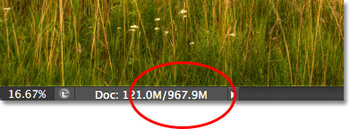
*The file size is now much larger after making multiple copies of the image.*

Saving a file as large as this will take some time, and as I mentioned, in Photoshop CS5 and earlier, we would essentially be locked out of Photoshop and unable to continue working until the saving process was finished. Watch what happens, though, as I save the file in Photoshop CS6, which I'll do by going up to the **File** menu in the Menu Bar along the top of the screen and choosing **Save**:

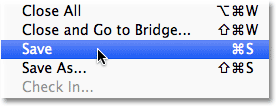
*Going to File > Save.*

The first clue that something is different with CS6 is that Photoshop now shows us how far along we are in the saving process by displaying a couple of **progress indicators**. The first one can be found in the name tab at the top of the document window, where the progress is displayed as a percentage. Here, Photoshop is telling me that the save process is 34% completed:

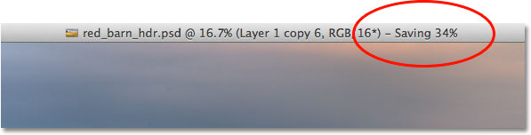
*The first progress indicator appears in the name tab at the top of the document window.*

The second indicator appears in the bottom left of the document window, and this one is a bit more helpful because along with the percentage value, it also displays the save process as a familiar blue progress bar:

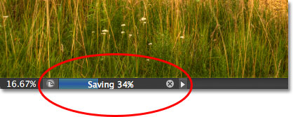
*The save process is displayed as a percentage and as a progress bar in the bottom left of the document window.*

While these progress indicators are a nice new addition to the interface, the real power of the Background Save feature in Photoshop CS6 is that, as its name implies, the saving process now takes place entirely in the background. What does that mean? It means that our workflow will no longer be interrupted when we go to save a large file because we won't be locked out of Photoshop. We can continue working on the image even while it's been saved!

As an example, here we can see that I've started working on a black and white conversion of my image (by adding a [Black and White adjustment layer](/photo-editing/black-and-white-cs3/)) even though the progress indicators at the top and bottom of the document window are telling me that the save process is still only 51% completed. The Background Save feature will even let us switch to a completely different image to work on while the original image is being saved, something that was not possible in Photoshop CS5 and earlier:

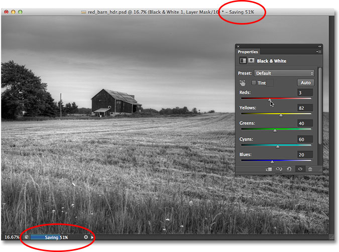
*With Background Save, we can keep working while Photoshop is saving the file. We can even work on a different image while the first one is being saved.*

## Auto Save

A second and even more impressive new feature in Photoshop CS6 is **Auto Save**. Even though Photoshop has evolved into a very mature and stable program, there's always the chance that something will go wrong and Photoshop will crash. When that happens, we often end up losing all the work we've done on our image, forcing us to start over again from scratch. At least, that's the way things *used* to be back in Photoshop CS5 and earlier.

Auto Save allows Photoshop to save a backup copy of our work at regular intervals so that if Photoshop does happen to crash, we can recover the file and continue from where we left off!

We can tell Photoshop how often we want it to save a backup copy of our work in the File Handling section of the Preferences. On a PC, go up to the **Edit** menu at the top of the screen, choose **Preferences**, and then choose **File Handling**. On a Mac, go up to the **Photoshop** menu, choose **Preferences**, then choose **File Handling**:

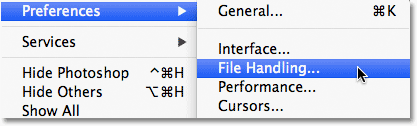
*Go to Edit > Preferences > File Handling (Win) or Photoshop > Preferences > File Handling (Mac).*

Here, you'll find the **Automatically Save Recovery Information Every** option, which by default is set to 10 minutes, meaning that Photoshop will save a backup copy of your work every 10 minutes. You can increase it to every 5 minutes, as I've done here, or if you're more of a gambler, you can set it to save a backup copy once every hour (there's also a 15 minutes and 30 minutes option):

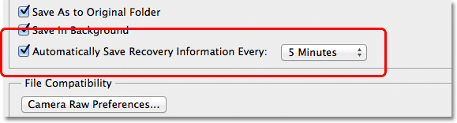
*We can have Photoshop save our recovery information every 5, 10, 15 or 30 minutes, or once every hour.*

It's important to note that Photoshop isn't saving over your original file (which would be very bad). The recovery information is kept in a separate backup file. If Photoshop does happen to crash while you're working, simply re-open Photoshop and it will automatically open the most recently saved backup copy, complete with all the work you had done up to the point where Photoshop saved the backup copy (assuming, of course, that you had been working long enough for Photoshop to have made at least one backup copy). You'll know it's the backup copy because Photoshop adds **Recovered** to the file name (which is displayed in the tab at the top of the document window):

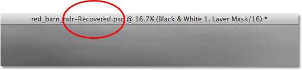
*Photoshop adds "Recovered" to the name of the backup copy to distinguish it from the original.*