# Photoshop Layers – The Background Layer

> Source: [https://www.photoshopessentials.com/basics/layers/background-layer/](https://www.photoshopessentials.com/basics/layers/background-layer/)
> Downloaded and converted to Markdown.

So far in our series on [Photoshop layers](/layers), we've learned the basics of [what layers are](/basics/understanding-photoshop-layers/) and why they're so important, and we've learned the essential skills for working with layers inside Photoshop's [Layers panel](/basics/layers/layers-panel/).

But before we get into more of the amazing things we can do with layers, there's one special type of layer we need to look at, and that's the **Background layer**. The reason we need to learn about it is because there's a few things we can do with normal layers that we can't do with the Background layer, and if we're not aware of them ahead of time, they can easily lead to confusion and frustration.

I'll be using **Photoshop CS6** for this tutorial. In Photoshop CC, Adobe made a couple of small but important changes to the way we work with the Background layer, so CC users will want to skip over to the [Background Layer in Photoshop CC](/basics/background-layer-photoshop-cc/) tutorial. For Photoshop CS5 and earlier, you can follow along here or you can check out the [original version](/basics/photoshop-background-layer/) of this tutorial.

Here's an image of a photo frame that I've just opened in Photoshop. I downloaded this image from [Adobe Stock](https://prf.hn/l/JzaOwkW):

*A photo of a frame for a photo.*

Whenever we open a new image in Photoshop, it opens inside its own document and Photoshop places the image on its own layer named **Background**, as we can see by looking in my [Layers panel](/basics/layers/layers-panel/):

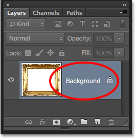
*The Layers panel showing the image on the Background layer.*

Photoshop names this layer Background for the simple reason that it serves as the background for our document. Any additional layers that we add to the document will appear *above* the Background layer. Since its whole purpose is to serve as a background, there's a few things that Photoshop won't allow us to do with it. Let's take a quick look at these few simple rules we need to remember. Then, at the end of the tutorial, we'll learn an easy way to get around every single one of them.

### Rule 1: We Can't Move The Contents Of A Background Layer

One of the things we can't do with a Background layer is move its contents. Normally, to move the contents of a layer, we grab the **Move Tool** from the top of the **Tools panel**:

*Selecting the Move Tool from the Tools panel.*

Then we simply click with the Move Tool inside the document and drag the contents around with our mouse. Watch what happens, though, when I try to drag the photo frame to a different location. Here, I'm trying to drag it towards the upper right of the document:

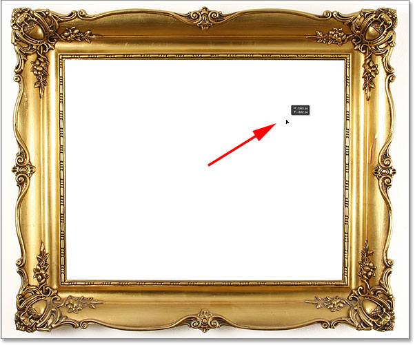
*Trying to move the Background layer using the Move Tool.*

Instead of moving the layer, Photoshop pops open a dialog box telling me that it *can't* move it because the layer is locked. I'll click OK to close out of the dialog box:

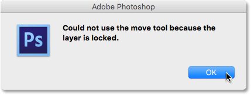
*Instead of moving the photo frame, Photoshop informs me that the layer is locked.*

If we look again in the Layers panel, we see a small **lock icon** on the far right of the Background layer, letting us know that sure enough, this layer is locked in place and we can't move it. So that's the first problem with Background layers; they're stuck in their original position:

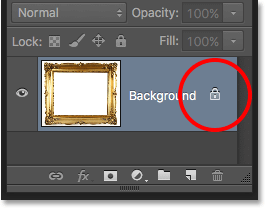
*The lock icon lets us know that some aspect of this layer is locked.*

### Rule 2: No Transparent Pixels

In a moment, I'm going to open another image and place it inside my photo frame, but the center of the frame is currently filled with white, which means I need to delete that white area before I can place my photo inside of it. Normally, when we delete pixels on a layer, the deleted area becomes transparent, allowing us to see through it to the layer(s) below. Let's see what happens, though, when I try to delete part of the Background layer.

First, I need to select the area inside the frame. Since it's filled with solid white, I'll select it using Photoshop's [Magic Wand Tool](/basics/layers/../selections/magic-wand-tool/). By default, the Magic Wand is nested behind the [Quick Selection Tool](/basics/layers/../selections/quick-selection-tool/) in the Tools panel. To get to it, **right-click** (Win) / **Control-click** (Mac) on the Quick Selection Tool, then choose the Magic Wand Tool from the fly-out menu:

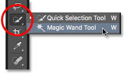
*Selecting the Magic Wand Tool.*

With the Magic Wand Tool in hand, I'll click anywhere inside the frame to instantly select that entire white area. It's a bit tough to see in the screenshot, but a selection outline now appears around the edges, letting me know the area inside the frame is selected:

*The white area inside the frame is now selected.*

To delete the area, I'll press **Backspace** (Win) / **Delete** (Mac) on my keyboard. But instead of deleting the area and replacing it with transparency as we'd expect on a normal layer, Photoshop mysteriously pops open the **Fill** dialog box, asking me to choose which color I want to fill the area with:

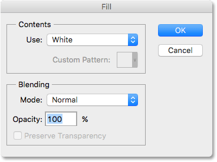
*Instead of deleting the area, Photoshop pops open the Fill dialog box.*

I'll click Cancel to close out of the Fill dialog box since that wasn't at all what I wanted to do. What I wanted to do was delete the white area inside the frame, not fill it with a different color. Maybe Photoshop just got confused, so I'll try something different. I'll go up to the **Edit** menu in the Menu Bar along the top of the screen and choose **Cut**:

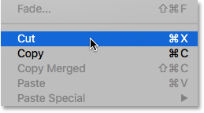
*Going to Edit > Cut.*

On a normal layer, this would cut the selected pixels from the layer, leaving transparency in their place. Yet once again, the Background layer gives us an unexpected result. In fact, this time, it looks like nothing has happened at all. The area is still filled with white:

*The white area inside the frame is now filled with... white?*

Why is it still filled with white? It's because even though it looks like nothing happened, something *did* actually happen. Rather than cutting out that area and leaving it transparent, Photoshop filled it with my current **Background color**.

We can see our current Foreground and Background colors in the **color swatches** near the bottom of the Tools panel. By default, Photoshop sets the Foreground color to black and the Background color to white. Since my Background color was set to white, that's the color Photoshop used to fill in the selection:

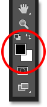
*The Foreground (upper left) and Background (lower right) color swatches.*

We can swap the Foreground and Background colors by pressing the letter **X** on the keyboard. I'll go ahead and press X, and now we see that with the colors swapped, my Background color has been set to **black**:

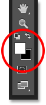
*The Background color is now black.*

I'll undo my last step (cutting the selection) by going up to the **Edit** menu and choosing **Undo Cut Pixels**:

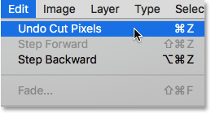
*Going to Edit > Undo Cut Pixels.*

Then, I'll go back up to the **Edit** menu and reselect **Cut**:

*Going once again to Edit > Cut.*

This time, with my Background color set to black, Photoshop fills the selection with black. At least it looks like something actually happened this time, but it's still not the result I wanted:

*Photoshop keeps filling the selection with color, but what we need is transparency.*

So, what's going on here? Why won't Photoshop simply delete the area inside the frame? Why does it keep wanting to fill it with a different color? The reason is because **Background layers don't support transparency**. After all, since the Background layer is supposed to be the *background* of the document, there shouldn't be any need to see through it because there shouldn't be anything behind it to see. The background is, after all, the background.

No matter how I try, I will never be able to delete the area inside the center of the frame as long as the image remains on the Background layer. How, then, will I be able to display another photo inside the frame? Let's leave this problem alone for the time being. We'll come back to it shortly.

### Rule 3: We Can't Move The Background Layer Above Another Layer

Here's the photo I want to place inside the frame. I downloaded this one from [Adobe Stock](https://prf.hn/l/vyW1GVR) as well:

*The image that will be placed inside the frame.*

The image is currently open inside its own document, so I'll quickly copy it into the photo frame's document by pressing **Ctrl+A** (Win) / **Command+A** (Mac) to select the entire photo. Then, I'll press **Ctrl+C** (Win) / **Command+C** (Mac) to copy the image to the clipboard. I'll switch over to the photo frame's document, then I'll press **Ctrl+V** (Win) / **Command+V** (Mac) to paste the image into the document. Photoshop places the image on a new layer named "Layer 1" above the photo frame on the Background layer:

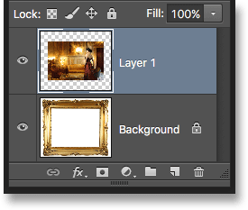
*The second photo is placed on its own layer above the Background layer.*

If we look in the document, we see the new photo appearing in front of the frame:

*The photo currently sits in front of the frame.*

In order for my second photo to appear inside the frame, I need to rearrange the order of the layers in the Layers panel so that the frame appears above the photo. Normally, moving one layer above another is as easy as clicking on the layer we need to move and dragging it above the other layer, but that's not the case when the layer we need to move is the Background layer.

When I click on the Background layer and try dragging it above the photo on Layer 1, Photoshop displays a circle icon with a diagonal line through it (the international "not gonna happen" symbol), letting me know that for some reason, it's not going to let me do it:

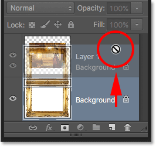
*The circle with the diagonal line through it tells me I can't drag the Background layer above Layer 1.*

The reason it won't let me drag the Background layer above Layer 1 is because **the Background layer must always remain the background of the document**. Photoshop won't allow us to move it above any other layers.

### Rule 4: We Can't Move Other Layers Below The Background Layer

Okay, so we can't move the Background layer above another layer. What if we try moving another layer *below* the Background layer? I'll click on Layer 1 and try to drag it below the Background layer, but this doesn't work either. I get the same little Ghostbusters symbol telling me that Photoshop won't let me do it:

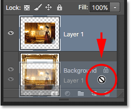
*The same "not gonna happen" icon appears when trying to drag Layer 1 below the Background layer.*

Again, the reason is because the Background layer must always remain the background of the document. We can't drag it above other layers and we can't drag other layers below it.

### Rule 5: We Can't Change The Blend Mode, Opacity Or Fill

Let's quickly recap. We learned that Photoshop won't let us move the contents of the Background layer with the Move Tool because the layer is locked in place. We learned that the Background layer does not support transparency, so there's no way to delete anything on the layer. And we learned that the Background layer must always remain the bottom layer in the document. We can't drag it above other layers, and we can't drag other layers below it.

There's a few more things we can't do with the Background layer that we'll look at quickly. I'll click on my Background layer to select it, and notice in the upper left of the Layers panel that the [Blend Mode](/photo-editing/layer-blend-modes/intro/) option (the box that's set to "Normal") is grayed out. Normally, we can change a layer's blend mode, which changes how the layer blends with the layer(s) below it. But since the Background layer must always remain the bottom layer in the document, there will never be any layers below it, which makes the Blend Mode option rather useless.

The same goes for the [Opacity and Fill](/basics/layers/opacity-vs-fill/) options directly across from the Blend Mode option. Both are grayed out when the Background layer is selected, and that's because they both adjust the layer's transparency level. Since the Background layer does not support transparency, there's no need to adjust it:

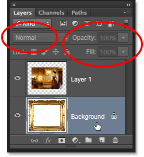
*The Blend Mode, Opacity and Fill options are unavailable with the Background layer.*

### The Easy Solution

Since the Background layer's whole purpose in life is to be the background of the document, each of these rules makes sense. Yet as with most rules, there's ways around them for times when we need to break them. In this case, there's an easy way around all of them at once! All we need to do is **rename the Background layer** to something other than Background. It's really that simple.

To rename the Background layer, you *could* go up to the **Layer** menu at the top of the screen, choose **New**, and then choose **Layer From Background**:

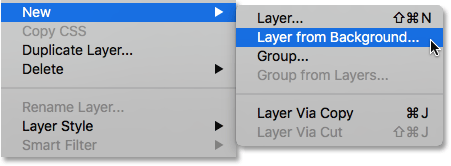
*Going to Layer > New > Layer From Background.*

A faster way, though, is to simply press and hold your **Alt** (Win) / **Option** (Mac) key on your keyboard and **double-click** anywhere on the Background layer:

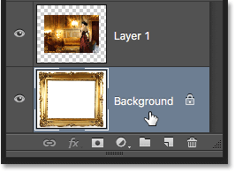
*Holding Alt (Win) / Option (Mac) and double-clicking on the Background layer.*

This instantly changes the name of the Background layer to "Layer 0":

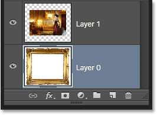
*The Background layer has been renamed Layer 0.*

And just by renaming it, we've converted the Background layer into a normal layer, which means we're no longer bound by any of the rules we just looked at! We can move the contents of the layer with the Move Tool, we can delete anything on the layer and replace it with transparency, and we can freely move the layer above or below other layers!

For example, I still need to move my photo frame above the image on Layer 1. Now that the frame is no longer on the Background layer, it's easy! I can just click on Layer 0 and drag it upward until a **highlight bar** appears above Layer 1. The bar tells us where the layer will be moved to when we release the mouse button:

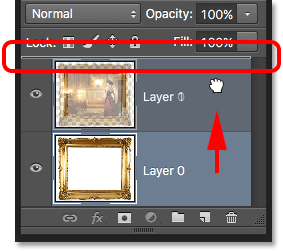
*Dragging Layer 0 above Layer 1.*

I'll release my mouse button, at which point Photoshop drops Layer 0 above Layer 1, exactly as I needed:

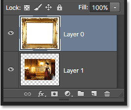
*Layer 0 now appears above Layer 1, which would not have been possible while Layer 0 was still the Background layer.*

We saw earlier that I was unable to delete the white area inside the frame while the image was on the Background layer, but now that I've renamed it Layer 0, it's no longer a problem. I'll click inside the frame with the Magic Wand Tool to instantly select the white area, just as I did before:

*The area inside the frame is once again selected.*

Then, I'll press **Backspace** (Win) / **Delete** (Mac) on my keyboard, and this time, instead of being greeted by the Fill dialog box, Photoshop actually does what I expected, deleting the area from the layer and revealing the photo below it:

*The area inside the frame has finally been deleted, revealing the photo underneath.*

I'll press **Ctrl+D** (Win) / **Command+D** (Mac) on my keyboard to deselect the area inside the frame and remove the selection outline. Then, just to quickly finish things off, I'll click on Layer 1 in the Layers panel to select it and make it the active layer:

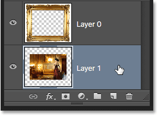
*Selecting Layer 1.*

I'll grab the Move Tool from the Tools panel, then I'll click on the photo and drag it into position inside the frame, nudging it a little to the left. Even though Layer 1 is now the bottom layer in the document, it's not an actual Background layer so it's not locked in place. I'm free to move it anywhere I want:

*Dragging the photo into position inside the frame.*

### Converting A Normal Layer Into A Background Layer

Finally, we've seen that we can convert a Background layer into a normal layer just by renaming it anything other than "Background". But what if we want to go the other way? What if we want to convert a normal layer into a Background layer? Is it possible? Yep, it sure is, but how you go about doing it isn't quite as obvious.

You might think that the same logic applies both ways; if we can convert a Background layer into a normal layer by renaming it something other than "Background", then we should be able to convert a normal layer into a Background layer by renaming it "Background". Makes sense, right? Unfortunately, that doesn't work. All you'll end up with is a normal layer that happens to be named "Background".

To convert a normal layer into a real Background layer, first select the layer you want to convert. I'll click on the bottom layer in my document (Layer 1) to make it active. Note, though, that you don't technically need to select the bottom-most layer in your document because *any* layer you convert into a Background layer will automatically be sent to the bottom as soon as you convert it:

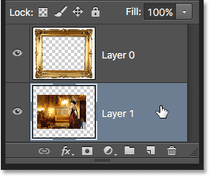
*Selecting the layer to convert into a Background layer.*

With your layer selected, go up to the **Layer** menu at the top of the screen, choose **New**, and then choose **Background from Layer**:

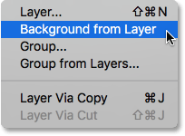
*Going to Layer > New > Background from Layer.*

And now we see in the Layers panel that my bottom layer, formerly "Layer 1", is now my document's official Background layer:

*Layer 1 has been converted into a Background layer.*