# Unlock The Full Power Of Basic Selections In Photoshop

> Source: [https://www.photoshopessentials.com/basics/selections/basic-selections/](https://www.photoshopessentials.com/basics/selections/basic-selections/)
> Downloaded and converted to Markdown.

*A basic shape in Photoshop.*

In this Photoshop tutorial, we're going to look at how to get the most out of Photoshop's basic selection tools, such as the Marquee tools or the Lasso tool. If all you've been using them for is to make a new selection every time, you've been missing out on their full potential.

We're going to see how you can add to an existing selection, how to subtract an area from an existing selection, and even how to intersect two selections and grab the area that overlaps. Once you become familiar with the full power of basic selections, they'll seem a whole lot more useful to you.

Let's start by taking a look at how to **add** to an existing selection.

This tutorial is from our [How to make selections in Photoshop](/basics/make-selections-photoshop/) series.

### Adding To A Selection

To keep things simple, I have a fairly basic shape open in my Document window:

*A basic shape in Photoshop.*

I want to select this shape using the most common selection tool in all of Photoshop, the **Rectangular Marquee Tool**, so I'm going to grab it from my Tools palette:

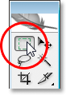
*Selecting the Rectangular Marquee Tool from Photoshop's Tools palette.*

I could also press **M** on my keyboard to quickly access it.

Now, let's say all I know how to do is make a new selection with this tool. Hmm, this is going to be a bit tricky. I'll start by dragging a selection around the bottom half of the shape. That should be easy enough:

*Dragging a selection around the bottom half of the shape.*

There we go, looks good. The bottom half is selected. There's still that square part in the top right though, so I'll just draw out another selection, this time around that top square. Since I'm selecting a square, I'm going to start from the top left corner of the shape and then hold down my **Shift** key as I drag to constrain my selection to a perfect square:

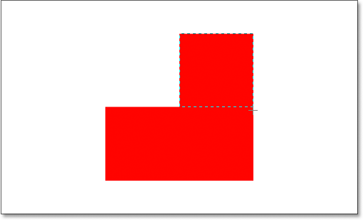
*Selecting the square section in the top right of the shape.*

There we go, the top of the shape is now selected. Except... wait a minute. What happened to my original selection around the bottom part of the shape? It's gone!

Yep, it's gone. I lost my original selection the moment I began dragging out my second selection, and that's the default behavior of selections in Photoshop. Once you start dragging out another selection, your existing one disappears, which means there's no way I can select this shape. It's beyond the power of Photoshop to select something this complex. Oh well, thanks for joining us.

Okay, seriously, there most certainly is a way to select this shape, although we could never do it by dragging out a new selection each time, as we've already seen. What we need to be able to do is add a selection to our initial selection, and if this is something new to you, you're about to wonder how you ever managed to work in Photoshop without knowing how to do this.

### The Four Main Selection Options In The Options Bar

Before we go any further, with my Rectangular Marquee Tool selected, let's take a look up in the **Options Bar**, specifically at four little icons on the left side of the Options Bar:

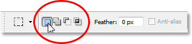
*The four main selection option icons in the Options Bar.*

They may look small, but each of those four little icons is very powerful, because each one represents a different option for working with our selections. The first one on the left, the one I'm clicking on in the screenshot above, is the **New Selection** icon, and it's the one that's selected by default when working in Photoshop. All it does is create a new selection each time. If you never knew these four options were there, this is the option you've always been using without even knowing it.

The second icon directly beside it is the one we're going to look at here, the **Add To Selection** icon:

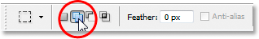
*The "Add To Selection" option in the Options Bar.*

With this option selected, any selection I draw will be *added* to any selection(s) I've already made. Let's see how this can help us select our shape.

First, I'm going to click back on the "New Selection" icon since I'm going to drag out my initial selection around the bottom half of the shape, the same as I did before:

*Dragging a selection around the bottom half of the shape once again.*

Now that I have my initial selection, I'm going to select that "Add To Selection" option so that I can add another selection to this one. Rather than selecting the option from the Options Bar though, I'm going to use the quick keyboard shortcut, which is to simply hold down the **Shift** key just before I start dragging out my selection. As soon as you press the Shift key, you'll see a small "plus sign" icon in the bottom right corner of your cursor, which indicates that you're about to add to the existing selection:

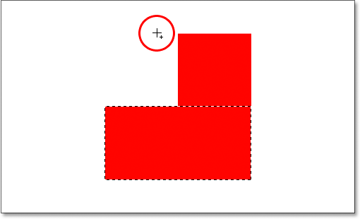
*Hold down the "Shift" key to quickly access the "Add To Selection" option. A small plus sign appears in the bottom right corner of the cursor icon.*

Let's try selecting that top square part again. With my Shift key held down, I'm going to drag out another selection around that square section in the top right of the shape. This time, rather than trying to select just the square, I'm going to select some of the area below the square as well so that this second selection overlaps my intial one:

*Dragging out the second selection, making both selections overlap.*

One quick note... You don't need to continue holding down the Shift key the whole time you're dragging out additional selections. All you need to do is hold down Shift, then click your mouse to start dragging out the selection, and once you've started dragging, you can safely release the Shift key.

Now that I've dragged out my second selection that I'm adding to my intial selection, I'm going to release my mouse button, and look what happens:

*The second selection has now been added to the first.*

Thanks to the "Add To Selection" option, which I accessed simply by holding down my Shift key, my second selection has been added to my initial selection, and my once impossible to select shape has now been completely selected.

Let's look at a common real world example to see how beneficial the "Add To Selection" option really is.

### Using "Add To Selection" To Select Eyes

One of the most common questions I get is, "How do I select both eyes at once? I select one with the Lasso tool, but then when I go to select the other one, I lose the selection around the first eye". Let's look at this common problem, and how the "Add To Selection" option can solve it for us. I'll use this photo here:

*The original photo.*

I'm going to quickly grab my **Lasso tool** from the Tools palette:

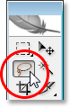
*Selecting the Lasso tool from the Tools palette.*

I could also press **L** on my keyboard to select it.

With the Lasso tool selected, I'm going to draw a selection around the left eye first:

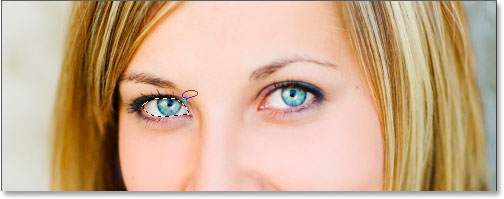
*Selecting the left eye with the Lasso tool.*

Now with the left eye selected (our left, her right), normally what would happen is that if I tried to select the eye on the right, I'd lose my selection around her left eye. But with the "Add To Selection" option, that's not the case. I'm going to hold down my **Shift** key once again to quickly access that "Add To Selection" option, which gives me that small plus sign in the bottom right corner of my mouse cursor, and then with my Shift key down, I'm going to select her right eye. Again, I don't need to hold the Shift key down the entire time. Once I've started my selection, I can release it. I'll go ahead now and select her other eye:

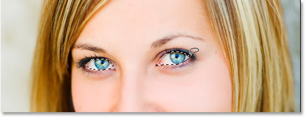
*Selecting the other eye using the "Add To Selection" option. It's that easy.*

And there we go, both eyes are now selected thanks to the "Add To Selection" option.

In the first example where we used "Add To Selection" to select all of the shape, I overlapped the selections to create one main selection. In this example with the eyes, my selections appear to be completely separate from each other, yet Photoshop still treats them as the same selection. I could select her hair, her eyebrows, her lips, and her teeth all separately as well, and as long as I'm using the "Add To Selection" option each time, Photoshop will treat them all as one selection.

So that's our look at the "Add To Selection" option. Now let's look at the "Subtract From Selection" option.

### The "Subtract From Selection" Option

Before we see how the "Subtract From Selection" option works, let's first see where to access it. For that, we go back up to the Options Bar for another look at those four little icons. The "Subtract From Selection" icon is the third one from the left:

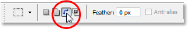
*The "Subtract From Selection" icon in the Options Bar.*

Now that we know where it is, let's see how to use it.

Sometimes when you're trying to select a complex shape, it's easier to select the entire shape first and then subtract from your selection. Let's use our shape again from the beginning of this tutorial:

The first time I selected this shape, I selected the bottom half first and then used the "Add To Selection" option to grab the remaining square section in the top right. This time, to show you how the "Subtract From Selection" option works, I'm going to start by selecting the entire shape. I'm going to use the Rectangular Marquee Tool once again, and I'll just drag a quick selection around the whole thing:

*Selecting the entire shape with the Rectangular Marquee Tool.*

Looks good, except for one obvious problem. By dragging a selection around the entire shape, I've also selected that empty square section in the top left. Thanks to the "Subtract From Selection" option though, I can easily fix that.

Just as we saw with the "Add To Selection" option, the "Subtract From Selection" option has a handy keyboard shortcut so we don't have to keep selecting it from the Options Bar every time we need it. All you need to do is hold down the **Alt** (Win) / **Option** (Mac) key, which places a little "minus sign" in the bottom right corner of your mouse cursor:

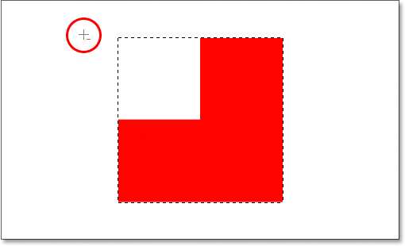
*Hold down the Alt key on Windows or the Option key on Mac to quickly access the "Subtract From Selection" option.*

Using my Rectangular Marquee Tool and the "Subtract From Selection" option, I'm going to select that empty square section in the top left of the shape to remove it from my existing selection. Holding down my Alt/Option key, I'm going to start my selection from just outside the top left corner of my existing selection, and then I'm going to drag my mouse down and to the right until I've selected the entire empty area that I want to remove:

*Selecting the area I want to remove from my existing selection.*

As with the "Add To Selection" option, you don't need to hold down the Alt/Option key the entire time you're dragging the selection. All you need to do is hold it down just before you start dragging, and then as soon as you've clicked your mouse button down, you can let go of the Alt/Option key.

Now that I've selected the part of the original selection that I want to remove, all I need to do is release my mouse button, and presto:

*The empty square section in the top left has been removed from the original selection.*

That empty section in the top left has now been removed from the original selection, leaving only my shape selected, thanks to the "Subtract From Selection" option.

Let's round out our look at the full power of basic selections in Photoshop with the final option, "Intersect With Selection".

### The "Intersect With Selection" Option

We've seen how to add to an existing selection. We've seen how to subtract an area from a selection. Now let's look at the final option, "Intersect With Selection". First, let's go back up to the Options Bar to see where we can find the "Intersect With Selection" option, and then we'll see how to use it. Again looking at our four little yet powerful icons, the "Intersect With Selection" icon is the one on the right:

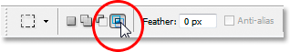
*The "Intersect With Selection" icon in the Options Bar.*

Just as with the "Add To Selection" and "Subtract From Selection" options, this one also has a handy keyboard shortcut so you don't have to keep going up to the Options Bar to access it. The keyboard shortcut is **Shift+Alt** (Win) / **Shift+Option** (Mac). So just as a quick keyboard shortcut summary:

- **Shift** = Add To Selection
- **Alt** (Win) / **Option** (Mac) = Subtract From Selection
- **Shift+Alt** (Win) / **Shift+Option** (Mac) = Intersect With Selection

Now that we know where it is in the Options Bar and how to quickly access it with the keyboard shortcut, what does the "Intersect With Selection" option do? For the answer to that, let's take a look at this new shape here:

Here we have two red crescent shapes, one on the left and one on the right, with an empty white area in between them. Let's say we needed to select that empty white area. We *could* try to use the Lasso tool, but unless you're talented at drawing perfect circles, good luck. We could use the Magic Wand tool here, since the area we want to select is solid white, but what if it wasn't? What if it was a full color photo and we needed to create a selection in that shape? The Magic Wand tool would probably be useless to us in that case. So what to do?

Well, Photoshop has a basic selection tool that's built for selecting round objects, the **Elliptical Marquee Tool**, so let's try that.

First, I'll select it from the Tools palette:

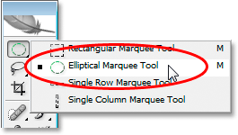
*Selecting the Elliptical Marquee Tool from the Tools palette.*

Then, with my Elliptical Marquee Tool selected, I'm going to draw a circular selection around that first shape on the left. As I drag, I'm going to hold down my **Shift** key to constrain my selection to a perfect circle:

*Selecting the crescent shape on the left with the Elliptical Marquee Tool. Hold "Shift" to constrain the selection to a perfect circle.*

Now I have that left shape selected, but I also have the white area in the middle selected, and my goal is to select *only* that white area in the middle. Let's see, I could try the "Add To Selection" option while dragging out another selection around the shape on the right:

*Dragging a selection around the shape on the right using the "Add To Selection" option.*

Nope, that didn't work. All it did was put a selection around both shapes. Maybe I could try dragging a selection around the shape on the right using the "Subtract From Selection" option:

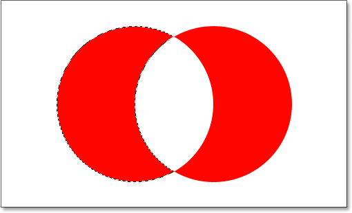
*Dragging a selection around the shape on the right using the "Subtract From Selection" option.*

Nope, that didn't work either. The "Subtract From Selection" option was able to give me a perfect selection around the shape on the left, but that's still not what I wanted. Time to try the final option, **Intersect With Selection**.

The way "Intersect With Selection" works is that it looks at the initial selection you made and the selection you're currently dragging out, and keeps only the area where both selections overlap, or "intersect". So if, for example, I was to drag a circular selection around the shape on the left, and then drag another circular selection around the shape on the right using the "Intersect With Selection" option, what I'd end up with is a selection around only that white empty space between them where the two selections would overlap. Which, come to think of it, is exactly what I want!

Let's try it out. With my shape on the left already selected, and using the Elliptical Marquee Tool, I'm going to use the keyboard shortcut **Shift+Alt** (Win) / **Shift+Option** (Mac) and drag out a second selection around the shape on the right, causing the area in between the shapes to overlap. If you look in the bottom right corner of the mouse cursor (circled in red below), you can see a small "x", indicating that I'm using the "Intersect With Selection" option:

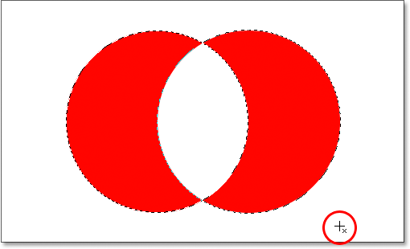
*Dragging a selection around the shape on the right using the "Intersect With Selection" option.*

As with the previous two options we looked at, once you've begun dragging out your selection, there's no need to continue holding down the Shift and Alt/Option keys.

Using "Intersect With Selection", I now have the shape on the right also selected, and we can see that both selections overlap around the white space between them, which is the area I want to select. All I have to do now is release my mouse button, and Photoshop will select only that white area in the middle where my selections intersected:

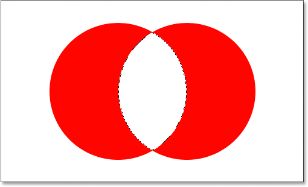
*The white area in between the two shapes is easily selected with the "Intersect With Selection" option.*