# Photoshop Blend Modes Tips and Tricks

> Source: [https://www.photoshopessentials.com/basics/blend-mode-tips-tricks/](https://www.photoshopessentials.com/basics/blend-mode-tips-tricks/)
> Downloaded and converted to Markdown.

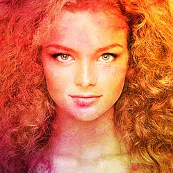

In this tutorial, you'll learn time-saving tips and tricks for working with layer blend modes in Photoshop! I'll show you how to easily scroll through the blend modes to see how each one affects your image, how to instantly jump to the exact blend mode you need, and even how to adjust the intensity of a blend mode, all directly from your keyboard! We'll cover every blend mode shortcut you need to know to speed up your workflow, and I'll even include a tip to make memorizing those shortcuts a whole lot easier.

I'll be using [Photoshop CC](https://prf.hn/l/dlXjD2w) but any recent version will work. Let's get started!

### What we'll be learning

To help us learn the tips and tricks, I'll use Photoshop to blend a texture with an image. Here's the image I'll be using. I downloaded [this one](https://prf.hn/l/NJ5g48A) from Adobe Stock:

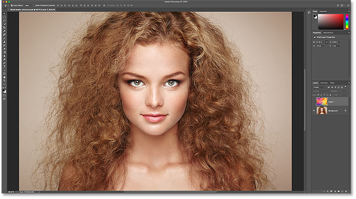
*The first image. Photo credit: Adobe Stock.*

And if we look in my **Layers panel**, we see that I also have a texture on a [layer](/photoshop-layers-learning-guide/) above it. I cover [how to move images into the same document](/basics/5-ways-move-images-photoshop-documents/) in a separate tutorial, so I'll turn the top layer on by clicking its **visibility icon**:

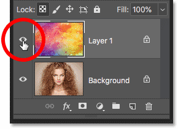
*Turning on the top layer.*

And here's my [texture](https://prf.hn/l/wzq8aNE), also from Adobe Stock:

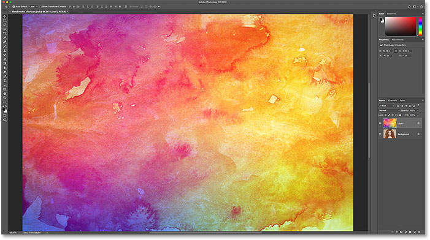
*The second image. Photo credit: Adobe Stock.*

## Where to find the layer blend modes

Photoshop's blend modes are all found in the upper left of the [Layers panel](/basics/layers/layers-panel/), and the default blend mode is **Normal**:

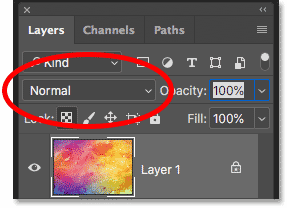
*The Blend Mode option, set to Normal by default.*

If you click on the Blend Mode option, you'll find lots of other blend modes to choose from. As of Photoshop CC, there's 27 blend modes in total:

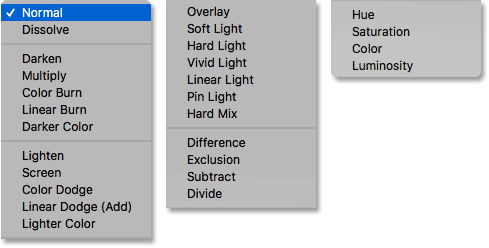
*Photoshop's 27 layer blend modes.*

### Layer blend modes vs tool blend modes in Photoshop

Before we go any further, it's important to know the difference between a *layer* blend mode and a *tool* blend mode, and I'll tell you why in a moment. Layer blend modes are all found in the Layers panel, and they control how a layer blends with the layers below it. But some of Photoshop's tools also include their *own* blend modes. Most of the brush tools and the painting tools have their own separate blend modes that affect the tool itself and are completely separate from the layer blend modes in the Layers panel.

If I choose the **Brush Tool** from the Toolbar:

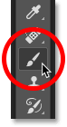
*Selecting the Brush Tool.*

We see in the Options Bar that it has its own Blend Mode option with its own modes to choose from. They may *look* the same as the blend modes in the Layers panel, but they're not. These blend modes affect the appearance of your *brush strokes*. They have no effect on any layers:

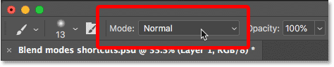
*The Brush Tool blend modes affect the Brush Tool, not your image.*

And it's not just the Brush Tool that has its own blend modes. Other brush-related tools, like the Spot Healing Brush, the Clone Stamp Tool, and the Eraser Tool, all have their own blend modes. And so does the Gradient Tool and even the Paint Bucket Tool. In fact, most of the brush and painting tools have them:

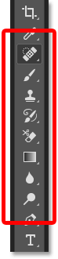
*The brush and painting tools are grouped together in the Toolbar.*

The reason you need to know this is that if you have one of these tools selected, you may accidentally select the *tool's* blend mode when you really meant to select a *layer* blend mode. So to use the shortcuts we're about to learn to switch between layer blend modes, first make sure you have a tool selected that doesn't have its own blend modes. The Move Tool works great, and so do any of Photoshop's selection tools. I'll grab the Move Tool from the Toolbar, which you can also select by pressing the letter **V**:

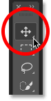
*The Move Tool is one of the tools without its own blend modes.*

## How to scroll through layer blend modes

Let's look at how to quickly scroll through the layer blend modes to see the effect that each one has on our image.

### To usual (slow) way to try blend modes in Photoshop

The way most people try out blend modes is that they click on the **Blend Mode** option in the Layers panel:

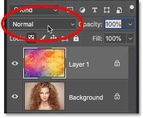
*Opening the Blend Mode menu.*

Then they choose a random blend mode from the list:

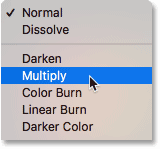
*Choosing a random blend mode.*

And then see what they get:

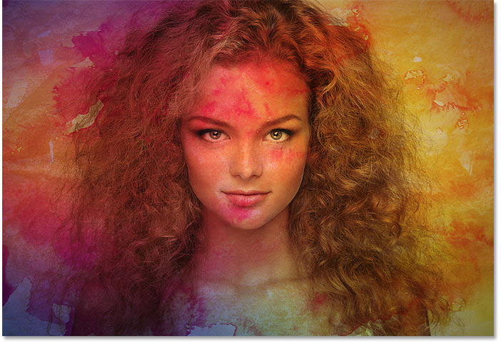
*The first blend mode result.*

If they like it, great. If not, they click on the Blend Mode option again and choose a different blend mode:

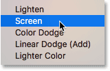
*Choosing a second blend mode.*

And see if they like this result better:

*The second blend mode result.*

Then they do the same thing again, choosing another random blend mode from the list:

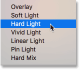
*Choosing a third blend mode.*

And comparing the results:

*The third blend mode result.*

### How to scroll through layer blend modes from your keyboard

While that's one way to work, there's a faster way, and that's by scrolling through the blend modes from your keyboard. I'll set my blend mode back to **Normal**:

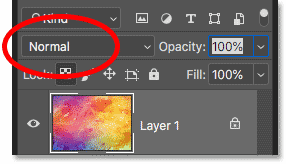
*Setting the blend mode back to Normal.*

Then, to scroll forward through the blend modes, press and hold the **Shift** key on your keyboard and tap the **plus sign** (**+**) repeatedly. Once you've moved through all 27 blend modes, you'll return to the Normal blend mode. To scroll backwards through the list, keep your **Shift** key held down and tap the **minus key** (**-**) instead.

## How to select blend modes from your keyboard

Scrolling through the blend modes is great when you're not sure which blend mode you need and just want to experiment. But if you *do* know which one you need, you can jump straight to it from your keyboard. Photoshop includes keyboard shortcuts for nearly all of its blend modes.

To select a blend mode from your keyboard, press and hold your **Shift** key, along with your **Alt** (Win) / **Option** (Mac) key, and then press the letter that's associated with the blend mode.

For example, the first blend mode I chose earlier was **Multiply**. To select the Multiply blend mode from your keyboard, hold **Shift+Alt** (Win) / **Shift+Option** (Mac) and press the letter **M**. The second one I chose was **Screen**, which you can jump to by holding **Shift+Alt** (Win) / **Shift+Option** (Mac) and pressing **S**. To jump to the **Overlay** blend mode, hold **Shift+Alt** (Win) / **Shift+Option** (Mac) and tap **O**.

### Photoshop's layer blend mode shortcuts - Complete list

Here's the complete list of keyboard shortcuts for Photoshop's layer blend modes. They all share the same two keys at the beginning, either **Shift+Alt** on a Windows PC or **Shift+Option** on a Mac. The only difference between them is the specific letter at the end. Some letters are obvious, like "N" for Normal, "M" for Multiply, and "S" for Screen, while others, like "G" for Lighten or "J" for Linear Light, you'll just remember over time:

| Blend Mode | Keyboard Shortcut (Alt = Win, Option = Mac) |
|------------|---------------------------------------------|
| **Normal** | Shift + Alt / Option + **N** |
| **Dissolve** | Shift + Alt / Option + **I** |
| **Darken** | Shift + Alt / Option + **K** |
| **Multiply** | Shift + Alt / Option + **M** |
| **Color Burn** | Shift + Alt / Option + **B** |
| **Linear Burn** | Shift + Alt / Option + **A** |
| **Lighten** | Shift + Alt / Option + **G** |
| **Screen** | Shift + Alt / Option + **S** |
| **Color Dodge** | Shift + Alt / Option + **D** |
| **Linear Dodge** | Shift + Alt / Option + **W** |
| **Overlay** | Shift + Alt / Option + **O** |
| **Soft Light** | Shift + Alt / Option + **F** |
| **Hard Light** | Shift + Alt / Option + **H** |
| **Vivid Light** | Shift + Alt / Option + **V** |
| **Linear Light** | Shift + Alt / Option + **J** |
| **Pin Light** | Shift + Alt / Option + **Z** |
| **Hard Mix** | Shift + Alt / Option + **L** |
| **Difference** | Shift + Alt / Option + **E** |
| **Exclusion** | Shift + Alt / Option + **X** |
| **Hue** | Shift + Alt / Option + **U** |
| **Saturation** | Shift + Alt / Option + **T** |
| **Color** | Shift + Alt / Option + **C** |
| **Luminosity** | Shift + Alt / Option + **Y** |

### The blend modes that are missing shortcuts

Out of Photoshop's 27 blend modes, only 4 of them are missing shortcuts, and those are **Darker Color**, **Lighter Color**, **Subtract**, and **Divide**. You'll rarely, if ever, use these ones, but if you do need them, you'll have to select them from the Layers panel:

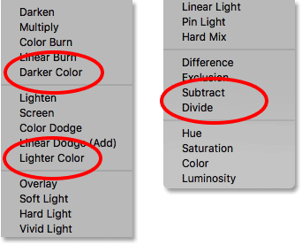
*The four blend modes without keyboard shortcuts.*

### How to avoid memorizing every blend mode shortcut

Here's a tip to make memorizing the shortcuts easier. Even though there's 23 shortcuts in total, you really only need to memorize a few of them; one from each of the blend mode groups.

#### The Darken blend modes

For example, let's say you want to use one of Photoshop's darkening blend modes, which include Darken, Multiply, Color Burn, Linear Burn, and Darker Color. To avoid memorizing the shortcut for each one, just memorize the main one, which is **Shift+Alt+M** (Win) / **Shift+Option+M** (Mac) for [Multiply](/photo-editing/layer-blend-modes/multiply/). Then, use the other shortcut we learned earlier, which is to hold **Shift** and tap the **plus or minus key**, to move up or down through the others in the group:

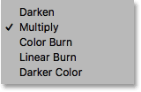
*Multiply is the main darkening blend mode.*

#### The Lighten blend modes

The same is true for the other groups as well. To try out the different lighten modes (Lighten, Screen, Color Dodge, Linear Dodge (Add), and Lighter Color), just press **Shift+Alt+S** (Win) / **Shift+Option+S** (Mac) to jump to the [Screen](/photo-editing/layer-blend-modes/screen/) blend mode. Then hold **Shift** and use the **plus or minus key** to scroll through the others:

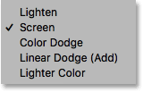
*Screen is the main lightening blend mode.*

#### The Contrast blend modes

For the contrast group (Overlay, Soft Light, Hard Light, Vivid Light, Linear Light, Pin Light, and Hard Mix), press **Shift+Alt+O** (Win) / **Shift+Option+O** (Mac) to jump to [Overlay](/photo-editing/layer-blend-modes/overlay/), and then scroll through the list:

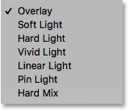
*Overlay is the main blend mode for boosting contrast.*

### The Color blend modes

And for the color blend modes (Hue, Saturation, Color, and Luminosity), press **Shift+Alt+C** (Win) / **Shift+Option+C** (Mac) to jump to the main one, [Color](/photo-editing/layer-blend-modes/color/), and then scroll to the one you need:

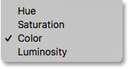
*Color is the main blend mode for colorizing images.*

To learn more about Photoshop's five main blend modes (Multiply, Screen, Overlay, Color, and Luminosity), see my [Top 5 Blend Modes You Need To Know](/photo-editing/layer-blend-modes/intro/) tutorial.

## How to adjust the intensity of a blend mode

Finally, if you like the overall look of a blend mode but the effect is too strong, you can adjust the intensity directly from your keyboard. For example, I'll jump to the **Linear Light** blend mode by pressing **Shift+Alt+J** (Win) / **Shift+Option+J** (Mac):

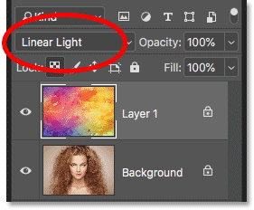
*Press Shift + Alt / Option + J to jump to Linear Light.*

I like the colors, but the overall effect is a bit too much:

*The Linear Light blend mode effect at full strength.*

### Lowering the layer opacity from your keyboard

To reduce the intensity of a blend mode, all we need to do is lower the *opacity* of the layer itself. You can do that from the **Opacity** option in the Layers panel, but you can also adjust it directly from your keyboard.

Just press a number from **1** to **9** to jump the opacity value between **10%** and **90%**. For example, I can lower the opacity to 50% by pressing 5 on my keyboard. Or, for a more specific value, like 55%, press the two numbers quickly:

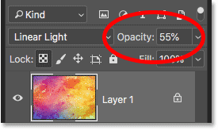
*Adjusting the layer opacity from the keyboard.*

And here's the result with the opacity lowered:

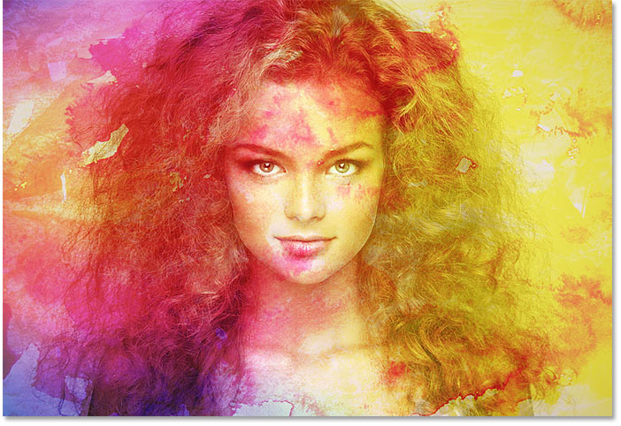
*The same Linear Light blend mode but with a lower opacity.*

I'll switch to a different blend mode, like **Screen**, by pressing **Shift+Alt+S** (Win) / **Shift+Option+S** (Mac). And then, to restore the opacity back to **100%**, press **0** on your keyboard:

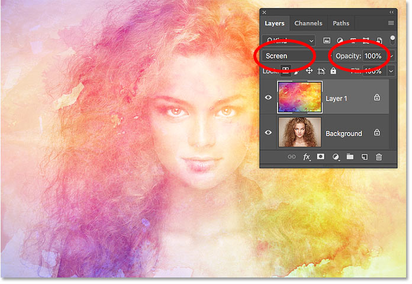
*Press 0 to reset the strength of the blending effect back to 100%.*

And there we have it! That's some time-saving tips you can use with layer blend modes in Photoshop! For more about blend modes, learn how to blend images like a [movie poster](/photo-effects/blend-photos-lmovie-poster-photoshop/), how to [blend text into backgrounds](/photo-effects/how-to-blend-text-into-clouds-with-photoshop/), or even how to [merge blend modes](/photo-editing/how-to-merge-layer-blend-modes-in-photoshop/) in Photoshop! Or visit our [Photoshop Basics](/basics/) section for more tutorials!