# Blending Photos With Layer Masks And Gradients In Photoshop

> Source: [https://www.photoshopessentials.com/basics/blending-photos-with-layer-masks-and-gradients-in-photoshop/](https://www.photoshopessentials.com/basics/blending-photos-with-layer-masks-and-gradients-in-photoshop/)
> Downloaded and converted to Markdown.

In this tutorial, we'll learn how to combine **gradients** with **layer masks** in Photoshop to easily blend two or more photos together into a seamless composite image!

Along the way, we'll look at the important difference between the two gradients you'll use the most with layer masks—the **Foreground to Background** and **Foreground to Transparent** gradients—and the reason for choosing one over the other.

As always, I'll be covering everything step-by-step, but to really get the most from this tutorial, you'll want to have at least a general understanding of how layer masks work, and you'll want to be familiar with drawing gradients using Photoshop's **Gradient Tool**. You'll find everything you need to know about drawing gradients in our [How To Draw Gradients With The Gradient Tool](/basics/how-to-draw-gradients-with-the-gradient-tool-in-photoshop/) tutorial, and you can learn all about layer masks with our [Understanding Layer Masks in Photoshop](/basics/layers/layer-masks/) tutorial.

I'll be using **Photoshop CC** but everything we'll be covering is fully compatible with **Photoshop CS6**.

Let's start by looking at the three photos I'll be using. You can use any photos you like since our goal here is not to create something specific but rather to learn the steps and techniques that you can then use to create your own interesting compositions. Here's my first image ([girl with dandelion photo](http://www.shutterstock.com/pic.mhtml?id=211372408&src=id) from Shutterstock):

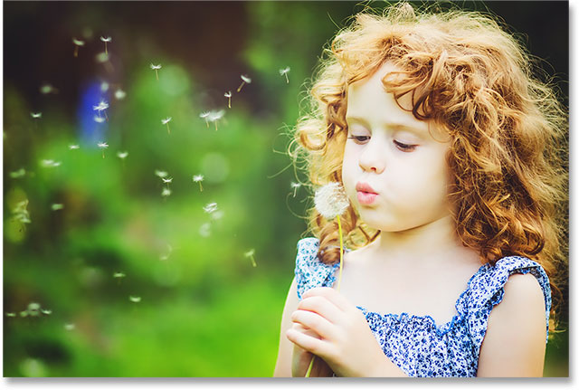
*The first photo.*

Here's my second image that I'll be blending in with the first one ([dandelion seeds photo](http://www.shutterstock.com/pic.mhtml?id=137674295&src=id) from Shutterstock):

*The second photo.*

And here's the third image I'll be using to tie it all together ([spring background photo](http://www.shutterstock.com/pic.mhtml?id=133756544&src=id) from Shutterstock):

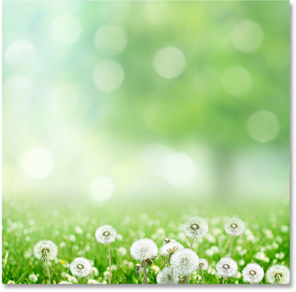
*The third photo.*

Here's what my final composite will look like after blending all three images using nothing more than simple gradients and layer masks:

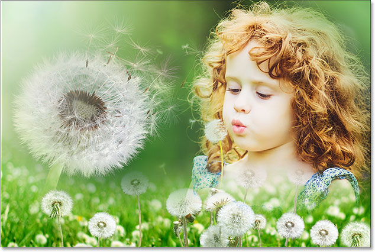
*All three images blended together.*

Let's get started!

To save us a bit of time, I'm going to start with all three of my images already imported into my Photoshop document. If we look in my [Layers panel](/basics/layers/layers-panel/), we see that each photo is sitting on its own separate [layer](/basics/layers/layers-intro/) which is very important, as we'll need each image to be on its own layer if we want to blend them together. To learn how Photoshop can quickly open multiple images and load them onto separate layers, see our [Open Multiple Images As Layers](/basics/layers/images-as-layers/) tutorial:

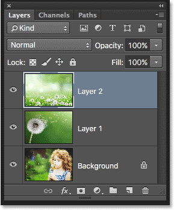
*The Layers panel showing each image on its own layer.*

As we can see in the layer **preview thumbnails**, the photo of the girl is on the bottom layer (the Background layer), the image of the dandelion is on the layer directly above it (Layer 1), and the photo of the field of dandelions is on the top layer (Layer 2). Let's focus on blending just the bottom two images for now. We'll save the top one for later.

Since we don't need to see the top image yet, I'll turn it off by clicking its **visibility icon**:

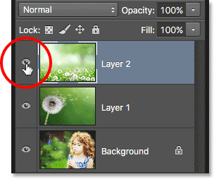
*Clicking the top layer's visibility icon.*

With the top layer turned off, the image on Layer 1 directly below it becomes visible in the document:

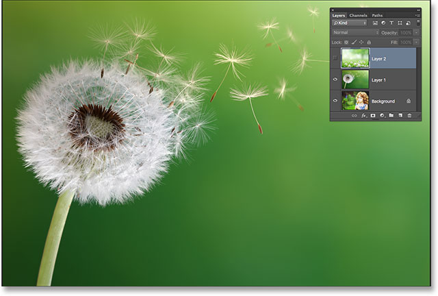
*The image on Layer 1.*

If I click the visibility icon for Layer 1 to turn *it* off temporarily:

*Clicking the visibility icon for Layer 1.*

We see the photo of the girl on the Background layer:

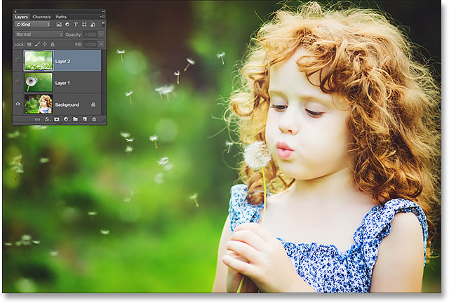
*The image on the Background layer.*

Now that we've seen which photos are on which layers, I'll turn Layer 1 back on by clicking once again on its visibility icon:

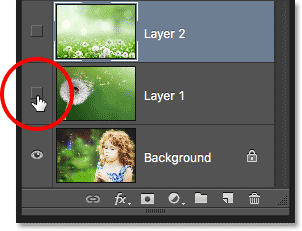
*Turning Layer 1 back on in the document.*

And now we're back to seeing the dandelion:

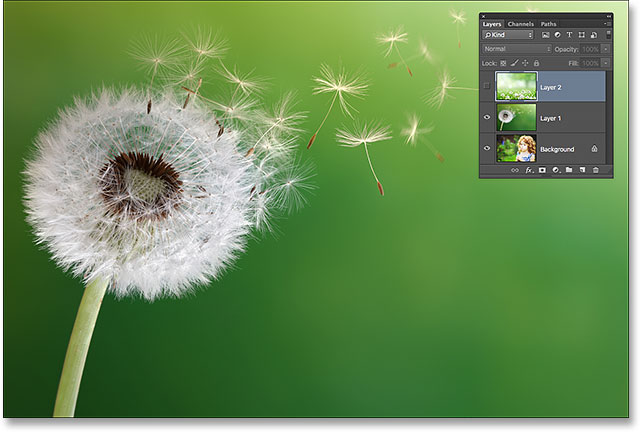
*The photo on Layer 1 is once again visible in the document.*

## How To Blend Photos In Photoshop

### Adding A Layer Mask

I want to blend the photo on Layer 1 with the image on the Background layer. Specifically, I want to keep the *left side* of the dandelion photo (the part that actually contains the dandelion) and the *right side* of the photo below it (where the girl is standing) and have both sides blending together as if they were part of the same image.

To do that, I'll use a **layer mask**. I'll need to place the mask on whichever of the two layers is *higher* in the layer stack, which in this case is Layer 1, so I'll click on **Layer 1** in the Layers panel to select it and make it active:

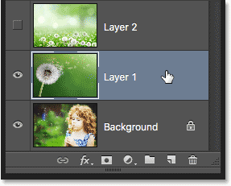
*Selecting Layer 1.*

With Layer 1 selected, I'll add a layer mask by clicking the **Add Layer Mask** icon at the bottom of the Layers panel:

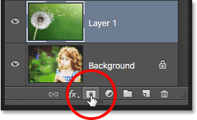
*Clicking the Add Layer Mask icon.*

Nothing will seem to have happened to the image, but a **layer mask thumbnail** appears on Layer 1, letting us know that the mask was added:

*The new layer mask thumbnail.*

Notice that the thumbnail is filled with **white**. The way a [layer mask works in Photoshop](/basics/layers/layer-masks/) is that areas filled with white on the mask represent the parts of the layer that are **100% visible** in the document. Areas filled with **black** on the mask represent the parts of the layer that are **100% transparent** in the document. **Partial transparency** on the layer is represented by various shades of **gray** on the mask; the darker the shade, the more transparent the area, so more of the layer below it shows through.

Since my layer mask is currently filled with white, it means the image on Layer 1 is fully visible, completely blocking the image below it:

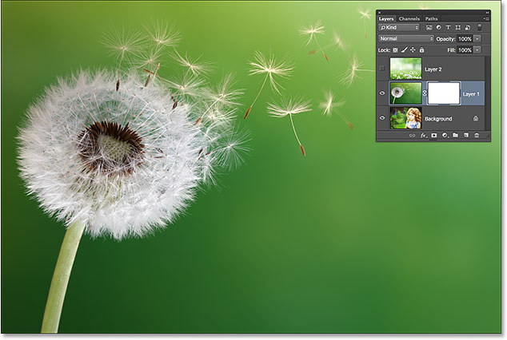
*A white-filled layer mask means the entire image on the layer is visible.*

### Selecting The Gradient Tool

Let's see how we can blend the photo on Layer 1 with the photo on the Background layer by simply drawing a gradient on the layer mask. First, we'll need the **Gradient Tool**. I'll select it from the **Tools panel**:

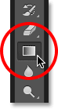
*Selecting the Gradient Tool.*

### Choosing The Foreground to Background Gradient

With the Gradient Tool in hand, the next thing I want to do is make sure I have the **Foreground to Background** gradient selected, which will use my current Foreground and Background colors as the colors of the gradient. To do that, I'll open Photoshop's [Gradient Picker](/basics/how-to-draw-gradients-with-the-gradient-tool-in-photoshop/) by clicking on the small **arrow** directly to the right of the **gradient preview bar** in the Options Bar along the top of the screen:

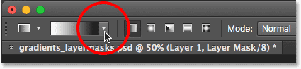
*Clicking the arrow beside the gradient preview bar.*

When the Gradient Picker appears, I'll choose the Foreground to Background gradient by **double-clicking** on its thumbnail (first one on the left, top row). Double-clicking (as opposed to *single*-clicking) the thumbnail will both select the gradient and close the Gradient Picker:

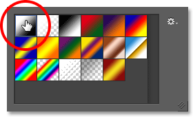
*Double-clicking the Foreground to Background gradient's thumbnail.*

### Choosing The Linear Gradient Style

To the right of the gradient preview bar is a series of five icons representing the five **gradient styles** we can choose from. Starting from the left, we have the **Linear** style, **Radial**, **Angle**, **Reflected**, and **Diamond**. To blend the two sides of my images together, I want to make sure I have the default **Linear** style selected, which will draw a simple gradient that transitions in a straight line from left to right (or top to bottom, or whichever direction I draw it):

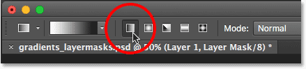
*Selecting the Linear gradient style.*

### Selecting The Layer Mask

The last thing I need to do before actually drawing my gradient is make sure I have the **layer mask**, not the layer itself, selected in the Layers panel. We can easily tell which one is selected by looking for the **white highlight border**. If you see the highlight border around the layer mask thumbnail, it means the mask is selected. If you see it around the layer's preview thumbnail, it means the layer itself is selected. If you need to, click on the mask thumbnail to select it and make it active:

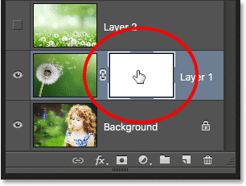
*The border around the thumbnail means the layer mask is selected.*

### The Foreground And Background Colors

Notice, if we look at the Foreground and Background **color swatches** near the bottom of the Tools panel, that my **Foreground color** is currently set to **white** and my **Background color** is set to **black**. These are Photoshop's default colors whenever we have a layer mask selected. You can reset them to the defaults if needed by pressing the letter **D** on your keyboard. Since I chose the Foreground to Background gradient from the Gradient Picker, it means I'll be drawing a white to black gradient on the mask:

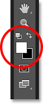
*The current Foreground (upper left) and Background (lower right) colors.*

### Drawing The Gradient

To draw the gradient, I'll click inside the document at the spot where I want the transition from white to black to begin. In this case, I'll click just inside the white part of the dandelion. Then, with my mouse button still held down, I'll drag towards the right to the spot where the transition should end. I'll also press and hold my **Shift** key as I'm dragging, which will limit the angle in which I can drag, making it easier to drag straight across horizontally:

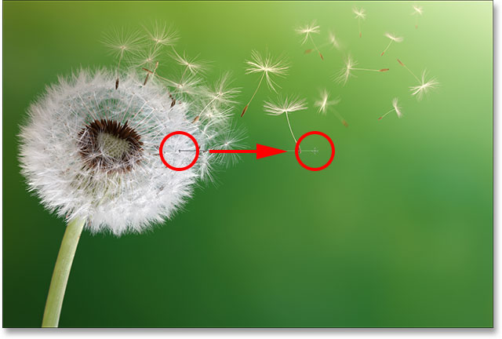
*Clicking to set the gradient's starting point, then dragging to the end point.*

When I release my mouse button, Photoshop draws the white to black gradient. Since the gradient was drawn on the layer mask, not on the layer itself, we don't actually see the gradient across the image. Instead, we now see the left side of my photo on Layer 1 blending with the right side of my photo on the Background layer:

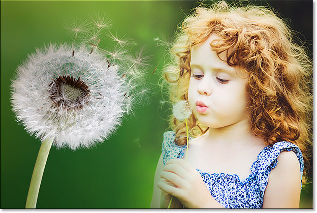
*The two sides of the photos have been blended together.*

If you didn't get the transition quite right, not to worry. Simply draw another gradient to try again. Each time you draw a Foreground to Background gradient on the layer mask, Photoshop will draw the new one overtop of the old one, making it easy to try as many times as needed until you get things looking exactly right.

### Viewing The Layer Mask

To view the actual layer mask in the document and see what your gradient looks like, press and hold your **Alt** (Win) / **Option** (Mac) key on your keyboard and click on the **layer mask thumbnail** in the Layers panel:

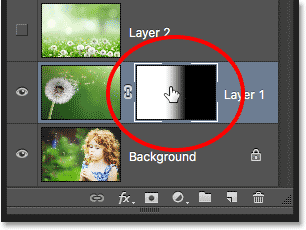
*Clicking the mask thumbnail while holding Alt (Win) / Option (Mac).*

This switches your view from the image to the layer mask itself, and here we see the area of solid white on the left, which is the area where my dandelion photo is fully visible in the document. The area of solid black on the right is where the dandelion photo is completely hidden from view, allowing the photo of the girl below it to show through. The transition from white to black in the middle of the mask is where the two photos are blending from one to the other:

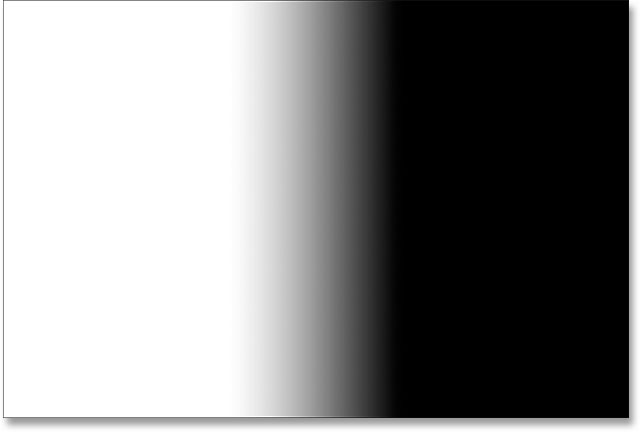
*Viewing the layer mask in the document.*

To hide the layer mask and return to your image, once again press and hold your **Alt** (Win) / **Option** (Mac) key and click on the **layer mask thumbnail**:

*Clicking again on the mask thumbnail while pressing Alt (Win) / Option (Mac).*

And now we're back to seeing the composite image:

*Back to the normal view.*

### Swapping The Foreground And Background Colors

Earlier, we saw that the default Foreground and Background colors when working on a layer mask are **white** for the **Foreground** and **black** for the **Background**, which is why I was able to draw a white to black gradient. But what if, instead of a white to black gradient, what you really need is the opposite—a black to white gradient? All you need to do is press the letter **X** on your keyboard. This will swap the Foreground and Background colors, making the **Foreground** color **black** and the **Background** color **white**. Pressing X again will swap them back:

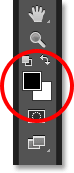
*Press X on your keyboard to swap the Foreground and Background colors.*

With the colors swapped, I'll draw another gradient from left to right in roughly the same spot as before:

*Drawing a black to white gradient on the layer mask.*

This time when I release my mouse button, I get the exact opposite result; the left side of the photo on the Background layer now blends in with the right side of the dandelion photo on Layer 1. In other words, I've successfully managed to blend the wrong sides of the images:

*The result of drawing a black to white gradient in the same direction as before.*

If we view the layer mask (by pressing and holding **Alt** (Win) / **Option** (Mac) and clicking on the **mask thumbnail** in the Layers panel), we see the area of solid black on the left which is making that part of the dandelion photo on Layer 1 fully transparent, allowing the Background layer to show through. The white area on the right is where Layer 1 is 100% visible, and the black to white transition in the middle is where Layer 1 and the Background layer are blending together:

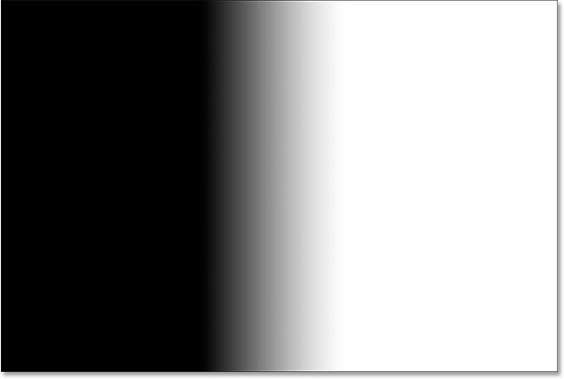
*Viewing the gradient on the mask.*

A black to white gradient can often be useful with layer masks, but in this case, it gave me the wrong result. Fortunately, it's an easy fix. I can just press **X** on my keyboard to swap my Foreground and Background colors and then re-draw the gradient in the same direction. Or, I can simply draw another black to white gradient overtop of it but in the *opposite* direction, which is what I'll do.

I'll return to viewing my image by once again pressing and holding **Alt** (Win) / **Option** (Mac) and clicking on the **mask thumbnail** in the Layers panel. Then, with my Foreground color still set to black and my Background color still set to white, I'll draw another gradient, this time from right to left:

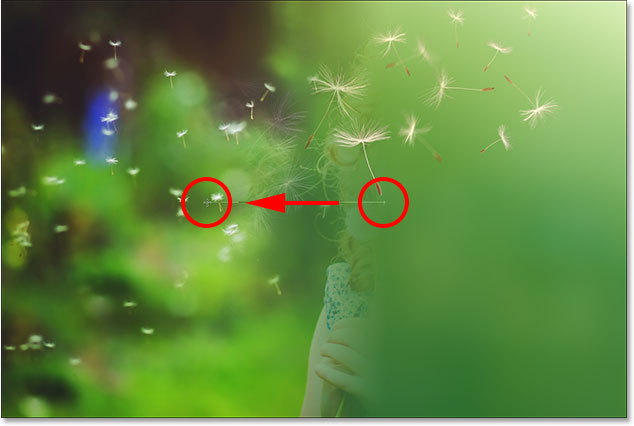
*Drawing a black to white gradient in the opposite direction.*

And now, we're back to seeing the dandelion on the left and the girl on the right:

*A much better result.*

### Adding The Third Photo To The Composition

Let's bring in the third photo, which in my case is on the top layer (Layer 2). I'll click on its **visibility icon** to turn it on:

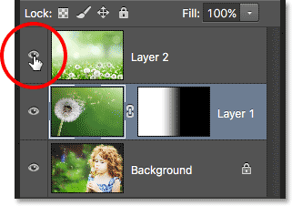
*Clicking the top layer's visibility icon.*

With the top layer now visible, my third image is blocking the other two photos below it from view:

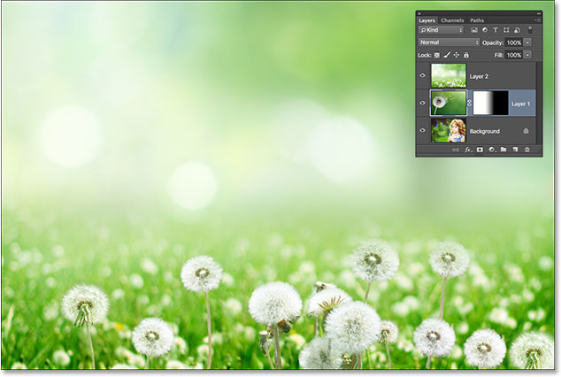
*The third photo.*

To blend this photo in with the others, I'll again use a layer mask. First, I'll click on Layer 2 to select it:

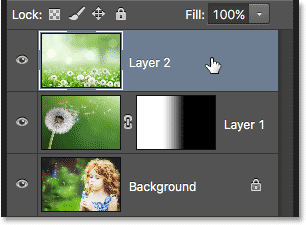
*Selecting the top layer.*

With Layer 2 selected, I'll click the **Add Layer Mask** icon at the bottom of the Layers panel:

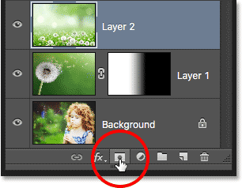
*Clicking the Add Layer Mask icon.*

A layer mask thumbnail, filled with white, appears:

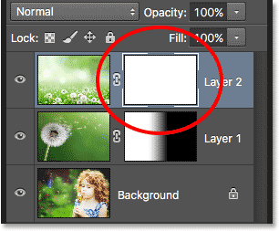
*The new layer mask thumbnail.*

Before I draw a gradient on this new layer mask, I'm first going to swap my Foreground and Background colors back to their defaults by once again pressing the letter **X** on my keyboard. I could also press the letter **D** on my keyboard to set them back to the defaults. Either way brings me back to having my **Foreground** color set to **white** and my **Background** color set to **black**, which will let me draw a white to black gradient on the mask:

*Back to the default colors.*

I'll start by blending just the bottom part of this photo in with the other images. To do that, with the layer mask selected, I'll click near the bottom of the image to set the starting point for my white to black gradient. Then I'll keep my mouse button held down and drag a short distance upward. I'll also press and hold my **Shift** key as I'm dragging which will again limit the angle in which I can drag, making it easier to drag straight up vertically:

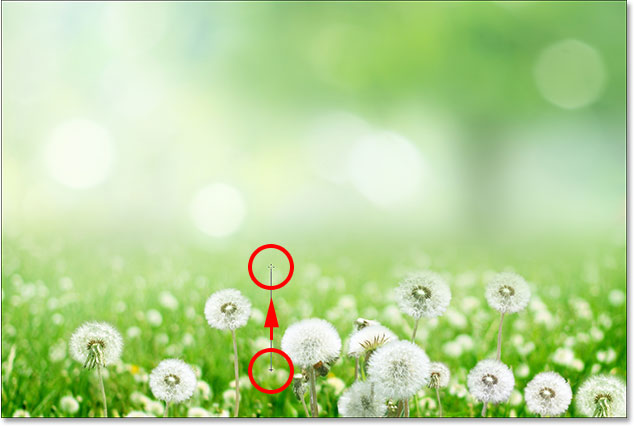
*Dragging a short white to black gradient upward from the bottom of the photo.*

When I release my mouse button, Photoshop draws the gradient on the layer mask, blending the bottom part of the photo into the composition. So far, so good:

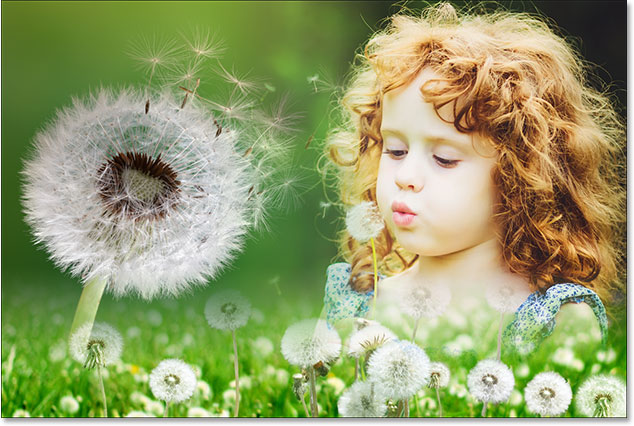
*All three photos are now blending together.*

I'll view the mask by pressing and holding **Alt** (Win) / **Option** (Mac) and clicking on the **mask thumbnail** for Layer 2:

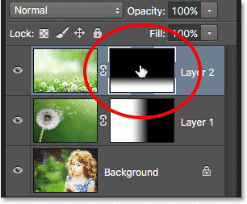
*Switching to the mask view.*

And here, we see what the gradient looks like. The white area at the very bottom is where the photo on Layer 2 is fully visible. The large area of black above it is where the photo is completely hidden, and the short transition area between them is where the photo fades away to reveal the other images below it:

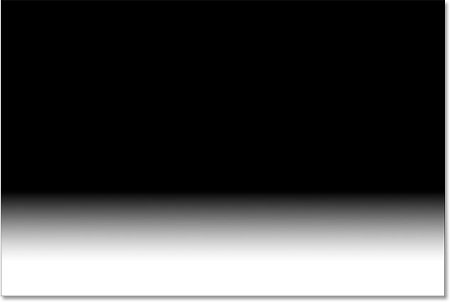
*The white to black gradient on Layer 2's mask.*

### Building Up The Layer Mask With More Gradients

So far, we've seen how to draw a single gradient on a layer mask using Photoshop's Foreground to Background gradient, but what if I want to add even more of the photo on Layer 2 into the composition? For example, let's say I also want to add in the area in the upper left corner.

I'll switch back to viewing the image. Then, with my Foreground to Background gradient still selected, white as my Foreground color and black as my Background color, I'll click in the upper left corner of the document to set the starting point for my gradient and drag downward diagonally into the middle of the photo:

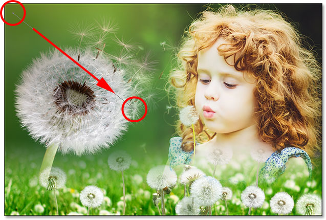
*Drawing a white to black gradient diagonally from the upper left corner.*

When I release my mouse button, notice what's happened; I've successfully blended the top left corner of the photo on Layer 2 into the composition, but where's the part on the bottom that I added in previously? It's no longer there:

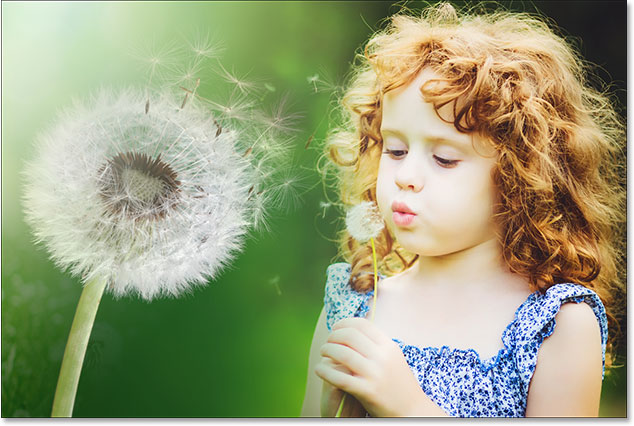
*The top left corner of the third image has been added, but the bottom part has disappeared.*

Let's look at the layer mask itself to see what's happened. Here, we see the white to black gradient that was drawn in the upper left, but notice that my original gradient at the bottom is gone. The reason is because each time we draw a new Foreground to Background gradient, Photoshop draws the new one overtop of the old one. I can't draw a new gradient without replacing the one that was already there:

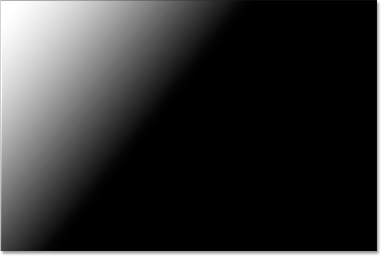
*The new gradient replaced the previous gradient, adding the top left corner of the photo but removing the bottom.*

### The Foreground to Transparent Gradient

What we need is a way to add multiple gradients to the same layer mask. We can't do that using the Foreground to Background gradient, but we *can* do it using Photoshop's **Foreground to Transparent** gradient. To switch gradients, I'll re-open the **Gradient Picker** by once again clicking the **arrow** to the right of the **gradient preview bar** in the Options Bar:

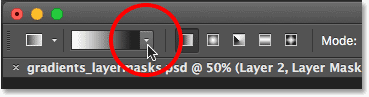
*Re-opening the Gradient Picker.*

Then, I'll choose the **Foreground to Transparent** gradient by double-clicking on its thumbnail (second from the left, top row):

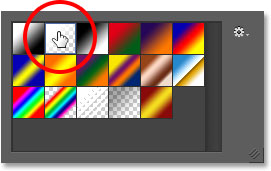
*Selecting the Foreground to Transparent gradient.*

The [Foreground to Transparent gradient](/basics/how-to-draw-gradients-with-the-gradient-tool-in-photoshop/) is similar to the Foreground to Background gradient in that it uses your current **Foreground color** as its main color. The big difference, though, is that there is *no second color*. Your main color simply fades into *transparency*. This allows us to add multiple Foreground to Transparent gradients to the same layer mask!

I'll undo the gradient I just added by going up to the **Edit** menu in the Menu Bar along the top of the screen and choosing **Undo Gradient**. I could also press **Ctrl+Z** (Win) / **Command+Z** (Mac) on my keyboard to undo it with the faster shortcut:

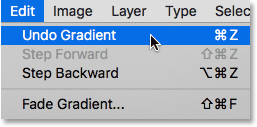
*Going to Edit > Undo Gradient.*

This removes the upper left corner of Layer 2 from the composition and brings back the bottom section:

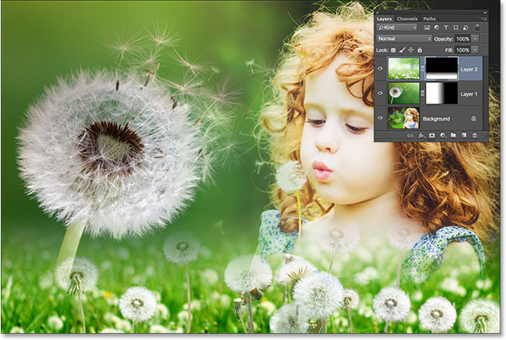
*The bottom part of the photo on Layer 2 has returned.*

I'll leave my Foreground color set to **white** so that I'm drawing a white to transparent gradient. Then, I'll once again draw a gradient from the upper left diagonally downward into the middle:

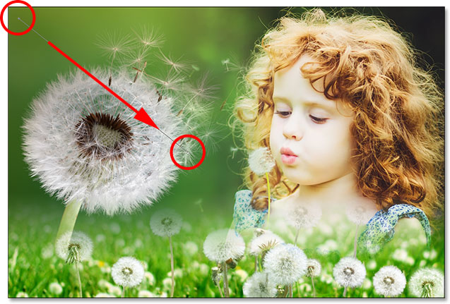
*Drawing a Foreground to Transparent gradient from the upper left of document.*

This time when I release my mouse button, we see that I was successfully able to add the top left corner of the photo without losing the bottom part:

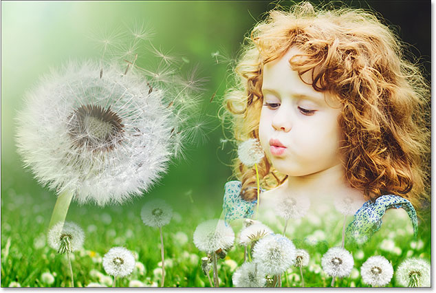
*Both the bottom and top left corner of Layer 2 have been successfully added to the composition.*

If we look again at the layer mask, we see that thanks to the Foreground to Transparent gradient, I was able to add the gradient in the upper left corner without overwriting the one at the bottom:

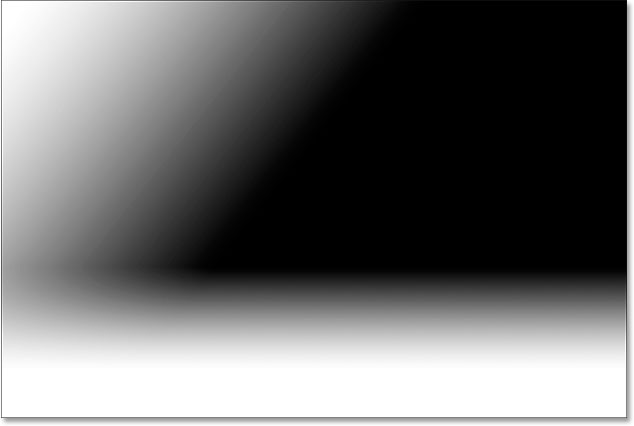
*The layer mask showing both gradients added.*

I'll do the same thing with the upper right corner of Layer 2, adding it to the composition by drawing a white to transparent gradient from the top right diagonally downward across the girl's hair:

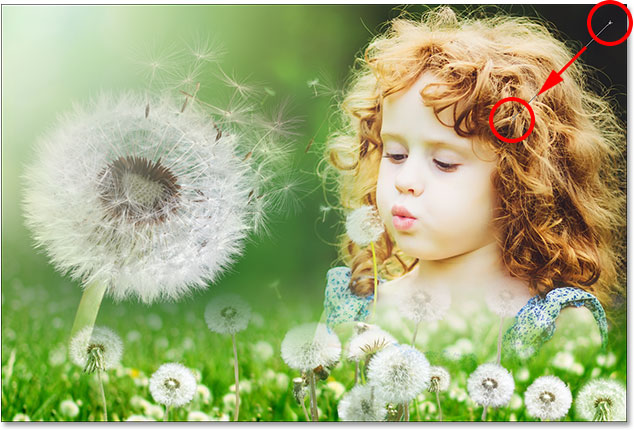
*Drawing another Foreground to Transparent gradient, this time in the upper right corner of the mask.*

I'll release my mouse button, and now the upper right corner is blending in:

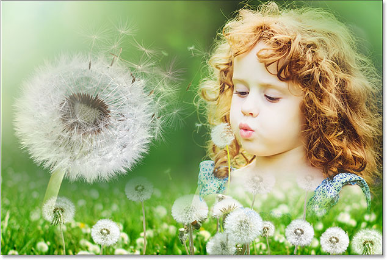
*The top right corner of Layer 2 has been added.*

Looking at the layer mask, we see that I now have three gradients on the same mask. This wouldn't be possible with the Foreground to Background gradient, but the Foreground to Transparent gradient makes it easy:

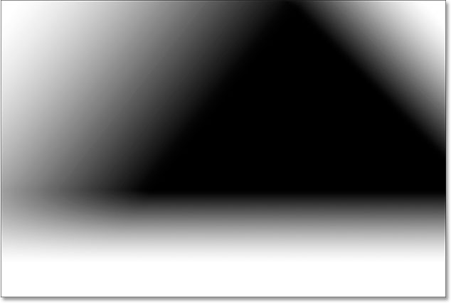
*The top right corner has been added to the layer mask.*

Finally, I'll bring in a bit more of the area in the lower left of Layer 2 by drawing a fourth Foreground to Transparent gradient, this time in that lower left corner:

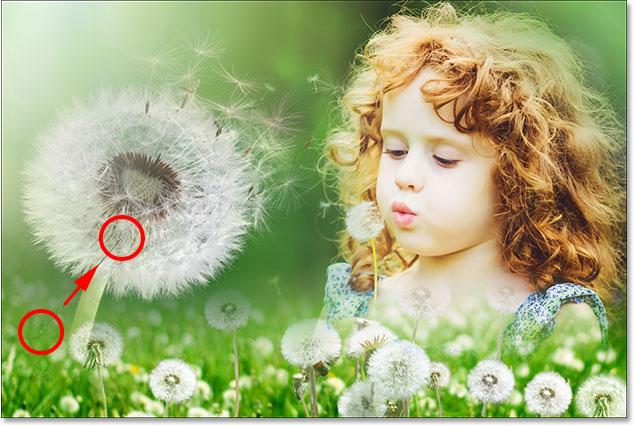
*Drawing yet another Foreground to Transparent gradient on the mask.*

Let's take one last look at the layer mask where we see all four gradients added:

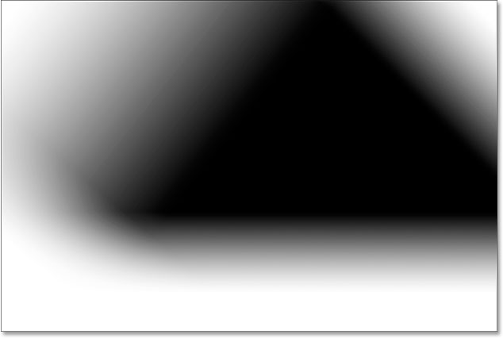
*The finished layer mask.*

And here, switching back to the image view, is my final composition:

*The final result.*