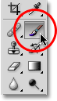
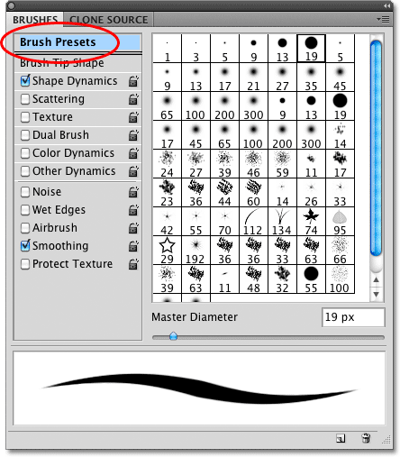
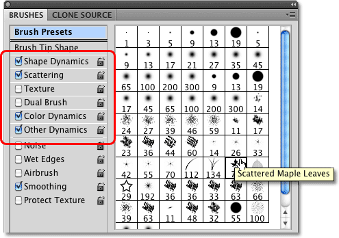
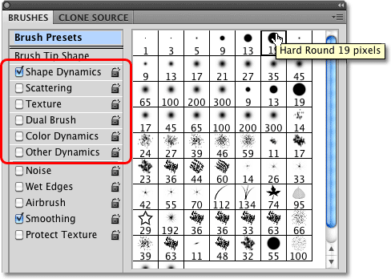

# Photoshop Brushes – The Brush Dynamics Options

> Source: [https://www.photoshopessentials.com/basics/photoshop-brushes/brush-dynamics/brush-dynamics-intro/](https://www.photoshopessentials.com/basics/photoshop-brushes/brush-dynamics/brush-dynamics-intro/)
> Downloaded and converted to Markdown.

In a previous tutorial, we learned how to **[make our own custom Photoshop brushes](/basics/photoshop-brushes/make-brushes/)**, and it can be lots of fun to design the initial shape of a brush, officially known as the **brush tip**. Where things really get interesting, though, is when we start controlling the **behavior** of a brush as we paint with it, dynamically changing things like the brush's size, angle, roundness, color and opacity!

We can add a texture to the brush, scatter multiple copies of it along each brush stroke, combine two brushes together, and more! Adobe calls these options **Brush Dynamics**, and they're just as amazing now as they were when Adobe first introduced them back in Photoshop 7. They also happen to be our topic for this series of tutorials!

There's six main categories of brush dynamics - **Shape Dynamics**, **Scattering**, **Texture**, **Dual Brush**, **Color Dynamics**, and **Other Dynamics** - all of which (as we'll see) are found in Photoshop's **Brushes panel**. Each one controls a different aspect of the brush as we paint with it, but the controls and options are similar for all six, so once you learn how things work for one, understanding the others will be much easier.

After you've read through the tutorials, I highly encourage you to spend time experimenting on your own with the various brush options to see what sorts of crazy (and useful, don't forget useful!) brush behaviors you can come up with. But be warned. Before there was YouTube and Facebook, there was Photoshop's Brush Dynamics, and many a creative type has lost untold hours of their lives playing around inside the Brushes panel.

I'll be using Photoshop CS4 here, but these tutorials apply to any version as far back as Photoshop 7. Let's get started!

### Step 1: Select The Brush Tool

To access any of the brush dynamics, we'll need to open Photoshop's Brushes panel. First, make sure you have the **Brush Tool** selected from the Tools panel, or press the letter **B** to quickly grab it with the keyboard shortcut:

*Select the Brush Tool if it's not selected already.*

### Step 2: Open The Brushes Panel

With the Brush Tool selected, the easiest way to open the Brushes panel is to either press the **F5** key on your keyboard (press it again to close the Brushes panel) or click on the Brushes panel **toggle icon** in the Options Bar at the top of the screen (click it again to close the panel):

*The toggle icon in the Options Bar opens and closes the Brushes panel.*

By default, the Brushes panel opens to the **Brush Presets** options (you'll see the words Brush Presets highlighted in blue in the top left corner of the panel). In this mode, all we can do is choose from a list of ready-made brushes on the right side of the panel. To choose any of the brushes, simply click on its thumbnail in the list. If you have Tool Tips enabled in Photoshop's Preferences, the name of each brush will appear as you hover your mouse cursor over the thumbnails. A helpful preview area along the bottom of the panel shows us what a brush stroke would look like with the currently selected brush. We can use the **Master Diameter** slider below the list of brushes to change the size of the brush. If all you want to do is choose a brush and paint with it, this is the place to be:

*The Brushes panel set to the Brush Presets.*

Each of the brush presets in the list on the right side of the panel comes with both a brush tip (the actual shape of the brush that we see in the brush's thumbnail) and a pre-selected collection of brush dynamics that control the behavior of the brush as we paint with it. The six categories of brush dynamics (Shape Dynamics, Scattering, Texture, etc.) are found along the left side of the Brushes panel, and if you keep an eye on them as you click on different brush thumbnails, you'll see that different categories turn on and off depending on which brush you select. For example, if I click on the Scattered Maple Leaves brush, we can see that Shape Dynamics, Scattering, Color Dynamics, and Other Dynamics are all enabled with the brush tip:

*Each brush preset includes both a brush tip and pre-set dynamic brush options.*

However, if I choose a more basic brush, like one of Photoshop's standard round brushes from the top of the list, only the Shape Dynamics category is selected. In fact, depending on whether or not you have a pen tablet installed on your computer, you may not see any brush dynamics categories selected at all:

*Some preset brushes include more dynamic brush controls than others.*

Let's take a look at how we can change the options in each category and how they affect the behavior of our brush, starting with the first one in the list - **[Shape Dynamics](/basics/photoshop-brushes/brush-dynamics/shape-dynamics/)**. Or, jump to any of the other Brush Dynamics categories using the links below:

- [**Scattering**](scattering)
- [**Texture**](/basics/photoshop-brushes/brush-dynamics/texture/)
- [**Dual Brush**](/basics/photoshop-brushes/brush-dynamics/dual-brush/)
- [**Color Dynamics**](/basics/photoshop-brushes/brush-dynamics/color-dynamics/)
- [**Other Dynamics**](/basics/photoshop-brushes/brush-dynamics/other-dynamics/)