# Photoshop Type – The Character Panel

> Source: [https://www.photoshopessentials.com/basics/type/character-panel/](https://www.photoshopessentials.com/basics/type/character-panel/)
> Downloaded and converted to Markdown.

In the first two tutorials in our series on **working with type in Photoshop**, we learned how to add [point type](/basics/type/essentials/) to a document, best for small amounts of text on a single line, and how to add [area type](/basics/type/area-type/), which is a better choice for larger blocks of text on multiple lines. In both of those tutorials, we saw that whenever we have the Type Tool selected, the Options Bar along the top of the screen gives us quick access to a handful of commonly-used text options, like font selection, text color, and so on.

Photoshop includes more advanced text options as well, but we won't find them in the Options Bar. Instead, they're found in the **Character** and **Paragraph** panels. In this tutorial, we'll cover the Character panel options, then in the next tutorial, we'll look at the additional options in the [Paragraph](/basics/type/paragraph-panel/) panel!

### Accessing The Character Panel

One way to access the Character panel in Photoshop is by going up to the **Window** menu in the Menu Bar along the top of the screen, which opens a list of all the panels that are available to us, and choosing **Character** from the list. A checkmark to the left of the panel's name means its already open somewhere on your screen:

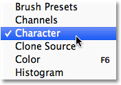
*Go to Window > Character.*

Another way, with the Type Tool selected, is to click on the small Character and Paragraph panels **toggle icon** in the Options Bar:

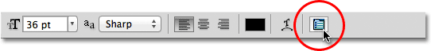
*Clicking on the Character and Paragraph panels toggle icon.*

Either way opens the Character panel, as well as the Paragraph panel because they're grouped together into a single **panel group**. We can switch between the two panels by clicking on their **name tabs** at the top of the group. The Character panel is the one that's selected and open by default:

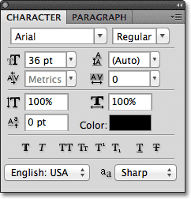
*The Character panel.*

### Font Selection And Text Color

The Character panel is sort of like an extended version of the Options Bar when it comes to working with type because most of the same options we'd find in the Options Bar are also found in the Character panel (I said "most" because one of the options from the Options Bar is found not in the Character panel but in the Paragraph panel, as we'll see in the next tutorial). For example, the Options Bar lets us choose our **font**, **font style** and **font size**:

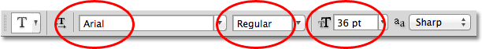
*The font, style and size options in the Options Bar.*

These same font, style and size options are also found at the top of the Character panel. It makes no difference if you set them in the Options Bar or the Character panel:

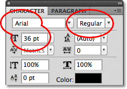
*The same font, style and size options in the Character panel.*

Likewise, we can choose a color for our text by clicking on the **color swatch** in the Options Bar:

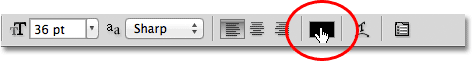
*The text color option in the Options Bar.*

Or we can click on the color swatch in the Character panel. Again, it makes no difference which one you choose. Either one will open Photoshop's **Color Picker** where we can select the text color we need:

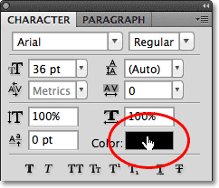
*The same text color option in the Character panel.*

### Anti-Aliasing

One option we haven't looked at yet that's also available in both the Options Bar and the Character panel is **Anti-Aliasing**. In the Options Bar, it's located directly to the right of the font size option:

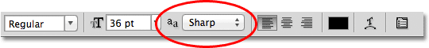
*The Anti-Aliasing option in the Options Bar.*

In the Character panel, the Anti-Aliasing option is found in the lower right corner:

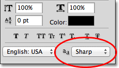
*The same Anti-Aliasing option in the bottom right of the Character panel.*

Anti-aliasing is used to keep the edges of the letters looking smooth. Without any form of anti-aliasing, most letters would appear blocky and jagged around the edges. Here's a zoomed-in view of the top half of a letter S with no anti-aliasing applied. Notice how blocky and rough the edges are:

*With no anti-aliasing applied, the edges of letters can appear blocky.*

With anti-aliasing applied, however, the edges appear much smoother. Photoshop actually adds some extra pixels around the edges to help create a smoother transition between the text color and the color of the background behind it:

*The same letter with anti-aliasing applied.*

Photoshop gives us a few different anti-aliasing methods to choose from (**Sharp**, **Crisp**, **Strong**, and **Smooth**) and each will have a slightly different effect on the overall appearance of your type. The default method is Sharp and I rarely change it to anything else, but feel free to try each one out and choose the one that you think looks best:

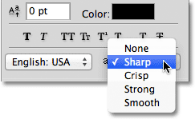
*The various anti-aliasing methods. The default, Sharp, tends to work well.*

### Leading

One of the type options found in the Character panel that's not available in the Options Bar is **Leading** which controls the amount of space between lines of type. By default, Leading is set to Auto:

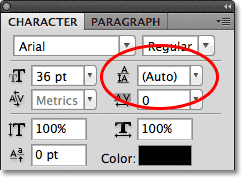
*The Leading option is only available in the Character panel.*

Keeping the Leading option set to Auto can sometimes give decent results, but you can adjust the line spacing by first making sure you have your **Type layer** selected in the Layers panel, then either entering a new value manually into the Leading input box or by clicking on the small **triangle** to the right of the input box and choosing from a list of preset leading amounts ranging from 6 pt up to 72 pt. Here's an example of some text using Auto leading:

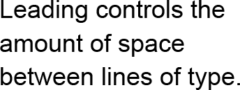
*A few lines of type using Auto leading.*

With Auto leading, Photoshop sets the leading amount to 120% of your font size. I'll lower the value to 36 pt, which is the same as my font size:

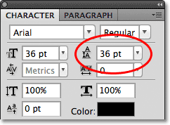
*Trying a Leading value equal to my font size.*

With the Leading value lowered, the lines of text now appear closer together:

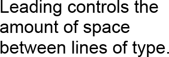
*The lines of type now appear more condensed.*

The general rule with leading is simply to choose a value that makes your text look natural and easily readable, and it will depend a lot on the font you've chosen. If there seems to be too much or too little space between your lines of text, adjust the leading value accordingly.

### Using Scrubby Sliders

Before we continue with our look at the other type options in the Character panel, one thing I should point out is that if you're using Photoshop CS or higher, an easy way to adjust many of the options in the Character panel (as well as in the Paragraph panel and the Options Bar) is by using **scrubby sliders** which allow us to change an option's value simply by dragging the mouse!

To access an option's scrubby slider, move your mouse cursor over the option's icon directly to the left of its input box. Not all options in Photoshop can use a scrubby slider, but if it's available, your cursor will change into the scrubby slider icon, which looks like a hand with the index finger pointed up and small left and right arrows on either side of it. With the scubby slider icon visible, click and hold your mouse button down, then drag left or right. As you drag, you'll see the value in the input box changing. It's much faster and easier than typing values in manually, especially when you don't know the exact value you need:

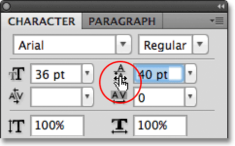
*Many options in Photoshop can by adjusted using a scrubby slider.*

### Tracking

**Tracking**, another type option found only in the Character panel, controls the amount of space between a range of letters or characters. It's located directly below the Leading option and is set to 0 by default:

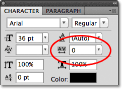
*Tracking sets the space between multiple characters or letters.*

To adjust the tracking value, you can click on the triangle to the right of the input box and choose from a list of preset values, you can enter a value manually, or you can click and hold your mouse button down on the option's icon and drag left or right using the scrubby slider that I described a moment ago. Using a negative tracking value will move the letters or characters closer together, while a positive value will spread them further apart.

To adjust the tracking for all of the text on a Type layer at once, simply select the Type layer itself in the Layers panel, then adjust the Tracking value in the Character panel. Or, you can first select part of the text, then adjust the tracking specifically for the selected range of letters. Here, I selected the word "space" in the sentence by double-clicking on it with the Type Tool, then I increased the tracking value to add more space between the letters in the word without affecting any other part of the sentence:

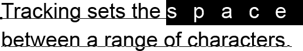
*Tracking can be used to adjust the letter spacing for an entire block of text or a selected range of letters.*

### Kerning

**Kerning**, another option exclusive to the Character panel, is found to the left of the Tracking option and is set to Metrics by default (I'll explain the term "Metrics" in a moment). Kerning controls the space between two specific letters or characters:

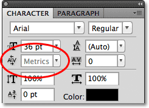
*Kerning controls the space between two specific characters.*

Kerning and tracking are often confused with each other because they seem similar, yet they're actually quite different. While tracking sets the space between **a range of characters**, kerning controls the spacing between **two specific characters**. It may help to think of tracking as the "global" setting for letter spacing, while kerning is the "local" setting.

Since kerning is only concerned with the space between two specific characters, the option is actually grayed out and unavailable until we click with the Type Tool to place our insertion marker between two characters in our text (at which point the Tracking option becomes unavailable since it deals only with a range of characters):

*Kerning only becomes available when we place our insertion marker between two characters.*

As I mentioned, by default, the Kerning option is set to **Metrics**, which means that Photoshop is using the letter spacing information that was included with the font by the font's designer. This is often the option that will give you the best results, although it will depend on the quality of the font you're using. If you click on the triangle to the right of the Kerning input box to bring up the list of preset values, you'll see that another option we can choose, directly below Metrics, is **Optical**. Rather than relying on the font's built-in kerning information, Optical will try to adjust the spacing based on the shapes of the two characters. Again, it will depend largely on the font itself as to which of these options, Metrics or Optical, will give you the better result.

You can also choose one of the other preset values in the list, or enter a value manually, or use the scrubby slider to adjust the kerning value.

### Vertical And Horizontal Scale

Below the Kerning and Tracking options in the Character panel are the **Vertical Scale** (left) and **Horizontal Scale** (right) options:

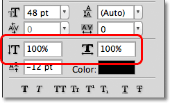
*The Vertical Scale (left) and Horizontal Scale (right) options.*

These options can be used to scale type either vertically or horizontally. With just the Type layer itself selected in the Layers panel, all of the text on the Type layer will be scaled together, or you can first select individual characters or words to scale them without affecting the remaining text.

Both of these options are set to 100% by default and it's generally not a good idea to use them to scale your type because they will distort the font's original letter shapes:

*The Vertical and Horizontal Scale options distort the font's original appearance.*

If you do need to scale your text, consider using Photoshop's [Free Transform](/basics/free-transform/) command instead.

### Baseline Shift

The **Baseline Shift** option is located directly below the Vertical Scale option in the Character panel:

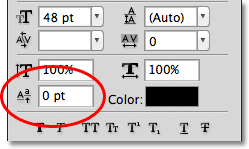
*Baseline Shift is another option only available in the Character panel.*

Baseline Shift allows us to move selected characters or words above or below the font's baseline. By default, it's set to 0 pt. Positive values will shift the selected text above the baseline, while negative values will shift it below the baseline. There are no preset values to choose from this time, so we either need to enter a value manually into the input box or drag left or right with the scrubby slider:

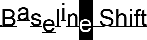
*Select characters or words, then adjust the Baseline Shift value to move them above or below the baseline.*

### Additional Type Options

Near the bottom of the Character panel is a row of icons that give us access to additional type options. From left to right, we have **Faux Bold** and **Faux Italic**, which can be used to create fake bold or italic styles when the font you're using doesn't include them (although you'd be much better off choosing a different font that does come with actual bold and italic styles):

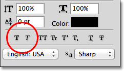
*Faux Bold (left) and Faux Italic (right) can give fake bold and italic styles to fonts that don't include them.*

Next we have the **All Caps** and **Small Caps** options for converting lowercase letters into either full size or smaller size uppercase letters:

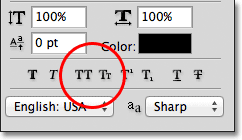
*Use All Caps (left) or Small Caps (right) to replace lowercase letters with capital letters.*

Up next are the **Superscript** and **Subscript** options:

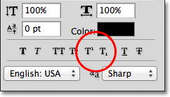
*The Superscript (left) and Subscript (right) options.*

And rounding out the list, we have the standard **Underline** and **Strikethrough** options:

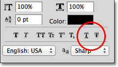
*The Underline (left) and Strikethrough (right) options.*

### Language Selection

Finally, in the bottom left corner of the Character panel is the **Language Selection** box. While it would be cool if Photoshop was able to translate our text from one language to another, sadly, that's not what this option is for. It's just for making sure you're using the correct spelling and hyphenation for whichever language you're targeting with your Photoshop document. Normally you can leave this option set to its default value:

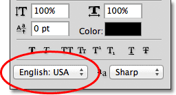
*Make sure Photoshop knows which language you're working in for correct spelling and hyphenation.*

### Resetting The Character Panel

If you've made changes to a lot of the options in the Character panel, you can quickly reset everything back to the defaults by clicking on the menu icon in the top right corner of the Character panel:

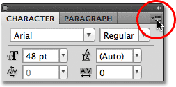
*Click on the menu icon in the top right corner.*

Then choose **Reset Character** from the menu that appears:

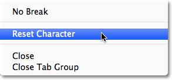
*Choose "Reset Character" from the list.*