# Clipping Masks And Type – Placing An Image In Text With Photoshop

> Source: [https://www.photoshopessentials.com/basics/clipping-masks-and-type/](https://www.photoshopessentials.com/basics/clipping-masks-and-type/)
> Downloaded and converted to Markdown.

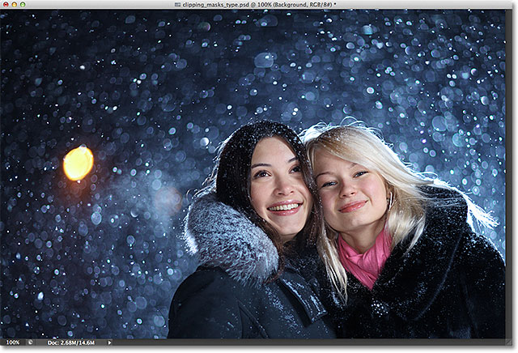
*The main image that will be used as the background.*

In a previous tutorial, we learned the basics and essentials of [using clipping masks in Photoshop](/basics/clipping-masks-essentials/) to hide unwanted parts of a layer from view in our designs and documents.

We learned that clipping masks use the content and transparent areas of the bottom layer to determine which parts of the layer above it remain visible, and as a real world example, we used a clipping mask to place one image into a photo frame that was inside a second image.

In that tutorial, we focused mainly on using clipping masks with [pixel-based layers](/essentials/pixels/), but another common use for them is with [type](/basics/type/photoshop-type-essentials/). Specifically, they can be used to easily **place a photo inside of text**!

As we'll see in this tutorial, Type layers in Photoshop are different from pixel-based layers in that there are no actual "transparent" areas on a Type layer. The type itself simply becomes the layer's contents. When we use a clipping mask with a Type layer, any part of the image on the layer above that sits directly over top of the text remains visible in the document, while areas of the image that fall outside the text are hidden. This creates the illusion that the image is actually inside the text! Let's see how it works.

As with the previous tutorial, I'll be using Photoshop CS6 here but everything we'll cover applies to any recent version of Photoshop.

## Using Clipping Masks With Type

Here's a document I have open containing two images. The first photo on the bottom Background layer will be used as the main image for the project ([friends enjoying snowfall photo](http://www.shutterstock.com/pic.mhtml?id=63804178) from Shutterstock):

*The main image that will be used as the background.*

And if I turn on the top layer by clicking on its **visibility icon** in the Layers panel:

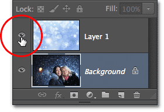
*Clicking the layer visibility ("eyeball") icon for the top layer.*

We see the image I'm going to be placing inside of some text ([abstract winter background](http://www.shutterstock.com/pic.mhtml?id=65799910) from Shutterstock):

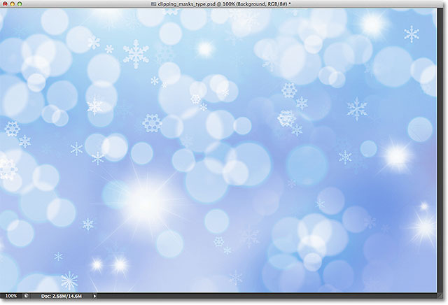
*The image that will be going inside the text.*

### Step 1: Add Your Text

Let's go ahead and add the text to the document. First, I want my text to appear in front of the other images for now (so I can see what I'm doing) so before I add any text, I'll click on the top layer in the Layers panel to select it and make it active:

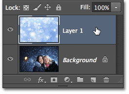
*Selecting the top layer.*

With the top layer selected, I'll add my text. If you're looking for more information on working with type in Photoshop, be sure to check out our full [Photoshop Type Essentials](/basics/type/photoshop-type-essentials/) tutorial, the first of several tutorials covering everything you need to know. Here, I'll start by grabbing the **Type Tool** from the Tools panel:

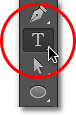
*Selecting the Type Tool.*

With the Type Tool selected, I'll choose my font up in the **Options Bar** along the top of the screen. When you know you're going to be placing an image inside your text, you'll usually want to choose a font with thick letters so you'll be able to see more of the image. I'll choose Impact since it's a nice thick font, and I'll set the initial size of my font to 24pt. Don't worry about choosing a color for the text because the color won't be visible once we've added the image:

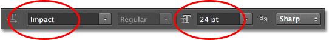
*Selecting the font options in the Options Bar.*

With my font details chosen, I'll click inside the document with the Type Tool to begin adding my text. I'll type the words "Happy Holidays":

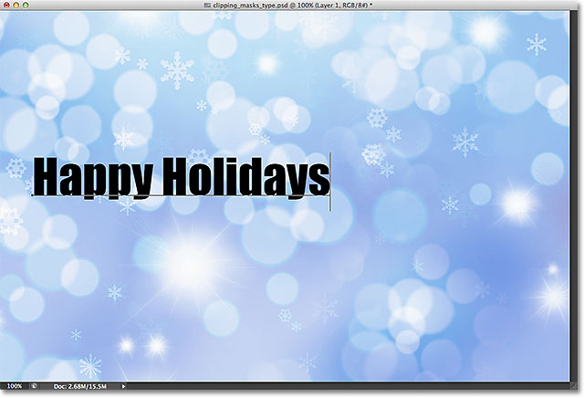
*Adding the type to the document.*

When you're done, click the **checkmark** in the Options Bar to accept the type and exit out of text editing mode:

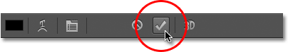
*Clicking the checkmark in the Options Bar.*

If we look in the Layers panel, we see the new **Type layer** that's been placed above the other two layers. Photoshop places new Type layers directly above whatever layer was previously active which is why I first clicked on Layer 1 to select it before adding the text:

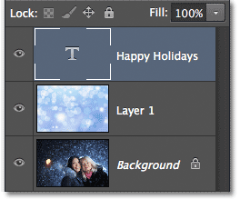
*The Layers panel showing the new Type layer.*

### Step 2: Resize The Text With Free Transform

Unfortunately, the font size I chose in the Options Bar was too small for my design, but that's okay because there's an easy way to [resize the text](/basics/type/font-size/). We'll just use Photoshop's [Free Transform](/basics/free-transform/) command. I'll select it by going up to the **Edit** menu in the Menu Bar along the top of the screen and choosing **Free Transform**. Or, I could press **Ctrl+T** (Win) / **Command+T** (Mac) on my keyboard to select Free Transform with the shortcut. Either way is fine:

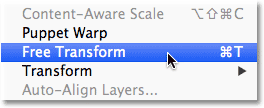
*Going to Edit > Free Transform.*

This places the Free Transform box and handles (little squares) around the type. To resize the type, I'll simply click and drag the **corner handles** outward to make the text as large as I need it. I'll also hold down my **Shift** key as I'm dragging the handles to keep the original shape of the letters intact as I'm resizing them. When you're done, press **Enter** (Win) / **Return** (Mac) on your keyboard to accept the transformation and exit out of the Free Transform command:

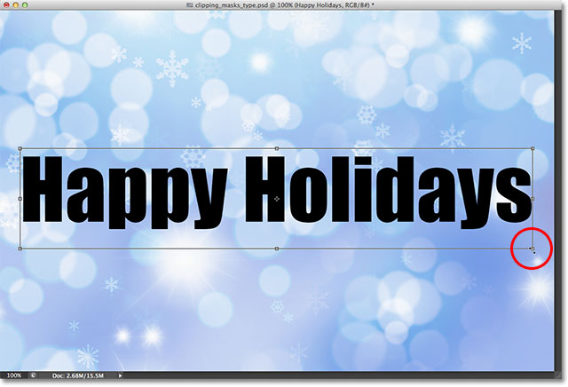
*Holding Shift and dragging the corner handles to resize the text.*

### Step 3: Create A Clipping Mask

Now that the type is the size we need, let's go ahead and add our clipping mask to place the image inside the text. The image I want to place inside my text is on Layer 1, but Layer 1 is currently sitting below my Type layer and as we learned in the [Clipping Masks Essentials](/basics/clipping-masks-essentials/) tutorial, we need the layer that's going to serve as the clipping mask (in this case, the Type layer) to be below the layer that's going to be "clipped" (Layer 1). This means I'll first need to move my Type layer below Layer 1.

To move the Type layer, I'll click on it in the Layers panel and with my mouse button held down, I'll begin dragging the layer downward until I see a **horizontal highlight bar** appear between Layer 1 and the Background layer:

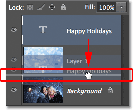
*Dragging the Type layer below Layer 1.*

When the highlight bar appears, I'll release my mouse button and the Type layer is moved right where I need it directly below Layer 1:

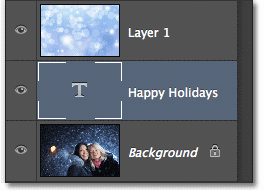
*Layer 1 now sits above the Type layer.*

Next, we need to make sure we have the layer that's going to be "clipped" by the clipping mask selected, so I'll select Layer 1:

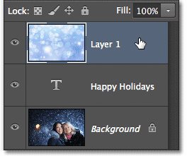
*Selecting the image layer above the Type layer.*

With the Type layer now directly below the image and the image layer selected, I'll add the clipping mask by going up to the **Layer** menu at the top of the screen and choosing **Create Clipping Mask**:

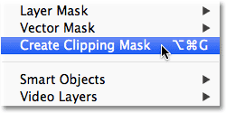
*Going to Layer > Create Clipping Mask.*

If we look again in the Layers panel, we see that Layer 1 is now indented to the right, with a small arrow to the left of its preview thumbnail pointing down at the Type layer below it. This tells us that Layer 1 is now being clipped by the Type layer:

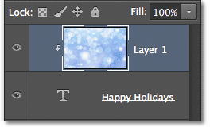
*The Layers panel showing the clipping mask.*

And if we look in the document window, we see that the image on Layer 1 now appears to be inside the text! It's not *really* inside the text. It only looks that way because any part of the image that is not sitting directly above the type is being hidden from view thanks to the clipping mask:

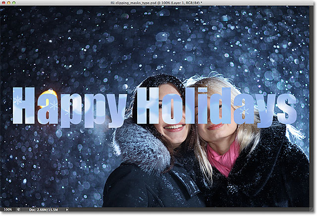
*Photoshop is now hiding any part of the image that is not sitting directly above the type.*

### Step 4: Reposition The Text

Of course, I picked a pretty bad spot to place my text. It's blocking the faces of the two people in the photo so I'll need to move the text into position. First, I'll select the **Type layer** in the Layers panel:

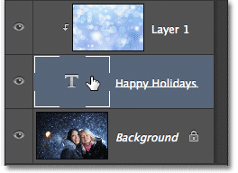
*Clicking on the Type layer to select it.*

Then I'll grab Photoshop's **Move Tool** from the top of the Tools panel:

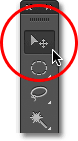
*Selecting the Move Tool.*

With the Type layer selected and the Move Tool in hand, I'll simply click on the text in the document and drag it up above the two people in the photo. Even though the text is moving, the image inside the text remains in place. It doesn't move at all. So with the text now higher up in the document, we see a different part of the image inside the text. The text and the image inside it can actually be moved **independently of each other**, so if I wanted to, I could also select the image layer (Layer 1) in the Layers panel and, with the Move Tool still in hand, drag the image around inside the text to reposition it. This would move the image while the text remained in place:

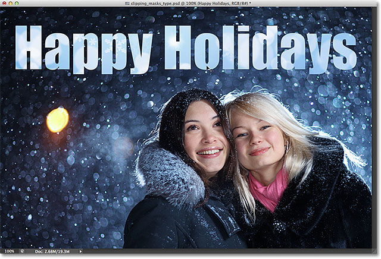
*Use the Move Tool to move the text, or the image inside the text (depending on which layer is selected in the Layers panel).*

Even though the Type layer is being used as a clipping mask, it's still officially type, which means it remains fully editable even with the image appearing inside of it. If you suddenly realized you made a spelling mistake, simply select the Type Tool, highlight the mistake by clicking and dragging over it, type the correction and then click the checkmark in the Options Bar to accept it. Or, if you don't like the font you chose initially, again select the Type Tool, click on the Type layer in the Layers panel to make it active, then choose a different font from the Options Bar (you may need to use Free Transform again to resize the type if you change fonts). Again, I cover all of these things and more beginning with our [Photoshop Type Essentials](/basics/type/photoshop-type-essentials/) tutorial.

### Warping And Reshaping The Type

Also since the type is still type, that means you can even warp it into different shapes! First make sure you have the Type layer selected in the Layers panel, then go up to the **Edit** menu at the top of the screen, choose **Transform**, and then choose **Warp**:

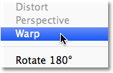
*Going to Edit > Transform > Warp.*

With the Warp command selected, look up near the far left of the Options Bar at the top of the screen and you'll see a **Warp** option that by default is set to **None**:

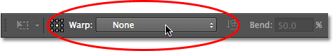
*The Warp option in the Options Bar.*

Clicking on the word None opens a drop-down list of several preset **warp styles** to choose from. As an example, I'll choose one of the more popular styles - **Wave**:

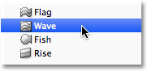
*Choosing Wave from the list of preset warp styles.*

This instantly [warps the text](/basics/type/warp-text/) into a fun "wave" shape, yet the clipping mask remains active with the image still appearing inside the text. Anything you can normally do with type in Photoshop, you can do with it even when it's being used as a clipping mask:

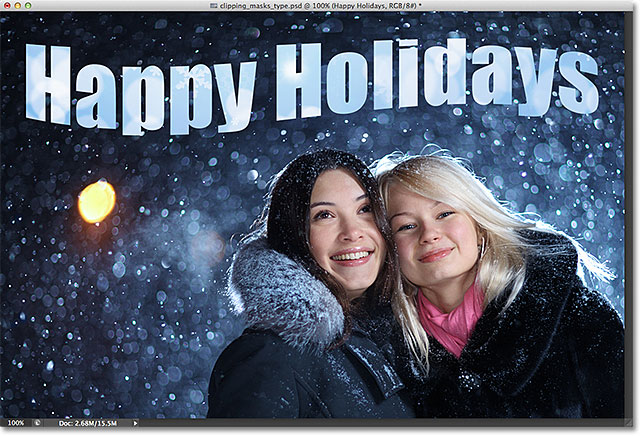
*The text after applying the Warp command.*

### Adding Layer Styles

We also learned in the [Clipping Masks Essentials](/basics/clipping-masks-essentials/) tutorial that we can add **layer styles** to clipping masks, and that's true even when using type. To quickly finish things off, I'll add a layer style to the text to help it blend in better with the main photo behind it. First, I'll select the Type layer in the Layers panel:

*Selecting the Type layer.*

Then I'll click on the **Layer Styles** icon at the bottom of the Layers panel:

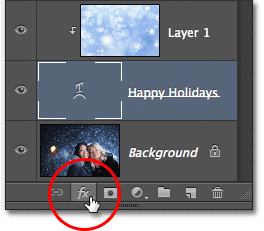
*Clicking the Layer Styles icon.*

I'll choose **Outer Glow** from the list of layer styles that appears:

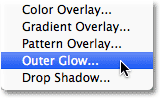
*Choosing an Outer Glow style.*

This opens Photoshop's Layer Style dialog box set to the Outer Glow options in the middle column. I'll change the color of my outer glow to white by clicking on the **color swatch** and choosing **white** from the **Color Picker** that appears. Then I'll lower the **Opacity** of the glow to **30%** and I'll increase the glow's **Size** to around **32px**. Of course, these are just settings that work well with my image here and are only meant to be an example of how we can add layer styles to type while it's being used as a clipping mask:

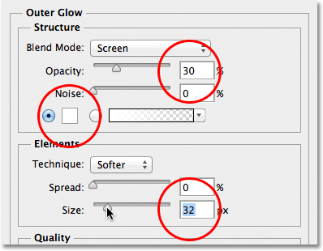
*The Outer Glow options.*

I'll click OK in the top right corner of the Layer Style dialog box to close out of it. We can see the Outer Glow style listed below the Type layer in the Layers panel:

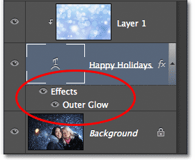
*The Outer Glow style appears below the Type layer.*

And with that, we're done! Here's my final result with the Outer Glow added to the text (I also used to Move Tool to move the type down just a bit so it appears more centered between the two girls and the top of the image):

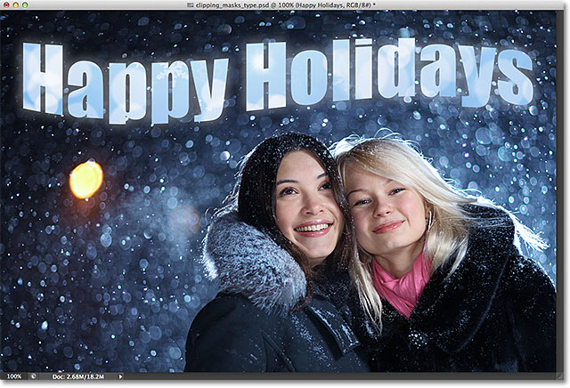
*The final "image in text" result.*