# Clipping Masks in Photoshop

> Source: [https://www.photoshopessentials.com/basics/clipping-masks-essentials/](https://www.photoshopessentials.com/basics/clipping-masks-essentials/)
> Downloaded and converted to Markdown.

In this tutorial, I show you how to use clipping masks in Photoshop to show and hide different parts of a layer and fit images into shapes! We'll learn the basics of how to create a clipping mask, and we'll explore the idea behind them in more detail so that by the end of this lesson, you'll have a solid grasp on how clipping masks work.

I'm using Photoshop CC but clipping masks work the same way in all recent versions. You can [get the latest Photoshop version here](https://adobe.prf.hn/click/camref:1100lrdjJ/destination:https%3A%2F%2Fwww.adobe.com%2Fproducts%2Fphotoshop.html).

## What Are Clipping Masks?

Clipping masks in Photoshop are a powerful way to control the visibility of a layer. In that sense, clipping masks are similar to layer masks. But while the end result may *look* the same, clipping masks and layer masks are very different. A [layer mask](/basics/understanding-photoshop-layer-masks/) uses black and white to show and hide different parts of the layer. But a *clipping mask* uses the *content and transparency* of one layer to control the visibility of another.

To create a clipping mask, we need two layers. The layer on the bottom controls the visibility of the layer above it. In other words, the bottom layer is the *mask*, and the layer above it is the layer that's *clipped* to the mask.

Where the bottom layer contains actual *content* (pixels, shapes, or type), the content on the layer above it is visible. But if any part of the layer on the bottom is *transparent*, then that same area on the layer above it will be hidden. That may sound more confusing than how a layer mask works, but clipping masks are just as easy to use. Let's create a clipping mask ourselves so we can better understand how they work.

## How A Clipping Mask Works

To really make sense of clipping masks, we first need to understand the difference between *content* and *transparency* on a layer. To follow along with me, you can open any image. I'll use this photo of my little friend here who's also trying to understand, in her own way, what this clipping stuff is all about ([photo](https://adobe.prf.hn/click/camref:1100lrdjJ/destination:https%3A%2F%2Fstock.adobe.com%2Fstock-photo%2Fgrooming%2F25030135) from Adobe Stock):

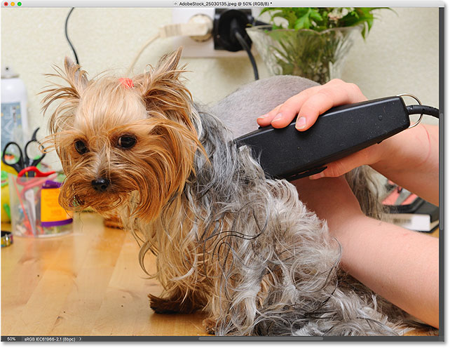
*The original image. Photo credit: Adobe Stock.*

### A *Mask* Layer And A *Clipped* Layer

If we look in the [Layers panel](/basics/layers/layers-panel/), we see the photo on the [Background layer](/basics/background-layer-photoshop-cc/), which is currently the only layer in the document:

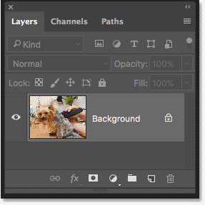
*The Layers panel showing the photo on the Background layer.*

We need *two* layers to create a clipping mask, one to serve as the mask and one that will be clipped to the mask, so let's add a second layer. We'll add the new layer below the image. First, unlock the Background layer. In Photoshop CC, click the **lock icon** to unlock it. In Photoshop CS6 or earlier, press and hold the **Alt** (Win) / **Option** (Mac) key on your keyboard and double-click on the Background layer:

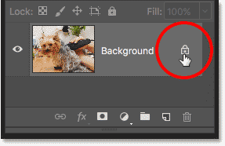
*Unlocking the Background layer.*

This unlocks the Background layer and renames it "Layer 0":

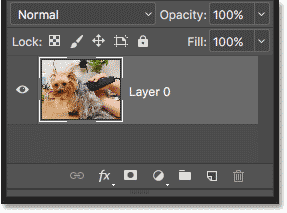
*Unlocking the Background layer lets us add a new layer below it.*

Then, to add a new layer below the image, press and hold the **Ctrl** (Win) / **Command** (Mac) key on your keyboard and click the **Add New Layer** icon:

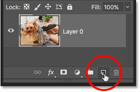
*Adding a new layer below the image.*

A new layer named "Layer 1" appears below the photo, and we now have two layers in the document. We'll turn the bottom layer into the mask, and the image above it will be clipped to the mask:

*The second layer needed for the clipping mask has been added.*

### Understanding Clipping Masks: Content vs Transparency

Hide the original image for the moment by clicking the top layer's **visibility icon**:

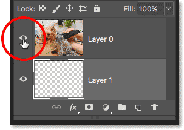
*Clicking the visibility icon to hide the photo.*

With the top layer turned off, we see the layer we just added. By default, new layers in Photoshop are blank, meaning they have no content at all. A layer with no content is *transparent* and we see right through it. When there are no other layers below a transparent layer, Photoshop displays the transparency as a checkerboard pattern, as we see here:

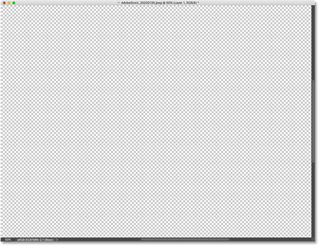
*The checkerboard pattern means the bottom layer is transparent.*

Turn the top layer back on by clicking again on its visibility icon:

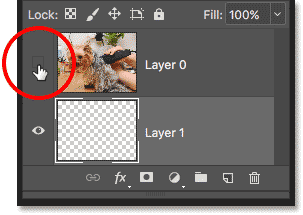
*Clicking the same visibility icon.*

The top layer contains actual *content*. In this case, it's pixel-based content because we're looking at a digital photo, but in Photoshop, content could also be a vector shape or even text. Really, anything that isn't transparency is considered content:

*The top layer contains actual content.*

### How To Create A Clipping Mask In Photoshop

Clipping masks use the content and transparency of the layer below to control the visibility of the layer above. Let's create a clipping mask using our two layers and see what happens.

#### Step 1: Select The Layer That Will Be Clipped

When creating a clipping mask, we first need to select the layer that's going to be clipped to the layer below it. In this case, the top layer ("Layer 0") will be clipped to the bottom layer ("Layer 1"), so make sure the top layer is selected:

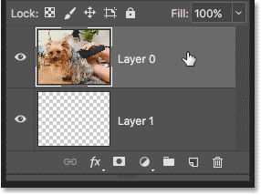
*Selecting the top layer.*

#### Step 2: Choose "Create Clipping Mask"

To create the clipping mask, go up to the **Layer** menu in the Menu Bar and choose **Create Clipping Mask**:

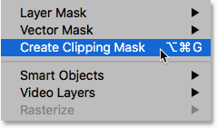
*Go to Layer > Create Clipping Mask.*

And that's all there is to it! With the layer mask created, the Layers panel now shows the top layer ("Layer 0") indented to the right, with a small arrow pointing down at "Layer 1" below it. This is how Photoshop tells us that the top layer is now clipped to the layer below:

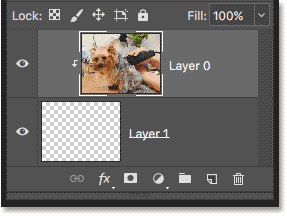
*The Layers panel showing the top layer clipped to the bottom layer.*

But the problem is, all we've accomplished so far by creating a clipping mask is that we've hidden the image from view, and that's because our mask layer ("Layer 1") contains no content. It's completely transparent. With a clipping mask, any areas on the top layer that are sitting directly above transparent areas on the bottom layer are hidden. Since the bottom layer contains nothing but transparency, no part of the image above it is visible:

*With no content on the mask layer, the image on the clipped layer is hidden.*

### How To Release A Clipping Mask

That wasn't very interesting, so release the clipping mask by going up to the **Layer** menu and choosing **Release Clipping Mask**:

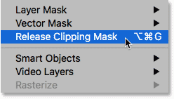
*Going to Layer > Release Clipping Mask.*

In the Layers panel, the top layer is no longer indented to the right, which means it's no longer clipped to the layer below:

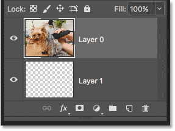
*The layer mask has been released.*

And in the document, we're back to seeing our image:

*With the clipping mask released, the image returns.*

### Adding Content To The Clipping Mask

Let's add some content to the bottom layer. Click the top layer's **visibility icon** to hide the image so we can see what we're doing:

*Clicking the top layer's visibility icon.*

Then click on the bottom layer to make it active:

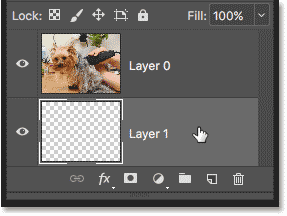
*Selecting the bottom layer.*

To add content, we'll draw a simple shape. Select the [Elliptical Marquee Tool](/basics/selections/elliptical-marquee-tool/) from the [Toolbar](/basics/photoshop-tools-toolbar-overview/) by **right-clicking** (Win) / **Control-clicking** (Mac) on the Rectangular Marquee Tool and choosing the Elliptical Marquee Tool from the fly-out menu:

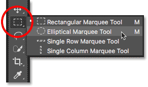
*Selecting the Elliptical Marquee Tool.*

Click and drag out an elliptical selection outline in the center of the document:

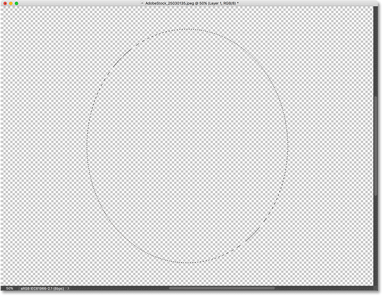
*Drawing a selection with the Elliptical Marquee Tool.*

Go up to the **Edit** menu in the Menu Bar and choose **Fill**:

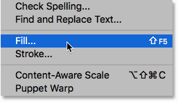
*Going to Edit > Fill.*

In the Fill dialog box, set the **Contents** option to **black**, and then click OK:

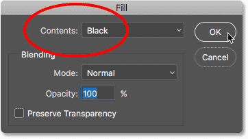
*The Fill dialog box.*

Photoshop fills the selection with black. To remove the selection outline from around the shape, go up to the **Select** menu and choose **Deselect**:

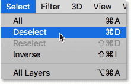
*Going to Select > Deselect.*

And now, instead of a completely transparent layer, we have an area with some content in the center. Notice, though, that the area surrounding the content remains transparent:

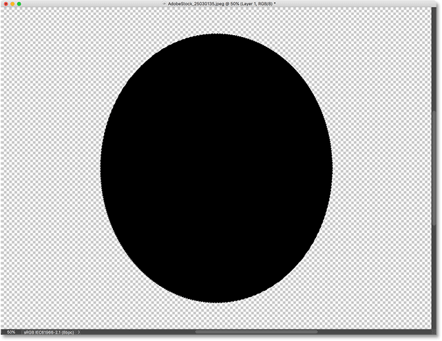
*The bottom layer now contains both content and transparency.*

Back in the Layers panel, the **preview thumbnail** for the bottom layer now shows the black shape. What's important to note here is that if you compare the preview thumbnails for both layers, you'll see that some of the image on the top layer is sitting directly above the content (the shape) on the bottom layer. And, some of the photo is sitting above the transparent areas on the bottom layer:

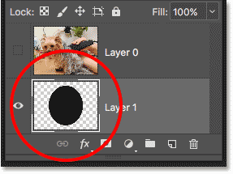
*The preview thumbnail showing the content and transparency on the bottom layer.*

### Creating Another Clipping Mask

Now that we've added some content to the bottom layer, let's create another clipping mask. Again, we first need to select the layer that will be clipped to the layer below, so click on the top layer to select it. Then, click the top layer's **visibility icon** to make the image on the layer visible:

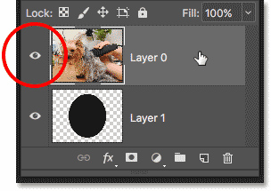
*Selecting and turning on the layer that will be clipped.*

Go back up to the **Layer** menu and once again choose **Create Clipping Mask**:

*Go again to Layer > Create Clipping Mask.*

In the Layers panel, we see the top layer clipped to the layer below it, just like we saw last time:

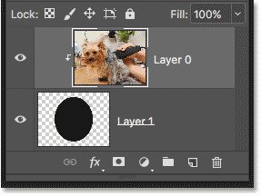
*The Layers panel again showing the clipping mask.*

But in the document, we now see a very different result. This time, the section of the photo that's sitting directly above the shape on the layer below it remains visible! The only parts of the photo that are hidden are the areas surrounding the shape, since those areas are still sitting above transparency:

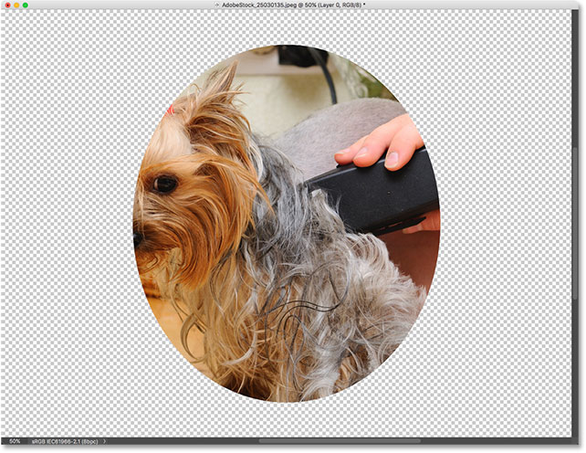
*The content on the bottom layer keeps part of the top layer visible.*

### Moving Content Within A Clipping Mask

Of course, the result might look better if our subject was centered inside the shape. With clipping masks, it's easy to move and reposition content within them. Just select the **Move Tool** from the Toolbar:

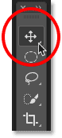
*Selecting the Move Tool.*

Then click on the photo and drag it into position. As you move the image, only the area that moves over the shape on the layer below it remains visible. And that's the basics of how clipping masks work:

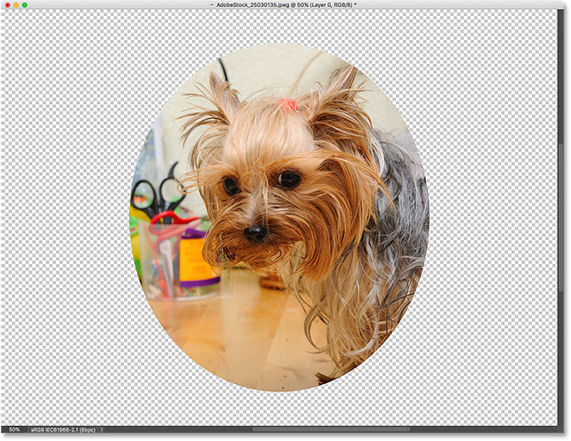
*The clipping mask after centering the photo within the shape.*

## When To Use A Clipping Mask

While layer masks are best for blending layers with seamless transitions, clipping masks in Photoshop are perfect when your image needs to fit within a clearly-defined shape. The shape may be one you've drawn with a [selection tool](/basics/make-selections-photoshop/) as we've seen. But a clipping mask can also be used to [fill a vector shape with an image](/photo-effects/place-image-inside-shape-photoshop/), or to [place an image inside text](/photoshop-text/text-effects/image-in-text-photoshop-cs6/). As another example of what we can do with clipping masks, let's quickly look at how a clipping mask can be used to place a photo inside a frame.

### Placing A Photo In A Frame With Clipping Masks

Here I have a document containing two images, each on a separate layer. The [photo](https://prf.hn/l/5N3YMRl) on the bottom layer contains the frame:

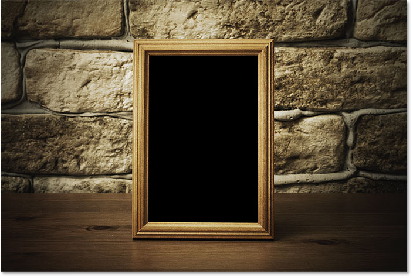
*The image on the bottom layer. Photo credit: Adobe Stock.*

And if I turn the top layer on by clicking its visibility icon:

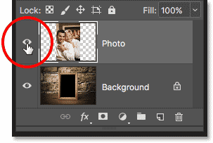
*Turning on the top layer.*

We see the [photo](https://prf.hn/l/ERLleyQ) I want to place inside the frame:

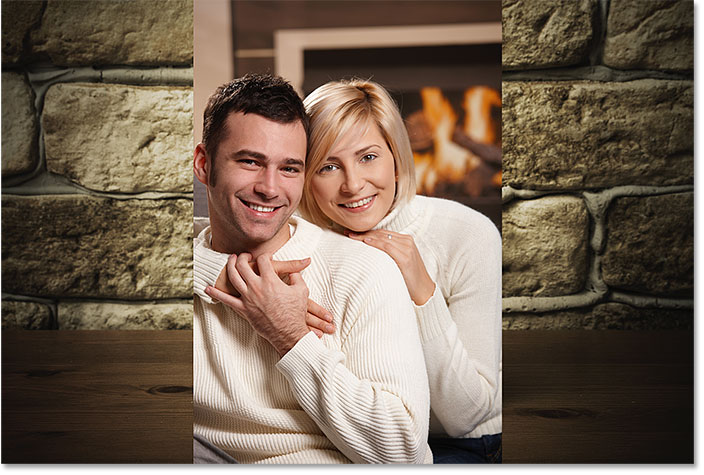
*The image on the top layer. Photo credit: Adobe Stock.*

I'll hide the top layer for the moment by once again clicking its visibility icon, and then I'll click on the Background layer to select it:

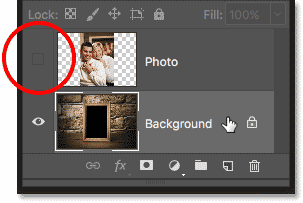
*Hiding the top layer and selecting the bottom layer.*

#### Drawing Or Selecting The Shape

I mentioned that clipping masks work best when your image needs to fit within a shape. In this case, the shape is the area inside the frame. Since the area is filled with solid black, I'll select it using Photoshop's [Magic Wand Tool](/basics/selections/magic-wand-tool/):

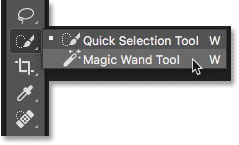
*Selecting the Magic Wand Tool from the Toolbar.*

I'll click with the Magic Wand Tool inside the frame, and now the area is selected:

*Selecting the area that will be used for the clipping mask.*

Then, I'll copy the selected area to a new layer by going up to the **Layer** menu in the Menu Bar, choosing **New**, and then choosing **Layer via Copy**:

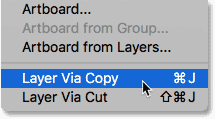
*Going to Layer > New > Layer via Copy.*

Photoshop copies my selection to a new layer between the Background layer and the photo I'll be placing inside the frame. I now have the shape I need to create my clipping mask:

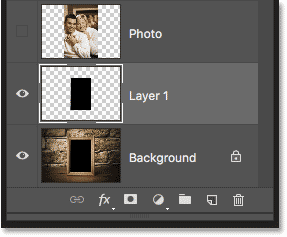
*The area inside the frame appears on its own layer.*

#### A Faster Way To Create A Clipping Mask

To create the clipping mask, I'll select the top layer, and I'll turn the layer back on by clicking its visibility icon:

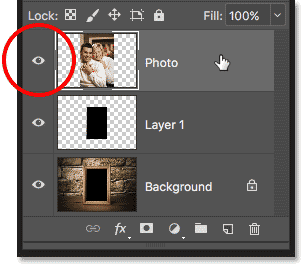
*Selecting and turning on the top layer.*

We've seen that we can create a clipping mask by choosing Create Clipping Mask from the Layer menu. But a faster way is to press and hold the **Alt** (Win) / **Option** (Mac) key on your keyboard as you hover your mouse cursor between the two layers. Your cursor will change into a **clipping mask icon**:

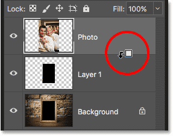
*The clipping mask icon appears.*

Click on the dividing line between the two layers to create the clipping mask:

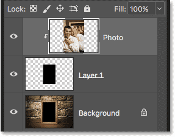
*The image is now clipped to "Layer 1" below it.*

With the clipping mask created, the photo now appears only inside the frame, since that's the only part of the image that's sitting above actual content on the layer below it. The rest of the photo is hidden because it's sitting above transparency:

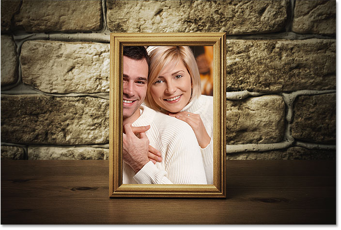
*The photo is now clipped inside the frame thanks to the clipping mask.*

#### Resizing Content Within A Clipping Mask

Finally, we've seen that we can move content around inside a clipping mask using the Move Tool. But we can also resize content within a clipping mask just as easily using Photoshop's [Free Transform](/basics/photoshops-free-transform-essentials/) command. At the moment, my photo is too big for the frame, so I'll resize it by going up to the **Edit** menu and choosing **Free Transform**:

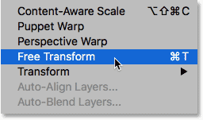
*Going to Edit > Free Transform.*

Photoshop places the Free Transform box and handles around the image, including the area outside the frame that's currently hidden by the clipping mask:

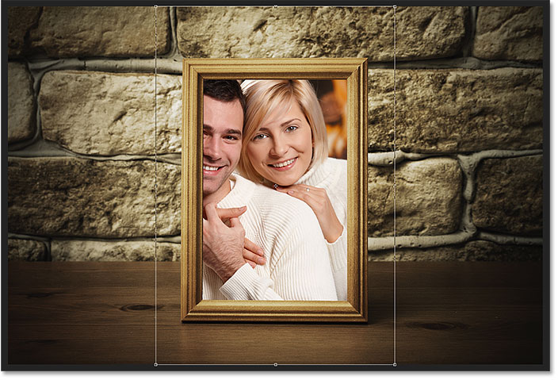
*The Free Transform handles appear around the entire image, including the hidden areas.*

To resize it, I'll press and hold my **Shift** key as I click on the **corner handles** and drag them inward. Holding the Shift key locks the aspect ratio of the image so I don't distort it:

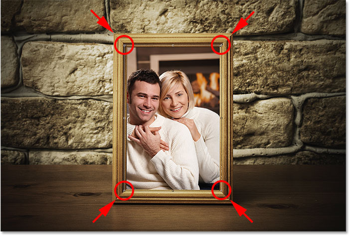
*Resizing the photo inside the clipping mask.*

To accept it, I'll press **Enter** (Win) / **Return** (Mac) on my keyboard to close out of Free Transform. And now, thanks to the power of clipping masks, the photo fits nicely within the frame:

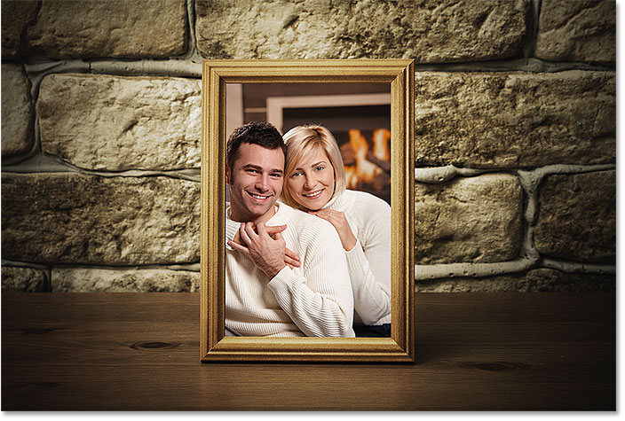
*The final clipping mask result.*

And there we have it! That's how clipping masks work in Photoshop and how to use a clipping mask to show and hide different parts of a layer!

Visit our [Photoshop Basics](/basics/) section for more Photoshop tutorials!