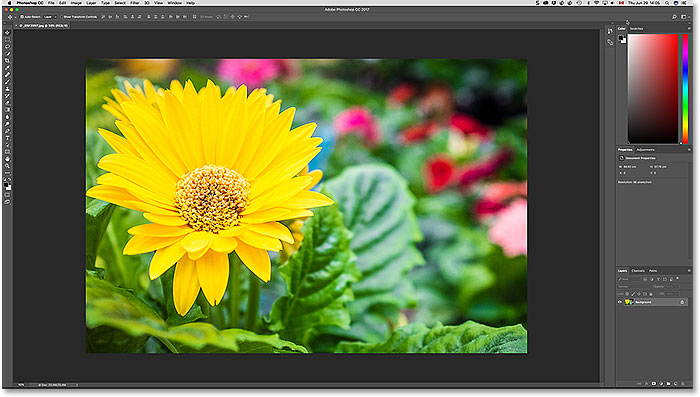
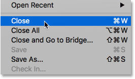
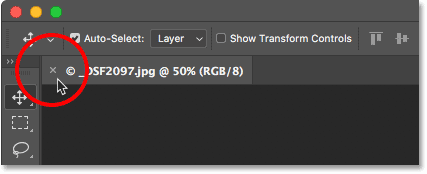
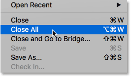
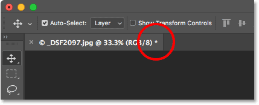
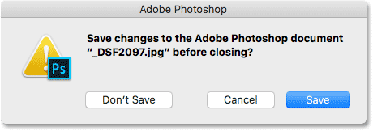
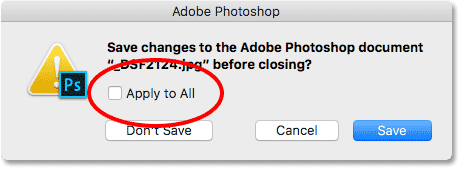
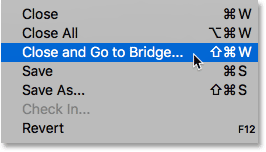
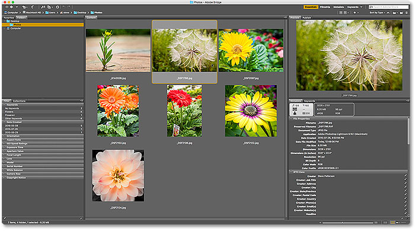

# How to Close Images in Photoshop

> Source: [https://www.photoshopessentials.com/basics/close-images-photoshop/](https://www.photoshopessentials.com/basics/close-images-photoshop/)
> Downloaded and converted to Markdown.

Learn the various ways to close an image in Photoshop when you're done viewing or editing it. We'll learn how to close a single image, how to close multiple images at once, how to close images with unsaved changes, and how to close an image and return to Adobe Bridge.

In this series of tutorials on getting our images into Photoshop, we've learned [how to set Photoshop as our default image editor](/basics/how-to-make-photoshop-your-default-image-editor/). We learned how to open images using Photoshop's [Start screen](/basics/open-images-photoshop-cc/), and how to open them into Photoshop from [Adobe Bridge](/basics/open-images-photoshop-adobe-bridge/). We've even looked at how to open images into Photoshop's image editing plugin, [Camera Raw](/basics/open-image-camera-raw/), before moving them over to Photoshop.

Knowing how to get our images into Photoshop is obviously important. But so is knowing how to close those images when we're done. In this quick tutorial, we'll learn how to close a single image, and how to close multiple images at once. We'll look at what happens when we try to close an image with unsaved changes. And finally, we'll learn how to close an image and return to Adobe Bridge.

This lesson is from my [Getting Images into Photoshop](/basics/opening-images-photoshop/) Complete Guide.

Let's get started!

## How To Close A Single Image

Here we see that I currently have a single image open in Photoshop:

*An image open in Photoshop CC. Photo credit: Steve Patterson.*

To close a single image, go up to the **File** menu in the Menu Bar along the top of the screen and choose **Close**. You can also use the keyboard shortcut, **Ctrl+W** (Win) / **Command+W** (Mac):

*To close a single image, go to File > Close.*

Another way to close a single image is by clicking the small "**x**" icon in the document's **tab**. On a Windows PC, the "x" is located on the far right of the tab. On a Mac (which is what I'm using here), it's on the left:

*Click the "x" in the tab to close the document.*

## How To Close Multiple Images At Once

If you have two or more images open in Photoshop and need to close them all, you *could* close each image one at a time. Or, you could close all of your open images at once. To close all open images, go up to the **File** menu and choose **Close All**. There's also a handy keyboard shortcut, **Ctrl+Alt+W** (Win) / **Command+Option+W** (Mac):

*To close all open images, go to File > Close All.*

## Closing An Image With Unsaved Changed

If you see a small **asterisk** after the file's name and other information in the document's tab, it means you've made one or more edits to your image and haven't yet saved your work:

*An asterisk in the tab means you have unsaved changes.*

To close an image that has unsaved changes, go up to the **File** menu and choose **Close**, or click the "**x**" icon in the document's tab. Photoshop will ask if you want to save your work before closing the image.

On a Windows PC, your options will be **Yes** to save, **No** to not save, or **Cancel** to escape out of the closing process and just return to your image. On a Mac, your options are **Save**, **Don't Save** or **Cancel**:

*Choose whether or not you want to save your work.*

One very important thing to be aware of is that if you choose **No** (Win) / **Don't Save** (Mac), Photoshop will *still close your image*. But since you didn't save your work, any edits you made will be lost forever. If you simply want to cancel the closing process and return to your image, choose **Cancel** instead.

## Close Multiple Images With Unsaved Changes

If you have two or more images open in Photoshop that have unsaved changes, you can close them all at once by going up to the **File** menu and choosing **Close All**. Before it closes your first image, Photoshop will ask if you want to save your work. You'll see the same options to choose from (Yes, No or Cancel on a Windows PC, or Save, Don't Save or Cancel on a Mac).

If you want the same choice to apply to all of the images you're closing, select **Apply to All**, then make your choice:

*Choose "Apply to All" to save or not save all open images.*

## How To Close An Image And Return To Adobe Bridge

Finally, if you're using [Adobe Bridge](/basics/open-images-photoshop-adobe-bridge/) to select and open your images into Photoshop, you can close an image and return to Bridge by going up to the **File** menu in Photoshop and choosing **Close and Go to Bridge**:

*Going to File > Close and Go to Bridge.*

This closes the image and sends you back to Adobe Bridge where you can select the next image you want to open into Photoshop:

*Adobe Bridge CC.*