# Work Anywhere with Cloud Documents in Photoshop

> Source: [https://www.photoshopessentials.com/basics/cloud-documents-photoshop-cc-2020/](https://www.photoshopessentials.com/basics/cloud-documents-photoshop-cc-2020/)
> Downloaded and converted to Markdown.

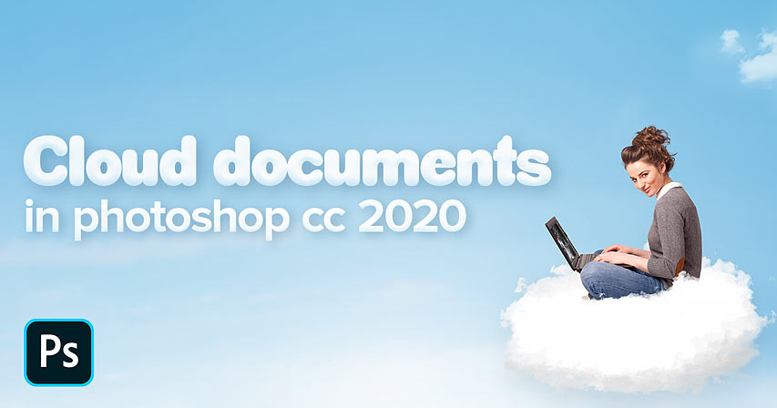

Learn how cloud documents, a new feature in Photoshop 2020, let you open your Photoshop files and continue working on any PC, Mac or iPad where you're signed in to the Adobe Creative Cloud!

A great new feature in Photoshop 2020, especially for people like me who work on multiple computers and devices, is the ability to save your Photoshop document not just to your local computer but also to the cloud. By saving your work as a Photoshop cloud document, you can reopen the file and continue working on any computer where you are logged in to your Adobe Creative Cloud account, whether it's another PC, a Mac, or even an iPad using the new Photoshop for iPad app!

In this tutorial, I'll show you how easy it is to start working with Photoshop cloud documents. You'll learn where to view your existing cloud documents, how to open a file from the cloud, and how to save your work as a new .psdc file, which stands for Photoshop Document Cloud. I'll also show you how to manage your cloud documents, including how to rename them, how to delete them, and how to restore a deleted cloud document if you change your mind!

To use cloud documents, you'll need [Photoshop 2020 or newer](https://prf.hn/l/dlXjD2w). And since cloud files are stored online, you'll also want to make sure that your computer or iPad is connected to the internet.

Let's get started!

## Where do I find my Photoshop cloud documents?

The main way to view and open cloud documents is from Photoshop's **Home Screen**. The Home Screen appears whenever you launch Photoshop without opening an image, or when you close your document and have no other documents open.

The Home Screen can also be accessed at any time by clicking the **Home button** in the upper left of [Photoshop's interface](/basics/getting-know-photoshop-interface/):

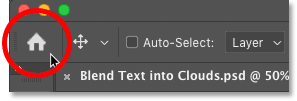
*Clicking the Home button.*

By default, the Home Screen is set to **Recent**, showing thumbnails of your recently-opened files. Any recently-opened cloud documents will appear here, along with other [file types](/essentials/file-formats/) such as standard Photoshop documents, JPEGs, PNG files, and so on:

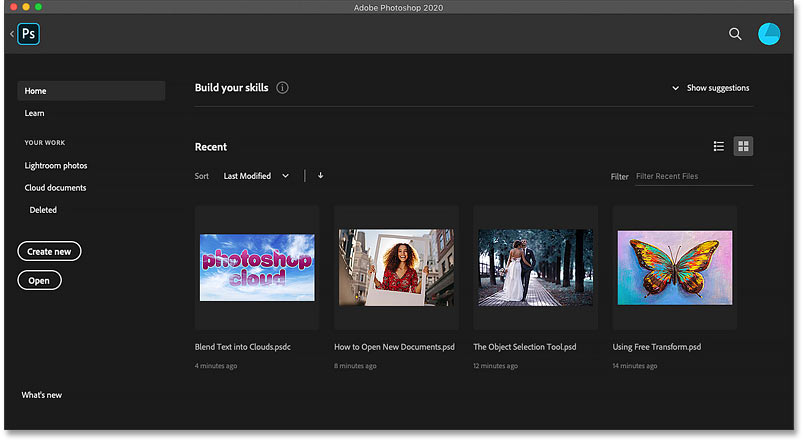
*The Home Screen showing recently-opened files.*

[Related: Learn all the ways to open images in Photoshop](/basics/open-images-photoshop-cc/)

### What file extension does a Photoshop cloud document use?

While standard Photoshop documents use a .psd file extension, cloud documents can be identified by the new **.psdc** (Photoshop Document Cloud) extension after their name:

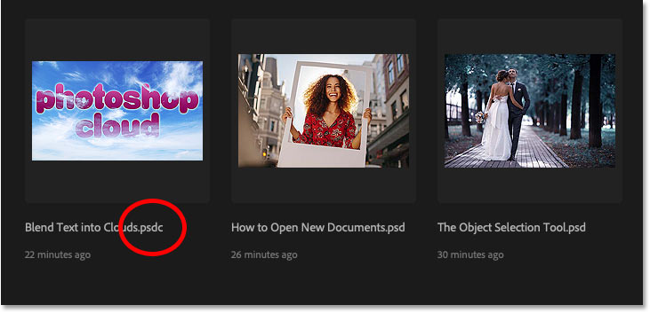
*Cloud documents use a ".psdc" file extension.*

### How to view all of your Photoshop cloud documents

With the Home Screen set to Recent, only cloud documents you've worked on recently will appear. To view all of your cloud documents, select **Cloud documents** in the menu along the left. Choose **Home** from the menu to switch back to viewing recent documents at any time:

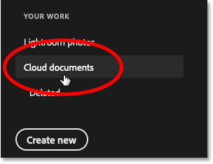
*Selecting "Cloud documents" from the Home Screen menu.*

And now instead of seeing just the one cloud document, I'm seeing both documents that I've saved to the cloud. The second document was saved from Adobe's new [Photoshop for iPad app](https://clk.tradedoubler.com/click?p(264303)a(2982769)g(22913540)url(https://www.adobe.com/products/photoshop/ipad.html)):

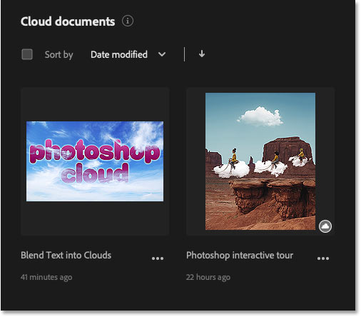
*The Home Screen now showing all cloud documents.*

## How to open a Photoshop cloud document

To open a cloud document from the Home Screen, just click on its thumbnail:

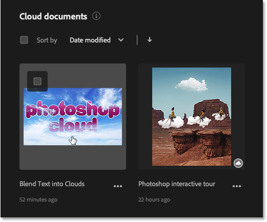
*Clicking the thumbnail to open the cloud document.*

### What does the cloud icon mean?

A small **cloud icon** in the lower right of a document's thumbnail means that the document was saved to the cloud from another computer or iPad and has not yet been opened on the one you're currently using.

Opening a cloud document for the first time takes a bit longer because the file needs to download over the internet from the cloud to your computer. But once downloaded, a cached version is saved locally so that the file will open much faster the next time:

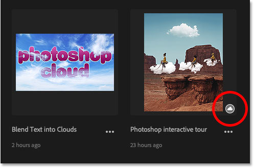
*The cloud icon means the document has not yet been downloaded.*

### Opening a cloud file using the Open command

Along with opening cloud files from the Home Screen, another way to open them is by going up to the **File** menu in Photoshop's Menu Bar and choosing **Open**:

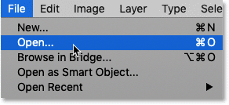
*Going to File > Open.*

By default, the Open dialog box lets you select files on your local computer. To open a cloud document, click the **Open cloud documents** button:

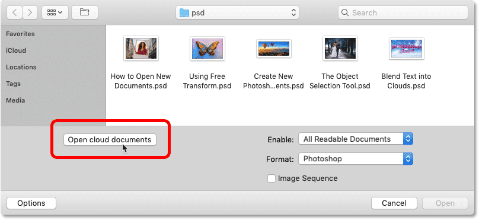
*Clicking the "Open cloud documents" button.*

And then click on a cloud document's thumbnail to open it into Photoshop. Or to switch back to your local files, click the **On your computer** button in the lower left:

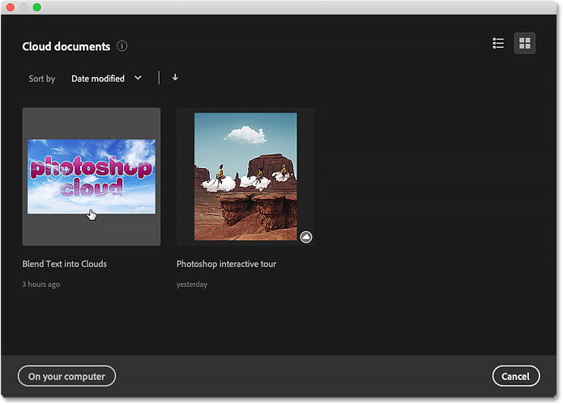
*Selecting a cloud document to open it.*

### Cloud documents save all of Photoshop's features

The cloud file opens in Photoshop complete with any [layers](/photoshop-layers-learning-guide/), [effects](/basics/using-layer-effects-and-layer-styles-in-photoshop-cc-2020-complete-guide/) or other features that can be saved with a standard Photoshop document. In other words, the only difference between a normal Photoshop document and a cloud document is that one is saved locally and the other is saved online. Other than that, the two file types are identical:

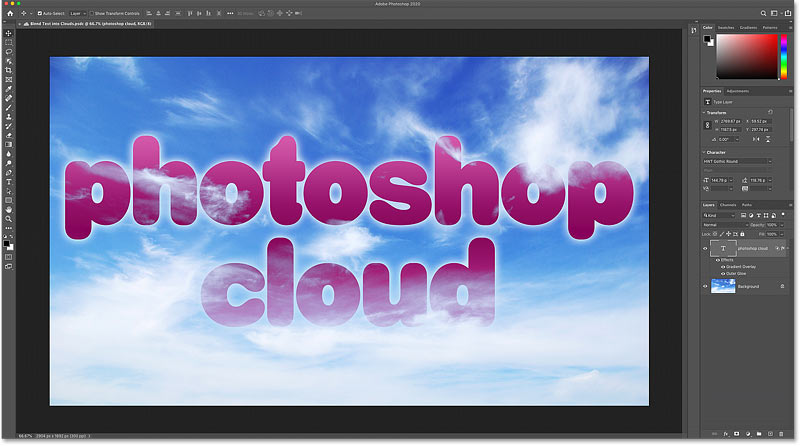
*The cloud file opens in Photoshop.*

You'll know you're working with a cloud file because a **cloud icon** appears in the [document's tab](/basics/tabbed-and-floating-documents-in-photoshop/), along with the **.psdc** file extension after the document's name:

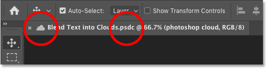
*The cloud icon and .psdc file extension in the document tab.*

## How to save and update a Photoshop cloud document

Now that we know how to open Photoshop cloud documents, let's learn how to update an existing cloud document, and how to save our work as a new cloud document.

### How to update a cloud document

I'll make a quick edit to my file by changing the word "photoshop" to "creative", and I'll scale the text larger using Photoshop's [Free Transform](/basics/transform-and-warp-images-with-free-transform-in-photoshop-cc-2019/) command. To learn how I created this text in clouds effect, check out my [Blend Text into Clouds](/photo-effects/how-to-blend-text-into-clouds-with-photoshop/) tutorial which you'll find along with my other [Photo Effects](/photo-effects/) lessons:

*Editing an existing cloud document.*

In the document tab, notice the **asterisk** to the right of the file's name and other information. The asterisk means that the file includes changes which have not yet been saved:

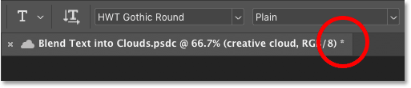
*The asterisk indicates unsaved changes.*

To update and save changes to an existing cloud document, go up to the **File** menu in the Menu Bar and choose **Save**. Or press the keyboard shortcut, **Ctrl+S** (Win) / **Command+S** (Mac):

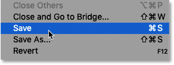
*Going to File > Save.*

If you then return to the Home Screen:

*Clicking the Home button.*

The document's thumbnail will show that your changes have been saved back to the cloud. Note that this only applies to PC and Mac users. If you're working with the Photoshop for iPad app, your changes are saved automatically when you return to the Home Screen:

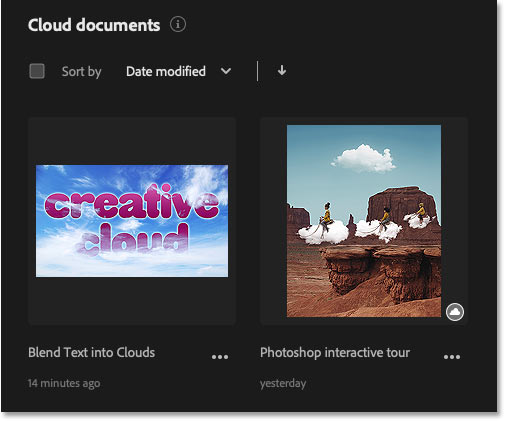
*The cloud file's changes have been saved.*

### How to save a new or existing file as a cloud document

So that's how you save changes to an existing Photoshop cloud document. But what if you've [created a new file](/basics/create-new-documents-photoshop-cc/) and want to save it to the cloud, or you want to save a standard document as a cloud document? Again, this applies only to PC and Mac users. The Photoshop for iPad app automatically saves your work as a cloud document.

I'll open another file, one that I created as part of my tutorial on using the new [Object Selection Tool](/basics/object-selection-tool/) in Photoshop CC 2020. This is a standard Photoshop document stored locally on my computer:

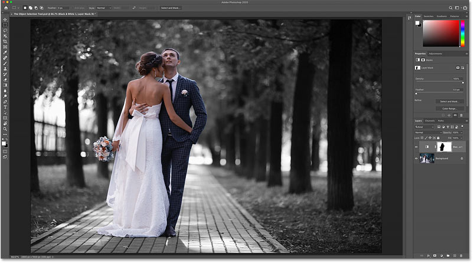
*Opening an existing Photoshop document.*

We know it's a standard Photoshop document because in the document's tab, no cloud icon appears. Also, the document has a file extension of **.psd**, while a cloud document would have a **.psdc** extension:

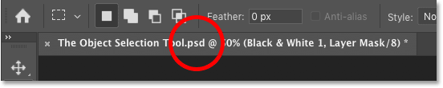
*The .psd extension means the file is a standard Photoshop document.*

To save the file as a cloud document, go up to the **File** menu and choose **Save As**:

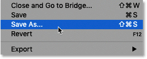
*Going to File > Save As.*

#### Saving to the cloud or to your computer

Photoshop will ask if you want to save to your computer or to the cloud. To save to the cloud, choose **Save to cloud documents**:

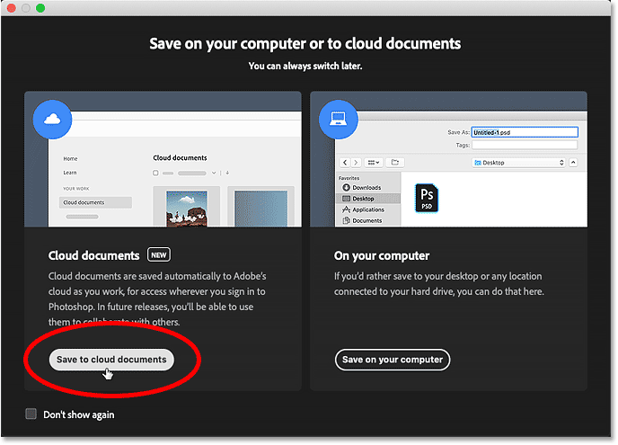
*Choosing the "Save to cloud documents" option.*

Then in the Save dialog box, give the cloud document a name (or keep the existing name) and click **Save**:

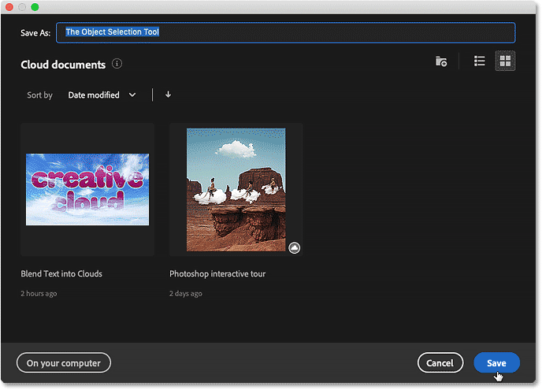
*Naming and saving the cloud document.*

Back in Photoshop, a **cloud icon** appears in the document's tab, and the file extension has been changed to **.psdc**, telling us that we're now working with a cloud document:

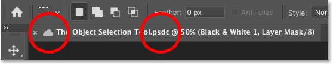
*The document tab after saving the file to the cloud.*

And if you switch back to the Home Screen:

*Clicking the Home button.*

The file appears as a cloud document, ready to be opened on any PC, Mac or iPad where you've logged in to your Adobe Creative Cloud account:

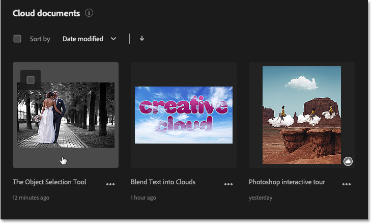
*The Home Screen showing the file as a new cloud document.*

## How to rename a Photoshop cloud document

To rename a cloud document from the Home Screen, make sure you've selected **Cloud documents** in the menu along the left. You can't rename a file while the Home Screen is set to Recent:

*Selecting "Cloud documents" from the menu.*

Then click on the **ellipsis** (the three dots) below the cloud document's thumbnail and choose **Rename**:

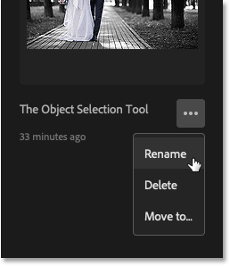
*Choosing "Rename" from the list.*

Enter the new name, and then press **Enter** (Win) / **Return** (Mac) on your keyboard to accept it:

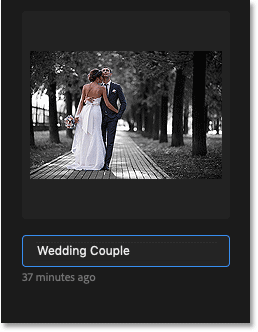
*Renaming the cloud document.*

## How to delete a Photoshop cloud document

And finally, to delete a document from the cloud, again make sure the Home Screen is set to **Cloud documents**. Then click on the **ellipsis** below the document and choose **Delete**:

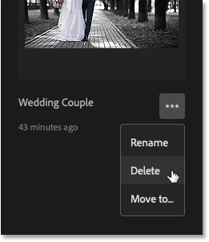
*Choosing "Delete" from the list.*

## How to restore a deleted cloud document

If you delete a cloud document by mistake, you can easily restore it. In the Home Screen menu, choose **Deleted** below the Cloud documents category:

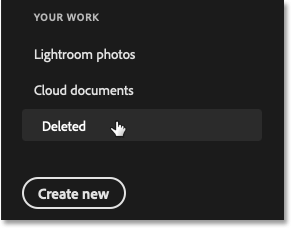
*Choosing the Deleted category on the Home Screen.*

All of your deleted cloud documents will appear. To restore a deleted document, click the **ellipse** below its thumbnail and choose **Restore**. Then switch back to the **Cloud documents** category and the document will reappear:

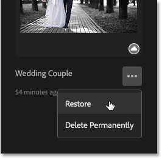
*Restoring the deleted cloud document.*

## How to permanently delete a cloud document

Or to permanently delete the file from the cloud, again make sure you've selected **Deleted** from the Home Screen menu. Then click the **ellipsis** below the document's thumbnail and choose **Delete Permanently**. Deleting files permanently can be useful if you're running out of storage space on the cloud and need to free up room:

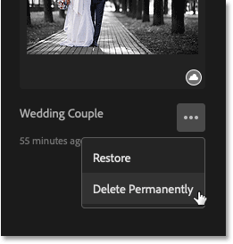
*Permanently deleting the file from the cloud.*

And there we have it! That's how to use cloud documents in Photoshop CC 2020! Check out our [Photoshop Basics](/basics/) section for more tutorials. And don't forget, all of our Photoshop tutorials are available to [download as PDFs](/print-ready-pdfs/)!