# Photoshop Brushes – Color Dynamics

> Source: [https://www.photoshopessentials.com/basics/photoshop-brushes/brush-dynamics/color-dynamics/](https://www.photoshopessentials.com/basics/photoshop-brushes/brush-dynamics/color-dynamics/)
> Downloaded and converted to Markdown.

Everything we've looked at so far as we make our way through Photoshop's various **[Brush Dynamics](/basics/photoshop-brushes/brush-dynamics/)** options has had one thing in common. They've all had something to do with the shape of the brush. We've seen how to dynamically change the brush size, angle and roundness with [**Shape Dynamics**](/basics/photoshop-brushes/brush-dynamics/shape-dynamics/), how to scatter multiple copies of the brush tip with **[Scattering](/basics/photoshop-brushes/brush-dynamics/scattering/)**, how to add a texture or pattern to the brush with the **[Texture](/basics/photoshop-brushes/brush-dynamics/texture/)** options, and how the **[Dual Brush](/basics/photoshop-brushes/brush-dynamics/dual-brush/)** options allow us to blend two different brushes together!

In this tutorial, we move away from the shape-related features and into the wild world of **color** as we learn how Photoshop's **Color Dynamics** allow us to control the hue, saturation and brightness of our brush as we paint, and even how to randomly swap between our Foreground and Background colors!

To access the Color Dynamics, click directly on the words **Color Dynamics** on the left side of the Brushes panel:

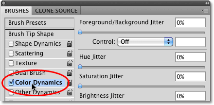
*Click directly on the words Color Dynamics to access the options.*

As soon as you click on the words, the options and controls for the Color Dynamics appear on the right side of the Brushes panel. At first glance, it looks like we have quite a bit of control here over the color of our brush, since we see options for **Hue**, **Saturation**, **Brightness**, and **Purity**, and even an option at the top that has something to do with our **Foreground and Background** colors:

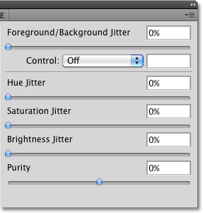
*Color Dynamics contains options for every aspect of the brush color, including hue, saturation and brightness.*

However, if you look closely, you'll notice that there's only one **Control** option in the entire Color Dynamics section, and it's tied to the Foreground/Background option at the top:

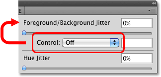
*Only the Foreground/Background option at the top has a Control option associated with it.*

None of other headings (Hue, Saturation, Brightness, and Purity) have a Control option associated with them, which means we can't control these other options ourselves with pen pressure, pen tilt, or even the Fade command. Instead, Hue, Saturation and Brightness each have the word **Jitter** to the right of their name:

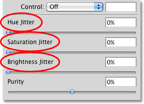
*The Hue Jitter, Saturation Jitter and Brightness Jitter controls.*

Jitter, as we know by now, means **randomness** in Photoshop, which means we can use these options to let Photoshop randomly change these three aspects of our brush's color as we paint! Let's look at each of the Color Dynamics options more closely.

### Foreground/Background

Normally, Photoshop uses our current Foreground color as the color for our brush, so if we wanted to paint with red, yellow, blue, or whatever the case may be, we'd set our Foreground color to the color we wanted before we started painting. But why settle for painting with just one color when we can paint with two! The **Foreground/Background** option at the top of the Color Dynamics section allows us to switch between our current Foreground and Background colors as we paint!

You can see what your Foreground and Background colors are currently set to by looking at their **color swatches** near the bottom of the Tools palette. The square in the upper left is the Foreground color swatch. The lower right square is the Background color swatch. By default, these are set to black (Foreground color) and white (Background color):

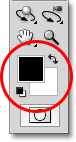
*The Foreground (upper left square) and Background (lower right square) color swatches.*

To change either color, simply click on its color swatch and choose a new color from Photoshop's **Color Picker**. I'm going to paint with the Scattered Maple Leaves brush tip, so I'll choose a couple of more traditional colors for leaves. First, I'll set my Foreground color to orange (for a nice Fall color) by clicking on the Foreground color swatch:

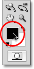
*Clicking once on the Foreground color swatch.*

This opens the Color Picker. I'll choose my color, then click OK to exit out of it:

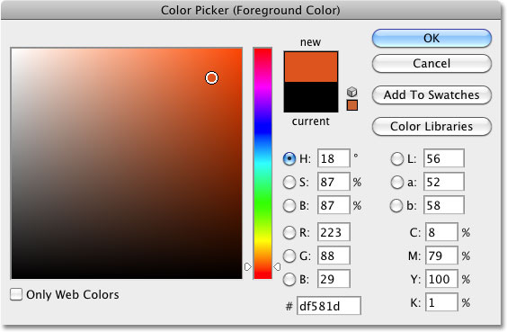
*Choosing orange for my Foreground color.*

I'll do the same thing for the Background color. First, I'll click on its color swatch in the Tools palette:

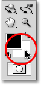
*Clicking once on the Background color swatch.*

When the Color Picker appears, I'll select a medium green, then click OK to once again exit out of it:

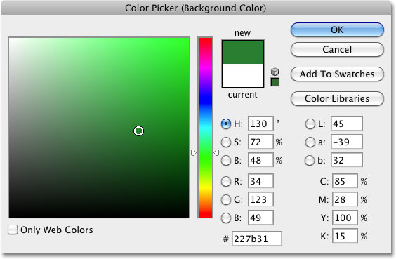
*Choosing a medium green for the Background color.*

If I look again at my Foreground and Background color swatches in the Tools palette, I see that the colors have now changed:

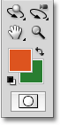
*The color swatches now show the newly chosen colors.*

By default, Photoshop will paint using only the Foreground color. Here's a simple brush stroke (with the brush tip set to Scattered Maple Leaves) with none of the Color Dynamics options selected. I've added some Angle jitter from the **[Shape Dynamics](/basics/photoshop-brushes/brush-dynamics/shape-dynamics/)** section for some variety:

*Since my Foreground color is set to orange, Photoshop paints with orange.*

**Control Options**

So far, we get exactly what we expected. Photoshop paints with the Foreground color. Watch what happens, though, when I set the **Control** option to **Pen Pressure**:

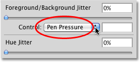
*Setting the Foreground/Background control to Pen Pressure.*

This time, Photoshop blends both the Foreground and Background colors into the brush stroke based on the amount of pressure I apply to the tablet with my pen. With a minimum amount of pressure, Photoshop uses the Background color (green). As more and more pressure is applied towards the center of the stroke, more of the Foreground color (orange) is mixed in, until finally, at maximum pen pressure, we see the pure Foreground color. As I reduce the pen pressure towards the end of the stroke, Photoshop gradually switches back to the Background color:

*Photoshop now blends the Foreground and Background colors into the brush stroke based on pen pressure.*

If you don't have a pen tablet, you can try the **Fade** command which works the same here as it does in the previous Brush Dynamics sections we've looked at. Once you've selected Fade from the Control drop-down list, enter the number of steps you want Photoshop to use to fade between the Foreground and Background colors. Here I've set mine to 10 steps:

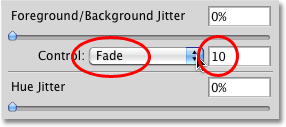
*Enter how many steps you want it to take to fade between the Foreground and Background colors.*

If I paint a new brush stroke, we see that the color of the leaves now fades between orange (the Foreground color) and green (the Background color) over 10 "stamps" of the brush tip. After 10 steps, the stroke continues on using the Background color:

*The color of the leaves fades from orange (Foreground color) to green (Background color) in 10 steps.*

**Jitter**

We can also let Photoshop randomly switch between the Foreground and Background colors as we paint using the **Jitter** slider. Dragging the Jitter slider towards the right increases the maximum percentage of the Background color that Photoshop can mix in. For example, here, I'm setting the Foreground/Background jitter to 25%:

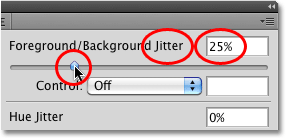
*Increasing the Foreground/Background Jitter option to 25%.*

This allows Photoshop to randomly blend up to 25% of the Background color in with the Foreground color, creating a subtle tinting effect with the leaves:

*Only 25% of the Background color is allowed to be randomly mixed in with the Foreground color.*

Here's another brush stroke, this time with the Foreground/Background jitter set to 50%, which means Photoshop can now mix up to 50% of the Background color in with the Foreground color. We're starting to see a stronger greenish tint in some of the leaves:

*Up to 50% of the Background color is now being mixed in with the Foreground color.*

At a jitter value of 75%, we're seeing much more green appearing:

*A jitter value of 75% means up to 75% of the Background color will be mixed in with the Foreground color.*

Finally, if we crank the jitter value all the way up to 100%, Photoshop is given complete control over how much of the Foreground and Background color is mixed in for each new brush tip:

*With jitter set to 100%, the Foreground color, Background color or any tint between the two can be used.*

Up next, we'll look at the Hue, Saturation, Brightness, and Purity controls!

### Hue Jitter

The Hue Jitter, Saturation Jitter and Brightness Jitter options in the Color Dynamics section of the Brushes panel all work in a similar way as the Foreground/Background Jitter option we just looked at. Each one will randomly control a certain aspect of our brush's color as we paint. The "hue" is what most people think of as the actual color itself, and by dragging the **Hue Jitter** slider towards the right, we let Photoshop randomly change the color of our brush. The further we drag the slider, the more variety we see in the colors.

By default, Hue Jitter is set to 0%, which means "off". At this setting, Photoshop will simply paint with the current Foreground color, which in my case is orange (I've turned off the Foreground/Background jitter and controls). I'll add just a hint of randomness to my brush color by increasing my Hue Jitter value to 10% with the slider:

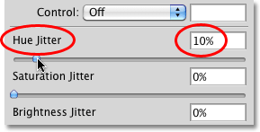
*Dragging the slider towards the right to set the Hue Jitter value to 10%.*

A Hue Jitter value of 10% means that Photoshop can only choose colors that are within 10% of the current Foreground color on the color wheel. If I paint a brush stroke, we see that all of the random colors are very similar to the original orange color:

*The color of the leaves may be random, but with a Hue Jitter value of only 10%, Photoshop can only choose colors that are similar to the original.*

If I increase my Hue Jitter value to 25%, Photoshop can now choose any color within 25% of the current Foreground color on the color wheel. We start to see a bit more variety, but the colors are still fairly similar:

*At 25%, we see a slightly bigger difference in the colors.*

At 50%, the colors of the leaves really start to become random as Photoshop is given a wide range of colors to choose from:

*Setting Hue Jitter to 50% lets Photoshop choose any color within 50% of the current Foreground color on the color wheel.*

If we increase Hue Jitter all the way to 100%, we get truly random colors as Photoshop can now choose any hue it likes:

*There may not be many blue maple leaves in nature, but with Hue Jitter set to 100%, any color is possible.*

### Saturation Jitter

The **Saturation Jitter** control works the same way, but it randomly changes the saturation of the brush color as we paint. The default value is 0%, but by dragging the slider towards the right, we let Photoshop randomly adjust how saturated the color appears. The further we drag the slider, the more variety we'll see in the saturation.

I'll start by setting my Saturation Jitter value to 25%:

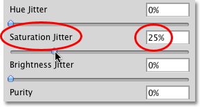
*Dragging the slider towards the right to set the Saturation Jitter value to 25%.*

A Saturation Jitter value of 25% means that Photoshop can randomly change the color saturation as we paint but only within 25% of the Foreground color's original saturation value. Here, we see the difference is quite subtle:

*The Saturation Jitter value sets the limit for how different the saturation values can be from the original color.*

If I increase my Saturation Jitter value to 50%, Photoshop can now choose any saturation value within 50% of the original. In my case, we're now seeing some leaves that are getting closer to gray:

*Your results will depend on your Foreground color's original saturation level.*

At a Saturation Jitter value to 100%, Photoshop can choose any saturation value, from fully saturated to completely desaturated, each time it "stamps" a new copy of the brush tip:

*Let Photoshop randomly choose any saturation level it likes by setting the Saturation Jitter value to 100%.*

### Brightness Jitter

The **Brightness Jitter** option lets Photoshop randomly choose the brightness of our brush's color as we paint, and it works the same way as the Hue Jitter and Saturation Jitter options. Dragging the slider towards the right will add randomness to the brightness, and the further we drag the slider, the more variety we see. I'll increase my Brightness Jitter value to 25%:

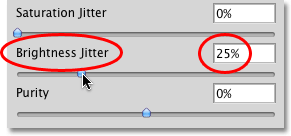
*Dragging the slider towards the right to set the Brightness Jitter value to 25%.*

At 25%, we see only minor differences in the brightness values since Photoshop is limited to choosing values within 25% of the Foreground color's original brightness level:

*The Brightness Jitter value sets the limit for how different the brightness values can be from the original color.*

If I increase Brightness Jitter to 50%, we see more varied brightness levels, with some leaves now much darker than others:

*Photoshop can now choose any brightness level within 50% of the original.*

Finally, with Brightness Jitter set to 100%, Photoshop can choose any brightness level with each new stamp of the brush tip:

*Setting the Brightness Jitter value to 100% gives Photoshop complete freedom to choose any brightness value.*

### Purity

The **Purity** option below the Hue, Saturation and Brightness Jitter options controls the overall saturation of the brush color. Unlike the Saturation Jitter option we looked at earlier which lets Photoshop randomly change the saturation as we paint, there's nothing random about the Purity option. We can use Purity to increase or decrease the brush color's saturation by dragging the slider left or right, and it will remain unchanged until we adjust the slider again. If you're painting with both the Foreground and Background colors using the Foreground/Background option at the top of the Color Dynamics section, Purity will affect both colors.

By default, Purity is set to 0%, which means it has no effect on the saturation:

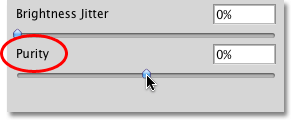
*Purity controls the overall saturation of the brush color, and is completely separate from the Saturation Jitter option.*

To decrease color saturation, simply drag the Purity slider towards the left. The further to the left you drag the slider, the lower the saturation level becomes. I'll lower mine down to a value of -50%:

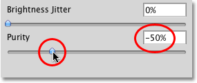
*Drag the slider towards the left to decrease the brush color's saturation.*

If I paint a stroke, we see that the brush's color saturation has been greatly reduced. I've set my Foreground/Background Jitter value to 100% so we get a nice mixture of both colors. Notice that there are no random changes to the saturation this time. The adjustment we made with the Purity option is consistent throughout the entire stroke and affects both the Foreground and Background colors:

*Lowering the saturation with Purity gives the leaves a more muted tone.*

To increase the brush's color saturation, drag the Purity slider towards the right. I'll increase mine to +50%:

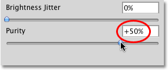
*Drag the slider towards the right to increase the brush color's saturation.*

In my case though, increasing the Purity value doesn't give me results that are much different from my original Foreground and Background colors, and that's because my original colors were already quite saturated. If I had chosen colors with low saturation levels to begin with, I'd see much more of a difference:

*Colors that were already highly saturated will not benefit much from increasing the Purity value.*