# The Color Range Command – Photoshop Selections

> Source: [https://www.photoshopessentials.com/basics/selections/color-range/](https://www.photoshopessentials.com/basics/selections/color-range/)
> Downloaded and converted to Markdown.

In this tutorial in our series on [Photoshop Selections](/photoshop-selection-tools-learning-guide/ "Photoshop Selection Tools Learning Guide"), we'll learn all about the **Color Range** command and why it's such a great tool for selecting areas in an image based on **tone or color**.

The Color Range command is similar to the [Magic Wand Tool](/basics/selections/magic-wand-tool/) in that both are used to select areas based on tonal and color values, but that's really where the similarities end. The Magic Wand was first introduced way back in the very first version of Photoshop, and while it can still prove useful at times, it didn't take long for the folks at Adobe to realize they could have done better.

In Photoshop 3, they introduced the Color Range command as a replacement of sorts for the Magic Wand. Yet for all its advanced features and flexibility, not to mention its vastly improved results, the Color Range command became nothing more than one of Photoshop's best kept secrets while the Magic Wand remained the tool of choice for most users.

In this tutorial, we'll learn why the Color Range command, not the Magic Wand, is the tool you should be using when making tone and color-based selections.

*This tutorial is from our [How to make selections in Photoshop](/basics/make-selections-photoshop/ "Learn how to use the Photoshop selection tools") series.*

### Where To Find The Color Range Command

The first difference between Color Range and the Magic Wand is that Color Range isn't actually a selection tool at all, which is why you won't find it mixed in with the Magic Wand and the other tools in the Tools panel. Color Range is a selection **command**, and we access it from the same place we access other commands - the Menu Bar along the top of the screen. Go up to the **Select** menu in the Menu Bar and choose **Color Range**:

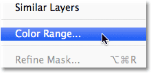

*Go to Select > Color Range.*

This opens the Color Range dialog box. If you've been using the Magic Wand for a while and are just now seeing Color Range for the first time, you may be thinking "Geez, no *wonder* most people still use the Magic Wand! What the heck am I looking at here?". At first glance, the Color Range command can seem a little intimidating. After all, with the Magic Wand, all we do is select the tool from the Tools panel and click on the image. But don't let first impressions fool you. Color Range is very easy to use once you know how it works (which, of course, you will after reading this tutorial!):

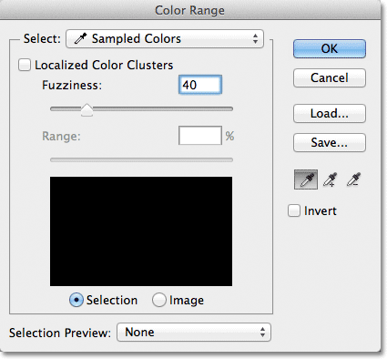

*The Color Range dialog box.*

### The Select Option

Let's take a quick run through of some of the things we're seeing in the Color Range dialog box. We'll look at the most important options for now and save the others for a bit later. At the very top of the dialog box is the **Select** option. By default, it's set to **Sampled Colors**:

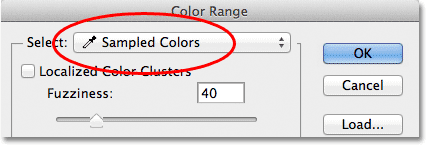

*The Select option set to Sampled Colors.*

The Select option controls what it is we'll be selecting in the image. With the option set to Sampled Colors, the Color Range command behaves much like the Magic Wand. We can select pixels that share the same or similar color just by clicking on an area of that color in the image. Photoshop "samples" the color we clicked on and selects all of the pixels that are the same as, or within a certain range of, that color (hence the name "Color Range").

In most cases, you'll want to leave the Select option set to Sampled Colors, but unlike the Magic Wand, the Color Range command gives us additional ways that we can select pixels. If you click on the words "Sampled Colors", you'll pop open a list of the different selection options we can choose from. For example, we can instantly select all the pixels of a specific color (reds, yellows, blues, etc.) simply by choosing that color from the list. Or, we can quickly select the brightest pixels in the image by choosing Highlights, or the darkest pixels by choosing Shadows. These additional options can come in handy in certain situations, but as I mentioned, for the most part you'll want to leave the option set to Sampled Colors, which is what we'll be focusing on in this tutorial:

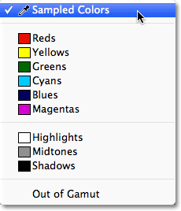

*Color Range gives us more ways to select pixels than what we get with the Magic Wand.*

### The Eyedropper Tools

When using the Magic Wand to select areas of similar color in an image, we click on the image with the Magic Wand itself. With Color Range, we click on the image with an eyedropper tool. In fact, Color Range gives us three eyedropper tools - one to make the initial selection, one to add to the selection, and one to subtract from the selection - and they're found on the right side of the dialog box.

From left to right, we have the main **Eyedropper Tool**, used for making our initial color selection (simply click on the image with the Eyedropper Tool to select the color you need), the **Add to Sample Tool** for adding additional colors to the selection, and the **Subtract from Sample Tool** to remove colors from the selection. We can switch between the tools by clicking on their icons, but there's actually no need to do that. The main Eyedropper Tool is selected for us by default, and we can temporarily switch to the other tools directly from the keyboard. To switch to the Add to Sample Tool, just hold down your **Shift** key, then click on the image to add new areas to the selection. To access the Subtract from Sample Tool from the keyboard, hold down your **Alt** (Win) / **Option** (Mac) key, then click on the image to remove an area from the selection. In other words, now that you know these three icons are here, you can safely forget all about them:

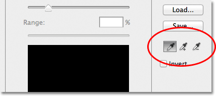

*The Eyedropper (left), Add to Sample (middle) and Subtract from Sample (right) tools.*

### The Selection Preview Window

In the bottom half of the dialog box is the selection **preview window** where we can see a live preview of which area(s) of the image we've selected after clicking with the eyedroppers. The preview window displays our selection as a grayscale image. If you're familiar with how [layer masks](/basics/layers/layer-masks/) work, the preview window works exactly the same way. Areas in the image that are fully selected will appear white in the preview window, while areas that are not selected will appear black. In my case here, nothing is selected at the moment so my preview window is currently filled with solid black. As we'll see, the Color Range command is also capable of partially selecting pixels, which is why it gives us better, more natural results than the Magic Wand. Partially selected areas appear as shades of gray in the preview window. Again, we'll see how this works in a moment:

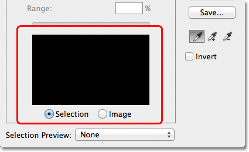

*The selection preview window.*

### Fuzziness

Once we've clicked on a color in the image, Photoshop goes ahead and selects all of the pixels in the image that are the same color, as well as the pixels that are similar to that color, either lighter or darker. But exactly how much lighter or darker can other pixels be for them to be included in the selection? We need a way to tell Photoshop what the acceptable range is so that all of the pixels that fall within this range will be included in the selection, while the pixels that fall outside this range, either because they're too much lighter or too much darker than the color we clicked on, will not be selected.

Both the Magic Wand and the Color Range command give us ways to tell Photoshop what the acceptable range should be. With the Magic Wand, we use the **Tolerance** option in the Options Bar. The higher we set the Tolerance value, the wider the acceptable range becomes. For example, if we leave the Tolerance value set to its default of 32 and then click on a color in the image, Photoshop will select all of the pixels that are the same color as the pixel we clicked on, plus all of the pixels that are within 32 brightness levels lighter and 32 brightness levels darker. Increasing the Tolerance value to 100 means we'll select every pixels that's within 100 brightness levels lighter or darker than the color we clicked on, while setting the Tolerance value to 0 means we'll select only the pixels that are the exact same color, nothing more:

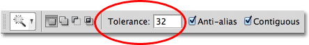

*With the Magic Wand selected, the Tolerance option in the Options Bar sets the acceptable color range.*

The Color Range dialog box gives us a similar way to set the acceptable range, except here it's not called Tolerance, it's called **Fuzziness**, and it has a major advantage over the Magic Wand's Tolerance option. We use the Fuzziness value the same way we use Tolerance. The higher we set the Fuzziness value, the more brightness levels we include in the acceptable range. A Fuzziness value of 40, for example, will select all pixels that are the exact same color as the pixel we clicked on, plus all pixels that are within 40 brightness values lighter or darker. Any pixels that are 41 or more brightness levels lighter or darker will be excluded from the selection.

The Tolerance option, though, is very much a "hit or miss" type of thing. If we click on the image with the Magic Wand and realize we didn't get the selection we needed because we used the wrong Tolerance value, all we can do is enter a different value, then click on the image and try again. This "trial and error" approach to selecting pixels can get frustrating very quickly. This is where the Color Range command really shines over the Magic Wand. Unlike the Tolerance value which forces us to guess at the correct value *before* we click on the image, the Fuzziness value can easily be adjusted *after* we've clicked! All we need to do is click once on the image to make the initial selection, and then we can adjust the selection simply by dragging the Fuzziness slider left or right to increase or decrease the range. A live preview of our selection will appear in the preview window as we drag the slider so there's no guesswork needed at all. We'll see an example of how Fuzziness works in a moment:

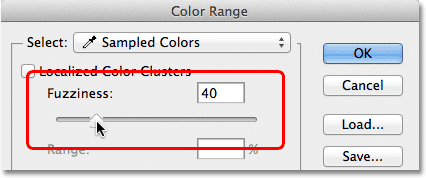

*The Fuzziness option is the Color Range version of the Magic Wand's Tolerance option.*

Now that we've covered the basics of the Color Range dialog box, let's see it in action. Here's a document I have open in Photoshop made up of a simple dark-to-light blue gradient, with a yellow bar running through the middle:

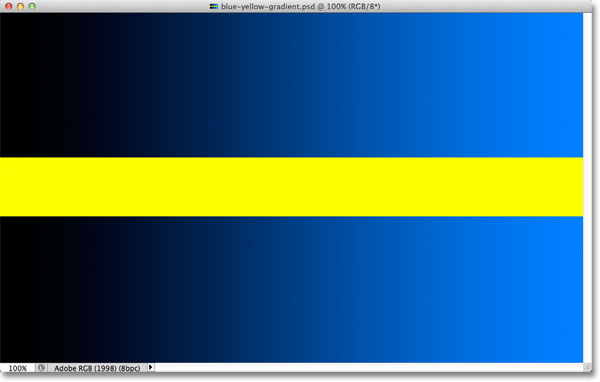

*A blue gradient divided horizontal by a yellow bar, but you knew that already.*

Let's say I want to select part of the blue gradient using the Color Range command. First, I'll go up to the **Select** menu at the top of the screen and choose **Color Range**. Then, when the Color Range dialog box appears, I'll make sure my main **Eyedropper Tool** is selected (which, as we learned, should already be selected by default):

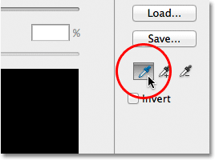

*Making sure the main Eyedropper Tool is active.*

With the main Eyedropper Tool active, I'll click somewhere in the middle of the gradient to sample a shade of blue:

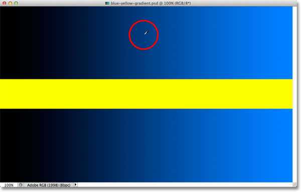

*Clicking in the middle of the gradient with the Eyedropper Tool.*

If we look at the selection preview window in the dialog box, we see that I've now selected part of the image based on the shade of blue I clicked on. The white area represents the pixels that are selected, while the black areas are not part of the selection:

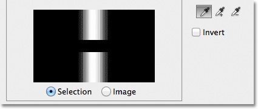

*My initial selection in the preview window.*

If I click on a different part of the gradient, I'll get a different result. I'll click on a darker shade of blue this time:

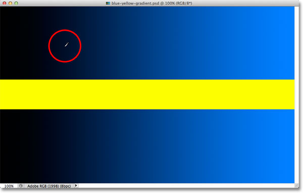

*Clicking with the Eyedropper Tool on a darker shade of blue.*

The preview window now shows me that I've selected a different part of the image:

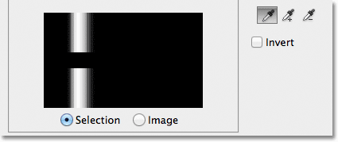

*Clicking on a darker shade of blue resulted in a different selection.*

And if I click on a lighter shade of blue in the gradient:

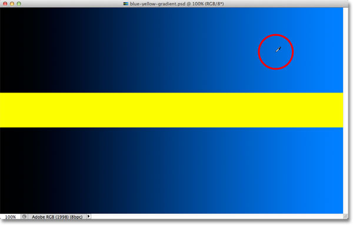

*Clicking on a lighter shade of blue.*

The preview window updates to show me that I've now selected a lighter part of the image:

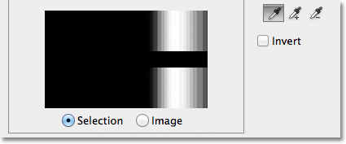

*Lighter shades of blue are now selected. Darker shades are not selected.*

Notice that no matter where I clicked on the blue gradient, Photoshop completely ignored the yellow bar in the middle. If I click on the yellow bar:

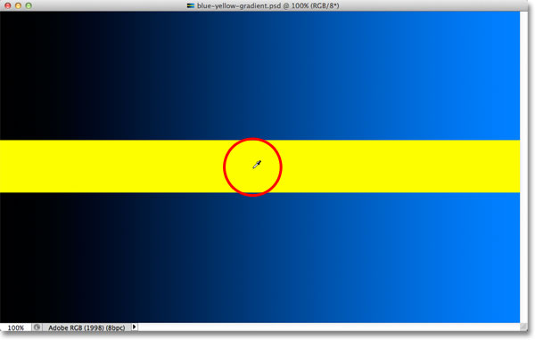

*Clicking on the yellow bar.*

The preview now shows me that the yellow bar is selected, while the blue gradient above and below it is being ignored:

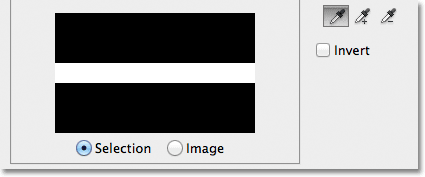

*The yellow bar is now selected. The blue gradient is not.*

I'm going to click again in the middle of the blue gradient so we can take a closer look at the Fuzziness option and how it lets us adjust our selection on the fly:

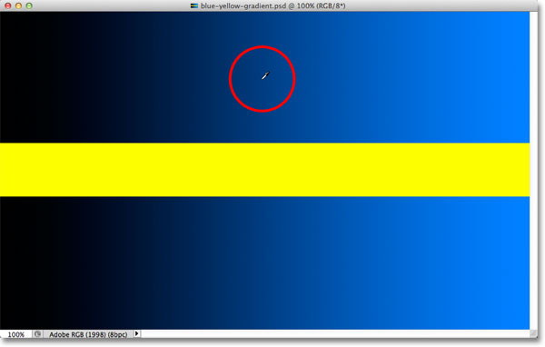

*Clicking again in the middle of the gradient.*

We see in the preview window that I've once again selected an area in the middle:

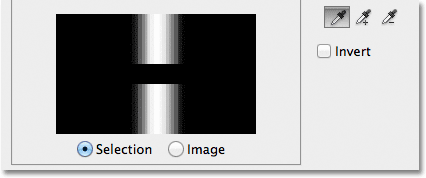

*Back to the original selection.*

When I clicked on the middle of the gradient, my Fuzziness value was set to 40, which means Photoshop selected the exact shade of blue I clicked on, plus 40 shades lighter or darker. But what if my Fuzziness value wasn't high enough and I needed to select a greater range of colors? Not a problem! All I need to do is drag the Fuzziness slider towards the right to increase the range. As I drag the slider, the preview window updates to show me my new selection. I'll increase my Fuzziness value to 100, which means I'm now selecting all pixels that are within 100 brightness levels lighter or darker than the shade of blue I initially clicked on. I can see in the preview window that I've now selected a much larger section of the gradient. Likewise, I could have dragged the slider towards the left to lower the Fuzziness value, in which case less of the gradient would be selected:

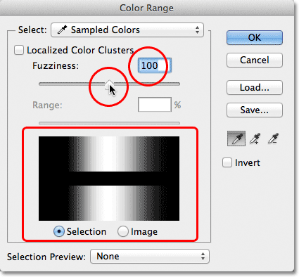

*Increasing the Fuzziness value with the slider increases the selected area in the preview window.*

Notice that the display in the preview window isn't limited to just pure white and pure black. Instead, it transitions smoothly and gradually from white to gray to black. That's because the Color Range command is capable of **partially selecting pixels**. Any pixels that are not the exact color we clicked on but still fall within the acceptable brightness range (set by the Fuzziness value) will be partially selected. These are the gray areas in the preview window. The closer an area is to the color we clicked on, the more selected it will be, represented by lighter shades of gray. Darker shades of gray represent areas that are further away from the color we clicked on and are less selected. This ability to "partially select" pixels can sound a little strange, but it's why the Color Range command gives us much smoother, more natural selections than what we could ever get from the Magic Wand.

### Adding To The Selection

Besides changing the Fuzziness value, we can also use the **Add to Sample** Tool to add areas to our initial selection. As we've already learned, though, there's no need to waste time selecting the eyedropper tools from the dialog box. All we need to do to temporarily switch from the main Eyedropper Tool to the Add to Sample Tool is to press and hold the **Shift** key. With the Shift key held down, a small **plus sign** ( **+** ) will appear in the bottom right corner of the eyedropper cursor, letting you know that you've switched tools. Releasing the Shift key will switch you back to the main Eyedropper Tool (the plus sign will disappear).

I'm going to set my Fuzziness value back to 40, just to make things easier to see:

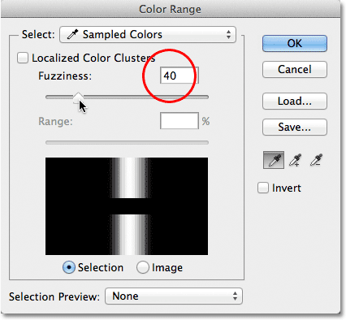

*Setting Fuzziness back to 40.*

To add more of the gradient to my initial selection, I'll hold down my Shift key, which switches me to the Add to Sample Tool, and I'll simply click on the area I want to add. I'll choose a brighter shade of blue:

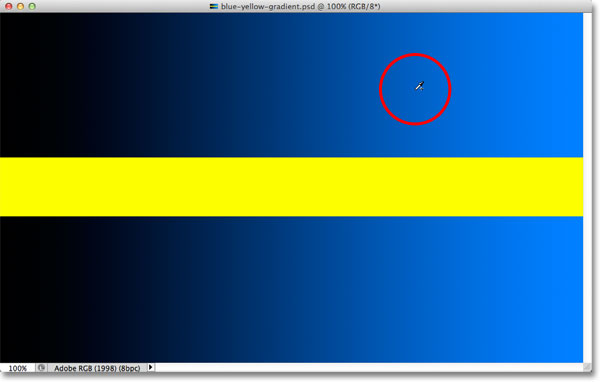

*Clicking on the image with the Add to Sample Tool (holding down the Shift key).*

If we look at the preview window, we see that lighter shades of blue have been added to my selection:

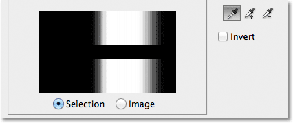

*More of the gradient has been selected.*

You can also **drag** across an area of the image with the Add to Sample Tool to add an entire range of colors or brightness values to the selection at once. Again, I'll hold down my Shift key to access the Add to Sample Tool, then I'll click and drag across a large area of the gradient:

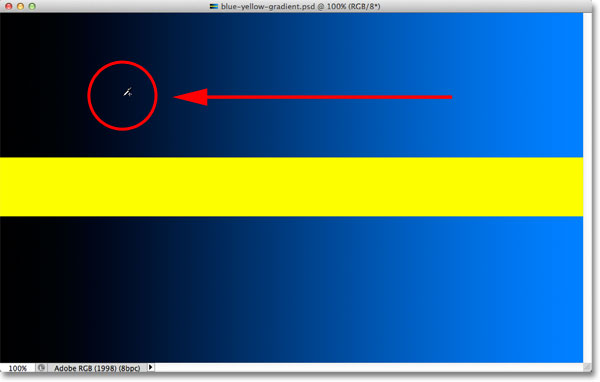

*Dragging with the Add to Sample Tool.*

And now we see in the preview window that I've added even more of the gradient to my selection:

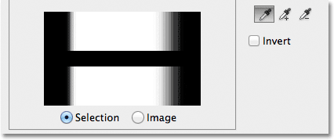

*The result after dragging with the Add to Sample Tool.*

### Subtracting From The Selection

We can also subtract areas from the selection using the **Subtract from Sample Tool**. Again, there's no need to grab it from the dialog box. Simply hold down your **Alt** (Win) / **Option** (Mac) key on your keyboard to temporarily switch to the Subtract from Sample Tool. A small **minus sign** ( **-** ) will appear in the bottom right corner of your eyedropper icon. Click on the area you want to remove from the selection, then release the Alt (Win) / Option (Mac) key to switch back to the main Eyedropper Tool when you're done.

I'll click on a darker area of the gradient with the Subtract from Sample Tool:

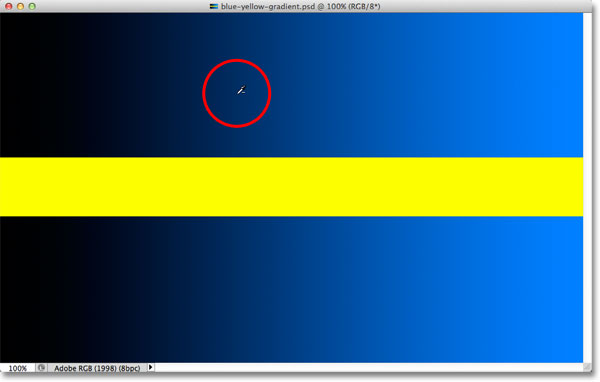

*Clicking with the Subtract from Sample Tool.*

The preview window now shows that I've removed those darker shades of blue from the selection:

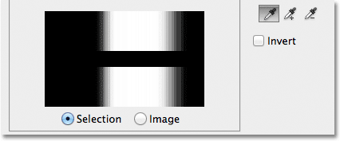

*The result after clicking with the Subtract from Sample Tool.*

One problem, though, with the Subtract from Sample Tool is that it doesn't work as well as the Add to Sample Tool, and it's not always easy to predict what results you'll get from it. If you make a mistake with the Add to Sample Tool and add the wrong area to your selection, it's often easier just to undo your last step and try again. The Color Range command gives us a single Undo level, so if you make a mistake with the Add to Sample Tool, press **Ctrl+Z** (Win) / **Command+Z** (Mac) on your keyboard to undo it, then try again.

When you're happy with your selection preview, click OK in the top right corner of the Color Range dialog box to close out of it:

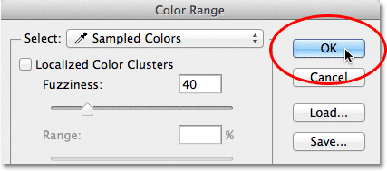

*Clicking OK to close out of the dialog box.*

Photoshop then displays your selection in the document as a standard "marching ants" selection outline. Keep in mind, though, that in most cases, the Color Range command will have partially selected certain pixels, and that Photoshop can only display the selection outline around pixels that are at least 50% selected. Any pixels that are less than 50% selected will fall outside the selection outline, which means that the outline may not be a completely accurate representation of your selection. This isn't a huge problem, just something to remember:

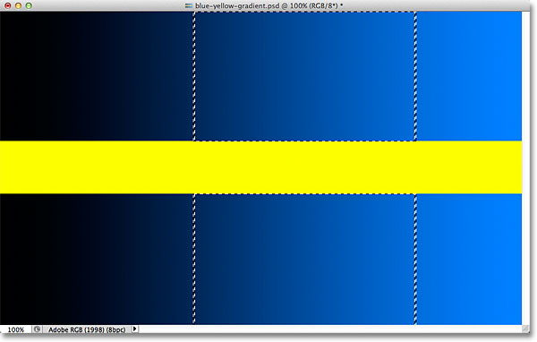

*The standard "marching ants" outline is now displayed around the selected part of the gradient.*

Let's take a quick look at a real world example, which will also give us a chance to look at the remaining options in the Color Range dialog box. In this image, I'd like to select just the red roses in the bouquet so I can leave them in color while converting the rest of the image to black and white:

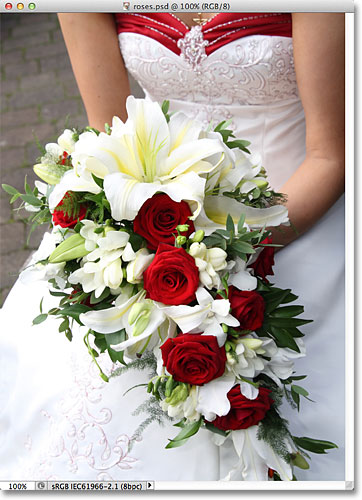

*The roses need to be selected.*

With the Color Range dialog box open and my main Eyedropper Tool active, I'll click once inside one of the roses to make my initial color selection:

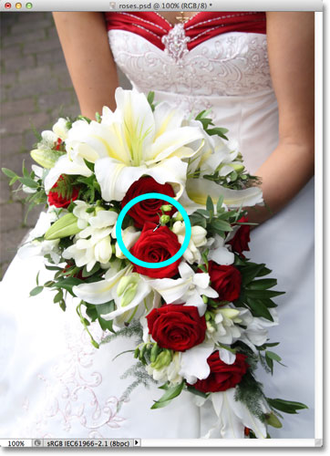

*Clicking once to select an initial shade of red.*

We can see my initial selection in the preview window:

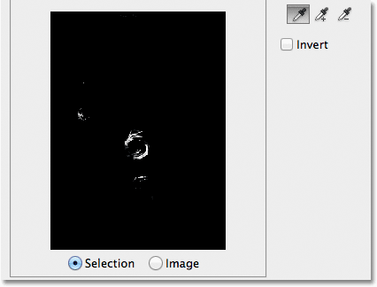

*The initial selection appears in the preview window.*

To add more areas to my selection, I'll press and hold my **Shift** key, which temporary switches me to the Add to Sample Tool, and I'll click on more shades of red in the roses. I can also drag across an area, just as we saw with the gradient, to add multiple shades of red to my selection at once:

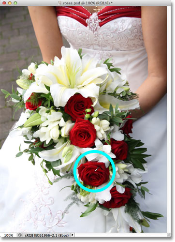

*Holding Shift and clicking to select more shades of red.*

The preview window shows the areas that have been added to the selection:

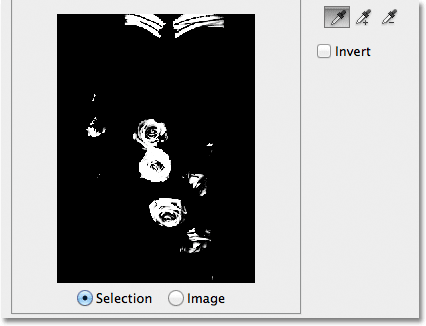

*The newly added sections appear in the preview.*

### The Preview Options

One option we have with the preview window that we haven't looked at yet is the ability to view the actual image itself inside the preview window, rather than seeing a grayscale preview of the selection. If you look directly below the preview window, you'll see two options - **Selection** and **Image**. To switch to the image view, select the **Image** option. You can even click on the image inside the preview window, rather than in the the document window, to make and edit your selections. You may not find this option particularly useful, but it's there if you need it. To switch back to viewing the grayscale preview, choose the **Selection** option (which is selected by default):

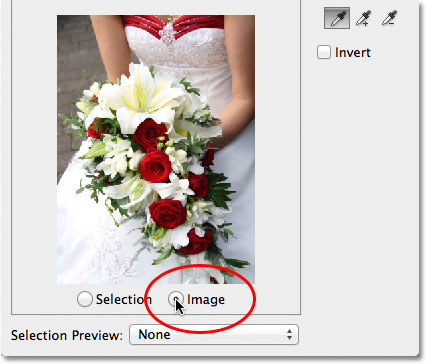

*Choose "Image" to view your image in the preview window. Choose "Selection" to view the grayscale preview.*

A much more useful preview option is found at the very bottom of the Color Range dialog box. The **Selection Preview** option controls what we see in our document window. By default, it's set to **None**, which means we're seeing our actual image in the document window:

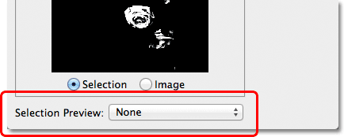

*The Selection Preview option.*

If you click on the word None, you'll open a list of additional choices - **Grayscale**, **Black Matte**, **White Matte**, and **Quick Mask** - each of which gives us a different way to preview our current selection inside the document window. I'll choose the first one, Grayscale:

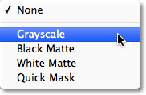

*Choosing Grayscale from the Selection Preview option.*

And now if we look in my document window, rather than seeing the image, we're seeing a full size grayscale preview of my current selection. It's the same preview that was displayed in the preview window, but it's much more useful when viewed at full size:

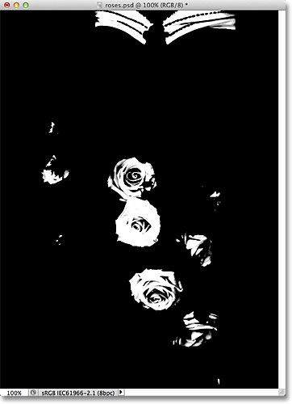

*A full size version of the grayscale selection preview now appears in the document window.*

Another very helpful way to preview your selection is by choosing **Black Matte** from the Selection Preview option:

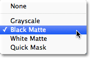

*Choosing Black Matte from the Selection Preview option.*

This is my favorite way to preview my selection because it displays the actual image itself, or at least, the areas of the image that are currently inside my selection, against a solid black background:

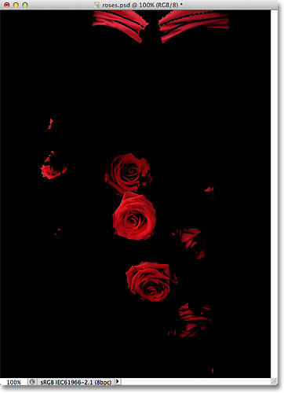

*The selected areas of the image are now displayed against a black background in the document window.*

You can also choose **White Matte**, which will display the selected area(s) of the image against a solid white background, or **Quick Mask** to view the selection with the Quick Mask red overlay. All four options can be useful ways to preview your selection in the document window. To switch back to viewing the image, set the Selection Preview option back to None.

### Localized Color Clusters (Photoshop CS4 and Higher)

Notice, though, that I'm running into a bit of a problem. I want to select only the red roses in the photo so I can keep them in color while converting the rest of the image to black and white, but if you look at the very top of the document in the previous screenshot, you'll see that I've also selected the top part of the woman's dress because it's the same red color as the roses.

In Photoshop CS4, Adobe added a new feature to the Color Range command called **Localized Color Clusters**. We can use this option to limit the areas in the photo where Photoshop will look for matching colors. I'll click inside the checkbox to enable the option (again, the Localized Color Clusters option is only available in CS4 and higher):

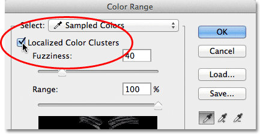

*Turning on Localized Color Clusters.*

As soon as we turn on Localized Color Clusters, another option, **Range**, becomes available directly below the Fuzziness slider. With Range set to 100% (or with the Localized Color Clusters option turned off), Photoshop will look throughout the entire image for areas of matching color to add to our selection. But as we lower the Range value by dragging the slider towards the left, we tell Photoshop to look only at areas of the photo that are closer to the areas we clicked on, and to ignore areas that are too far away from where we clicked.

In other words, I can tell Photoshop to ignore the red part of the woman's dress at the top of the photo, and to focus only on areas closer to the roses (the areas I clicked on to sample colors) just by lowering my Range value. I'll lower my Range value down to around 50% or so. And now. if we look at the top of the preview window, we see that it has become solid black, which means the woman's dress is no longer part of the selection because it's too far away from the roses:

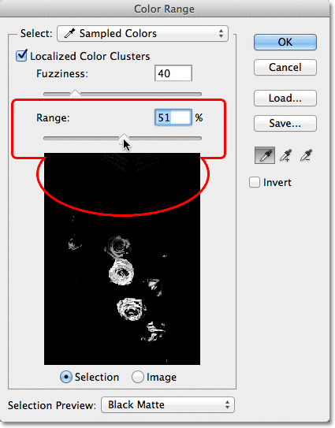

*Lowering the Range value removed the top area of the photo from the selection.*

I'll continue clicking inside the roses with my Add to Sample Tool to add more areas to my selection. Then I'll fine-tune my selection with my Fuzziness slider. With the gradient example we looked at previously, we saw how to add to the selection by increasing the Fuzziness value, but with this image, I'm actually going to tighten up the selection a bit by lowering my Fuzziness value slightly. Finally, I'll re-adjust my Range value to tighten the selection even further, and after playing around with the settings for a few minutes (you'll often need to go back and forth with the settings to get things just right), I'm happy with my final result:

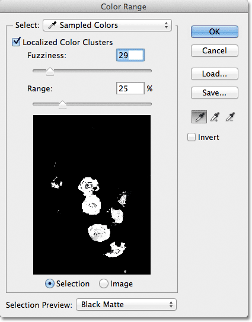

*My final Color Range settings.*

### Inverting The Selection

One last important thing I need to consider is that I currently have the roses selected, but what I actually need is for everything *except* the roses to be selected. In other words, I need to **invert** my selection so that everything that's currently selected (the roses) becomes deselected, and everything that's currently not selected (the rest of the photo) becomes selected.

To invert the selection from within the Color Range dialog box, all we need to do is select the **Invert** option below the eyedroppers. This will also invert the grayscale selection preview in the preview window, since my roses (now filled with black) are no longer part of my selection, while the rest of the image (filled with white) is now selected:

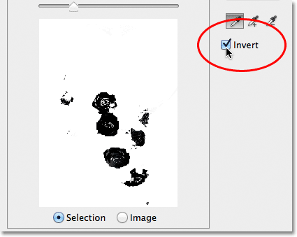

*Selecting the Invert option.*

To complete my selection, I'll click OK in the top right corner of the dialog box to close out of the Color Range command, and we now see the standard "marching ants" selection outlines in my document. As I mentioned earlier, the selection outline only appears around pixels that are at least 50% selected, which means what we're seeing is often not entirely accurate:

*The standard selection outline appears in the document.*

To quickly finish up my effect, I'll click on the **New Adjustment Layer** icon at the bottom of the Layers panel:

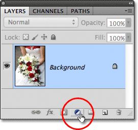

*Clicking on the New Adjustment Layer icon.*

Then I'll choose a **Black & White** adjustment layer from the list that appears:

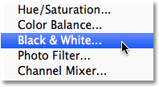

*Choosing a Black & White adjustment layer.*

This adds a Black & White adjustment layer above my image on the Background layer. We can see in the layer mask preview thumbnail that Photoshop applied the selection I created with the Color Range command to the adjustment layer's mask:

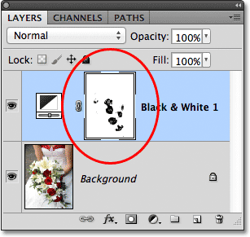

*The newly added Black & White adjustment layer.*

I'll leave the Black & White adjustment layer set to its default settings for now, just so we can see that thanks to the Color Range command's ability to select the roses based on their color, I was able to easily isolate them from the rest of the image so they can remain in color while everything else is converted to black and white:

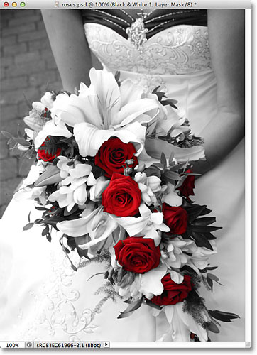

*The final result.*