# Essential Photoshop Color Settings

> Source: [https://www.photoshopessentials.com/basics/color-settings/](https://www.photoshopessentials.com/basics/color-settings/)
> Downloaded and converted to Markdown.

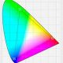

Open your images to a greatly expanded world of color with one simple but important change to the Color Settings in Photoshop. Learn about color spaces, working spaces, the default sRGB color space, and why Adobe RGB is a better choice.

Adobe Photoshop is the world's most powerful and popular image editor. As photographers, we trust Photoshop to help our photos look their very best. So it may surprise you to learn that Photoshop's default **color settings** are preventing your photos from looking the way they should. The color settings in Photoshop determine the range of colors available to us when we edit our images. More colors mean more potential detail in our photos. More colors also give us access to richer, more vibrant and more saturated colors. And better looking colors mean better looking images, both on screen and in print.

Yet Photoshop's default color settings won't give you more colors. In fact, the default settings give you *fewer* colors. In this tutorial, we'll look at why Adobe thinks that fewer colors are better. We'll learn where to find Photoshop's color settings so we can change them. And we'll look at the one important setting we need to change to expand our range of colors and help our images look even better. I'll be using Photoshop CC but the color settings in Photoshop are the same now as they've been for years. So if you're using Photoshop CS6 or earlier, you can easily follow along.

This is lesson 5 of 8 in [Chapter 1 - Getting Started with Photoshop](/basics/getting-started-photoshop/).

Let's get started!

## Where To Find Photoshop's Color Settings

In Photoshop, the color settings are found under the **Edit** menu. Go up to the Edit menu in the Menu Bar along the top of the screen. Then, choose **Color Settings**:

*To open the color settings, go to Edit > Color Settings.*

### The Color Settings Dialog Box

The Color Settings dialog box will open. If you've never seen the the Color Settings dialog box before, it can look intimidating at first. But as we'll see, most of Photoshop's default color settings are fine. In fact, there's really only one setting we need to change:

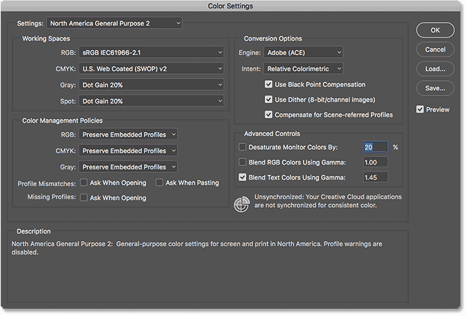

*Photoshop's Color Settings dialog box.*

#### The New Darker Dialog Box

The Color Settings dialog box may look different on your screen depending on which version of Photoshop you're using. Adobe made dialog boxes darker in the most recent versions of Photoshop CC. Photoshop CS6 and earlier uses lighter dialog boxes. The particular shade of gray you're seeing makes no difference. The color settings are the same.

Also, in Photoshop CS6 and earlier, some of the more advanced color settings are hidden by default. You can access them by clicking the **More Options** button. However, we don't need to change any of the advanced options, so you can safely leave them hidden.

## The Default Color Settings Preset

By default, Photoshop uses a preset collection of color settings known as **North America General Purpose 2**. If you're in a different part of the world, your preset may be named something different. If it is, that's okay because we'll be making our own change anyway:

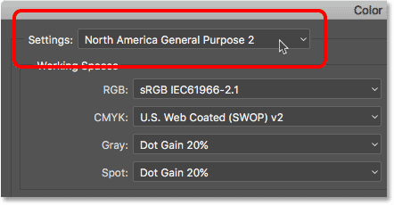

*The default "North America General Purpose 2" preset.*

## Photoshop's Working Spaces

If we look directly below the name of the preset, we find the **Working Spaces** section. A *working space* tells Photoshop which **color space** to use for different situations. For example, Photoshop uses one color space for displaying images on screen. But it uses a different color space for print. A *color space* determines the range of colors that are available. Some color spaces offer a wider range of colors than others. The particular range of colors that a color space offers is known as its color *gamut*.

There are four options (four different situations) listed under Working Spaces. These options are RGB, CMYK, Gray and Spot. Of the four, the only one we're interested in is the first one, **RGB**. That's because RGB is the one Photoshop uses for displaying our images on screen. The other three options (CMYK, Gray and Spot) have to do with commercial printing. For our purposes here, and unless you're working with a commercial printer, you can leave all three options set to their defaults.

### The RGB Working Space

Let's look at the RGB working space. RGB stands for **Red**, **Green** and **Blue**. It's the working space Photoshop uses for displaying and editing images. Red, green and blue are the *three primary colors of light*. Your computer monitor, smart phone, tv and every other type of screen is an RGB device. RGB devices mix different amounts of red, green and blue light to display every color we see on the screen.

Photoshop also uses RGB. It uses [color channels](/essentials/rgb/) to mix different amounts of red, green and blue to display all the colors we see in our images. The exact range of colors that Photoshop will reproduce is determined by the color space we've chosen as our RGB working space. By default, Photoshop sets the RGB working space to **sRGB**:

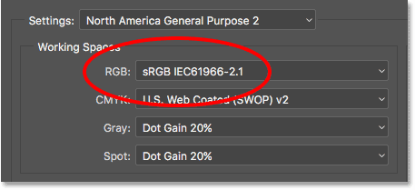

*Photoshop's default working space for RGB is sRGB.*

### The sRGB Color Space

The sRGB color space was created back in 1996 by Hewlett-Packard and Microsoft. It was designed as a standard based on the range of colors available on a typical low-end computer monitor. Even today, most monitors can only display the sRGB range of colors. Because of that, sRGB is the default color space for the web. Digital cameras typically have their default color space set to sRGB. In fact, many photographers are unaware that there's a Color Space option buried in their camera's menu. Your home inkjet printer is set up to receive sRGB images by default. And even commercial printing labs will usually expect you to save your images in the sRGB color space.

For all of these reasons, Adobe decided it was best to set Photoshop's default RGB working space to sRGB. After all, sRGB is the safe choice. But the safe choice isn't always the best choice. When it comes to image editing in Photoshop, "safe" and "best" are definitely not the same. The reason is that, of all the RGB color spaces we can choose from, sRGB contains the *smallest range of colors*.

### The Human Eye vs sRGB

To help illustrate the problem, let's look at a graph. This graph shows the color range available to us when working in the sRGB color space. The outer, curved area represents all the colors the human eye can see. It's not a true representation because it doesn't show brightness values. But it's still enough to give us a general sense of what's going on. Inside the larger shape is a small triangle. The area inside the triangle represents the sRGB color range. None of the colors outside the triangle are available in sRGB. This means that many of the richer, more saturated and more vibrant colors, especially in the greens and cyans, are unavailable in the sRGB color space:

*A graph showing the colors we can see (outer shape ) and what sRGB can display (inner triangle).*

### The Adobe RGB Color Space

While sRGB is by far the most widely-used RGB color space, it's not the only one. And, because it offers the smallest range of colors, it's also not the best one. A better choice is **Adobe RGB (1998)**. Created in 1998 by Adobe (which explains the name), Adobe RGB offers a wider range of colors than sRGB. It's original purpose was to help our photos look better when printed. Even though printers can print far fewer colors than the number of colors available in sRGB, they can reproduce more of the deeper, saturated colors our eyes are capable of seeing. Many higher-end inkjet printers have the option to switch from sRGB to the Adobe RGB color space so our prints can benefit from the extended color range. 

Digital cameras are also capable of capturing far more colors than what's available in sRGB. So many cameras these days, especially high-end DSLRs, have the option to change their default color space from sRGB to Adobe RGB. If you shoot JPEGs, Adobe RGB will allow your photos to preserve more of the scene's original colors. If your camera supports the raw format, and you capture your images as raw files, the Color Space setting in your camera makes no difference. Raw files always capture every color the camera sees. However, Adobe Lightroom and Camera Raw, the tools we use to process raw images, both use Adobe RGB as their default RGB working space.

### The Human Eye vs Adobe RGB

Let's look at another graph, this time showing the range of colors available in Adobe RGB. Once again, the outer shape represents all the colors we can see. The triangle inside the shape represents the range of colors Adobe RGB can reproduce. Notice how much larger the triangle is this time. While sRGB encompasses about a third of the visible color range, Adobe RGB contains roughly half of all colors our eyes can see. Most of the difference is in the greens and cyans, as the triangle extends much further into those areas than it did with sRGB. Where the sRGB color space is limited to more muted tones, Adobe RGB can produce richer, more vibrant colors: 

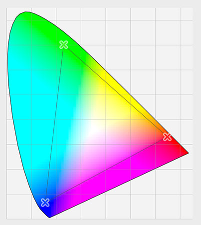

*A similar graph showing the extended color range of Adobe RGB.*

## Should You Switch From sRGB To Adobe RGB?

Many digital cameras can capture images in Adobe RGB. Many inkjet printers can reproduce colors that are only available in Adobe RGB. There are even high-end computer monitors these days that can display nearly all of the Adobe RGB color range. So, should you switch Photoshop's RGB working space from sRGB to Adobe RGB? In most cases, the answer is yes. Adobe RGB offers a much wider range of colors than sRGB. So if your camera can capture them and your printer can print them, why limit Photoshop to the smaller, more muted sRGB color space?

### Reasons For Choosing sRGB

There *are* a few reasons why you may want to choose sRGB instead. As we learned earlier, sRGB is the safe choice. Computer monitors, cameras and inkjet printers are all set to sRGB by default. Also, sRGB is the color space for images and graphics on the web. If you primarily display your photos online, you may want to stick with sRGB. If you're a web designer, again sRGB may be a better choice. And, if you're brand new to Photoshop and all this talk about color spaces is too confusing, there's no harm in leaving Photoshop set to sRGB. While sRGB may lack the more vibrant and saturated colors of Adobe RGB, it still contains a wide enough color range to produce stunning and amazing looking images.

### Reasons For Choosing Adobe RGB

However, if you're a photographer and you want your photos to look their absolute best, especially when printed, Adobe RGB is the better choice. If you shoot in the raw format, both Camera Raw and Lightroom use Adobe RGB as their default color space. It makes sense, then, to set Photoshop to Adobe RGB as well. Even if you display your images on the web, there's no reason not to edit them in Adobe RGB. They'll benefit from the expanded Adobe RGB color range during the editing process. And, when you save them later using the Save for Web dialog box, Photoshop will automatically convert your images to sRGB. In other words, if you just want to play it safe, choose sRGB. In pretty much every other case, Adobe RGB is the better choice.

## Setting Photoshop To Adobe RGB

To start taking advantage of the expanded color range of Adobe RGB, all we need to do is change Photoshop's RGB working space. Click on "sRGB IEC61966-2.1":

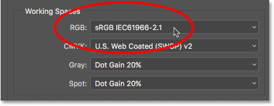

*Clicking on the default sRGB color space.*

Then choose **Adobe RGB (1998)** from the list:

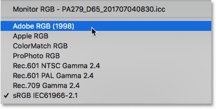

*Choosing the Adobe RGB color space.*

With that one simple change, Photoshop will now use Adobe RGB for displaying and editing your images. For best results, check your digital camera and inkjet printer to see if they support the Adobe RGB color space. If they do, you'll want to set them both to Adobe RGB:

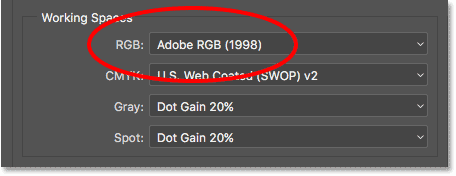

*The RGB working space has been changed to Adobe RGB.*

## The Color Management Policies

Now that we've set Photoshop's RGB working space to Adobe RGB, there's one set of options we should quickly look at. Those are the **Color Management Policies**. Even though we've set Photoshop to Adobe RGB, you may still find yourself opening images that were saved in sRGB. It sounds like something to worry about, but it's not. Photoshop is more than capable of handling images that use a color space other than our working space. By default, Photoshop will simply preserve the photo's original color profile. This is exactly what you want. The colors in the image will still look correct, and you can edit the image as you normally would without any problems.

We tell Photoshop how to handle these color profile mismatches in the Color Management Policies section. The RGB, CMYK and Gray working spaces each have their own separate setting. Again, the only one we're really interested in is the first one, RGB. However, it doesn't hurt to make sure that all three working spaces are set to **Preserve Embedded Profiles**, which they should be by default:

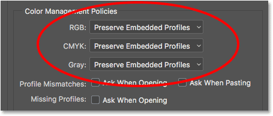

*The Color Management Policies section.*

### The Profile Mismatches And Missing Profiles Checkboxes

Below the RGB, CMYK and Gray options are three checkboxes. The first two are for **Profile Mismatches**, where the image you're opening uses a color profile that's different from your working space. The third one is for **Missing Profiles** where the image has no color profile at all. Images downloaded from the web often do not have a color profile associated with them. If you select (check) these options, then every time you go to open an image with a different color profile, or no profile at all, Photoshop will ask how you want to handle it. To avoid the question and just let Photoshop open the images as it normally would, leave these options unchecked:

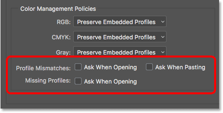

*The Profile Mismatches and Missing Profiles options.*

## Save Your New Color Settings

Once you've switched from sRGB to Adobe RGB, it's a good idea to save your new color settings. This way, you can easily switch back to them again if needed. To save your color settings, click the **Save** button:

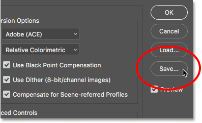

*Clicking the Save button.*

Enter a name for your color settings. I'll name mine "My Color Settings". Then, click the **Save** button again:

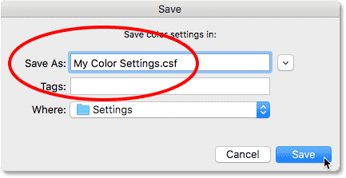

*Naming the new color settings.*

The **Color Settings Comment** dialog box will open. Here, you can enter a description for your settings to serve as a reminder of what these settings are for. I’ll enter “These are the best settings to use with my images”. Click OK when you’re done to close out of the dialog box:

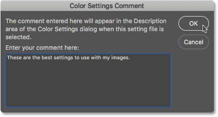

*Adding a description for the new color settings.*

Your custom Photoshop color settings are now saved. You can choose them again at any time from the **Settings** option at the top of the Color Settings dialog box:

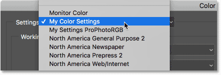

*Selecting my new custom settings from the list of presets.*