# How to Copy Layer Effects in Photoshop

> Source: [https://www.photoshopessentials.com/basics/copy-layer-effects-photoshop/](https://www.photoshopessentials.com/basics/copy-layer-effects-photoshop/)
> Downloaded and converted to Markdown.

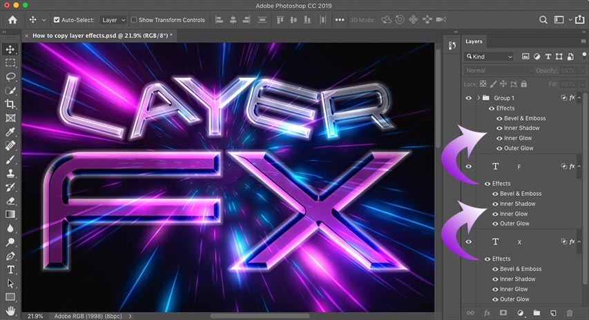

This tutorial shows you how to quickly copy Photoshop's layer effects and layer styles from one layer to another! For Photoshop CC and earlier.

Photoshop's layer styles are an easy way to create fun and impressive effects that would be nearly impossible to create without them. But once you've added your strokes, shadows, glows and more to one layer, how do you get those same effects onto other layers without needing to redo the entire effect from scratch? It's actually very simple.

In this tutorial, I show you how to copy layer effects from one layer to another, including how to copy a single effect and how to copy multiple layer effects at once. I also show you how to copy and paste an entire *layer style*, which includes any layer effects you've added, plus any blending options. And you'll learn how to save time by combining multiple layers into a *layer group* and then copying and pasting your layer effects onto the group! 

I'm using [Photoshop CC](https://prf.hn/l/dlXjD2w) but you can follow along with any recent version of Photoshop. Let's get started!

## Adding the initial layer effects

Here's a retro-style design I'm working on in Photoshop, and most of the work will be done using layer effects. I downloaded the [background image](https://prf.hn/l/gAXR3pQ) from Adobe Stock, and I've added the words "LAYER FX" in front of it.

The font I'm using is [Tachyon](https://clk.tradedoubler.com/click?p(264303)a(2982769)g(22913540)url(https://fonts.adobe.com/fonts/tachyon)) which I downloaded from Adobe Typekit. And notice that I've already gone ahead and added my layer effects to the letter "F" at the bottom. Since the effect has already been created once, copying it to the other layers will be easy:

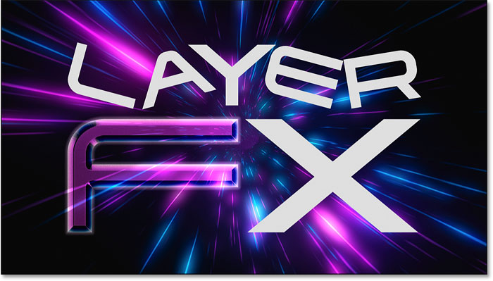
*The Photoshop document with the layer effects applied to a single layer.*

In the [Layers panel](/basics/layers/layers-panel/), we see my layer effects listed below that one Type layer. Notice that I placed each letter in the design on its own separate layer so I could [rotate or resize each letter](/photoshop-text/text-effects/flip-rotate-scale-letters/) separately. But this means I need a way to get the effects from that first layer onto six other layers:

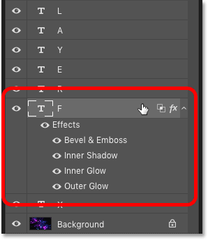
*The Layers panel showing the layer effects applied to a single layer.*

**Related:** [Create an 80's retro text effect in Photoshop](/photoshop-text/text-effects/80s-retro-text-effect-photoshop/)

## How to copy a single layer effect to another layer

We'll start by learning how to copy a single layer effect from one layer to another, and then I'll show you how to copy multiple layer effects at once.

Rather than copying *every* layer effect in the list, you can copy one effect at a time. Just press and hold the **Alt** (Win) / **Option** (Mac) key on your keyboard, and then click directly on the layer effect you want to copy and drag it on top of the layer where you want to paste it.

Here I'm holding Alt (Win) / Option (Mac) and dragging the Bevel & Emboss layer effect from the letter "F" down onto the letter "X":

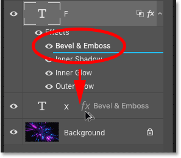
*Copying a single layer effect to another layer.*

Release your mouse button and Photoshop drops a copy of that one effect onto the other layer. I now have all four effects (Bevel & Emboss, Inner Shadow, Inner Glow, and Outer Glow) still applied to the original layer, and only one of those effects (Bevel & Emboss) applied to the other:

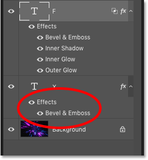
*The single effect has been copied.*

And in the document, we see only the Bevel & Emboss effect applied to the letter "X". Of course, that's not what I wanted to do, so I'll undo my last step by pressing **Ctrl+Z** (Win) / **Command+Z** (Mac) on my keyboard:

*The result after copying just one of the effects to the other layer.*

**Related:** [Learn how to use layers in Photoshop](/photoshop-layers-learning-guide/)

## How to copy all layer effects to another layer

To copy *every* layer effect from one layer to another, again press and hold the **Alt** (Win) / **Option** (Mac) key on your keyboard. Then click on the word "Effects" above the list of individual layer effects and drag it onto the other layer:

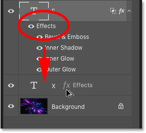
*Dragging the word "Effects" from one layer to another.*

Release your mouse button and Photoshop copies the entire list of effects to the new layer:

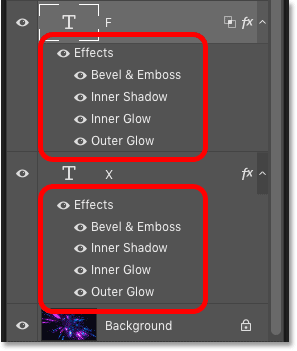
*Every layer effect has been copied.*

But in the document, something's still not right. Even though I've copied every layer effect from the first layer to the second, the two letters still don't look the same:

*The result after copying all layer effects from one layer to another.*

## Layer effects vs layer styles in Photoshop

The reason why they don't look the same even with all the layer effects copied is that the second layer is still missing the *transparency* effect from the first layer. And this brings us to the difference between layer *effects* and layer *styles*.

**Layer effects** are the actual effects themselves, like Bevel and Emboss, Stroke, Drop Shadow, and so on. But a **layer style** includes not only the layer effects but also any *blending effects* that you've applied to the layer. Blending effects include the [Opacity and Fill](/basics/layers/opacity-vs-fill/) values, the [blend mode](/photo-editing/layer-blend-modes/intro/), and any additional [Blending Options](/photo-effects/how-to-blend-text-into-clouds-with-photoshop/) you've set in the Layer Style dialog box.

### The Fill value

In the Layers panel, I'll click on the "F" layer to select it. And notice that, along with applying layer effects, I've also lowered the **Fill** value down to **0%**. This means that the contents of the layer are transparent and all we're seeing in the document are the layer effects themselves:

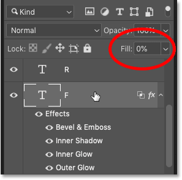
*The Fill value of the first layer was lowered to 0%.*

But if I select the "X" layer, the **Fill** value is still set to **100%**. So the effects were copied over, but the Fill value was not:

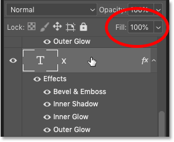
*The Fill value of the second layer is still at 100%.*

### How to delete layer effects

Since copying the layer effects did not give me the result I needed, I'll delete the effects from the "X" layer. To delete all layer effects at once, click on the word "Effects" and drag it down onto the trash bin:

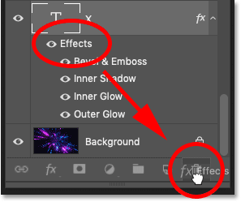
*Deleting the layer effects I had copied.*

## How to copy a layer style to another layer

So how can we copy the entire layer style from one layer to another, so that we're getting both the layer effects and the blending effects?

To copy a layer style, **right-click** (Win) / **Control-click** (Mac) on the layer containing the effects:

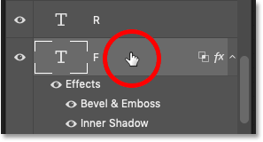
*Right-clicking on the layer that holds the layer style.*

And then choose **Copy Layer Style** from the menu:

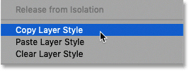
*Choosing "Copy Layer Style".*

Then **right-click** (Win) / **Control-click** (Mac) on the layer where you want to paste the effects:

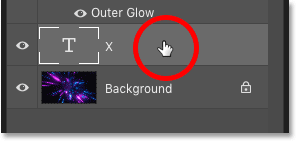
*Right-clicking on the layer where the layer style will be copied.*

And choose **Paste Layer Style**:

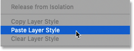
*Choosing "Paste Layer Style".*

This time, not only are the layer effects copied over, but so are the blending effects. In this case, the Fill value has been correctly set to 0%:

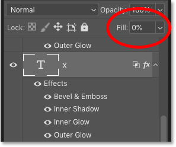
*Copying the layer style copied the Fill value as well.*

And in the document, the two letters, "F" and "X", now finally look the same:

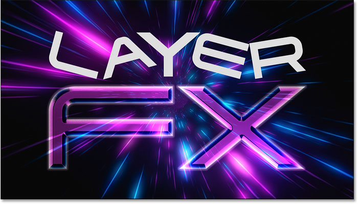
*The result after copying and pasting the entire layer style.*

## How to copy a layer style to multiple layers at once

So now that we know how to copy layer effects and styles to a single layer, let's learn how to copy them to multiple layers at once.

Back in the Layers panel, we see that each letter in the word "LAYER" appears on its own layer. Again I did that so I could rotate or resize each letter in the word separately. But it means I need a way to copy and paste the layer style onto five more layers:

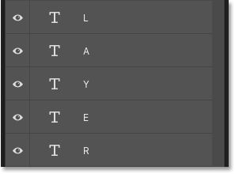
*The word "LAYER" is split into five separate layers.*

One way to do that would be to select all five layers at once, and then copy and paste the layer style onto them.

### Step 1: Copy the layer style

First, copy your layer style like we did earlier by **right-clicking** (Win) / **Control-clicking** (Mac) on the layer containing the effects and choosing **Copy Layer Style** from the menu:

*Choosing "Copy Layer Style".*

### Step 2: Select your layers

Then, to select multiple layers at once, click on the top layer you want to select:

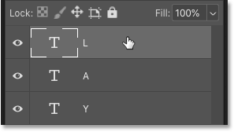
*Clicking the top layer to select it.*

And then hold your **Shift** key and click on the bottom layer. This selects both layers plus every layer in between:

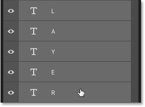
*Holding Shift and clicking the bottom layer.*

**Related:** [Learn more tips and tricks for working with layers!](/basics/layer-shortcuts/)

### Step 3: Paste the layer style

With the layers selected, **right-click** (Win) / **Control-click** (Mac) on any of the layers and choose **Paste Layer Style** from the menu:

*Choosing "Paste Layer Style".*

This adds a copy of both the layer effects and the blending effects to each individual layer. I've split the Layers panel into two columns here because the list of layer effects is now so long:

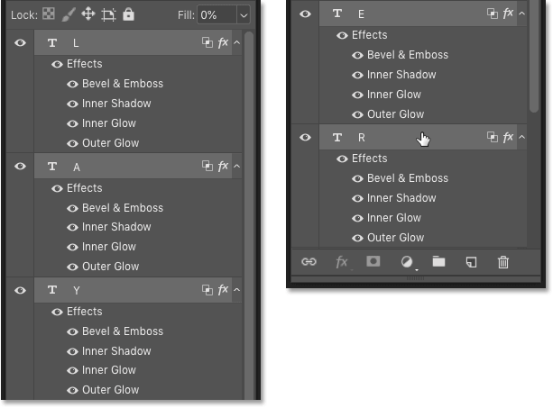
*The layer style has been copied onto each separate layer.*

And in the document, we see that the word "LAYER" now has the same effects applied to it as the "F" and the "X":

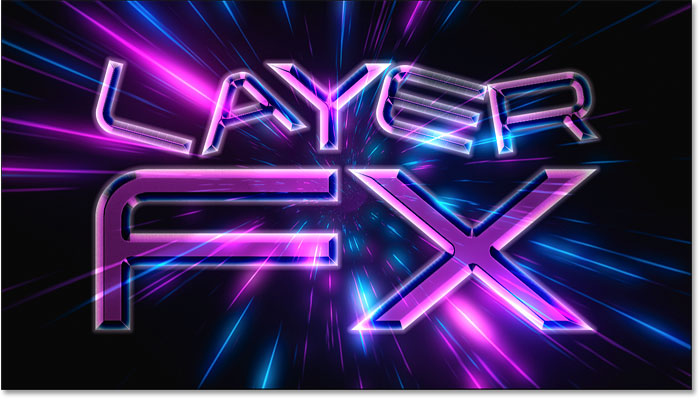
*The result after copying the layer style to multiple layers at once.*

## The problem with copying a layer style to multiple layers

But here's a problem you may run into when using the same layer effects or layer style on multiple separate layers. What if you need to make a change to the effect? 

For example, what if I need to change the effect that's being applied to each letter in the word "LAYER"? Let's say I want to turn off the Bevel & Emboss effect for the entire word. I can turn off Bevel & Emboss for the "L" layer by clicking its **visibility icon**:

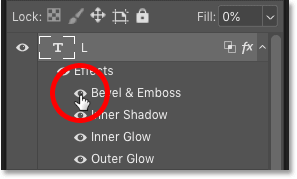
*Turning off Bevel & Emboss for one of the layers.*

But that turns off the effect for just that one layer. The other layers are unaffected:

*Only that one layer was affected by the change.*

## How to copy a layer style to a layer group

A better way to work would be to place the layers into a *layer group* and then copy the layer style onto the group itself. And here's how to do that.

### Step 1: Select the layers to place into the group

First, select the layers you need to group together by clicking on the top layer, holding **Shift**, and then clicking on the bottom layer:

*Selecting all five layers that will be grouped together.*

### Step 2: Choose "New Group from Layers"

With the layers selected, click on the **menu icon** in the upper right of the Layers panel:

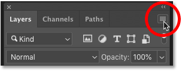
*Clicking the menu icon.*

And choose **New Group from Layers**:

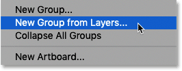
*Choosing "New Group from Layers".*

Give the group a name, or just accept the default name, and click OK:

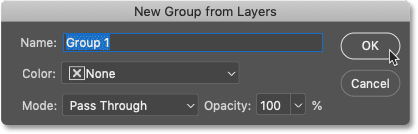
*Clicking OK to create the new layer group.*

And in the Layers panel, all five layers are now inside the group:

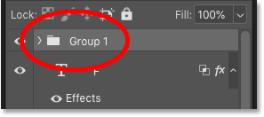
*The layers are now grouped together.*

### Step 3: Copy the layer style

**Right-click** (Win) / **Control-click** (Mac) on the layer that holds the effects you want to copy:

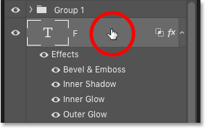
*Right-clicking on the layer.*

And choose **Copy Layer Style**:

*Choosing "Copy Layer Style".*

### Step 4: Paste the layer style onto the group

And then **right-click** (Win) / **Control-click** (Mac) on the layer group:

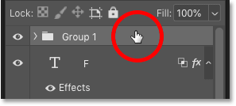
*Right-clicking on the layer group.*

And choose **Paste Layer Style**:

*Choosing "Paste Layer Style".*

This time, rather than applying the layer style to a bunch of separate layers, we've applied it to the group itself:

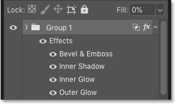
*The layer style is applied to the group.*

## How to edit the group's layer style

With the layer style copied to the group, any changes you make to the effects will apply to every layer *in* the group.

I'll edit the Bevel and Emboss settings by **double-clicking** on the name of the effect:

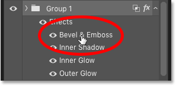
*Double-clicking on the words "Bevel & Emboss".*

And then in the Layer Style dialog box, I'll make a few changes. I'll lower the **Size** value from 60 px down to **20 px**. Then I'll change the **Highlight color** from pink to **white**. And I'll lower the **Highlight Opacity** from 100% down to **70%**.

Since this is not a tutorial on how to create a specific effect, I've gone through these changes quickly. The point here is just to show how easy it is to edit layer effects when they're applied to a layer group:

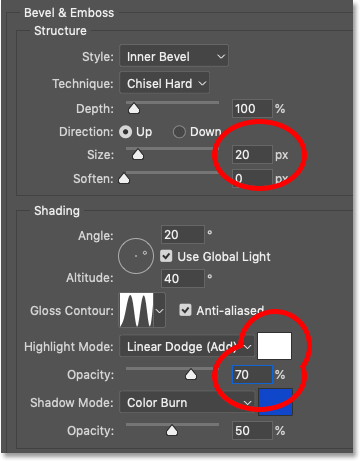
*Making changes to one of the effects in the layer style.*

I’ll click OK to close the Layer Style dialog box. And instantly, every layer in the group updates. By changing just one effect, I was able to change the look of several layers at once:

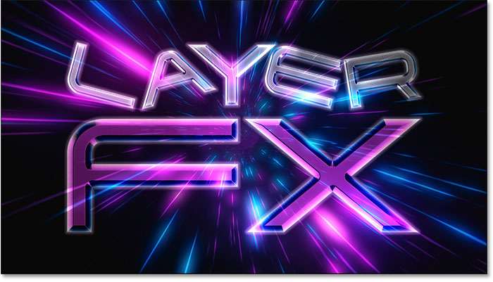
*The result after editing the effects applied to the layer group.*

And there we have it! That's how to copy layer effects and layer styles to single layers, multiple layers and layer groups in Photoshop! 

Check out our [Photoshop Basics](/basics/) section for more tutorials, or our [Text Effects](/photoshop-text/text-effects/) section for more effects you can create with layer styles! And don't forget, all of our tutorials are now available to [download as PDFs](/print-ready-pdfs)!