# Create Color Swatches from Images in Photoshop 2020

> Source: [https://www.photoshopessentials.com/basics/create-color-swatches-from-images-in-photoshop-cc-2020/](https://www.photoshopessentials.com/basics/create-color-swatches-from-images-in-photoshop-cc-2020/)
> Downloaded and converted to Markdown.

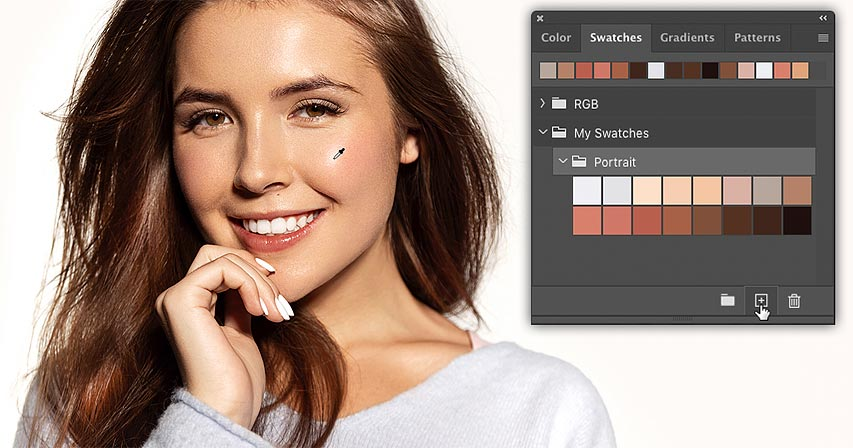

Learn how to turn photos into color swatches by sampling colors directly from images, and how to save your colors as custom swatch sets, in the latest version of Photoshop CC!

In the previous tutorial, we learned all about the improved Swatches panel in Photoshop CC 2020. We looked at Photoshop's new default color swatches, and the new ways to [drag and drop colors](/basics/drag-and-drop-colors-swatches-in-photoshop-cc-2020/ "Learn more") from the Swatches panel directly into the document. 

This time, I show you how easy it is to create your own color swatches in Photoshop. Specifically, you'll learn how to create swatches by sampling colors from an image. You'll also learn how to organize your swatches into custom sets. And along the way, I'll show you a simple trick you can use to reduce the number of colors in your image so that choosing colors becomes a whole lot easier.

For best results with this tutorial, you'll need [Photoshop 2020 or newer](https://prf.hn/l/dlXjD2w "Get Photoshop"). If you're already using Photoshop CC, make sure that your copy is up to date.

### The document setup

To follow along with me, go ahead and open any image. I'll use [this image](https://prf.hn/l/PJo93yb "View image on Adobe Stock") that I downloaded from Adobe Stock:

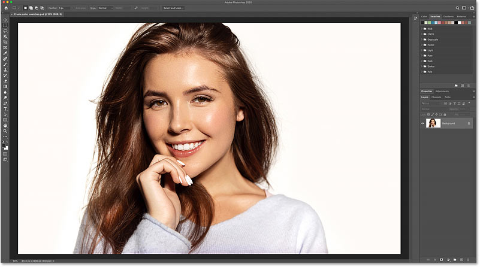
*The original image. Photo credit: Adobe Stock.*

Let's get started!

## How to reduce the number of colors in the image

Before we start sampling colors from the image, let's look at how to make the process of selecting colors easier by reducing the number of colors we can choose from. To do that, we'll pixelate the image. This step is not absolutely necessary, but you may find it helpful.

### Step 1: Duplicate the image layer

In the [Layers panel](/basics/layers/layers-panel/ "Learn more"), we see my image on the [Background layer](/basics/background-layer-photoshop-cc/ "Learn more"):

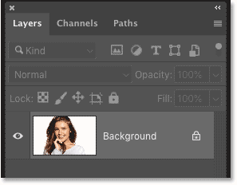
*The Layers panel showing the original image.*

We need to make a copy of the image so we don't damage the original. One way to do that is to click on the Background layer (or whichever layer your image is sitting on) and drag it down onto the **Add New Layer** icon:

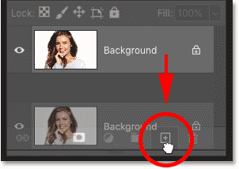
*Dragging the image onto the Add New Layer icon.*

Release your mouse button, and a copy of the layer appears above the original:

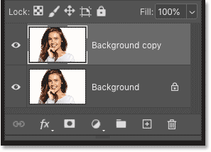
*A copy of the image appears.*

[Learn all about layers in Photoshop with our Complete Guide!](/photoshop-layers-learning-guide/ "Learn more")

### Step 2: Select the Mosaic filter

To pixelate the image, go up to the **Filter** menu in the Menu Bar, choose **Pixelate**, and then choose **Mosaic**:

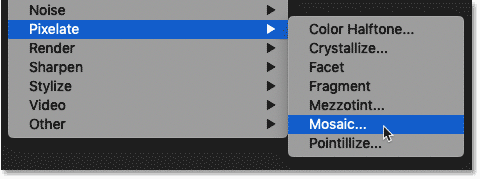
*Going to Filter > Pixelate > Mosaic.*

### Step 3: Adjust the Cell Size value

In the Mosaic filter's dialog box, the **Cell Size** option at the bottom determines the number of squares, or "[pixels](/basics/pixels-image-size-resolution-photoshop/ "Learn more")", that the image will be divided into. Photoshop averages the colors in the image and fills each square with a single color.

Drag the slider along the bottom to adjust the Cell Size value to the desired setting. I'll increase the value to 80, but you may need a different value depending on the size of your image. Click OK when you're done to close the dialog box:

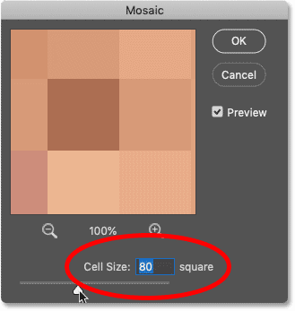
*Adjusting the Cell Size value.*

Here's my result after applying the Mosaic filter. With the image now pixelated, we have a clearer view of the photo's overall color palette, and we'll have an easier time choosing the colors we need:

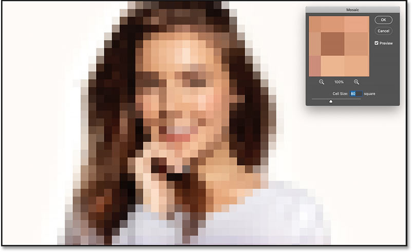
*The result after pixelating the image with the Mosaic filter.*

[Keep filter effects editable with Smart Filters in Photoshop!](/basics/how-to-use-smart-filters-in-photoshop/ "Learn more")

## Creating a new swatch set in Photoshop CC 2020

So now that we've pixelated the image, we're ready to start sampling some colors to create swatches. And to keep the Swatches panel organized, we'll first create a new swatch set that we can place our swatches into.

### Step 1: Open the Swatches panel

Start by opening the **Swatches panel**. In Photoshop CC 2020, the Swatches panel is grouped in with the Color, Gradients and Patterns panels.

As I covered in the [previous tutorial](/basics/drag-and-drop-colors-swatches-in-photoshop-cc-2020/ "Learn more"), the default color swatches in Photoshop CC 2020 are divided into sets, and each set is represented by a folder. To twirl a set open or closed, click the arrow to the left of its folder icon:

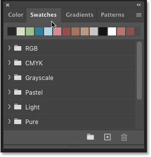
*The default color swatch sets in Photoshop CC 2020.*

### Step 2: Create a new swatch set

To create a new set to hold your own color swatches, click the **Create New Group** icon at the bottom of the Swatches panel:

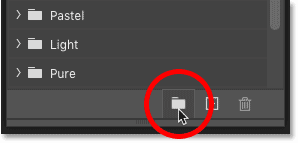
*Clicking the Create New Group icon.*

Give the new set a name, like "My Swatches", and then click OK:

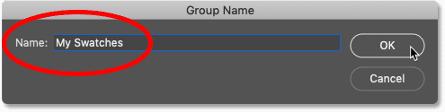
*Naming the new swatch set.*

Your new set appears below the other sets in the list:

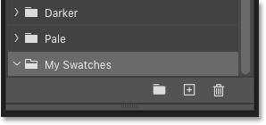
*The new "My Swatches" set appears.*

## Tip! Create swatch sets within the main set

But rather than placing all of your custom swatches into the same set, it's usually better to divide them into smaller sets within the main one. In other words, if you'll be creating swatches from different images, you may want the swatches from each image to be saved in their own set.

### Step 1: Create another new swatch set

For example, I want to create a set specifically for the colors from the image I'm using. To do that, I'll again click the **Create New Group** icon at the bottom of the Swatches panel:

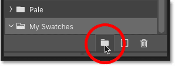
*Clicking the Create New Group icon.*

And this time, I'll name the set "Portrait". Then I'll click OK to close the dialog box:

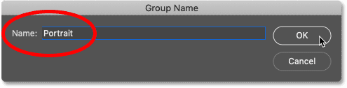
*Naming the new set.*

Back in the Swatches panel, the new "Portrait" set appears below the "My Swatches" set:

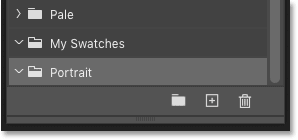
*The second set appears.*

### Step 2: Drag the new set onto the main set

To move the "Portrait" set into the "My Swatches" set, all I need to do is drag the "Portrait" set up and onto it. When a **blue highlight box** appears around the "My Swatches" set, I'll release my mouse button:

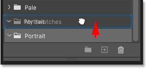
*Dragging one set onto another set.*

And now, the new set is nested inside the main one:

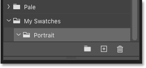
*The Swatches panel showing the nested swatch set.*

## How to create color swatches in Photoshop

Now that we've created a new set to hold our swatches, let's learn how to create swatches by sampling different colors from the image.

### Step 1: Select a swatch set in the Swatches panel

First, in the Swatches panel, make sure the set you want to save the swatches into is selected. I'll choose my "Portrait" set:

*Choosing the correct swatch set.*

### Step 2: Select the Eyedropper Tool

Next, in the [toolbar](/basics/photoshop-tools-toolbar-overview/ "Learn more"), select the **Eyedropper Tool**. You can also select the Eyedropper Tool from your keyboard by pressing the letter **I**:

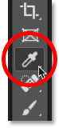
*Selecting the Eyedropper Tool.*

### Step 3: Click on a color to sample it

Then with the Eyedropper Tool selected, click on one of the colors in the image to sample it:

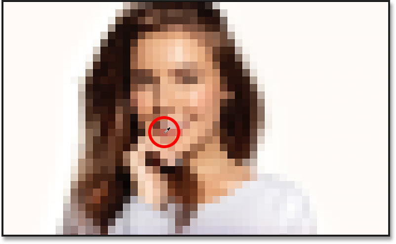
*Selecting the Eyedropper Tool.*

Back in the toolbar, the color you sampled appears as your new **Foreground color**:

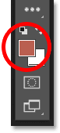
*The Foreground Color swatch shows the sampled color.*

### Step 4: Click the Create New Swatch icon

To save the sampled color as a new swatch, click the **Create New Swatch** icon at the bottom of the Swatches panel:

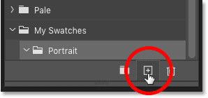
*Clicking the Create New Swatch icon.*

You can name the new swatch in the **Color Swatch Name** dialog box, or just accept the default name. And you can add the new swatch to your Creative Cloud library by selecting the **Add to my current library** option. I don't need to do that so I'll uncheck it. 

Click OK to close the dialog box when you're done:

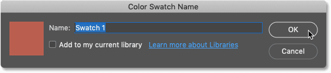
*The Color Swatch Name dialog box.*

#### Tip! How to skip the Color Swatch Name dialog box

If you don't need to name your new swatches, you can skip the Color Swatch Name dialog box by pressing and holding **Alt** (Win) / **Option** (Mac) on your keyboard as you click the **Create New Swatch** icon.

The new swatch appears as a thumbnail in the active swatch set:

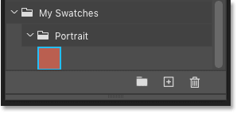
*The sampled color is saved as a new swatch.*

[See also: How to choose text colors from images!](/basics/how-to-choose-type-colors-from-images-with-photoshop/ "Learn more")

## How to delete a color swatch

To delete a color swatch in the Swatches panel, click on the swatch's thumbnail to highlight it, and then click the **Delete Swatch** icon (the trash bin):

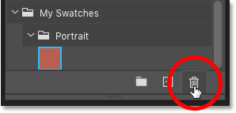
*Deleting the selected color swatch.*

When Photoshop asks if you want to delete the swatch, click OK. Or to skip this dialog box when deleting a swatch, press and hold **Alt** (Win) / **Option** (Mac) on your keyboard as you click the **Delete Swatch** icon:

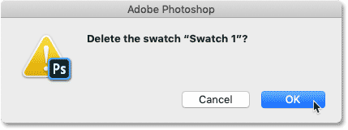
*The Delete Swatch dialog box.*

Another way to delete a color swatch is to **right-click** (Win) / **Control-click** (Mac) on the swatch's thumbnail:

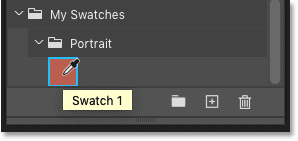
*Right-clicking (Win) / Control-clicking (Mac) on the swatch.*

And then choose **Delete Swatch** from the menu:

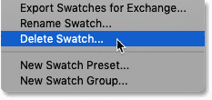
*Choosing the Delete Swatch command.*

## Creating more color swatches

Continue sampling colors from the image with the Eyedropper Tool and clicking the **Create New Swatch** icon in the Swatches panel. In general, it's best to get a wide range of colors, including a few highlights, some shadows, and some of the more common colors in between.

All of your new swatches will appear in the set, ready to be used in your layout or in future designs:

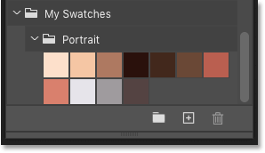
*The new swatches.*

## Deleting the pixelated version of the image

Finally, to delete the pixelated version of the image when you're done, select its layer in the Layers panel and simply drag it down onto the **Delete Layer** icon (the trash bin):

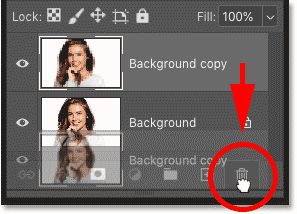
*Dragging the pixelated version onto the trash bin.*

And there we have it! That's how easy it is to create your own color swatches, and how to save them in custom sets, in Photoshop CC 2020! In the next tutorial, I'll show you how to import and export your color swatches so you'll always have them when you need them!

Check out our [Photoshop Basics](/basics/ "More Photoshop Basics tutorials") section for more tutorials. And don't forget, all of our Photoshop tutorials are available to [download as PDFs](/print-ready-pdfs/ "Learn more")!