# How to Create New Documents in Photoshop

> Source: [https://www.photoshopessentials.com/basics/create-new-documents-photoshop-cc/](https://www.photoshopessentials.com/basics/create-new-documents-photoshop-cc/)
> Downloaded and converted to Markdown.

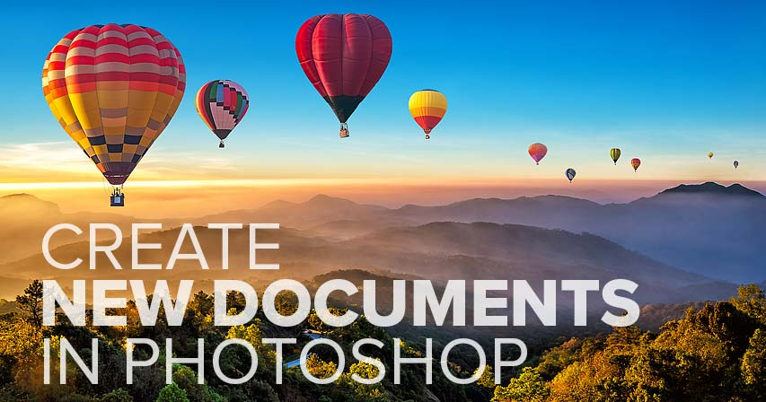

Everything you need to know to create a new document and begin your adventure in Photoshop! Learn all about the New Document dialog box, how to create custom document sizes, how to save your custom settings as presets, and more!

To follow along with this tutorial, you'll want to be using the [latest version of Photoshop](https://prf.hn/l/dlXjD2w) and you'll want to make sure that your copy is [up to date](/basics/update-photoshop-cc/).

This lesson is part of my Complete Guide to [Getting Images into Photoshop](/basics/opening-images-photoshop/). Let's get started!

## Creating new documents vs opening images in Photoshop

Before we begin, it's important that we understand the difference between creating a new document in Photoshop and opening an existing image *into* Photoshop.

### When to create a new Photoshop document

When we create a new Photoshop document, we create what is essentially a blank canvas. Then once we've created the canvas (the document), we can import images, graphics or other assets into it. New documents are perfect for design layouts, whether for print or for the web. You simply create a new blank document at the size you need and then begin adding and arranging your various elements.

New documents are also great for digital painting with Photoshop's brushes, and for creating composites from multiple images. Basically, any time you want to start with a blank canvas and then add your content as you go, you'll want to create a new Photoshop document. And we'll be learning how to create new documents in this tutorial.

### When to open an existing image in Photoshop

But if you're a photographer, then instead of creating a new document, you'll most likely want to start by opening an existing image into Photoshop. Opening images is different from creating new documents, since the image itself determines the document's size.

In the first lesson in this chapter, we learned [how to set Photoshop as our default image editor](/basics/how-to-make-photoshop-your-default-image-editor/) so that our images will open directly into Photoshop when we double-click on them in Windows or macOS. We'll learn other ways of getting images into Photoshop beginning with the next tutorial in this chapter, [How to open images in Photoshop](/basics/open-images-photoshop-cc/). For now, let's learn how to create new documents.

## How to create a new Photoshop document

To create a new document in Photoshop, we use the New Document dialog box, and there are a few ways to get to it.

### Creating a new document from the Home Screen

One way is from Photoshop's **Home Screen**. By default, when you launch Photoshop CC without opening an image, or if you close your document when no other documents are open, you're taken to the Home Screen.

The content on the Home Screen changes from time to time, but in general, you'll see different boxes you can click on for learning Photoshop or for seeing what's new in the latest version. And if you've worked on previous images or documents, you'll see them displayed as thumbnails that you can click on to quickly reopen them:

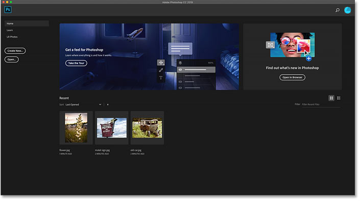
*Photoshop's Home Screen.*

To create a new document from the Home Screen, click the **Create New...** button in the column along the left:

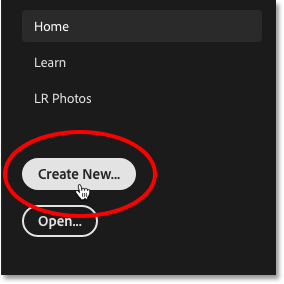
*Clicking the "Create New..." button on the Home Screen.*

### Creating a new document from the Menu Bar

Another way to create a new Photoshop document is by going up to the **File** menu in the Menu Bar and choosing **New**. Or you can press the keyboard shortcut, **Ctrl+N** (Win) / **Command+N** (Mac):

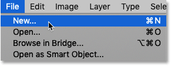
*Going to File > New.*

## Photoshop's New Document dialog box

Any way you choose to create a new document opens the New Document dialog box, and there are actually two versions of this dialog box. We'll start by looking at the default version (pictured here), and then I'll show you how to switch to the older, smaller version which I personally think is better:

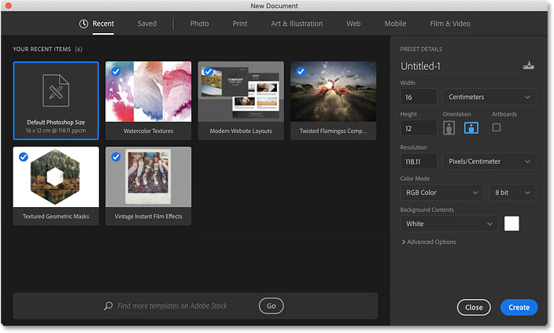
*The default New Document dialog box in Photoshop CC.*

### Choosing a recently-used document size

Along the top of the dialog box is a row of categories. We have **Recent** and **Saved**, plus **Photo**, **Print**, **Art & Illustration**, **Web**, **Mobile**, and **Film & Video**.

By default, the Recent category is selected, and it gives you quick access to any recently-used document sizes. To choose one, click on its thumbnail to select it and then click the **Create** button in the bottom right corner of the dialog box. Or you can just double-click on the thumbnail.

In my case, all I'm seeing at the moment is the default Photoshop size, along with some pre-made templates from Adobe. Using the templates goes beyond the scope of this tutorial, so we'll focus on how to create our own documents:

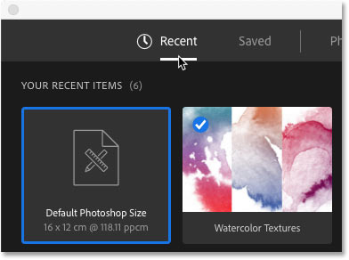
*Any recently-used document sizes appear in the Recent category.*

### Choosing a new document preset

Along with choosing from recently-used document sizes, we can also choose from preset sizes. First, select the type of document you want to create by choosing one of the categories (Photo, Print, Web, and so on) along the top. I'll choose **Photo**:

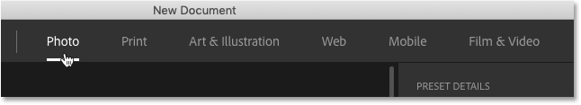
*Choosing a document category.*

The presets will appear below as thumbnails. Only a few presets are displayed at first, but you can see more by clicking **View All Presets +**:

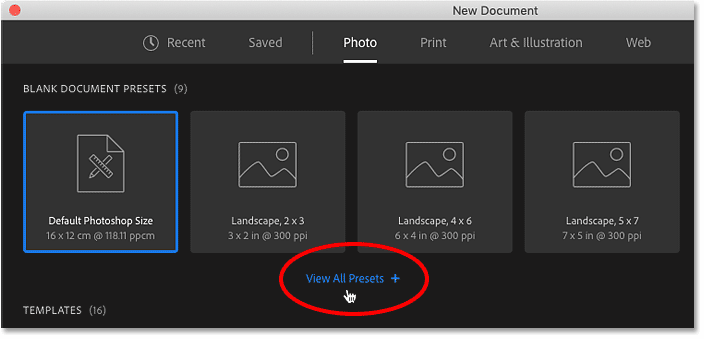
*Clicking the "View All Presets +" option.*

Then use the scroll bar along the right to scroll through the presets. If you see one that suits your needs, click on its thumbnail. I'll choose "Landscape, 8 x 10":

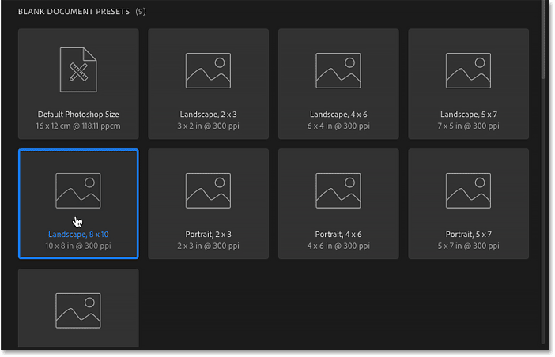
*Choosing a preset document size.*

### The Preset Details panel

The details of the preset appear in the **Preset Details** panel along the right of the dialog box. After choosing the "Landscape, 8 x 10" preset, we see that sure enough, this preset will create a document with a **Width** of **10 inches** and a **Height** of **8 inches**. It also sets the **Resolution** to **300 pixels/inch** which is the standard resolution for print:

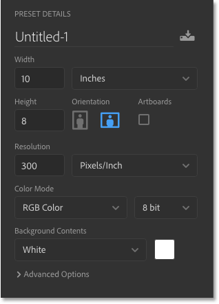
*The Preset Details panel in the New Document dialog box.*

### Creating the new document

If you're happy with the settings, click the **Create** button in the bottom right of the dialog box:

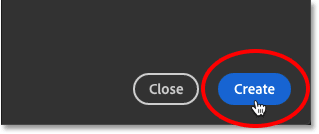
*Clicking the Create button.*

This closes the New Document dialog box and opens your new document in Photoshop:

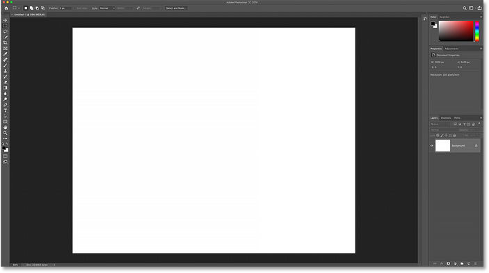
*The new document is created.*

## How to verify the document size

If you're the skeptical type, you can verify that the document is the size you wanted using Photoshop's Image Size dialog box. To do that, go up to the **Image** menu at the top of the screen and choose **Image Size**:

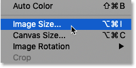
*Going to Image > Image Size.*

### The Image Size dialog box

This opens the [Image Size dialog box](/basics/photoshops-image-size-command-features-and-tips/) where we see that the **Width** of the document is in fact **10 inches**, the **Height** is **8 inches**, and the **Resolution** is set to **300 pixels/inch**:

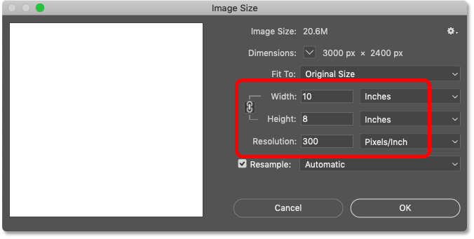
*Verifying the settings with the Image Size dialog box.*

I'll close out of the Image Size dialog box by clicking the **Cancel** button:

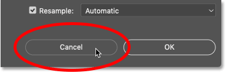
*Closing the Image Size dialog box without making any changes.*

### Closing the document

Then, I'll [close my new document](/basics/close-images-photoshop/) by going up to the **File** menu and choosing **Close**:

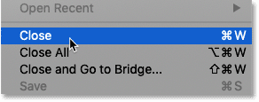
*Going to File > Close.*

### Creating another new document

Since I have no other documents open at the moment, Photoshop returns me to the Home Screen. I'll again open the New Document dialog box by clicking the **Create New...** button:

*Clicking the "Create New..." button on the Home Screen.*

And the New Document dialog box reopens to the **Recent** category. This time, it's displaying not only the default Photoshop size but also the "Landscape, 8 x 10" preset. If I wanted to quickly create a new document using either of these sizes, all I would need to do is double-click on the one I need:

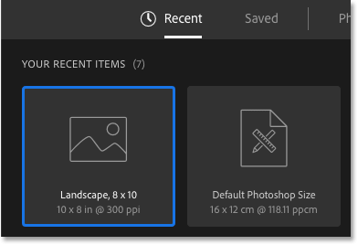
*My previously-used document size now appears in the Recent list.*

## Creating new documents from custom settings

While selecting a preset can sometimes be useful, the most common way to create a new Photoshop document is by entering your own custom settings into the Preset Details panel.

### Setting the width and height

If I want to create, say, a 13 by 19 inch document, all I need to do is set the **Width** to **13 inches** and the **Height** to **19 inches**. I'm using inches here as an example but you can click the measurement type box and choose other measurement types as well, like pixels, centimeters, millimeters and more:

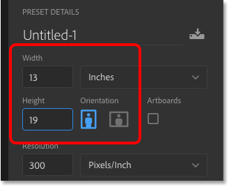
*Entering my own custom Width and Height values.*

### Swapping the orientation

To change the **orientation** of the document, click either the **Portrait** or **Landscape** buttons. This swaps the Width and Height values as needed:

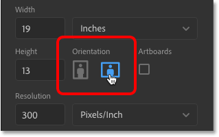
*The Portrait (left) and Landscape (right) orientation buttons.*

### Setting the print resolution

You can also enter a custom resolution value for the document into the **Resolution** field. But keep in mind that [resolution applies only to print](/basics/how-to-resize-images-for-print-with-photoshop/). It has no effect on images being viewed online or on any type of screen.

For print, the industry standard resolution is 300 pixels per inch. For images that will be viewed on screen, you can ignore the Resolution value:

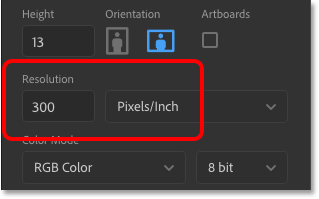
*Setting the Resolution value (print only).*

### Setting the background color of the document

The default background color for a new Photoshop document is white, but you can choose a different color from the **Background Contents** option. At first, it will look like you can only choose **White**, **Black** or the current **Background Color**:

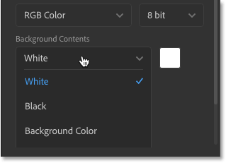
*The initial background color options.*

But if you scroll down, you'll see that you can also choose a **Transparent** background, or select **Custom** to choose a color from Photoshop's Color Picker. Clicking the **color swatch** to the right of the drop-down box will also open the Color Picker so you can choose a custom background color:

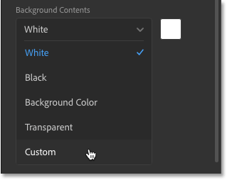
*Scroll down to view more background choices.*

### Color Mode and Bit Depth

You can set the **Color Mode** and **Bit Depth** for your new document. In most cases, the default settings (**[RGB Color](/essentials/rgb/)** and **[8 bit](/essentials/16-bit/)**) are what you need, but you can choose other values if you need them:

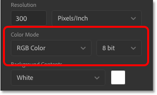
*The Color Mode (left) and Bit Depth (right) options.*

### The Advanced options

And finally, if you twirl open the **Advanced Options**, you'll find settings for the document's **Color Profile** and **Pixel Aspect Ratio**. You can safely leave these at the defaults:

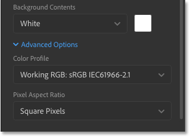
*The Advanced Options.*

## How to save your settings as a new preset

If you know you'll need the same document size again in the future, then before you click the Create button, you may want to save your settings as a custom preset. Click the **Save** icon at the top of the Preset Details panel:

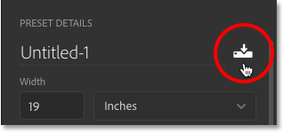
*Clicking the Save icon.*

Then give your preset a name. I'll name mine "Landscape, 13 x 19". To save it, click **Save Preset**:

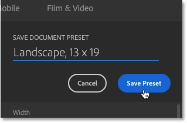
*Naming the preset, then clicking "Save Preset".*

The New Document dialog box will switch to the **Saved** category where you'll find your new preset, along with any other presets you've created. To use the preset in the future, just open the Saved category and double-click on the preset's thumbnail:

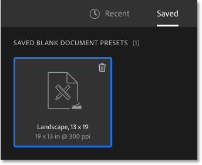
*The new preset appears in the Saved category.*

### How to delete a saved preset

To delete a saved preset, click the **trash bin** in the upper right of the thumbnail:

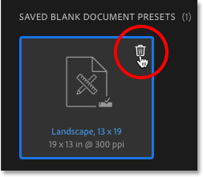
*Click the trash bin to delete the preset.*

## Opening the new Photoshop document

Now that I've saved my settings as a preset, I'll open the new document by clicking the **Create** button in the bottom right corner:

*Clicking the Create button.*

This once again closes the New Document dialog box and opens my new document in Photoshop:

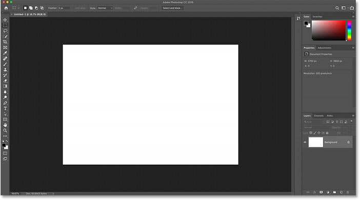
*Opening the new document with my custom settings.*

## Using Photoshop's Legacy New Document dialog box

Earlier, I mentioned that there are actually two versions of Photoshop's New Document dialog box. Up to now, we've been using the newer, larger version. But there is also a smaller, more streamlined version and I personally like it better. Adobe calls the smaller version the "legacy" New Document dialog box because it's what we used until the newer version came along.

To switch to the legacy version, on a Windows PC, go up to the **Edit** menu, choose **Preferences** and then choose **General**. On a Mac, go up to the **Photoshop CC** menu, choose **Preferences**, and then choose **General**:

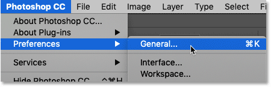
*Going to Edit (Win) / Photoshop CC (Mac) > Preferences > General.*

In the [Preferences dialog box](/basics/essential-photoshop-preferences-beginners/), select the option that says **Use Legacy "New Document" Interface**, and then click OK to close the dialog box:

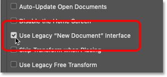
*Turning on the 'Use Legacy "New Document" Interface' option.*

Then create a new document by going up to the **File** menu and choosing **New**:

*Going to File > New.*

And this time, we see the [legacy New Document dialog box](/basics/legacy-new-document-dialog-box-photoshop-cc/), with all of the same settings but in a more compact, streamlined design. If you prefer the newer version, just go back to Photoshop's Preferences and deselect the **Use Legacy "New Document" Interface** option:

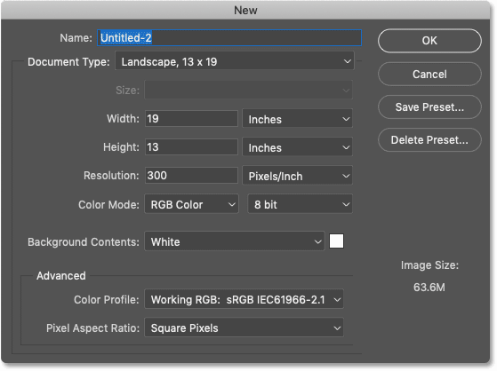
*The original "legacy" version of the New Document dialog box.*