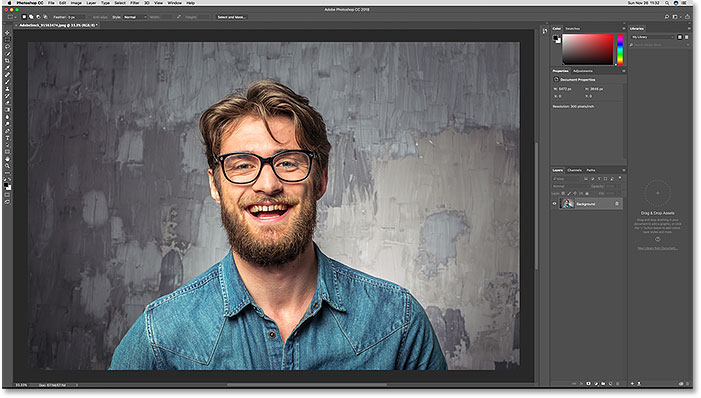
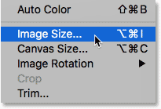
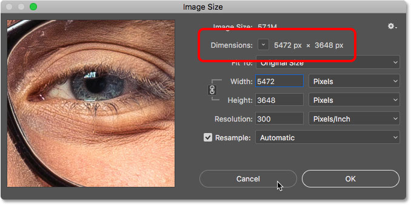
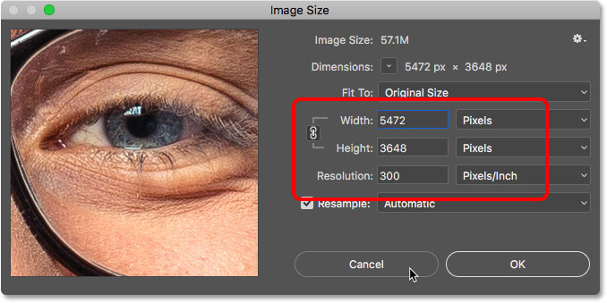
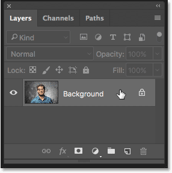
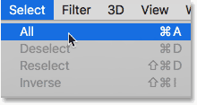
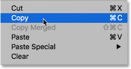
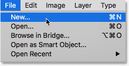
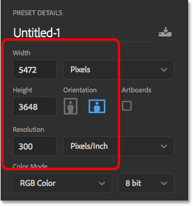

# Create A New Document The Same Size As An Open Document

> Source: [https://www.photoshopessentials.com/basics/create-new-photoshop-document-same-size-as-open-document/](https://www.photoshopessentials.com/basics/create-new-photoshop-document-same-size-as-open-document/)
> Downloaded and converted to Markdown.

This tutorial shows you how to quickly create a new Photoshop document that matches the exact size (width, height and resolution) of an open document. Works with Photoshop CC, CS6 and earlier.

Whether we're compositing images or creating designs in Photoshop, we often need to create a new document that will match the size of our open document. By "size", I mean that both documents will need to share the same width, height and resolution. What most Photoshop users will do is open the Image Size dialog box and write down the size of the current document. Then, they'll create a new document and manually enter the same width, height and resolution values into the New Document dialog box.

That's one way to work, but there's a faster way, and one that does not involve remembering or writing down numbers. The next time you need to create a new Photoshop document at the same size as your current document, here's how to do it! I'll be using [Photoshop CC 2018](https://prf.hn/l/dlXjD2w) but any recent version will work.

## Where To Find The Current Document Size

You won't need to do this step every time, but just to confirm that the new document we'll be creating does match the size of the current document, let's quickly check our current document's size. Here's the image I have open in Photoshop (photo from [Adobe Stock](https://prf.hn/l/yOWnd1m)):

*The currently-open document in Photoshop.*

### The Image Size Dialog Box

To view the document size, go up to the **Image** menu in the Menu Bar and choose **Image Size**:

*Going to Image > Image Size.*

This opens the Image Size dialog box. There are two places where we can view the document's width and height. One is next to the word **Dimensions** at the top. Here we see that my document has a width of 5472 px and a height of 3648 px. If you're Image Size dialog box is showing the dimensions using a measurement type other than pixels (like percent, inches, and so on), click on the small **triangle** and choose **Pixels** from the list:

*The pixel dimensions (width and height) of the open document.*

The second place to view the document size is in the **Width**, **Height** and **Resolution** boxes. Here, we see the same width and height values as the ones shown next to the word "Dimensions", and we also see that my document is set to a resolution of 300 pixels per inch. We won't be making any changes here, so click **Cancel** to close the Image Size dialog box

*The width, height and resolution of the open document.*

**[Related: The 72 PPI Web Resolution Myth](/essentials/the-72-ppi-web-resolution-myth/)**

## How To Create A New Document At The Same Size

### Step 1: Select The Background Layer

To create a new Photoshop document that matches the width, height and resolution of your current document, first select the **Background layer** in the [Layers panel](/basics/layers/layers-panel/). This will make sure that you're grabbing the full dimensions of the document and not just the size of whatever happens to be on a different layer. If the only layer in your document is the Background layer, you can skip this step:

*Selecting the Background layer.*

### Step 2: Select All

Go up to the **Select** menu in the Menu Bar and choose **All**. A selection outline appears around the image:

*Going to Select > All.*

### Step 3: Copy The Background Layer

Next, go up to the **Edit** menu in the Menu Bar and choose **Copy**. This sends a copy of the Background layer to the clipboard:

*Going to Edit > Copy.*

### Step 4: Create A New Photoshop Document

To create the new document, go up to the **File** menu and choose **New**:

*Going to File > New.*

In the New Document dialog box, look at the **Width**, **Height** and **Resolution** fields and you'll see that Photoshop has automatically filled them in with the dimensions from your other document. Click **Create** (Photoshop CC) or **OK** (CS6 or earlier) to create your new document at the same size:

*The new document will share the same dimensions as the open document.*

And there we have it! That's how to quickly create a new document that will match the size of your open document in Photoshop! Looking for similar tutorials and tips? See our [Complete Guide to Opening Images in Photoshop](/basics/opening-images-photoshop/), or visit our [Photoshop Basics](/basics/) section!