# Creating A New Background Layer Action In Photoshop

> Source: [https://www.photoshopessentials.com/basics/creating-new-background-layer-action-photoshop/](https://www.photoshopessentials.com/basics/creating-new-background-layer-action-photoshop/)
> Downloaded and converted to Markdown.

Learn how to create a new Background layer for a Photoshop document from scratch, and how to save your steps as a time-saving action! For Photoshop CS6, CC and earlier versions of Photoshop.

Previously, we learned all about Photoshop's [Background layer](/basics/layers/background-layer/) and why it's different from normal layers. Since the Background layer serves as the background for our document, there are certain things that Photoshop won't allow us to do with it. The most important of those things are that we can't move the contents of the Background layer, we can't move other layers below the Background layer, and since the Background layer does not support transparency, we can't delete any pixels from the Background layer.

If you're doing image retouching work (adjusting the exposure and contrast, correcting colors, removing skin blemishes, and so on), the Background layer's limitations probably won't be an issue. But if you're creating photo effects, compositing multiple images together, or doing anything where you need more control over the initial photo you opened in your document, then the Background layer can quickly become a problem.

This is lesson 5 in my [Photoshop Layers Learning Guide](/photoshop-layers-learning-guide/).

Let's get started!

Let's look at a simple example to show you what I mean. Here's an image I've opened in Photoshop. I downloaded this one from [Adobe Stock](https://prf.hn/l/mejxP81) but you can easily follow along with any image of your own:

*The original image.*

Whenever we open an image, Photoshop automatically places it on the Background layer, as we see here in my [Layers panel](/basics/layers/layers-panel/):

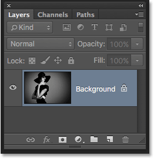
*The Layers panel showing the image on the Background layer.*

Let's say I want this image to appear in front of a white background, with the white background acting as a border around the photo. Sounds easy enough, right? And yet, there's a problem. Since my photo currently *is* the background for the document, how do I place a different background under it? The answer is, I can't. Photoshop won't allow us to place any other layers below the Background layer.

And let's say I also want to add a basic drop shadow below the image. Again, it sounds easy, but we're faced with the same problem. The photo would need something else below it in order for the shadow to be visible, but Photoshop won't let us place anything below the Background layer.

In fact, if we look at the **Layer Styles** icon (the "fx" icon) at the bottom of Layers panel, which is what we would normally click on to add a drop shadow (as well as any other layer effects), we see that the icon is grayed out. Photoshop won't let us add layer effects to the Background layer:

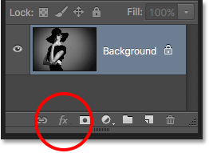
*The Layer Styles icon is currently unavailable.*

So what's the solution? Well, the solution really has two parts to it. First, we need to convert our initial Background layer into a normal layer. That way, we'll have complete control over the image and we'll be able to do whatever we need to do with it. Second, we need to create a new Background layer from scratch and place it below the image.

Fortunately, the steps for doing both of these things are very simple. But even simple things take time. So, since this is something we'll need to do a lot in Photoshop, rather than performing the steps manually every time, we'll go through them once here and save them all as an **action**.

What's an action? In Photoshop, an action is a pre-recorded series of steps. You simply create a new action and then record your steps. After that, any time you need to perform the same steps again, rather than doing them yourself, you just play the action and let Photoshop do the work for you! In our case here, once we've recorded the steps for creating a new Background layer, then in the future, we can let Photoshop create one for us just by playing the action. Let's see how it works.

## How To Create A Background Layer Action

### Step 1: Check Your Background Color

When we create a new Background layer, Photoshop will fill the layer with our current **Background color**. So before we go any further, and to avoid unexpected results, we should check to make sure that our Background color is set to the color we need.

We can see our current Foreground and Background colors in the **color swatches** near the bottom of the **Tools panel**. By default, Photoshop sets the Foreground color to black and the Background color to white. Since white is the most common color for the background, these default colors work great.

If your Foreground and Background colors are set to something other than the defaults, press the letter **D** on your keyboard to quickly reset them (think "D" for "Default colors"):

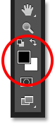
*The Foreground (upper left) and Background (lower right) color swatches.*

If you'd rather fill your Background layer with black instead of white, first press the letter **D** on your keyboard to reset the Foreground and Background colors to their defaults (if needed). Then press the letter **X** on your keyboard to swap them, which sets your Background color to black:

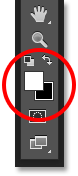
*Press X to swap the Foreground and Background colors.*

You can press X again if you change your mind to swap them back to the default settings, which is what I'm going to do because I want my Background layer to be filled with white. Either way, just make sure you check your Background color before creating the Background layer.

### Step 2: Open The Actions Panel

To record our action, we need to use Photoshop's **Actions panel**. Unlike the Layers panel, the Actions panel is not one of the panels that Photoshop opens for us by default, so we'll need to open it ourselves.

Go up to the **Window** menu in the **Menu Bar** along the top of the screen. Here, you'll find a list of every panel that's available to us in Photoshop. Select the Actions panel from the list. If you see a checkmark next to the panel's name, it means the panel is already open somewhere on your screen. If you don't see the checkmark, go ahead and select it:

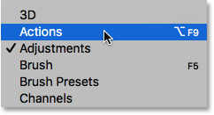
*Going to Window > Actions.*

This opens the Actions panel. Photoshop includes a collection of default actions which are found in the cleverly-named **Default Actions** set. You can twirl the Default Actions set open to view the actions inside of it by clicking the **triangle** icon to the left of the little folder icon. Clicking the triangle again will close the set:

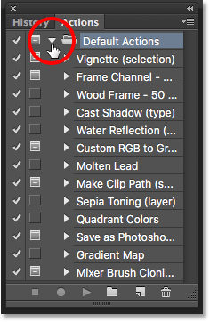
*Viewing Photoshop's default actions.*

### Step 3: Create A New Action Set

We're going to create our own action, and rather than adding it in with Photoshop's default actions, let's create a new **action set**. An action set is like a folder that holds the actions inside of it. Creating different action sets lets us keep related actions together.

To create a new set, click the **New Set** icon (the folder icon) at the bottom of the Actions panel:

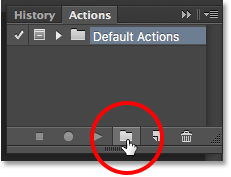
*Clicking the New Set icon.*

This opens the New Set dialog box where we give the set a name. You can name it anything you like. I'll name mine "My Actions". Click OK when you're done to close out of the dialog box:

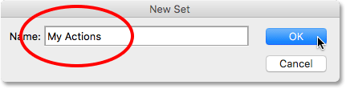
*Naming the new action set.*

The new action set appears below the Default Actions set in the Actions panel:

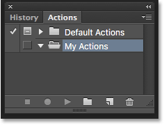
*The new set has been added.*

### Step 4: Create A New Action

Now that we have our set, let's create a new action. Click the **New Action** icon directly to the right of the New Set icon:

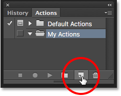
*Clicking the New Action icon.*

This opens the New Action dialog box. Give your action a descriptive name. I'll name mine "New Background Layer". Then, make sure the **Set** option (short for Action Set) directly below it is showing the action set you just created, which in my case is named "My Actions". We want to make sure the action is going to be placed into the correct set:

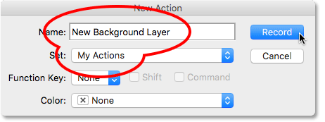
*The New Action dialog box.*

### Step 5: Click "Record"

When you're ready, click the **Record** button to close out of the dialog box and begin recording your action:

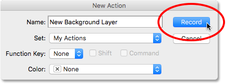
*Clicking the Record button.*

If we look again in the Actions panel, we see that the red **Record** icon has been activated, letting us know that we're now in Record mode:

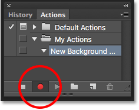
*Photoshop is now in Record mode.*

From this moment on, Photoshop is going to record all of our steps so we can play them back later. But don't worry about how long it takes you to complete the steps. Recording an action in Photoshop is not like recording a movie. In other words, we're not recording in real time. Photoshop records only the steps themselves, not the time it takes to complete them. So sit back, relax, take all the time you need, and let's record our action!

### Step 6: Convert The Background Layer Into A Normal Layer

The first thing we need to do is convert our current Background layer into a normal layer. To do that, go up to the **Layer** menu at the top of the screen, choose **New**, and then choose **Layer from Background**:

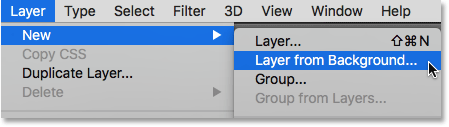
*Going to Layer > New > Layer from Background.*

This opens the New Layer dialog box. Leave the name set to "Layer 0" and click OK to close out of the dialog box:

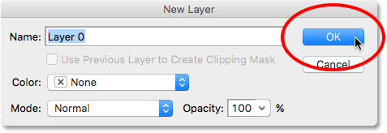
*The New Layer dialog box.*

If we look in the Layers panel, we see that our Background layer is no longer a Background layer. It's now a normal layer named "Layer 0". So far, so good:

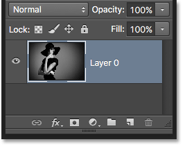
*The Background layer has been converted to a normal layer.*

### Step 7: Add A New Layer

Next, we'll add a new layer that will become our new Background layer. Click the **New Layer** icon at the bottom of the Layers panel:

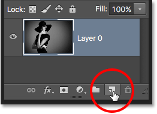
*Clicking the New Layer icon.*

Photoshop adds a new blank layer named "Layer 1" above the image:

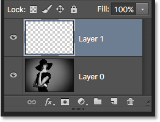
*The Layers panel showing the new blank layer.*

### Step 8: Convert The Layer Into A Background Layer

Let's convert the new layer into a Background layer. Go back up to the **Layer** menu, choose **New**, and then choose **Background from Layer**:

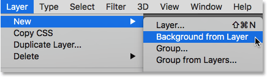
*Going to Layer > New > Background from Layer.*

A couple of things happen. First, as soon as we convert the layer into a Background layer, Photoshop automatically moves the layer from *above* the image to *below* the image in the Layers panel. That's because one of the main rules of Background layers is that they must always be the bottom layer in the document. No other layers can appear below a Background layer.

Second, if we look at the Background layer's **preview thumbnail** to the left of the layer's name, we see that Photoshop filled the Background layer with **white**. As we learned earlier, that's because Photoshop automatically fills the Background layer with our current Background color. In my case, it was white:

*The Layers panel showing the new Background layer.*

### Step 9: Stop Recording

At this point, we've done everything we need to do. We've converted the original Background layer into a normal layer, and we've created a brand new Background layer from scratch. Since there are no more steps to complete, let's stop recording our action by clicking the **Stop** icon (the square) at the bottom of the Actions panel:

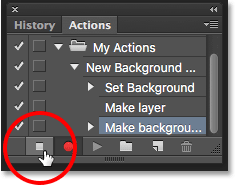
*Clicking the Stop icon.*

The steps for creating a new Background layer are now saved as an action! We can see the steps listed under the action's name. We don't need to see them, though, so I'm going to toggle the action closed by clicking the **triangle** icon to the left of its name:

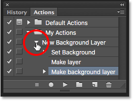
*Closing the action by clicking the triangle.*

And now we see just the name of the action ("New Background Layer") listed under the "My Actions" set:

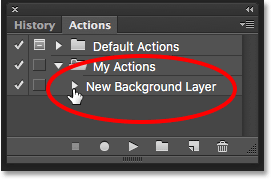
*The Actions panel after closing the action.*

### Step 10: Revert The Image

Lets test our new action to make sure it works. To do that, we'll revert the image back to its original state by going up to the **File** menu at the top of the screen and choosing **Revert**:

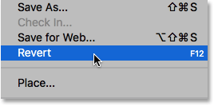
*Going to File > Revert.*

The Revert command in Photoshop restores the image either to its previously-saved version or, as in our case here, to its original, newly-opened version. If we look in the Layers panel, we see that we're back to having our image as the Background layer of the document:

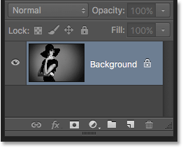
*The default Background layer has returned.*

### Step 11: Play The Action

Before we test the action, I'm going to swap my Foreground and Background colors by pressing the letter **X** on my keyboard so that my **Background color** is now **black** instead of white:

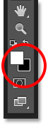
*Setting my Background color to black.*

Let's play the action and see what happens. To play it, click on its name in the Actions panel to select it:

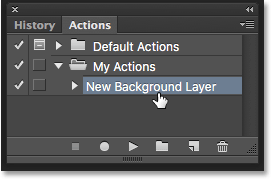
*Selecting the "New Background Layer" action.*

Then, click the **Play** icon (the triangle) to play it:

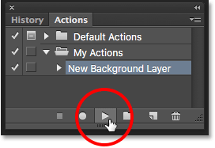
*Clicking the Play icon.*

No matter how long it took us to record the steps, Photoshop plays them back instantly. And if we look again in the Layers panel, we see that everything is already done! The original Background layer was converted to a normal layer named "Layer 0" and a new Background layer was created and placed below it!

Notice that the preview thumbnail for my new Background layer is filled with black this time instead of white. That's because I set my Background color to black before playing the action:

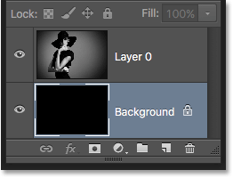
*The Layers panel after playing the action with the Background color set to black.*

### Changing The Color Of The Background Layer

If you forgot to check your Background color before playing the action and ended up with the wrong color for the Background layer, no worries. You can easily change its color afterwards. First, make sure the Background layer is selected in the Layers panel. Then, go up to the **Edit** menu at the top of the screen and choose **Fill**:

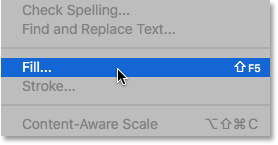
*Going to Edit > Fill.*

I need my Background layer to be white, so I'll set the **Use** option at the top of the Fill dialog box to **White**:

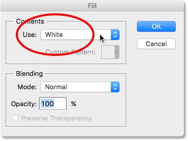
*Selecting a new color for the Background layer.*

Click OK to close out of the dialog box, at which point Photoshop fills the Background layer with your chosen color. If we look again at the preview thumbnail for my Background layer, we see that it's now filled with white:

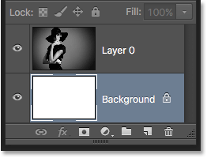
*The Background layer color has been changed from black to white.*

Of course, we haven't actually seen the Background layer yet in the document because the photo is blocking it from view, so I'll quickly resize my photo by first selecting its layer (Layer 0) in the Layers panel:

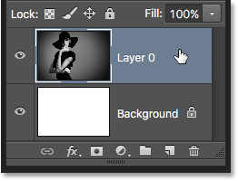
*Selecting the photo's layer.*

Then I'll go up to the **Edit** menu at the top of the screen and choose **Free Transform**:

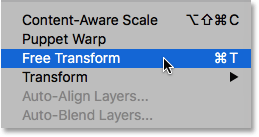
*Going to Edit > Free Transform.*

This places the [Free Transform](/basics/photoshops-free-transform-essentials/) box and handles around the image. I'll press and hold **Shift+Alt** (Win) / **Shift+Option** (Mac) on my keyboard as I click on the handle in the top left corner of the image and drag it inward to make the photo a bit smaller. Holding the Shift key as I drag locks the aspect ratio of the image as I'm resizing it, while the Alt (Win) / Option (Mac) key resizes the image from its center rather than from the corner.

With the image now smaller, we can see the white background appearing as a border around it:

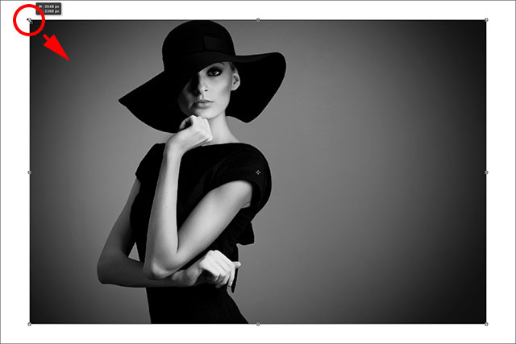
*Resizing the image with Free Transform.*

I'll press **Enter** (Win) / **Return** (Mac) on my keyboard to accept the transformation and close out of the Free Transform command. Then, I'll add a drop shadow to the image by clicking the **Layer Styles** icon at the bottom of the Layers panel. This is the same icon that was grayed out earlier when the image was on the Background layer:

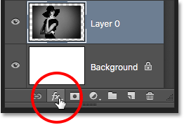
*Clicking the Layer Styles icon.*

I'll select **Drop Shadow** from the list of layer styles that appears:

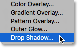
*Selecting a Drop Shadow layer style.*

This opens Photoshop's Layer Style dialog box set to the Drop Shadow options in the middle column. I'll set the **Angle** of the shadow to **135°** so that the light source is coming from the upper left. Then, since I'm working on a fairly large image here, I'll set the **Distance** of the shadow to **40 pixels**, and I'll set the **Size** value (which controls the softness of the shadow edges) to **40 pixels** as well. Finally, I'll lower the **Opacity** of the shadow down to **50%**:

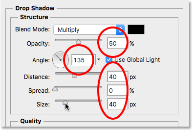
*The Drop Shadow options in the Layer Style dialog box.*

I'll click OK to accept my settings and close out of the dialog box, and here's my final result with the drop shadow applied:

*The final result after applying the drop shadow.*

That last part (resizing the image and adding a drop shadow) was a bit beyond the scope of this tutorial (which is why I went through it quickly) but it served as an example of something we could do with the image that would not have been possible if the image itself had remained the Background layer for the document. Converting the image into a normal layer and then adding our own, separate Background layer below it freed us from the Background layer's limitations, making it easy to achieve our goal.

And, since we recorded those steps as an action, the next time we need to replace the default Background layer with a new one, we can just play the action and let Photoshop do all the work! And there we have it!