# Crop and Resize Photos to Match Frame Sizes with Photoshop

> Source: [https://www.photoshopessentials.com/basics/crop-and-resize-photos-to-match-frame-sizes-with-photoshop-cc/](https://www.photoshopessentials.com/basics/crop-and-resize-photos-to-match-frame-sizes-with-photoshop-cc/)
> Downloaded and converted to Markdown.

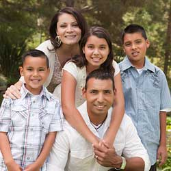

Learn how to easily crop and resize an image to fit in any frame size you need using the Crop Tool in Photoshop! For Photoshop CC and CS6.

When resizing an image for print, a problem we often face is that the aspect ratio of our image is different from the aspect ratio of the frame we want to place the image into. Since we can't change the frame size, we need a way to change the aspect ratio of the image. In this lesson, I'll show you how easy it is to both change the aspect ratio *and* resize your image for the highest print quality using Photoshop's Crop Tool! Let's see how it works.

I'll be using [Photoshop CC](https://prf.hn/l/dlXjD2w) here but you can also follow along with Photoshop CS6.

Let's get started!

## Image size vs frame size

First, let's quickly look at the problem. Here's [an image](https://prf.hn/l/0Gmw5mP) I've opened in Photoshop that I downloaded from Adobe Stock:

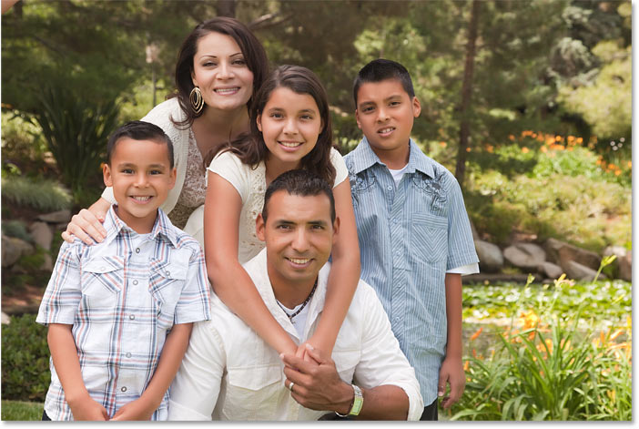
*The original photo. Credit: Adobe Stock.*

Let's say I want to print this image so that it will fit inside a standard 8" by 10" frame. Normally, we [resize images in Photoshop](/basics/how-to-resize-images-in-photoshop-complete-guide/) using the Image Size dialog box. To open it, I'll go up to the **Image** menu in the Menu Bar and I'll choose **Image Size**:

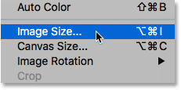
*Going to Image > Image Size.*

In Photoshop CC, the [Image Size dialog box](/basics/photoshops-image-size-command-features-and-tips/) features a new preview window on the left, along with the image size options on the right:

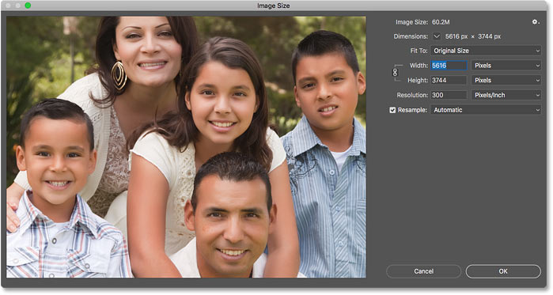
*The Image Size dialog box in Photoshop CC.*

### Why the usual way to resize an image won't work

But here's the problem. Remember that I want to fit this image into an 8" by 10" frame. But since the current aspect ratio of my image is *not* 8 x 10, the Image Size dialog box won't let me resize it to the 8" by 10" frame size that I need. If I try setting the **Width** to **8 Inches**, the **Height** value is wrong:

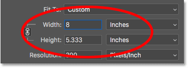
*Setting the Width value makes the Height wrong.*

And if I change the **Height** to **8 inches**, then the **Width** value is wrong. And the same thing will happen if I try setting the Width or Height to 10 Inches. The other value will always be wrong, and it's because the aspect ratios of my image and of the frame are different:

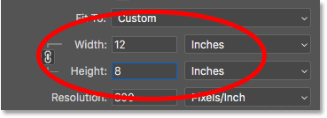
*Setting the Height value makes the Width wrong.*

Now I *could* unlink the Width and Height values by clicking the **link icon** between them, and this would let me change the Width and Height independently. So if I want to keep the image in landscape orientation, where the width is larger than the height, I could enter **10 Inches** for the **Width** and **8 Inches** for the Height:

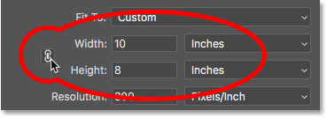
*Unlinking the Width and Height values and setting them independently.*

But as we can see in the preview window, this squishes the image horizontally, which isn't what I want to do:

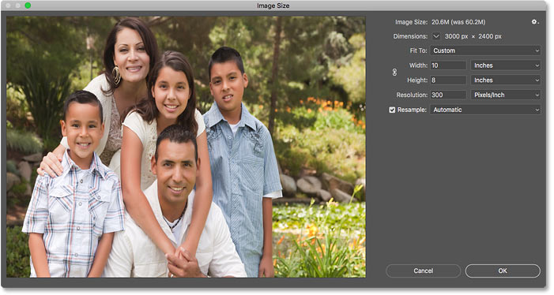
*The image looks distorted after unlinking the Width and Height.*

As long as the image and the frame I want to display it in are using different aspect ratios, then the standard way of resizing images using the Image Size dialog box isn't going to work. So I'll click the **Cancel** button to close the dialog box without making any changes:

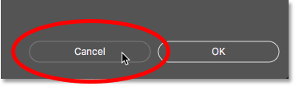
*Canceling and closing the Image Size dialog box.*

## How to crop and resize the image with the Crop Tool

What we need is a way to crop our image to the same aspect ratio as the frame before resizing it. And we can do that using the [Crop Tool](/basics/how-to-crop-images-photoshop-cc/). In fact, the Crop Tool lets us crop the image *and* resize it for print all in one shot!

### Step 1: Select the Crop Tool

First, I'll select the **Crop Tool** from the [Toolbar](/basics/photoshop-tools-toolbar-overview/):

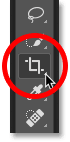
*Selecting the Crop Tool.*

Photoshop places the crop border and handles around the image:

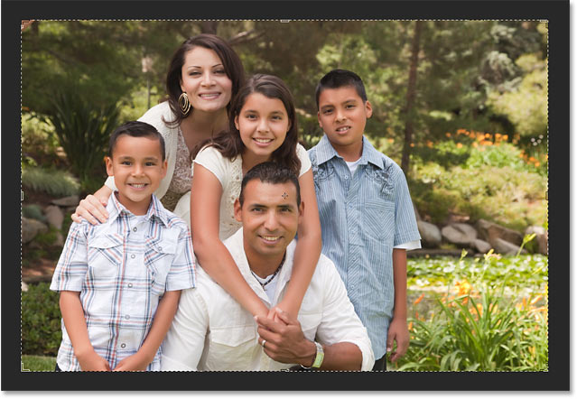
*The crop border and handles appear.*

### Step 2: Choose "W x H x Resolution" from the Aspect Ratio menu

Now if I just wanted to crop the image to the new aspect ratio, without caring about the actual [print size](/basics/how-to-resize-images-for-print-with-photoshop/), I could do that by entering the new ratio into the **Width** and **Height** fields in the Options Bar. Since I want to crop it as an 8 x 10, and in landscape orientation with the width larger than the height, I'll enter **10** for the **Width** and **8** for the **Height**. Notice that I'm not entering a specific measurement type, like inches or pixels. I'm only entering the aspect ratio itself:

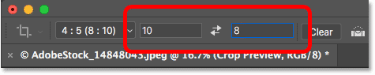
*Entering the new aspect ratio into the Width and Height fields.*

Photoshop automatically resizes the crop border to match the new ratio:

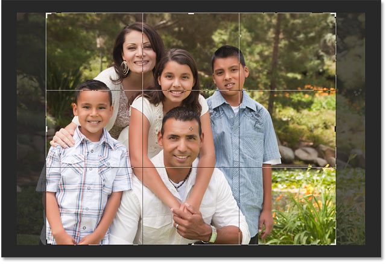
*The crop border has been resized to the new aspect ratio.*

But in this case, changing the aspect ratio isn't the only thing I want to do. I actually want to resize the image so that it will print at exactly 10 inches wide and 8 inches tall. To do that, I'll click on the **Aspect Ratio** option in the Options Bar:

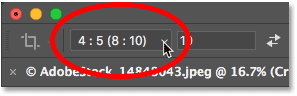
*Clicking the Aspect Ratio option.*

And from the menu, I'll choose **W x H x Resolution** (Width x Height x Resolution):

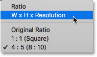
*Choosing "W x H x Resolution".*

### Step 3: Enter the new Width and Height, in inches

Then, I'll re-enter the same aspect ratio as before. But this time, I'll also include the measurement type. So instead of just entering 10 for the **Width**, I'll enter **10 in**, for inches. And for the **Height**, I'll enter **8 in**, again for inches:

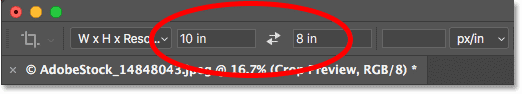
*Entering the width and height, this time in inches.*

### Step 4: Set the Resolution to 300 pixels/inch

Notice that we also have a third box now, and this third one is for the **Resolution** value. Since I'll want the image to [print at the highest quality](/basics/how-to-resize-images-for-print-with-photoshop/), I'll enter the industry standard resolution of **300 pixels/inch**:

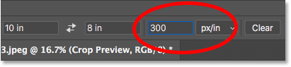
*Entering the print resolution.*

### Step 5: Reposition the crop border around your subject

Then, I'll drag the image to the right to reposition the family inside the crop boundary:

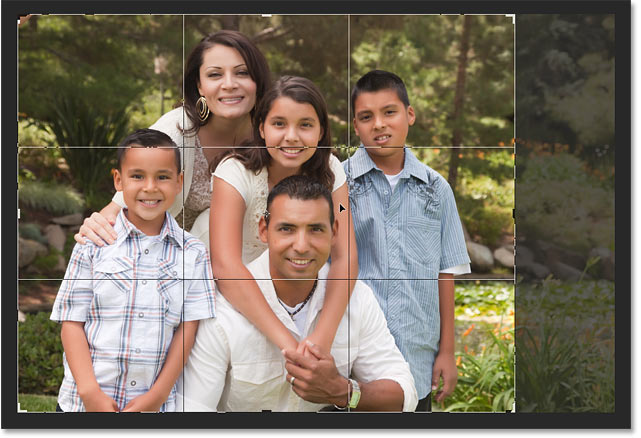
*Dragging the image to fit the subjects inside the crop border.*

### Step 6: Click the checkmark

And finally, to commit the crop and resize the image, I'll click the **checkmark** in the Options Bar:

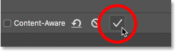
*Clicking the checkmark to crop and resize the image.*

To fit the cropped image on the screen, I'll go up to the **View** menu and I'll choose **Fit on Screen**:

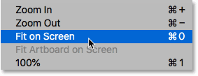
*Going to View > Fit on Screen.*

And here's our image at its new aspect ratio:

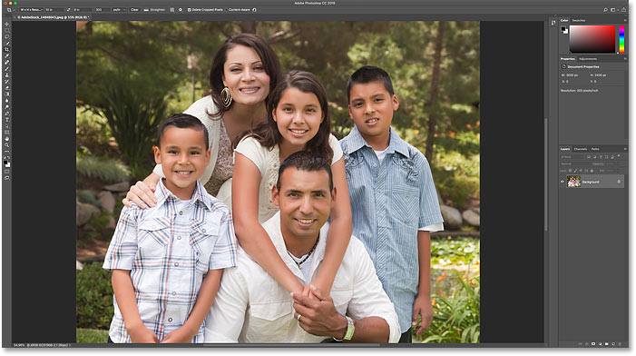
*The image after cropping and resizing it to the 8 x 10 frame size.*

## How to check that the print and frame sizes match

Let's finish off by checking to make sure that the image will now print at the frame size we need. I'll re-open the Image Size dialog box by going up to the **Image** menu and choosing **Image Size**:

*Going to Image > Image Size.*

And sure enough, if I change the measurement type for the Width and Height to Inches, we see that the image will now print at exactly 10 inches wide and 8 inches tall, at a resolution of 300 pixels/inch, which means it will now fit perfectly and look great in an 8" by 10" frame:

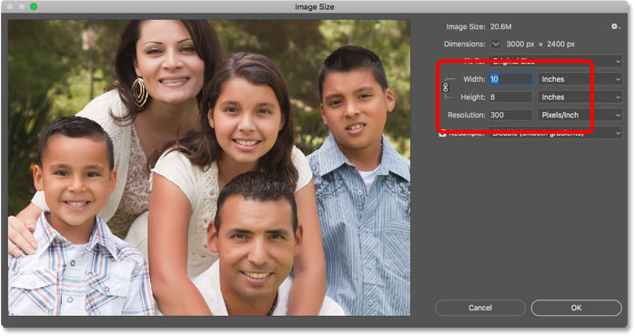
*Confirming the new print size.*

And there we have it! In the next lesson, I show you how the Crop Tool's [Content-Aware](/basics/new-content-aware-crop-tool-photoshop-cc/) feature can add more room to your photos by automatically filling empty space with more photo!

You can jump to any of the other lessons in this [Cropping Images in Photoshop](/basics/cropping-images-in-photoshop-complete-lesson-guide) series. Or visit our [Photoshop Basics](/basics/) section for more topics!