# How to Crop Images in a Circle Shape with Photoshop

> Source: [https://www.photoshopessentials.com/basics/crop-image-circle-photoshop/](https://www.photoshopessentials.com/basics/crop-image-circle-photoshop/)
> Downloaded and converted to Markdown.

Tired of cropping your photos as rectangles and squares? Learn how easy it is to crop images as circles with Photoshop, and how to save the circle with a transparent background so the image looks great in a design or on the web! A step-by-step tutorial.

When cropping images in Photoshop, we usually think of rectangles or squares. That’s because the Crop Tool in Photoshop has no other options. 

But who says we need to use the Crop Tool? Photoshop makes it just as easy to crop an image using a selection tool. And in this tutorial, I show you which selection tool you need to crop your image in a circle. You'll learn the trick to drawing a selection as a perfect circle around your subject, and how to crop your image around the selection using a layer mask.

Then once we've cropped the image, I show you how to save it with a transparent background so you can place it onto any other background you like.

Here’s an example of what the image cropped in a circle will look like when we’re done, complete with transparent corners so the new background will show through.

*The final result.*

Let's get started!

### Which version of Photoshop do I need?

I’m using Photoshop 2023 but any recent version will work. You can [get the latest Photoshop version here](https://adobe.prf.hn/click/camref:1100lrdjJ/destination:https%3A%2F%2Fwww.adobe.com%2Fproducts%2Fphotoshop.html).

### The document setup

You can follow along with any image. I'll use [this image](https://adobe.prf.hn/click/camref:1100lrdjJ/destination:https%3A%2F%2Fstock.adobe.com%2Fstock-photo%2Fportrait-of-a-beautiful-young-brunette-woman%2F50129600) from Adobe Stock:

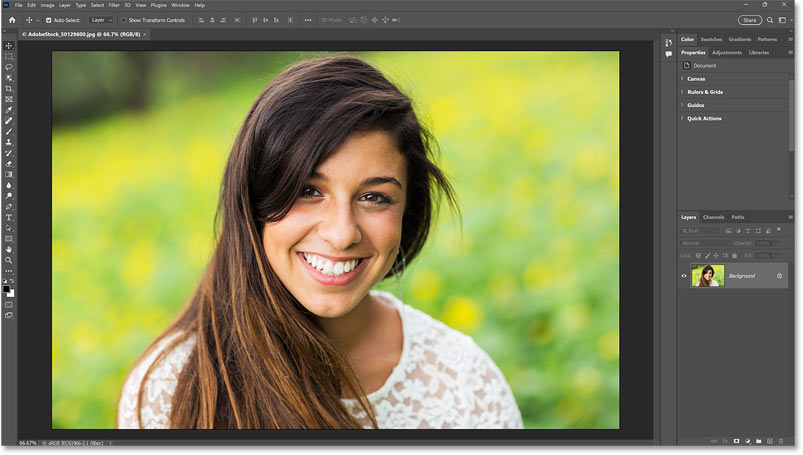
*The image that will be cropped in a circle.*

[Related: How to Crop a Single Layer in Photoshop](/basics/how-to-crop-a-single-layer-in-photoshop/)

## Step 1: Unlock the Background layer

In the [Layers panel](/basics/layers/layers-panel/), the newly-opened image appears on the Background layer.

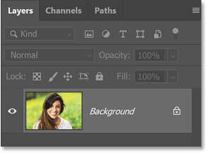
*Photoshop's Layers panel.*

Before we can crop the image in a circle, the Background layer needs to be converted to a [normal layer](/basics/understanding-photoshop-layers/). That’s because the areas around the circle will need to be transparent and [Background layers](/basics/background-layer-photoshop-cc/) do not support transparency.

So to convert it to a normal layer, just click the **lock icon**.  Or if you're using an older version of Photoshop and clicking the lock icon does not work, hold the **Alt** (Win) / **Option** (Mac) key on your keyboard and double-click on the Background layer.

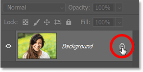
*Clicking the lock icon.*

Photoshop renames the Background layer to "Layer 0", the lock icon disappears, and we're ready to crop the image into a circle.

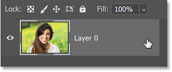
*The Background layer is now a normal layer.*

## Step 2: Select the Elliptical Marquee Tool

To draw a selection as a circle around our subject, we need the **Elliptical Marquee Tool** which is found in the [toolbar](/basics/photoshop-tools-toolbar-overview/).

By default, the [Elliptical Marquee Tool](/basics/photoshop-selection-basics-the-rectangular-and-elliptical-marquee-tools/) is hiding behind the Rectangular Marquee Tool. So click and hold on the Rectangular Marquee Tool until a fly-out menu appears. Then choose the Elliptical Marquee Tool from the list.

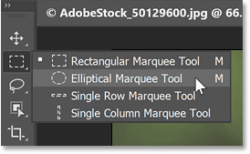
*Selecting the Elliptical Marquee Tool.*

## Step 3: Draw a circular selection outline around your subject

With the Elliptical Marquee Tool active, click and drag on your image to begin drawing an elliptical selection outline. 

Don’t worry that it’s not a circle or that it’s not centered around your subject. We’ll fix both of these things next.

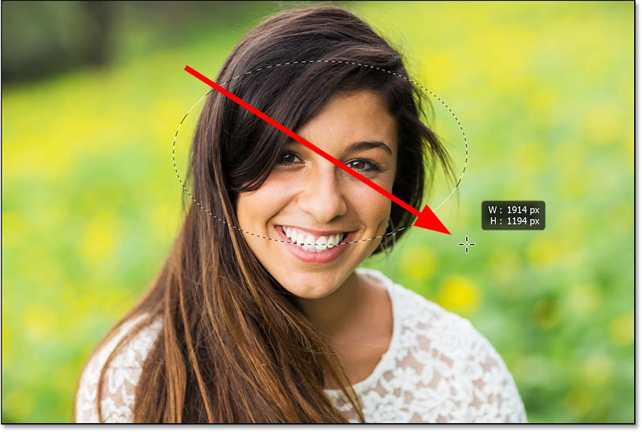
*Drawing the initial elliptical selection outline.*

### How to draw the selection as a perfect circle

To force the outline into a perfect circle, keep your mouse button held down and hold the **Shift** key on your keyboard. 

Then continue dragging. You’ll now be drawing a circle.

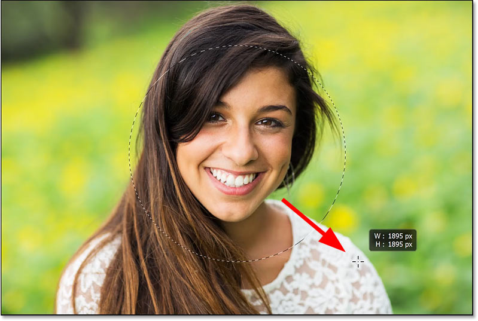
*Holding Shift forces the outline into a perfect circle.*

### How to reposition the selection as you draw it

If the outline is not being drawn where you need it (not centered around your subject), keep your mouse button and the Shift key held down and add the **spacebar**. 

Then drag to reposition the selection outline around your subject.

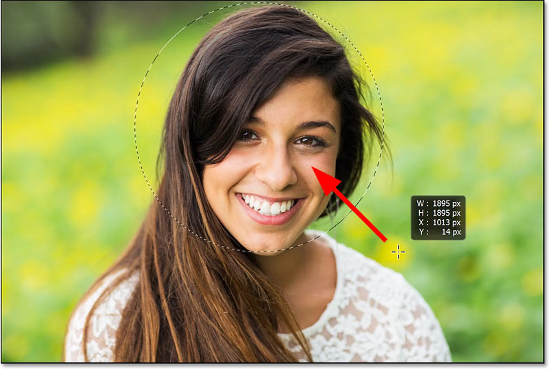
*Holding the spacebar and dragging the outline into place.*

Release the spacebar (but not your mouse button or the Shift key) once the outline is in place and continue dragging out the selection.

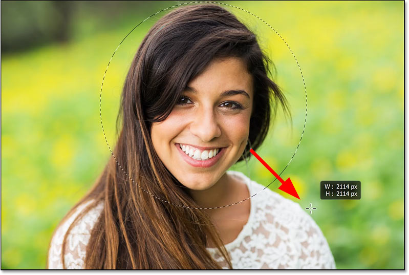
*Releasing the spacebar to continue drawing the selection outline. *

Once you’ve drawn the selection outline at the size you need, release your mouse button to complete it and then release your Shift key. 

It’s very important that you release your mouse button first, *then* the Shift key, or the outline will snap back to a random elliptical shape and you’ll lose the perfect circle.

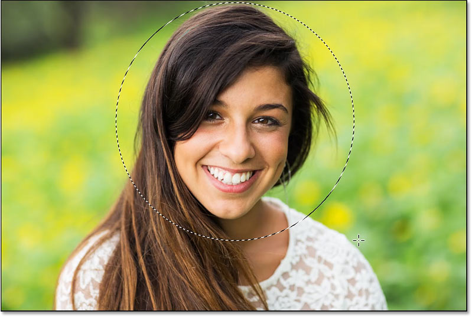
*Completing the selection by releasing my mouse button, then the Shift key.*

### Repositioning the outline after you draw it

If your selection outline is still not quite centered around your subject after you’ve released your mouse button, it's not too late to move it.

With the Elliptical Marquee Tool still active, just click inside the outline and drag it into place. Here I’m moving the selection just a bit higher and to the left.

*Click inside the selection outline and drag to reposition it if needed.*

## Step 4: Add a layer mask

Now that we've drawn the selection outline as a perfect circle around our subject, how do we use it to crop the image?

Well, we’re not going to "crop" it in the traditional sense. Instead, we’re going to hide everything outside the outline by converting the selection into a [layer mask](/basics/understanding-photoshop-layer-masks/).

In the Layers panel, click the **Add Layer Mask** icon at the bottom.

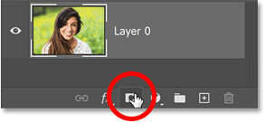
*Clicking the Add Layer Mask icon.*

Everything outside the selection outline instantly disappears and is replaced with transparency (indicated by the checkerboard pattern).

*The result after converting the selection outline to a layer mask.*

Back in the Layers panel, we see the **layer mask thumbnail** that was added to the layer. 

The white circle on the mask is where the image is still visible, and the black area surrounding it is where the image is hidden.

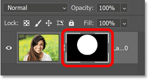
*The layer mask thumbnail.*

## Step 5: Trim away the transparent areas

All we need to do now is trim away the transparent area around the circle.

So go up to the **Image** menu in the Menu Bar and choose the **Trim** command.

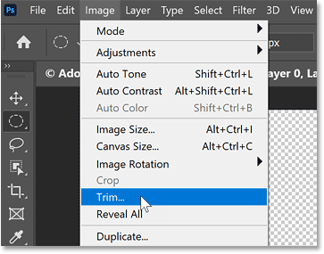
*Choosing Trim from the Image menu.*

In the Trim dialog box, select **Transparent Pixels** at the top. 

Make sure **Top**, **Bottom**, **Left** and **Right** are all selected at the bottom. Then click OK.

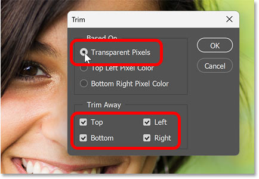
*The Trim options.*

And Photoshop trims away the empty space around the circle.

We still have some transparent areas in the corners of the document, and that’s because a Photoshop document is always rectangular or square. There’s no way to crop the document itself as a circle.

But that’s okay. We just need to make sure that when we save the image, we save it in a format that will keep the corners transparent so that whatever background we place the image onto will show through the transparency. 

And that’s what we’ll do next as our final step.

*The image is now cropped as a circle (with transparent corners).*

## Step 6: Save the cropped image as a PNG file

Everything we’ve done up to this point will be for nothing if we lose the transparency in the corners when saving the image. Which means we need to choose a format that supports transparency.

The JPEG format does not support transparency so it won’t work. But the **PNG** format *does* support transparency, so that’s what we’ll use.

Go up to the **File** menu and choose **Save As**.

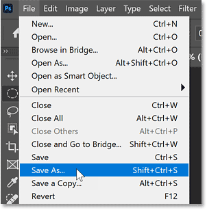
*Choosing the Save As command from the File menu.*

In the Save As dialog box, navigate to where you want to save the image. I’ll save mine to a folder on my Desktop.

Then click the **Save as type** box to view a list of file types we can choose from. Notice that because our document contains transparency, the JPEG format is not even an option (which is good).

The format we want to choose is **PNG**, which does support transparency.

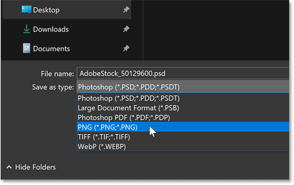
*Choosing the PNG file format from the list.*

Give the file a name. I’ll name mine "image-cropped-as-circle.png".

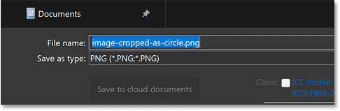
*Naming the file before saving it.*

Then click **Save**.

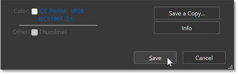
*Naming the file before saving it.*

Finally, in the PNG Format Options dialog box, choose **Smallest file size (Slowest saving)** for the smallest size possible and click OK.

Your cropped image will be saved with the transparent corners still intact, ready to be placed onto any background you like.

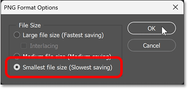
*Choosing the Smallest file size option.*

And there we have it! That's how to crop an image a circle in Photoshop.