# Create Your Own Custom Photoshop Keyboard Shortcuts

> Source: [https://www.photoshopessentials.com/basics/custom-keyboard-shortcuts/](https://www.photoshopessentials.com/basics/custom-keyboard-shortcuts/)
> Downloaded and converted to Markdown.

In this *Photoshop tutorial*, we're going to look at how to create your own custom **Photoshop keyboard shortcuts**, which may not sound as exciting as, say, swapping people's faces in a photo or drawing lightning bolts that shoot out of someone's eyes.

But no matter what you're doing in Photoshop, being able to customize your own keyboard shortcuts is a great (and easy) way to speed up your workflow and make both you and Photoshop much more efficient.

Adobe first introduced the ability to customize our own keyboard shortcuts in *Photoshop CS*, which means you'll need Photoshop CS or higher to follow along. Prior to Photoshop CS, we were basically stuck with whatever keyboard shortcuts the good folks at Adobe felt like giving us. These days, that's no longer the case.

You can now assign a keyboard shortcut to pretty much anything in Photoshop, from Menu Bar options and commands to palettes and palette options, filters, adjustment layers, tools, or whatever you like! We can even change any of the shortcuts that Adobe has built in to Photoshop! If you're the type of person who loves customizing things to suit your own style, or you just want to be able to work faster in Photoshop, you'll definitely want to check out this great feature.

As I stated, you can create keyboard shortcuts for just about anything, but to get you started, we'll look at how to assign shortcuts to two of the most commonly used filters in all of Photoshop, *Gaussian Blur* and *Unsharp Mask*. Both of these filters are used time and time again, yet neither of them have keyboard shortcuts assigned to them, which means that every time we want to use them, we have to drag our mouse cursor up to the Filter menu at the top of the screen and then make our way through sub-menus until we get to them. Wouldn't it be easier and faster to simply press a couple of keys on the keyboard? Of course it would! Let's see how to assign shortcuts to them. You can then use what you've learned to assign keyboard shortcuts to almost anything you want!

### Step 1: Select "Keyboard Shortcuts" From The Edit Menu

Creating, changing or deleting keyboard shortcuts in Photoshop is all done from inside the rather massive Keyboard Shortcuts dialog box, which we access by going up to the *Edit* menu at the top of the screen and choosing *Keyboard Shortcuts* from down near the bottom of the list:

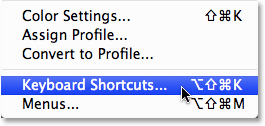
*Go to Edit > Keyboard Shortcuts.*

This brings up the Keyboard Shortcuts dialog box:

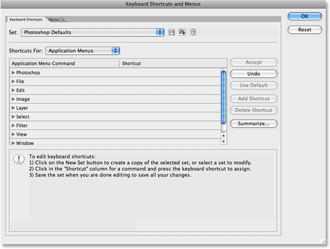
*The Keyboard Shortcuts dialog box.*

As I mentioned above, we're going to be creating shortcuts to a couple of often-used filters, but the process is the same for adding shortcuts to anything. Feel free to either follow along or simply read through the steps so you'll know how to add your own shortcuts for other commands and options.

### Step 2: Choose Which Shortcut "Set" You Want To Make Changes To

Before we go adding or changing keyboard shortcuts, we first need to select which currently existing set of shortcuts we want to make changes to. You'll find this option at the very top of the Keyboard Shortcuts dialog box. By default, the *Photoshop Defaults* set is selected, which means we'll be making changes to the list of shortcuts that are automatically included with Photoshop, and in most cases, this is what we want:

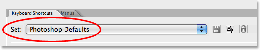
*Choose which existing set of keyboard shortcuts you want to make changes to.*

### Step 3: Choose Which Type Of Shortcut You Want To Create

Photoshop gives us three different types, or categories, of keyboard shortcuts that we can create. We can create shortcuts for *Application Menus*, which are all the different menu options we find up in the Menu Bar at the top of the screen, *Palette Menus*, which are the options we find in the menus of the various palettes, and *Tools*, which are the tools we find in Photoshop's Tools palette, like the Lasso Tool, Rectangular Marquee Tool, Pen Tool, and so on. We can add, change or delete keyboard shortcuts for any of these things, and we choose between these three shortcut categories from the drop-down list directly below the "Set" option we looked at a moment ago. By default, the Application Menus category is selected for us, and since we want to add keyboard shortcuts to a couple of filters, which we find under the Filter menu in the Menu Bar, this is exactly the category we want:

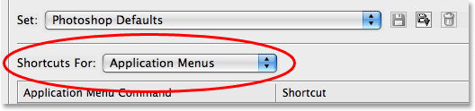
*Select the type of shortcut you want to create.*

### Step 4: Select The Command, Option Or Tool You Want To Create A Shortcut For

Once you've chosen your shortcut category, scroll through the list of available commands, options or tools in the center part of the dialog box until you come to the one you want, then click on it to select it. In my case, I want to add a shortcut for the Gaussian Blur filter, which is found under the Filter menu, so I'll first select the list of filters either by double-clicking on the word *Filter* or by clicking on the small triangle to the left of the word, which twirls open the list. Then I'll scroll down to the *Blur* options, where I find the *Gaussian Blur* filter listed. I'll click on it to select it, which highlights the option in blue and displays a small input box for me in the Shortcut column:

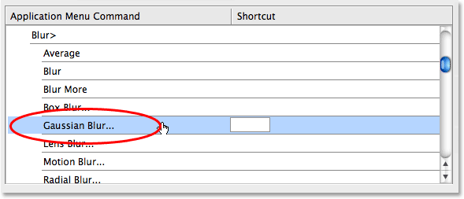
*Scroll through the list of commands, options or tools and select the one you want to create a shortcut for.*

### Step 5: Type In The Keyboard Shortcut You Want To Use

With the Gaussian Blur filter selected in the list, I can simply type in the keyboard shortcut I want to use to access it. Now, one of the problems you'll undoubtedly run into when customizing your own shortcuts in Photoshop is that Adobe has already used up many of the key combinations you'll want to use. Photoshop is, after all, a huge program and there's only so many keys on your keyboard. For example, I think I want to use *Shift+F5* to access the Gaussian Blur filter, so I'll hold down my Shift key and press F5, which appears inside the small input box as "Shift+F5". If we look below the scroll window though, we can see that Photoshop is warning me about something. Apparently, "Shift+F5" is already being used as the shortcut for the Fill command, which is found under the Edit menu:

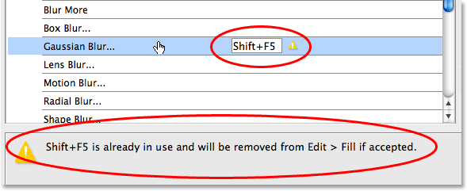
*After typing in a keyboard shortcut, Photoshop may warn you that the shortcut is already in use.*

At this point, I have a couple of options. If I use the Fill command often enough that I want to keep its shortcut, I can simply type in a different shortcut and see if its available. Or, if I don't use the Fill command on a regular basis and don't mind handing its shortcut over to something I use much more frequently, I can simply accept the change. In this case, since I don't use the Fill command very often, I'm quite willing to reassign Shift+F5 to the Gaussian Blur filter which I use all the time, so I'll simply click the *Accept* button on the right of the scroll window:

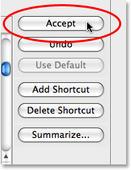
*Click on the "Accept" button to accept the new shortcut.*

I'm going to do the same thing for the Unsharp Mask filter, which is also found under the Filter menu. More specifically, it's found under the Sharpen sub-menu, so I'll scroll down the list of filters until I find the *Sharpen* group, and then I'll continue scrolling until I get to the *Unsharp Mask* filter. I want to assign *Shift+F6* to this filter, so I'll click on the Unsharp Mask filter in the list to select it, which highlights it in blue and opens up the small input box in the Shortcut column, and I'll hold down the Shift key and press F6, which appears inside the input box as "Shift+F6". And just as before, Photoshop warns me that Shift+F6 is already taken, this time as the shortcut for the Feather command which is found under the Select menu:

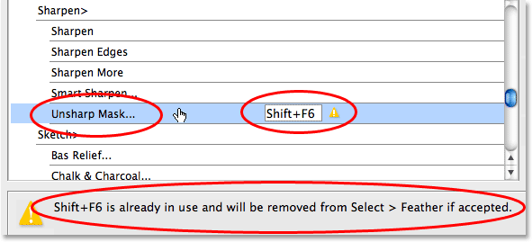
*After typing in a new shortcut for the Unsharp Mask filter, Photoshop warns me that Shift+F6 is already taken.*

The Feather command is another one that I rarely use, so I have no problem reassigning its keyboard shortcut to the Unsharp Mask filter. I'll click on the *Accept* button to the right of the scroll window to accept the change:

*Clicking on the "Accept" button to accept my second keyboard shortcut.*

### Step 6: Save Your Changes

At this point, I've assigned keyboard shortcuts to two of the filters I use most often, and now I'm ready to save my changes. If I look up at the *Set* option at the top of the dialog box, I can see that it now says *Photoshop Defaults (modified)*, which tells me that I've made changes to this set of shortcuts:

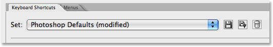
*Photoshop adds "(modified)" to the name of the shortcut set to indicate that changes have been made.*

I'm going to save my changes as a new shortcut set. To do that, simply click on the *Save* icon, which is the small floppy disk icon (does anyone still use floppy disks?) to the right of the shortcut set name:

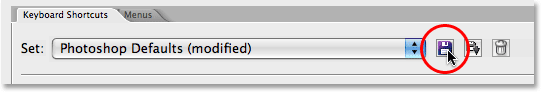
*Click on the small floppy disk icon to save the changes as a new set.*

When the Save dialog box appears, I'm going to name my new set "My Shortcuts". Of course, you can give your shortcut set whatever name you like. Click on the *Save* button when you're done to save the new set and exit out of the dialog box:

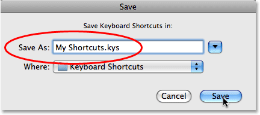
*Name your new set and click the "Save" button.*

Click *OK* to exit out of the Keyboard Shortcuts dialog box at this point, and you're done! To make sure that I have, in fact, added my two new keyboard shortcuts, I'll go up to the *Filter* menu at the top of the screen and choose *Blur*, where I can see my new "Shift+F5" shortcut listed to the right of the **Gaussian Blur** option:

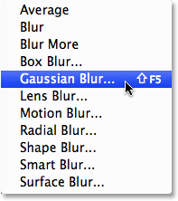
*The new "Shift+F5" shortcut now appears to the right of the Gaussian Blur filter in the Filter menu.*

And if I select the *Sharpen* sub-menu under the Filter menu, I can see my new "Shift+F6" shortcut listed to the right of the **Unsharp Mask** option:

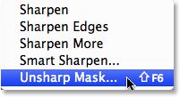
*The new "Shift+F6" shortcut now appears to the right of the Unsharp Mask filter in the Filter menu.*