# Creating Custom Shape Sets In Photoshop

> Source: [https://www.photoshopessentials.com/basics/custom-shape-sets/](https://www.photoshopessentials.com/basics/custom-shape-sets/)
> Downloaded and converted to Markdown.

In [Part 1](/basics/custom-shapes/) of our look at creating **Photoshop custom shapes**, we learned how to create a basic shape using Photoshop's Pen Tool, how to combine the Pen Tool with Photoshop's other Shape Tools to add detail to the shape, and how to turn our completed shape into a custom shape.

We then learned where to find our custom shape in Photoshop and how to add it to a new document using the Custom Shape Tool. Finally, we looked at how to add multiple copies of our shape to a document, how to change the color of shapes, as well as how to rotate and resize them.

Part 2 of the tutorial falls under the category of "not quite as fun but definitely worth knowing". We're going to look at how to collect and organize our custom shapes into **custom shape sets**, and then how to load them into Photoshop any time we need them.

Once you're comfortable using the Pen Tool and Photoshop's various other Shape Tools, you may find that creating custom shapes can become a bit of an addiction, especially if you're into digital scrapbooking. You can create shapes for any theme or topic you can think of - holidays, birthdays, vacations, weddings, toys, animals, nature - the list goes on. Before you know it, you could have hundreds of shapes stored up in Photoshop, all taking up valuable memory space in your computer, all completed disorganized, and all waiting for the day when your computer crashes and you lose every single one of them. The good news is, we can eliminate all of those problems at once thanks to custom shape sets!

Here we have several holiday-themed custom shapes that I currently have loaded into Photoshop, including the Gingerbread Man we created in [Part 1](/basics/custom-shapes/) of this tutorial:

*Holiday-themed custom shapes.*

And here we have some vacation-themed shapes:

*Vacation-themed custom shapes.*

As we learned in [Part 1](/basics/custom-shapes/), we can access any of our currently available shapes by selecting the *Custom Shape Tool* from the Tools palette, then *right-clicking* (Win) / *Control-clicking* (Mac) anywhere inside our document and choosing the shape we want from the *Shape selection box* that appears. I'm not going to go over any of that again, but we can see here in my Shape selection box that all of the holiday and vacation-themed shapes above are available for me to select (the bottom three rows), along with all of Photoshop's default shapes (the top four rows):

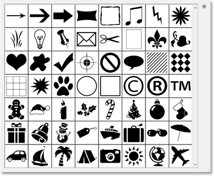

*The Preset Manager displays all currently available shapes in Photoshop.*

Notice how custom shapes always appear black in the Shape selection box, even though you can make them any color you want in your document, which again we looked at in [Part 1](/basics/custom-shapes/).

At the moment, things aren't too bad as far as my shapes being disorganized or taking up much room in my computer's memory, but I do run the risk of losing them if my computer crashes. Plus, since I've created shapes from two different themes (Holidays and Vacations), it would be nice if I could organize them so that the Holiday shapes are grouped together separately from the Vacation shapes. That way, if I'm working on a design where I need access to my Holiday shapes and I'm looking for my Gingerbread Man shape, finding him doesn't become a game of "Where's Waldo?", where he and all of my other Holiday shapes are mixed in with the hundreds of other shapes I may have created.

Fortunately, organizing shapes is very easy to do thanks to custom shape sets!

### Step 1: Open Photoshop's "Preset Manager"

Creating, saving and loading custom shape sets is all done using Photoshop's *Preset Manager*, and you can find it by going up to your *Edit* menu at the top of the screen and choosing *Preset Manager...* from the list.

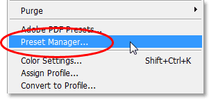

*Got to Edit > Preset Manager.*

As a quick side note, any time you see three dots ("...") to the right of a menu choice in the Options Bar, it means that a dialog box will appear when you select that option, and in this case, the Preset Manager dialog box appears.

### Step 2: Change The "Preset Type" To "Custom Shapes"

By default, the Preset Manager is set to display all the brushes inside Photoshop that are currently available, which isn't what we want. We want it to show us our custom shapes, so choose *Custom Shapes* from the *Preset Type* drop-down list at the top of the dialog box:

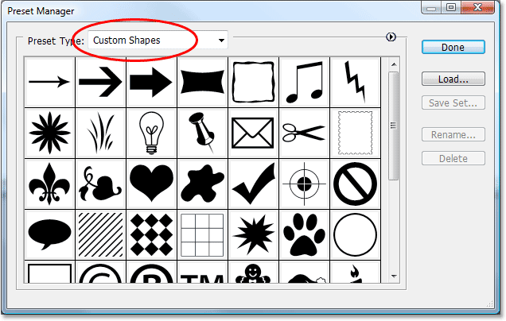

*Set the Preset Manager to show Custom Shapes by choosing them from the "Preset Type" drop-down box at the top.*

As soon as you set the Preset Type to "Custom Shapes", all of the custom shapes currently available in Photoshop are displayed. If you have "Show Tool Tips" enabled in Photoshop's Preferences, you'll be able to see the name of each shape as you hover your mouse cursor over it.

You can change the size of the shape thumbnails in the Preset Manager by clicking on the small, right-pointing arrow in the top right corner of the dialog box and selecting either *Small Thumbnail* or *Large Thumbnail* from the fly-out menu, or you can choose to simply display the names of the shapes in a list if you prefer. By default, the Preset Manager shows small thumbnails, but I have mine set to the larger thumbnail size.

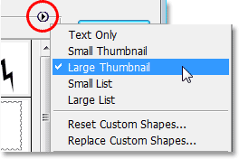

*Select either small or large thumbnails from the Preset Manager options.*

### Step 3: Select The Shapes You Want To Add To Your Shape Set

Let's say I want to save all of my Holiday shapes as a shape set. The first thing we need to do is select all the shapes that we want to add to the set, so I'll click once on the first Holiday shape thumbnail in the Preset Manager, which happens to be my Gingerbread Man shape, to select it. If all the shapes you want to add to your set are side-by-side each other as mine are, once you've selected the first shape, simply hold down your *Shift* key and click on the last shape you want to add. This will select the first shape, the last shape, and all the shapes in between, as we can see in the screenshot below. To make it easier to see which shapes I've selected, I've highlighted them in yellow:

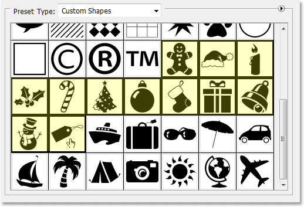

*Click on the first shape you want to add to the shape set, then Shift-click on the last shape to select all the shapes in between.*

If the shapes you want to add to your set are not side-by-side each other, you'll need to hold down your *Ctrl* (Win) / *Command* (Mac) key and click on each shape separately until you have them all selected.

### Step 4: Click On The "Save Set" Button

Once you have all your shapes selected, click on the *Save Set* button on the right of the Preset Manager dialog box:

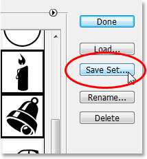

*Click on the "Save Set" button on the right of the Preset Manager.*

### Step 5: Name And Save The Set

When you click the "Save Set" button, the *Save* dialog box appears. Photoshop needs to know where you want the save the set and what you want to name it. It's a good idea to save your custom shape sets all in one central location outside of Photoshop. I'd recommend creating a folder on your desktop named "Custom Shapes" (or whatever you want to name it) and storing them all inside that folder. That way, you'll always know where they are, they're easy to get to, and if Photoshop crashes on you, you won't lose any of your shape sets because they're stored safely outside of Photoshop. I'm going to save my set inside my "Custom Shapes" folder on my desktop, and I'm going to name my set "Holiday shapes":

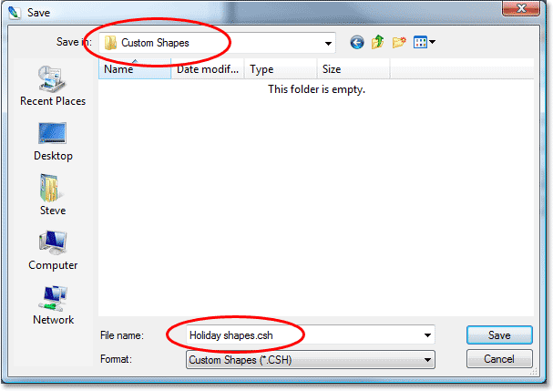

*Give your shape set a name and save it inside a folder somewhere outside of Photoshop.*

Click the *Save* button to save the shapes as a set and exit out of the dialog box.

I'm going to do the same thing with my Vacation shapes. First I'll select all the shapes I want to add to my set, which I've again highlighted in yellow to make it easier to see:

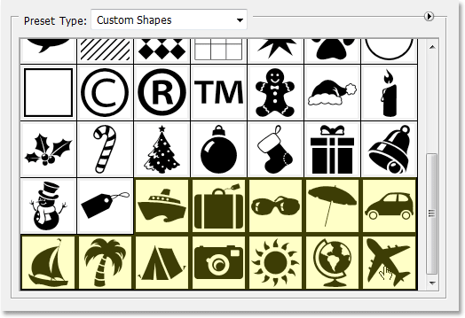

*Selecting all the Vacation-themed shapes in the Preset Manager.*

Then I'll click the *Save Set* button on the right of the Preset Manager, which brings up the *Save* dialog box. I'm going to name this set "Vacation shapes", and I'll save it in the same "Custom Shapes" folder on my desktop. We can see the "Holiday shapes" set already inside the folder:

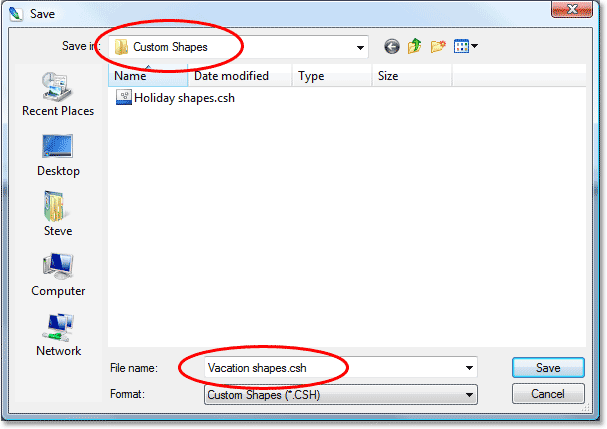

*Naming the new set "Vacation shapes" and saving it in the same "Custom Shapes" folder on the desktop.*

With both of my custom shape sets now created and saved outside of Photoshop, if Photoshop crashes on me and I need to re-install it, I'm not going to lose my shapes. The only way I might lose them at this point would be if my computer crashes, so it's a good idea to also copy your shape sets to a CD. That way, no matter what happens to Photoshop or your computer, your shapes are safe, and loading them back into Photoshop whenever you need them is easy, as we're about to see!

### Step 6: Reset The Custom Shapes

Now that we have our shapes saved as shape sets which we can access any time we need them, there's no need to continue having all those shapes taking up memory in Photoshop if we're not using them at the moment. To clear out all the shapes you created and leave only Photoshop's default shapes, click on the small right-pointing arrow in the top right corner of the Preset Manager and choose *Reset Custom Shapes* from the menu:

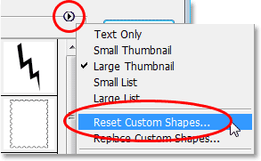

*Select "Reset Custom Shapes" from the Preset Manager's fly-out menu.*

Photoshop will pop up a dialog box asking if you want to replace the current shapes with the defaults. Click *OK*:

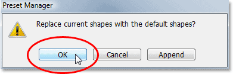

*Click "OK" to replace the current shapes with Photoshop's default shapes.*

Now if we look again at the shapes currently available to us in the Preset Manager, we can see that all of the Holiday and Vacation shapes are gone, leaving only Photoshop's defaults (I've switched to the small thumbnail size):

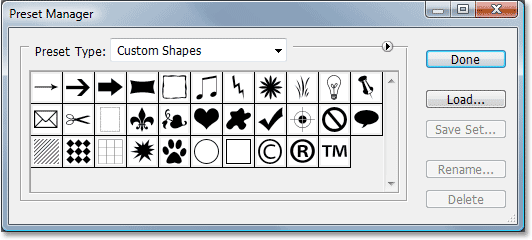

*Only Photoshop's default custom shapes now appear inside the Preset Manager.*

### Step 7: Load The Shape Set You Need

To load any of the shape sets you've created into Photoshop so you can use them, make sure you have "Custom Shapes" selected for the "Preset Type" option at the top of the Preset Manager, then simply click on the *Load* button on the right:

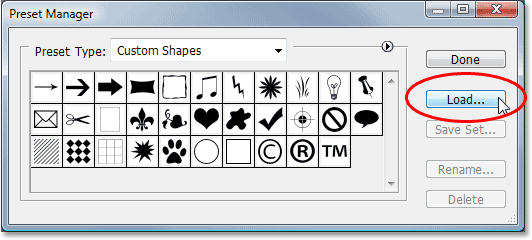

*With the "Preset Type" option set to "Custom Shapes" at the top of the Preset Manager, click on the "Load" button on the right.*

The "Load" dialog box will appear. Navigate to whichever folder you've saved your custom shape sets in and select the one you want by clicking on it. I'm going to load my "Vacation shapes" set. Then click on the *Load* button in the bottom right corner to load the shape set into Photoshop and exit out of the dialog box:

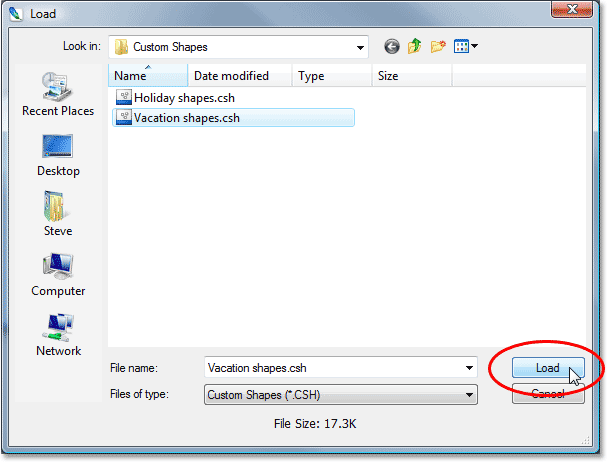

*Select the shape set you want to load into Photoshop, then click the "Load" button in the bottom right corner.*

If we look again inside the Preset Manager to see which custom shapes are available, we can see that all of my Vacation shapes have now been loaded into Photoshop and are appearing after the default shapes. Again I've highlighted them in yellow:

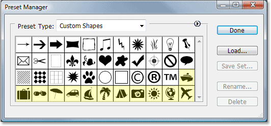

*The Vacation shape set has now been loaded into Photoshop and is ready for use.*

Click *Done* to exit out of the Preset Manager, and all of the shapes inside your custom shape set are now available and ready to use inside Photoshop! Make sure to read through [Part 1](/basics/custom-shapes/) of this tutorial for all you need to know about using your custom shapes.