# Create Your Own Photoshop Custom Shapes

> Source: [https://www.photoshopessentials.com/basics/custom-shapes/](https://www.photoshopessentials.com/basics/custom-shapes/)
> Downloaded and converted to Markdown.

In this **Photoshop tutorial**, we're going to look at everything you need to know to create and work with **custom shapes in Photoshop**. There's a lot to cover, so we're going to break things up into two parts. In *Part 1*, we'll look at how to *create a shape*, how to define it as a *custom shape*, and then how to call it up and use it whenever we need it. In *[Part 2](/basics/custom-shape-sets/)*, we'll look at how to collect and save multiple shapes into *custom shape sets*!

I came up with the idea for this tutorial after looking through a scrapbooking magazine recently and coming across pages and pages of simple, ready-made shapes, all packaged together neatly into different themes, that people could buy for ridiculously high prices, and I immediately thought, "Hey! You could create these shapes in Photoshop for, like, FREE!". You don't need to be into digital scrapbooking, though, to benefit from knowing how to create your own custom shapes.

For one thing, creating them is just plain fun! Creating a whole bunch of them and collecting them into different sets is even *more* fun! You can use custom shapes as decorations in digital scrapbooking pages, but you can also use them in professional design work. Or combine a custom shape with a vector mask to create really interesting photo borders! Before we can do any of that, though, we first need to learn how to create them!

One more thing I should point out before we begin. Creating custom shapes involves using the Pen Tool. You *can* create them out of Photoshop's basic Shape tools, like the Rectangle Tool or the Ellipse Tool, but unless you want to limit yourself to creating shapes that look like boxes or bicycle tires, you're going to need to use the Pen Tool. We cover how to use the Pen Tool in great detail in our *[Making Selections With The Pen Tool](/basics/pen-tool-selections)* tutorial, so we won't be going over all that stuff again here. Be sure to read through that tutorial first though if you're not familiar with the wacky world of the Pen.

In this tutorial, we're going to create our custom shape by tracing around an object in an image. If you have a natural talent for drawing and can draw your shape freehand without needing to trace around anything, great! There's no difference between tracing an object or drawing one freehand and there's no benefit to either way of doing it (other than bragging rights), but I personally find it easier to trace around objects (I have no natural talents), and that's what we'll be doing here.

I'm going to turn Mr. Gingerbread Man here into a custom shape:

*Mr. Gingerbread Man.*

Let's get started!

### **Step 1:** Select The Pen Tool

As I mentioned, you *can* create custom shapes in Photoshop using the basic Shape tools like the Rectangle or Ellipse Tool, but try tracing our gingerbread man with those tools and you're likely to want to bite his head off (sorry, just a little gingerbread man humor). What we really need is the Pen Tool, so select it from the Tools palette:

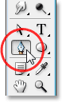

*Select the Pen Tool.*

You can also select the Pen Tool by pressing the letter *P* on your keyboard.

### **Step 2:** Select The "Shape Layers" Option In The Options Bar

With the Pen Tool selected, look up in the Options Bar at the top of the screen. Over on the left, you'll see a group of three icons:

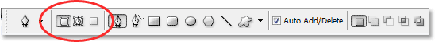

*The three icons in the Options Bar which allow us to select what we want to do with the Pen Tool.*

These icons represent what you can do with the Pen Tool. The icon on the right is grayed out, and that's because it's only available when we have one of the basic Shape tools selected (the Pen Tool and the Shape tools share most of the same options in the Options Bar). As we saw in our "Making Selections With The Pen Tool" tutorial, the icon in the middle is used when we want to draw paths, but that's not what we want to do here. We want to use the Pen Tool to draw *shapes*, and for that, we need to select the icon on the left, which is the *Shape layers* icon:

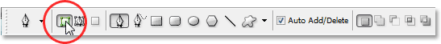

*Select the "Shape layers" icon to draw shapes with the Pen Tool.*

The "Shape layers" option is selected by default whenever you grab the Pen Tool so you probably won't need to select it yourself. It's a good idea though to check and make sure it's selected before you begin drawing your shape.

I should point out here that there's no difference between drawing paths with the Pen Tool and drawing shapes with it. Both are created exactly the same way, by clicking to add *anchor points*, then dragging out *direction handles* if needed to create straight or curved *path segments* (again, see our *[Making Selections With The Pen Tool](/basics/pen-tool-selections)* tutorial if you're unfamiliar with these terms). In fact, regardless of whether you're "officially" drawing shapes or paths, you're drawing paths. The difference is that with shapes, Photoshop fills the path with color, even as you're drawing it, which is what allows us to see the shape.

This is actually going to create a bit of a problem for us, as we'll see in a moment.

### **Step 3:** Begin Drawing Your Shape

Now that we have the Pen Tool selected along with the "Shape layers" option in the Options Bar, we can begin tracing around the object. I'm going to start by tracing around the top of the gingerbread man, clicking with the Pen Tool to place anchor points and dragging out direction handles to create curved path segments around the side and top of his head. We can see the anchor points and direction handles in the screenshot below, but notice that we also have a bit of a problem. Photoshop is filling the shape with the Foreground color (mine is currently set to black) as I draw it, blocking the gingerbread man from view:

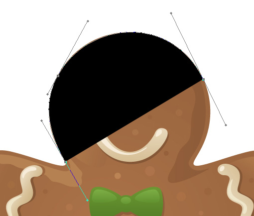

*Photoshop fills the shape with the Foreground color as you draw it, blocking the object from view.*

We'll fix this problem next.

### **Step 4:** Lower The Opacity Of The Shape Layer

To fix the problem of Photoshop blocking our object from view as we try to trace around it, simply go to your Layers palette and lower the *opacity* of the shape layer. We can see here in my Layers palette that I currently have two layers - the *Background* layer on the bottom which contains my gingerbread man photo, and the shape layer above it, named "Shape 1". I can tell that the shape layer is selected because it's highlighted in blue, so to lower its opacity, all I need to do is go up to the Opacity option in the top right corner of the Layers palette and lower the value. I'm going to set my opacity to about 50%:

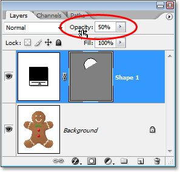

*Lower the opacity of the shape layer using the Opacity option in the top right of the Layers palette.*

Now that I've lowered the opacity of the shape layer, I can see my gingerbread man easily through the shape color, which is going to make it much easier to continue tracing around him:

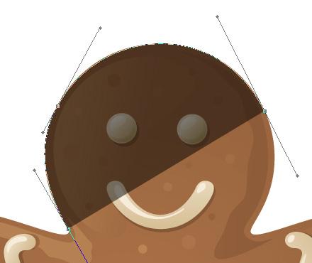

*The object is now visible through the shape color after lowering the shape layer's opacity.*

### **Step 5:** Continue Tracing The Object

With the gingerbread man now visible through the shape color, I can continue tracing around him with the Pen Tool until I've completed my initial shape:

*The initial shape around the object is now complete.*

If I look at the shape layer in my Layers palette, I can now see the shape of the gingerbread man clearly defined:

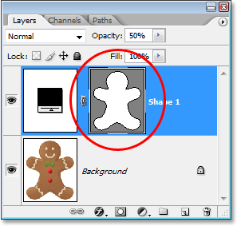

*The shape of the object is now clearly visible in the Layers palette.*

So far, so good. We've traced around the basic shape of the object, and depending on the shape you're using, this may be enough. In my case though, my gingerbread man shape needs a bit more detail. At the very least, I think we should include his eyes and mouth in the shape, and probably even his bow tie and the two large buttons below it. So how do we add these details to the shape? Simple. We don't! We *subtract* them from the shape!

We'll see how to do that next!

### **Step 6:** Select The Ellipse Tool

Let's start with his eyes. We could select his eyes with the Pen Tool if we wanted, but since they're round, we'll be able to select them more easily using the *Ellipse Tool*. Select the Ellipse Tool from the Tools palette. By default, it's hiding behind the Rectangle Tool, so click on the Rectangle Tool, then hold your mouse button down for a second or two until the fly-out menu appears, and then select the Ellipse Tool from the list:

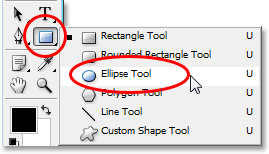

*Click on the Rectangle Tool in the Tools palette, then hold your mouse button down until the fly-out menu appears and select the Ellipse Tool from the list.*

### **Step 7:** Select The "Subtract From Shape Area" Option

With the Ellipse Tool selected, look up in the Options Bar and you'll see a series of icons grouped together that look like little squares combined in different ways. These icons allow us to do things like add a new shape to the current shape, subtract a shape from the current shape, or intersect one shape with another. Click on the third icon from the left, which is the *Subtract from shape area* icon:

*Click on the "Subtract from shape area" icon in the Options Bar.*

### **Step 8:** Drag Out Shapes To Subtract Them From The Initial Shape

Now that we have the "Subtract from shape area" option selected, we can begin adding little details to our shape by essentially cutting holes out of it. I'm going to begin by dragging an elliptical shape around his left eye:

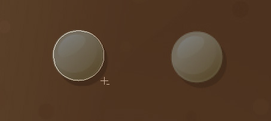

*Dragging an elliptical shape around the left eye.*

When I release my mouse button, the elliptical shape around the eye is instantly subtracted, or "cut out", from the initial shape, creating a hole for the eye. The left eye from the original image on the *Background* layer below it is now showing through the hole:

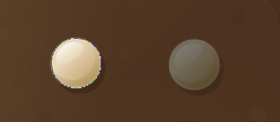

*The left eye has now been "cut out" of the initial shape, allowing the eye from the original image below it to show through.*

I'll do the same thing for the right eye. First, I'll drag an elliptical shape around it:

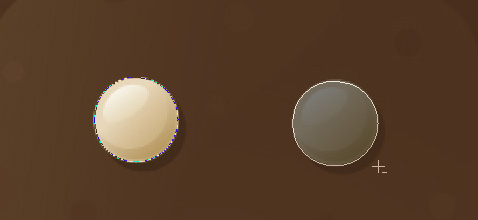

*Dragging an elliptical shape around the right eye.*

And as soon as I release my mouse button, a second round hole is cut out of the initial shape, creating the second eye, again allowing the original image below it to show through:

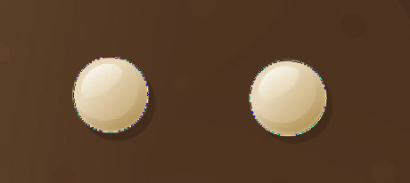

*A second hole is now cut out of the initial shape, creating the second eye.*

Since the two buttons below his bow tie are also round, I can use the Ellipse Tool to cut them out of my shape as well. First, I'll drag a shape around the top button:

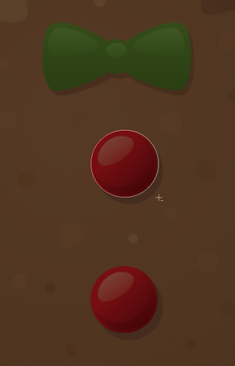

*Dragging an elliptical shape around the top button.*

Releasing my mouse button subtracts the shape from the initial shape, creating a hole for the button and allowing the image below it to show through:

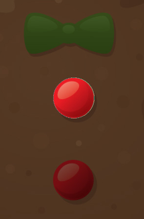

*A second hole is now cut out of the initial shape, creating the second eye.*

And now I'll do the same thing for the bottom button, first dragging my shape around it:

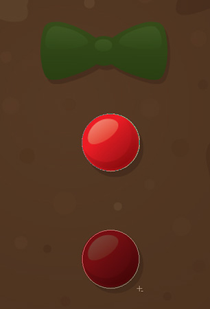

*Dragging an elliptical shape around the bottom button.*

And when I release my mouse button, a fourth hole is created in the initial shape:

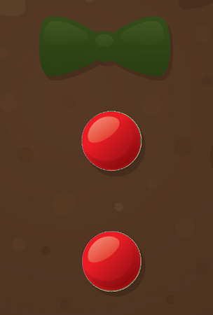

*Both buttons have now been cut out of the initial shape.*

If I look at my shape layer's preview thumbnail in the Layers palette at this point, I can see the two holes for the eyes and the two holes for the buttons that I've cut out of the shape:

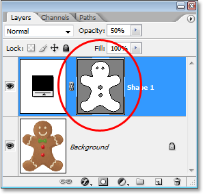

*The shape layer's thumbnail now shows the holes cut out of the shape for the eyes and buttons.*

We're going to switch back to the Pen Tool to add the remaining details to the shape next!

### **Step 9:** Subtract Any Remaining Details From The Shape Using The Pen Tool

I'm going to switch back to my Pen Tool at this point because I have a few more details I want to add to my shape that I won't be able to select with the Ellipse Tool.

I want to add his mouth to the shape, as well as his bow tie, so with my Pen Tool selected and the "Subtract from shape area" option still selected in the Options Bar, I'm simply going to trace around his mouth and bow tie to subtract them from my initial gingerbread man shape.

Here, we can see the paths I've drawn around them, along with the original gingerbread man image showing through the holes I've created:

*The mouth and bow tie have now been cut out of the intial gingerbread man shape using the Pen Tool.*

Let's finish off our gingerbread man shape by subtracting those squiggly rows of icing sugar from his arms and legs. Again, I'll use the Pen Tool for this. Here, I'm drawing a path around the icing sugar along his left arm, and we can see the shape of the icing sugar being cut out of the initial shape as I go:

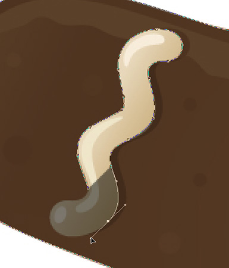

*Subtracting the row of icing sugar along his left arm with the Pen Tool.*

I'll finish tracing around this one, and then trace around the other three as well until all four rows of icing sugar have been subtracted from my initial shape:

*The rows of icing sugar along his arms and legs have now been subtracted from the initial shape.*

If we look again at the shape layer's thumbnail in the Layers palette, we can see more clearly that all four rows of icing sugar, along with his eyes, mouth, bow tie, and buttons, have now been cut out of the shape:

*The shape layer thumbnail in the Layers palette showing all the details that have been cut out of the initial gingerbread man shape.*

At this point, I'd say the gingerbread man shape is complete! We've used the Pen Tool to trace around the outside of him, creating our initial shape, and then we used a combination of the Pen Tool and the Ellipse Tool, along with the "Subtract from shape area" option, to cut out all the smaller details in the shape.

### **Step 10:** Increase The Opacity Of The Shape Layer Back To 100%

Now that we're done tracing around the different parts of our object, we no longer need to see the original image through the shape, so go back to the Opacity option in the top right corner of the Layers palette and set the opacity value back to 100%:

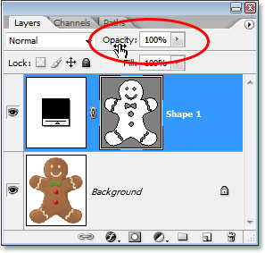

*Increase the opacity of the shape layer back to 100%.*

I'm also going to hide my *Background* layer temporarily by clicking on its *Layer Visibility* icon (the "eyeball" icon) so we can see just the shape by itself against a transparent background. You don't have to hide your *Background* layer if you don't want to. I'm only doing this to make it easier for us to see the shape itself:

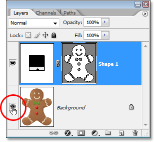

*Clicking on the "Layer Visibility" icon for the *Background* layer to hide it temporarily from view.*

With my original image on the *Background* layer now hidden and the opacity value of my shape layer set back to 100%, here's the gingerbread man shape I've created:

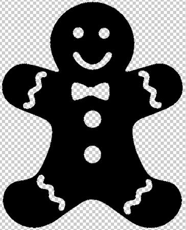

*The completed gingerbread man shape, showing against a transparent background.*

After all that work, we have our shape! We're not done yet though. We still need to define it as a *Custom Shape*, and we'll see how to do that next!

### **Step 11:** Define The Shape As A Custom Shape

To define our shape as a Custom Shape, first make sure your shape layer is selected in the Layers palette. Also, you'll need to make sure that the shape layer's preview thumbnail is selected. You can tell that it's selected because it will have a white highlight border around it, and you'll also be able to see your path outlines around your shape in the document. If the preview thumbnail does not have a highlight border around it and you can't see your path outlines, simply click on the thumbnail to select it:

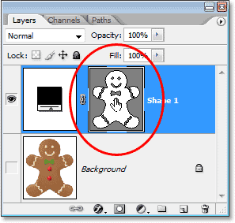

*Click directly on the shape layer's preview thumbnail to select it if needed.*

*Note:* If you ever need to hide the path outlines around your shape, simply click on the shape layer's preview thumbnail again to deselect it.

With the shape layer and its preview thumbnail selected, go up to the *Edit* menu at the top of the screen and select *Define Custom Shape*:

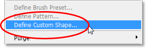

*Go to Edit > Define Custom Shape.*

Photoshop will pop up the *Shape Name* dialog box, asking you to enter a name for your shape. I'm going to call my shape "Gingerbread Man":

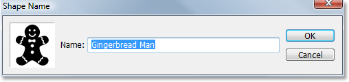

*Enter a name for your shape into the "Shape Name" dialog box.*

Click OK when you're done to exit out of the dialog box, and your Custom Shape is now ready for action! You can close out of your Photoshop document at this point since we're done creating and saving our shape. Now we're going to see where to find it and how to use it!

### **Step 12:** Open A New Photoshop Document

Open a new blank Photoshop document by going up to your *File* menu at the top of the screen and choosing *New...*. This brings up the *New Document* dialog box. For the purpose of this tutorial, you can choose any size you want for your document. I'm going to choose 640x480 pixels from the *Preset* menu:

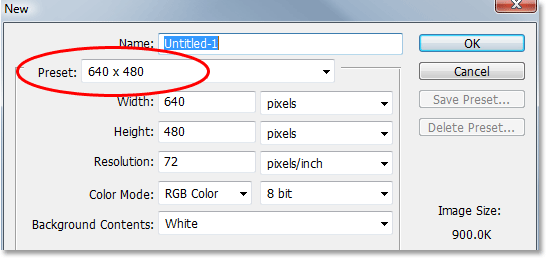

*Create a new blank Photoshop document.*

### **Step 13:** Select The Custom Shape Tool

With your new blank Photoshop document open, select the *Custom Shape Tool* from the Tools palette. By default, it's hiding behind the Rectangle Tool, so click on the Rectangle Tool, then hold your mouse button down for a second or two until the fly-out menu appears, and then select the Custom Shape Tool from the list:

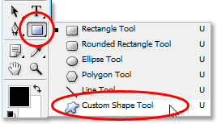

*Click on the Rectangle Tool, then hold your mouse button down until the fly-out menu appears, and then select the Custom Shape Tool.*

### **Step 14:** Select Your Custom Shape

With the Custom Shape Tool selected, *right-click* (Win) / *Control-click* (Mac) anywhere inside your Photoshop document. You'll see the *Shape selection box* appear, allowing you to select any of the currently available Custom Shapes. The shape you just created will appear as the very last shape in the selection box. Simply click on it's little thumbnail to select it:

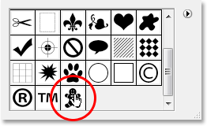

*"Right-click" (Win) / "Control-click" (Mac) anywhere inside the document to access the Shape selection box, then click on your Custom Shape's thumbnail to select the shape.*

### **Step 15:** Drag Out Your Shape

With your Custom Shape selected, simply click inside the document and drag out the shape! To constrain the proportions of the shape as you drag so you don't accidentally distort the look of it, hold down your *Shift* key as you drag. You can also hold down your *Alt* (Win) / *Option* (Mac) key if you want to drag the shape out from its center. If you need to reposition your shape as you're dragging, simply hold down your *spacebar*, drag the shape into its new location, then release your spacebar and continue dragging out the shape.

As you're dragging out the shape, you'll see only the basic path outline of the shape appearing:

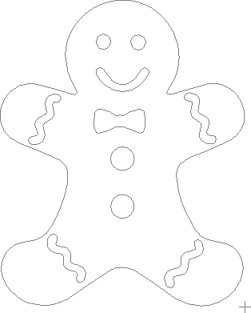

*The basic path outline of the shape appears as you're dragging out the shape.*

When you're happy with the size and location of the shape, simply release your mouse button and Photoshop fills the shape with your current Foreground color (mine happens to be set to black):

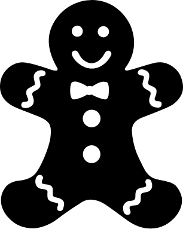

*Release your mouse button and Photoshop fills the shape with color.*

We're going to finish things off by looking at how to change the color of our shape, along with how to resize and rotate it, next!

### **Step 16:** Double-Click On The Shape Layer's Thumbnail To Change The Shape Color

There's no need to worry about the color of your shape when you're dragging it out and adding it to your document. Photoshop will automatically fill the shape with whatever color you currently have selected as your Foreground color, but if you want to change the shape's color at any time, just double-click on the shape layer's thumbnail. Not the shape preview thumbnail on the right (which is technically called a *vector mask thumbnail)*. You want the thumbnail on the left, the one that looks like a color swatch with a little slider bar underneath. Double-click on it to change the shape's color:

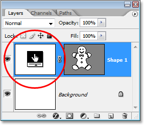

*Double-click on the shape layer's thumbnail (the color swatch thumbnail) on the left to change the shape's color.*

This will bring up Photoshop's *Color Picker*. Choose a new color for your shape with the Color Picker. I'm going to choose a brown color for my gingerbread man:

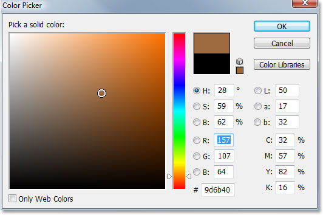

*Use the Color Picker to choose a new color for your shape.*

Click OK when you're done to exit out of the Color Picker, and the new color is applied to your shape:

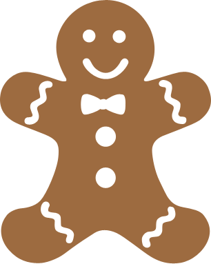

*The color of the shape has now been changed.*

You can change the color of your shape whenever you need to, and as many times as you want!

### **Step 17:** Resize The Shape If Needed With Free Transform

Color isn't the only thing you don't have to worry about with shapes. One of the great things about working with shapes in Photoshop is that they use *vectors* instead of pixels, which means you're free to change the size of them whenenever you want, as often as you want, without any loss of image quality! If you decide you need to make your shape larger or smaller at any time, simply select the shape's layer in the Layers palette, then use the keyboard shortcut *Ctrl+T* (Win) / *Command+T* (Mac) to bring up Photoshop's *Free Transform* box and handles around the shape. Resize the shape by dragging any of the corner handles. Hold down *Shift* as you drag the handles to constrain the proportions of the shape, again so you don't accidentally distort the look of it. You can also hold down *Alt* (Win) / *Option* (Mac) as you drag the handles to resize the shape from it's center:

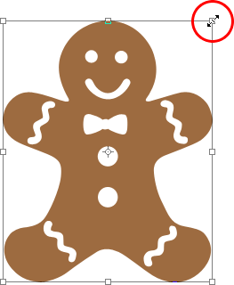

*Resize the shape by dragging any of the Free Transform handles.*

To rotate the shape, simply move your mouse anywhere outside of the Free Transform box, then click and drag your mouse to rotate it:

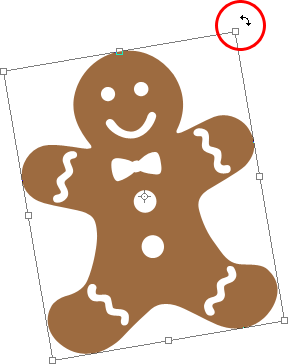

*Click and drag your mouse anywhere outside of the Free Transform box to rotate the shape.*

Press *Enter* (Win) / *Return* (Mac) when you're done to accept the transformation and exit out of Free Transform.

You can add as many copies of your custom shape as you like to your document, changing the color, size and rotation of each one as needed. Each copy of the shape will appear as its own separate shape layer in the Layers palette. Here, I've added several more copies of my Gingerbread Man shape to my document, each one set to a different color, size and angle. Notice how no matter what size you make them, they always retain their sharp, crisp edges:

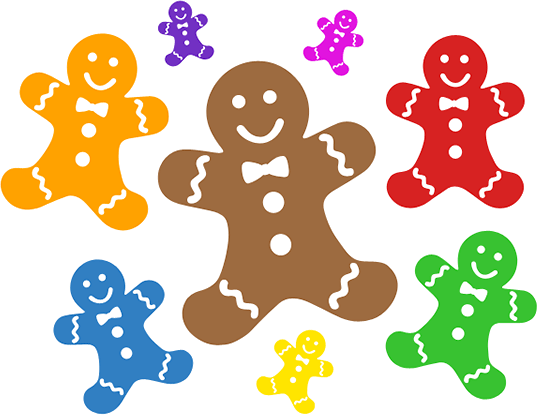

*Add as many copies of your custom shape as you like to your design, changing the color, size and angle of each one.*

And there we have it! We've created an initial shape by tracing around an object with the Pen Tool. We "cut out" little details in our shape using a combination of the Pen Tool and the Ellipse Tool, both set to the "Subtract from shape area" option in the Options Bar. We saved our shape as a Custom Shape using the "Define Custom Shape" option in the Edit menu. We then created a new Photoshop document, selected the "Custom Shape Tool", selected our shape from the Shape selection box, and dragged out our shape inside the document. Finally, we saw how to change the color, size and angle of the shape any time we want!