# Create Custom Photoshop Color Swatches and Sets

> Source: [https://www.photoshopessentials.com/basics/custom-swatches/](https://www.photoshopessentials.com/basics/custom-swatches/)
> Downloaded and converted to Markdown.

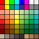

**Version note:** Using Photoshop CC? Please see our fully updated [Create Color Swatches in Photoshop CC 2020](/basics/create-color-swatches-from-images-in-photoshop-cc-2020/ "View updated tutorial") tutorial.

In this **Photoshop tutorial**, we're going to learn how to collect and organize colors into custom color swatch sets which we can then call up and use whenever we need them, perfect for times when we're working with multiple clients and each of them has their own specific colors they want used on their project, or when we simply want to collect and organize different colors for our own work.

One of the things I enjoy doing is taking photos of outdoor nature scenes, then sampling some of the colors from the images and saving them as different color sets. After all, it's hard to top Mother Nature when it comes to finding colors that work well together. In this tutorial, we're going to be doing exactly what I just described, sampling various colors from a photo, storing them as color swatches in Photoshop's Swatches palette, and then saving them as a custom swatch set. We'll also see how to reset the swatches back to Photoshop's default colors when we're done and then how to load our newly created swatch set whenever we need it!

Here's the photo I'll be using to sample colors from. I want to create an "Autumn Leaves" color swatch set, so this photo should work nicely:

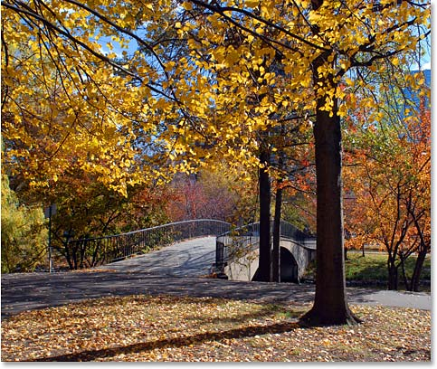
*A photo of leaves changing color in the Fall.*

At the end of the tutorial, we'll see an example of how you can then use the colors from your custom swatch set to create something entirely different. Let's get started.

### Step 1: Delete The Existing Color Swatches From Photoshop' Swatches Palette

To create our custom swatch set, let's first delete all of the color swatches that are currently in the Swatches palette. Don't worry, they won't be gone for good, as we'll see a bit later on. Switch over to your Swatches palette, which by default is grouped in with the Color and Styles palettes. Unless you've previously loaded other swatch sets, you'll find Photoshop's default color swatches filling up the palette:

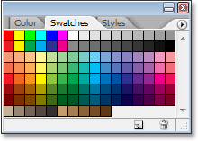
*Photoshop's Swatches palette showing the default set of color swatches.*

Unfortunately, Adobe forgot to include a "Clear All Swatches" option, so in order to delete all the color swatches currently in the Swatches palette, we'll need to delete each one manually. To do that, hold down your *Alt* (Win) / *Option* (Mac) key and hover your mouse over the color swatch in the top left corner (the "RGB Red" swatch). You'll see your mouse cursor change into a scissors icon:

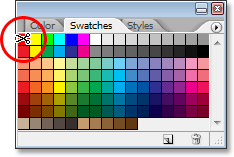
*Hold down "Alt" (Win) / "Option" (Mac) and hover your mouse over the red color swatch in the top left corner. Your mouse cursor changes to a scissors icon.*

Then, while still holding down "Alt/Option", click on the color swatch to delete it, then continue clicking to delete all of the remaining swatches. You'll need to click a total of 122 times to clear all of them, but depending on how fast you are at mouse clicking, it shouldn't take too long. Your Swatches palette will be completely empty when you're done:

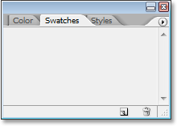
*The swatches palette is now empty after deleting all the default color swatches.*

### Step 2: Select The Eyedropper Tool

Open the image in Photoshop that you want to sample your colors from if it isn't open already, then grab your *Eyedropper Tool* from the Tools palette, or press **I** on your keyboard to select it with the shortcut:

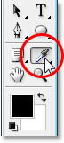
*Select the Eyedropper Tool.*

### Step 3: Sample Your First Color From The Image

With the Eyedropper Tool selected, move your mouse cursor over an area of color you want to sample, then click to sample it. I'm going to sample a bright yellow from one of the leaves in the top of my image as my first color:

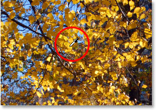
*Sampling a bright yellow from one of the leaves.*

You can see exactly which color you've sampled by looking at the *Foreground color swatch* in the Tools palette:

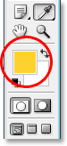
*The sampled color appears in the Foreground color swatch in Photoshop's Tools palette.*

*Note:* You may find it easier to sample your colors by holding down your mouse button as you drag your mouse cursor around inside the image (with the Eyedropper Tool selected). The color the Eyedropper is currently over appears in the Foreground color swatch in the Tools palette and continuously updates as you drag your mouse, giving you a live preview of the color before you sample it, which I find much easier than the "click and see what you get" method. Release your mouse button when you're over the color you want to sample.

### Step 4: Add The Color To The Swatches Palette

Once you've sampled your first color, move your mouse cursor into the empty area inside the Swatches palette. You'll see your mouse cursor change into a paint bucket icon. Click anywhere inside the empty area to convert your sampled color into a color swatch. Photoshop will pop up a dialog box asking you to enter a name for your color swatch. If you're creating a swatch set for a client using specific Pantone colors they've requested, it's a good idea to enter the Pantone color name as the name of your swatch ("Pantone Yellow 012 C", for example), or if you're creating the swatch set for your own use, use whatever name makes most sense to you. I'm simply going to name my color "Yellow":

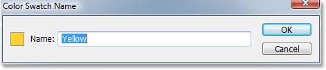
*Give your new color swatch a descriptive name, although you can choose not to name your colors as well.*

You don't necessarily *have* to name your color swatches, so if the names don't really matter to you, feel free to leave them with the default names that Photoshop gives them. Click OK when you're done to exit out of the dialog box, and if I look now in my Swatches palette, I can see that my first color has been added:

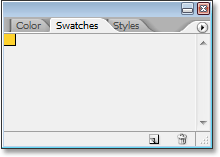
*The Swatches palette showing my "Yellow" color added.*

### Step 5: Continue Sampling Colors And Creating Color Swatches From Them

Continue sampling colors from your image and then clicking inside any empty area in the Swatches palette to save them as color swatches, naming them if needed. I've sampled ten more colors from my image, giving me a total of eleven color swatches in my Swatches palette. You can have as many color swatches as you like:

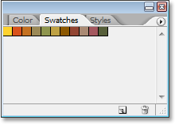
*More sampled colors have been added to the Swatches palette as color swatches.*

### Step 6: Save The Color Swatches As A Swatch Set

When you're done adding colors to the Swatches palette and you're ready to save them as a new swatch set, click on the small right-pointing arrow in the top right corner of the Swatches palette to access the palette menu:

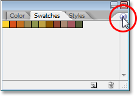
*Access the Swatches palette menu by clicking on the small right-pointing arrow.*

Then select *Save Swatches* from the menu that appears:

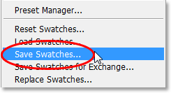
*Select the "Save Swatches..." option.*

Photoshop will pop up the Save dialog box. Enter a name for your new swatch set. I'm going to name mine "Autumn Leaves":

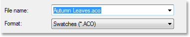
*Enter a name for your new swatch set.*

Click the *Save* button when you're done to save the new set. Photoshop saves the swatch set in the same default directory as all the other swatch sets that were installed with Photoshop, so you won't have to go looking all over your computer the next time you want to access any of the custom sets you've created, as we'll see in a moment.

### Step 7: Reset Your Swatches Back To The Defaults

We've sampled some colors from an image, created color swatches from the sampled colors, and saved them all as a new custom swatch set. But what if we want to go back to using all those default swatches we deleted? All we need to do is click once again on the small right-pointing arrow at the top of the Swatches palette to bring the palette menu back up, and this time, we choose *Reset Swatches* from the list:

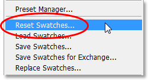
*Select "Reset Swatches" from the palette menu to revert back to Photoshop's default color swatch set.*

Photoshop will ask you if you want to replace your current swatches with the defaults. You have a choice here of clicking "OK", which tells Photoshop to remove your current swatches and replace them with the defaults, or you can also click "Append", in which case you'll keep your existing swatches and Photoshop will simply add the default swatches to them. I'm going to click OK to replace my "Autumn Leaves" swatches with the defaults:

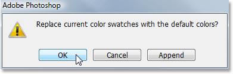
*Clicking OK to reset my color swatches to Photoshop's defaults.*

And now my Swatches palette is filled once again with the default colors:

*The default color swatches have returned.*

We'll see how to access our custom color swatches set, as well as how to use it, next.

### Step 8: Load The Custom Color Swatch Set

The next time you want to use your custom color swatch set, all you need to do is click once again on the right-pointing arrow at the top of the Swatches palette to access the palette menu. If you look down at the bottom of the menu, you'll see a list of additional color swatch sets that are available. Most of these are additional sets that installed with Photoshop, but since Photoshop saves our custom swatch sets in the same directory as the other sets it comes with, you'll find your custom sets listed here as well. All you need to do is click on the name of your custom set to select it. Photoshop lists the names of the sets in alphabetical order, so my "Autumn Leaves" set is listed second from the top:

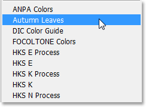
*You'll find all your custom swatch sets listed along with the other sets that install with Photoshop in the Swatches palette menu. Click on the name of the set to select it.*

Again, Photoshop will ask you if you want to replace your existing swatches with the new ones or if you simply want to append them to the list. I'm going to click OK to replace the default swatches with my Autumn Leaves swatches:

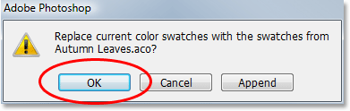
*Click "Replace" to replace the current swatches in the Swatches palette with your new swatches.*

And just like that, my custom "Autumn Leaves" swatches are loaded into my Swatches palette for me, ready to use:

*The custom swatch set is loaded back into the Swatches palette.*

### Choosing A New Foreground Color From The Swatches Palette

The great thing about using color swatches is that they're essentially preset colors, meaning colors that we've already chosen (or colors that Adobe has already chosen if we're working with swatch sets that installed with Photoshop), which means we don't have to keep choosing them with Photoshop's Color Picker every time we need them. To select any of the colors in the Swatches palette, simply hover your mouse over the color swatch. You'll see your mouse cursor change into the Eyedropper icon. Then click on the color to select it. Here, I'm choosing the orange color, second from the left:

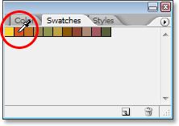
*Click on any colors in the Swatches palette to instantly select them.*

After clicking on it, I can see by looking at the Foreground color swatch in the Tools palette that the color I just clicked on has indeed been selected:

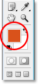
*The color you clicked on in the Swatches palette appears in the Foreground color swatch in the Tools palette.*

### Choosing A New Background Color From The Swatches Palette

To select a color to use as your Background color, simply hold down your *Ctrl* (Win) / *Command* (Mac) key and click on the color you want in the Swatches palette. Here, I'm clicking on a dark red color while holding down "Ctrl/Command":

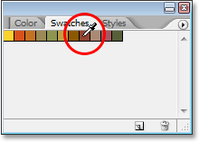
*Hold down "Ctrl" (Win) / "Command" (Mac) and click on any color in the Swatches palette to select a color to use as your Background color.*

Now if I look again in my Tools palette, I can see that the Background color swatch is filled with the dark red color I just clicked on:

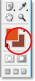
*The Background color swatch in the Tools palette now appears filled with the color you selected in the Swatches palette.*

I can now use the colors from my "Autumn Leaves" swatch set whenever I want, however I want! Here I've created a simple design for a poem using the colors from my swatch set, along with the "Scattered Maple Leaves" brush that ships with Photoshop:

*A design for a poem using the colors from my custom "Autumn Leaves" swatch set.*