# How to Customize the Toolbar in Photoshop

> Source: [https://www.photoshopessentials.com/basics/custom-toolbar-photoshop/](https://www.photoshopessentials.com/basics/custom-toolbar-photoshop/)
> Downloaded and converted to Markdown.

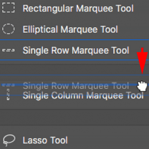

Learn how to customize the Toolbar in Photoshop CC using the Customize Toolbar dialog box, and how to save your custom Toolbar layout as a preset. You'll learn how to remove and restore tools, group and ungroup tools, reorder the tools, change keyboard shortcuts, and more!

So far in this series on the Photoshop interface, we've learned all about Photoshop's [Toolbar and its many tools](/basics/photoshop-tools-toolbar-overview/ "Photoshop tools and Toolbar overview"). We've also learned how to [reset Photoshop's tools and the Toolbar](/basics/reset-toolbar-photoshop-cc/ "How to reset Photoshop's tools and Toolbar") back to the default settings. In this tutorial, we'll learn **how to customize the Toolbar** in Photoshop! In Photoshop CC, Adobe finally allows us to create custom Toolbar layouts that better match the way we work. We can hide tools we don't use, change the tool groupings, rearrange the order of the tools, and more! We can even save our custom Toolbar layouts as presets! Lets see how it works.

To use the new customizable Toolbar feature, you'll need Photoshop CC. You'll also want to make sure that your copy of Photoshop CC is [up to date](/basics/update-photoshop-cc/).

This is lesson 4 of 10 in my [Learning the Photoshop Interface](/basics/learning-the-photoshop-interface/ "Complete Guide to Learning the Photoshop Interface") series.

Let's get started!

## Some Quick Toolbar Basics

By default, the Toolbar in Photoshop is located along the left of the interface. I've darkened the rest of the interface in the screenshot to make the Toolbar easier to see (it's way over on the left):

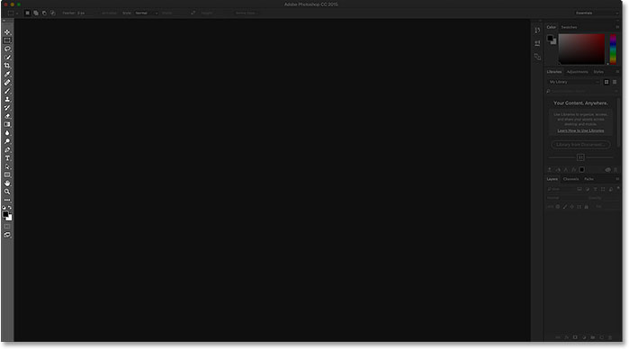
*Photoshop’s interface showing the Toolbar (highlighted) along the left.*

### Selecting The Tools

Each icon in the Toolbar represents a different tool we can select. Yet as they say on late night infomercials, "But wait... there's more!". Most of the tools we see in the Toolbar have more tools hiding behind them in the same spot. To view the additional tools, **right-click** (Win) / **Control-click** (Mac) on a tool icon. A fly-out menu will appear listing the other tools that are grouped in with it.

Photoshop's tools are grouped together with other tools that are similar in what they do. For example, if I right-click (Win) / Control-click (Mac) on the [Rectangular Marquee Tool](/basics/selections/rectangular-marquee-tool/ "Learn how to use the Rectangular Marquee Tool") near the top, a fly-out menu appears. The menu shows me that the [Elliptical Marquee Tool](/basics/selections/elliptical-marquee-tool/ "Learn how to use the Elliptical Marquee Tool"), the Single Row Marquee Tool and the Single Column Marquee Tool are all grouped together and available in that same spot. This makes sense because all four tools are [basic selection tools](/basics/selections/basic-selections/ "Unlock the full power of basic selection tools"):

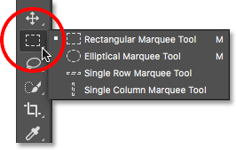
*Photoshop's four geometric selection tools are all found in the same spot in the Toolbar.*

If I right-click (Win) / Control-click (Mac) on the [Spot Healing Brush Tool](/photo-editing/spot-healing-brush/ "Learn how to use the Spot Healing Brush"), we see that it shares that spot in the Toolbar with the [Healing Brush Tool](/photo-editing/healing-brush/ "Learn how to use the Healing Brush"), the Patch Tool, the Content-Aware Move Tool, and the Red Eye Tool. These are all [photo retouching](/photo-editing/portrait-retouch/ "See our Portrait Retouching tutorials") tools, so again it makes sense that they're grouped together:

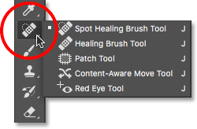
*Many of Photoshop's retouching tools are grouped together.*

## Why Do We Need To Customize The Toolbar?

I won't go through [every tool in the Toolbar](/basics/photoshop-tools-toolbar-overview/ "View a complete summary of every Photoshop tool"), but obviously, there's a lot of them (66 by my count as of Photoshop CC 2017). It's great that Photoshop gives us so many tools to work with, but you probably won't need every tool every day. There are some tools that you'll use all the time. Others, you'll use left often. And still others that, well, you'll have no use for at all.

Wouldn't it be great if we could customize the Toolbar so we could keep just the tools we need and hide the ones we don't? How about being able to change the order of the tools? That way, the tools you use the most could appear first, rather than being scattered all over the place. And what if we could group and ungroup tools in ways that make more sense to us and the way we work? Finally, what if we could save our customized Toolbar layout as a preset that we could switch to whenever we needed?

In earlier versions of Photoshop, there was no way to do any of those things. But in Photoshop CC, Adobe finally lets us customize the Toolbar any way we like. Let's see how it works.

## How To Customize The Photoshop Toolbar

To customize the Toolbar in Photoshop, we use the **Customize Toolbar** dialog box. To open it, go up to the **Edit** menu in the Menu Bar along the top of the screen and choose **Toolbar**:

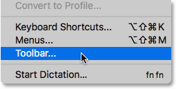
*Going to Edit > Toolbar.*

Or, **right-click** (Win) / **Control-click** (Mac) on the **Ellipsis icon** (the three little dots) directly below the Zoom Tool in the Toolbar itself. Then, choose **Edit Toolbar** from the fly-out menu:

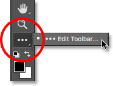
*Right-clicking (Win) / Control-clicking (Mac) on the Ellipsis icon and choosing Edit Toolbar.*

### The Customize Toolbar Dialog Box

Either way opens the Customize Toolbar dialog box. The dialog box is made up of two main columns. On the left is the **Toolbar** column. The Toolbar column displays the current Toolbar layout, including the order in which the tools appear and their groupings. On the right is the **Extra Tools** column. It's where we drag tools from the Toolbar column that we want to remove:

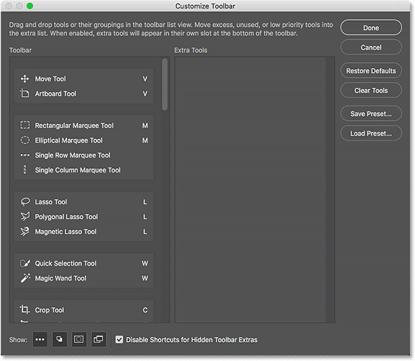
*The Customize Toolbar dialog box in Photoshop CC.*

### How To Remove A Tool From The Toolbar

To remove a tool from the Toolbar, simply click on the tool in the Toolbar column on the left and drag it into the Extra Tools column on the right. But before I show you how it works, I'm going to close out of the Customize Toolbar dialog box for a moment. To do that, I'll click the **Cancel** button in the upper right. This closes the dialog box without saving any of your changes:

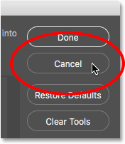
*Clicking the Cancel button.*

With the dialog box closed, I'll right-click (Win) / Control-click (Mac) on the Move Tool at the very top of the Toolbar. This opens the fly-out menu where we see that, by default, the Artboard Tool is nested behind the Move Tool:

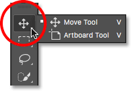
*The Move Tool and Artboard Tool share the same spot in the Toolbar.*

Let's say I don't really use the Artboard Tool very often, so I'd like to remove it from the Toolbar. To do that, I'll **right-click** (Win) / **Control-click** (Mac) on the **Ellipsis** icon near the bottom of the Toolbar. Then, I'll choose **Edit Toolbar** from the fly-out menu, just as we saw earlier:

*Choosing the Edit Toolbar command.*

This opens the Customize Toolbar dialog box, again as we saw earlier. If we look at the top of the Toolbar column on the left, we see the Move Tool and the Artboard Tool grouped together:

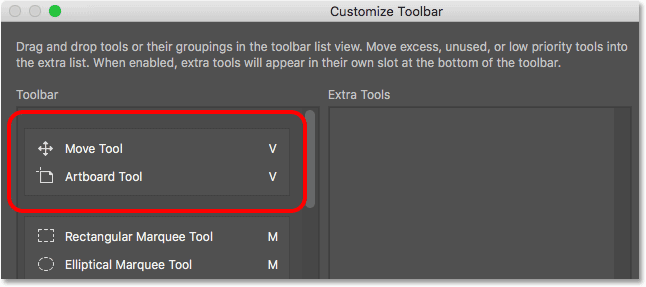
*The Customize Toolbar dialog box showing the Move Tool and the Artboard Tool group.*

To remove the Artboard Tool from the Toolbar, all I need to do is click on it in the Toolbar column and drag it into the Extra Tools column:

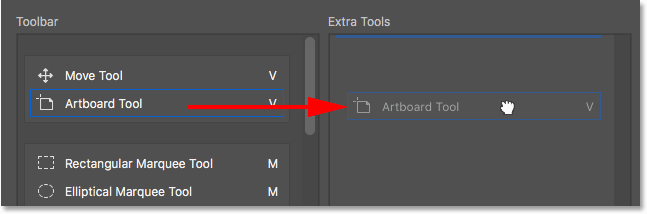
*Dragging the Artboard Tool from the left column into the right column.*

I'll release my mouse button, and now the Artboard Tool no longer appears in the Toolbar on the left. It's now an extra tool over on the right:

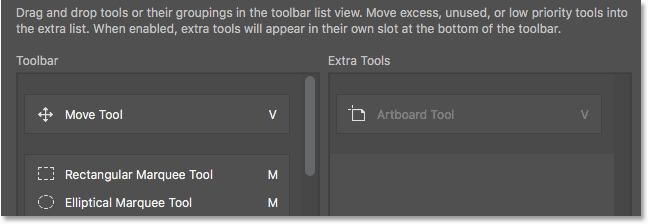
*The Artboard Tool is now an extra tool, not a main tool in the Toolbar.*

To accept my change and close out of the dialog box, I'll click the **Done** button in the upper right:

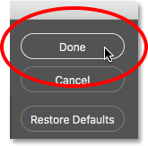
*Clicking the Done button.*

And now, if I right-click (Win) / Control-click (Mac) on the Move Tool in the Toolbar, nothing happens. The fly-out menu no longer appears. That's because the Move Tool is now the only tool in that spot. I've removed the Artboard Tool that was previously nested behind it:

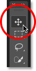
*The Move Tool now sits alone at the top of the Toolbar.*

### Where To Find The Extra Tools

So, where did the Artboard Tool go? Well, when I say I've *removed* it from the Toolbar, that's not really true. We don't actually remove tools completely. Instead, we simply move them from the main Toolbar layout into a new, hidden **Extra Tools** area. To view the Extra Tools area, **right-click** (Win) / **Control-click** (Mac) on the **Ellipsis icon** in the Toolbar to open the fly-out menu. Or, **click and hold** on the Ellipsis icon for a moment and the fly-out menu will appear.

Any tools you've dragged into the Extra Tools column of the Customize Toolbar dialog box (like my Artboard Tool, for example) will appear here, listed below the Edit Toolbar command. This means that if and when you do need these tools, they're still here and ready to select. The only difference is, they're now tucked away in a separate area:

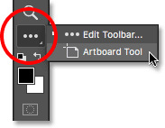
*Extra tools are listed below the Edit Toolbar command.*

### How To Restore A Tool In The Toolbar

Now that I've moved the Artboard Tool into the Extra Tools area, what if I realize I made a mistake? I actually do use the Artboard Tool quite a bit, so how do I move it back into the main Toolbar? To restore a tool, click on it in the Extra Tools column on the right and drag it back into the Toolbar column on the left.

#### Creating An Independent Tool

Pay attention, though, to the **blue horizontal bar** that appears below your little "grabby" hand cursor as you're dragging the tool. This blue bar tells you where you'll be dropping the tool when you release your mouse button. Where you drop it is where it will appear in the Toolbar. For example, if I drag the Artboard Tool below the Move Tool so that the blue horizontal bar appears between the Move Tool and the group that begins with the Rectangular Marquee Tool:

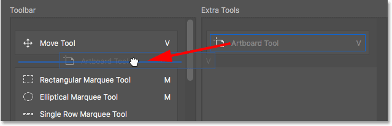
*Dragging the Artboard Tool below the Move Tool.*

Then when I release my mouse button, Photoshop drops the Artboard Tool into that spot, making it an independent tool rather than being part of any group:

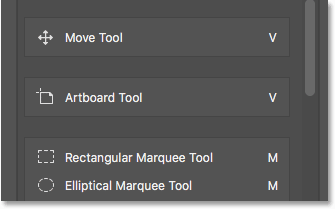
*The Artboard Tool now sits below and separate from the Move Tool.*

### The Live Toolbar Preview

The Toolbar itself actually updates to show us a live preview of the changes we're making in the Customize Toolbar dialog box. Here, we see the Artboard Tool now sitting below the Move Tool:

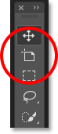
*The Toolbar updates as we make changes.*

#### Grouping A Tool With Other Tools

What if, instead of having the Artboard Tool separate, I wanted to group it back in with the Move Tool as it was originally? I'll click and drag the Artboard Tool back into the Extra Tools column for a moment:

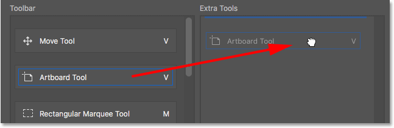
*Dragging the Artboard Tool back into the Extra Tools column.*

Then, I'll drag it back into the Toolbar column. But this time, rather than dragging it *below* the Move Tool, I'll position my hand cursor so that the blue horizontal bar appears just *inside* the bottom of the Move Tool's box:

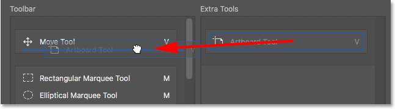
*Dragging the Artboard Tool into the same group as the Move Tool.*

I'll release my mouse button, and now the Artboard Tool is once again grouped in with the Move Tool:

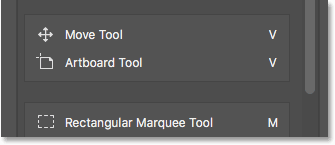
*The Move Tool and Artboard Tool once again share the same group.*

### How To Group And Ungroup Tools In The Toolbar

If you think about it, the Artboard Tool and the Move Tool really have nothing to do with each other. So why are they part of the same group? It makes more sense for them to be separate, independent tools in the Toolbar. How do I ungroup them? I mean, I *could* drag the Artboard Tool back into the Extra Tools column and then back into the Toolbar column again as I did a moment ago. But there's an easier way.

#### Ungrouping A Single Tool

To ungroup the Artboard Tool, all I need to do is click on it and drag it downward until the blue horizontal bar appears below and separate from the Move Tool's box:

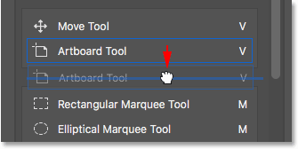
*Dragging the Artboard Tool down and away from the Move Tool.*

When I release my mouse button, Photoshop ungroups the Artboard Tool from the Move Tool and displays them independently of each other:

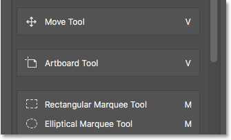
*The two tools have been ungrouped.*

#### Removing Multiple Tools From A Group

We'll come back to the Artboard Tool a bit later. Let's look at a different example. Here we have the group containing the Rectangular Marquee Tool, the Elliptical Marquee Tool, the Single Row Marquee Tool, and the Single Column Marquee Tool. These are Photoshop's basic selection tools:

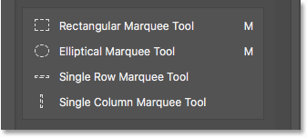
*The Marquee Tools group.*

The Rectangular Marquee Tool and the Elliptical Marquee Tool both get plenty of use. But the only time I ever really use the Single Row or Single Column Marquee Tool is when I'm trying to [turn a photo into an interesting background](/photo-effects/photoshop-background/). I'd like to keep the Rectangular and Elliptical Marquee Tools in the main Toolbar but move the other two over to the Extra Tools column.

To do that, I'll start by separating the Single Row and Single Column Marquee Tools from the group. I'll remove the Single Column Marquee Tool first by clicking and dragging it downward until the blue bar appears below the group:

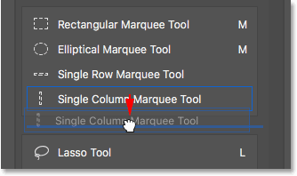
*Ungrouping the Single Column Marquee Tool.*

I'll release my mouse button to drop the tool into place, and I now have the Single Column Marquee Tool separate from the others:

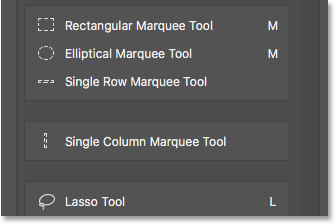
*The Single Column Marquee Tool is now separate from the group.*

#### Creating A New Tool Group

Next, I'll click on the Single Row Marquee Tool and drag it downward as well. But rather than making it another independent tool, I'll create a **new group** to hold the Single Row and Single Column Marquee Tools. To do that, I'll position my hand cursor so that the blue bar appears just inside the top of the Single Column Marquee Tool's box:

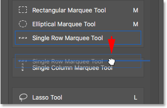
*Dragging the Single Row Marquee Tool into the Single Column Marquee Tool box.*

When I release my mouse button, Photoshop ungroups the Single Row Marquee Tool from the Rectangular and Elliptical Marquee Tools and places it in a brand new group with the Single Column Marquee Tool:

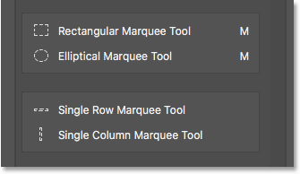
*The Single Row and Single Column Marquee Tools now sit inside their own group.*

### The Default Tool

If we look in my actual Toolbar, we see the new group sitting between the Rectangular Marquee Tool and the Lasso Tool. Notice that it's the Single Row Marquee Tool's icon that we're seeing. The Single Column Marquee Tool is currently nested behind it. This means that to get to the Single Column Marquee Tool, I would need to right-click (Win) / Control-click (Mac) on the Single Row Marquee Tool. Then, I could select the Single Column Marquee Tool from the fly-out menu:

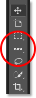
*The Single Row Marquee Tool is displayed in the Toolbar. The other tool is hiding behind it.*

How does Photoshop know which tool in the group to display in the Toolbar and which tool(s) to nest behind it? It knows because Photoshop considers the tool at the top of the group to be the **default tool**. The default tool is the one that gets displayed first.

#### How To Change The Default Tool For a Group

To change the default tool, all we need to do is drag a different tool to the top of the group. For example, if I want the Single Column Marquee Tool to be the default tool, all I need to do is click on it and drag it above the Single Row Marquee Tool. Notice that I'm not dragging it completely out of the group. I'm positioning my hand cursor so that the blue bar appears just inside the top of the group:

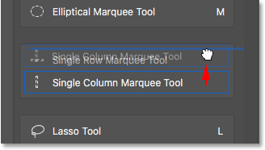
*Dragging the Single Column Marquee Tool above the Single Row Marquee Tool in the group.*

When I release my mouse button, Photoshop drops the Single Column Marquee Tool above the Single Row Marquee Tool, making it the new default tool:

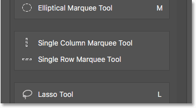
*The Single Column Marquee Tool is now the group's default tool.*

And if we look again in my Toolbar, we see that the Single Column Marquee Tool is now the one that's actually displayed. The Single Row Marquee Tool is now nested behind it:

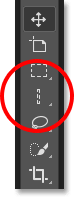
*The Single Column Marquee Tool's icon is now displayed in the Toolbar.*

### How To Move Entire Tool Groups At Once

We've seen how to drag individual tools from one column to the other. We can also drag entire groups. With the Single Row and Single Column Marquee Tools now in their own separate group, I can easily move them both into the Extra Tools column. To drag a group, first position your mouse cursor over the edge of the group. A **blue highlight box** will appear around the group. This lets you know that you're selecting the group as a whole:

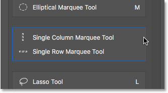
*Highlighting the group by positioning my mouse cursor over its edge.*

Then, just as you would with an individual tool, click and drag the group over to the Extra Tools column:

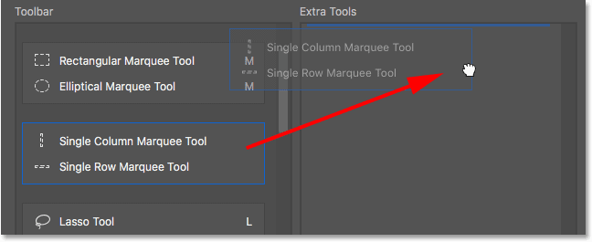
*Dragging the entire group into the Extra Tools column.*

I'll release my mouse button, at which point Photoshop moves both tools to the Extra Tools column at the same time. You can do the same thing in the opposite direction as well, moving an entire group from the Extra Tools column into the Toolbar column:

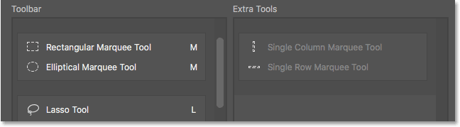
*The tools have been moved as a group into the Extra Tools column.*

### How To Rearrange The Order Of The Tools In The Toolbar

Let's go back to the Artboard Tool for a moment. It's currently sitting directly below my Move Tool at the top of the Toolbar:

*The Artboard Tool currently sits near the top.*

One thing you might want to do when customizing your Toolbar is move the tools you use the most to the top of the Toolbar and move the ones you don't use as often further down. Even though I do use the Artboard Tool, I don't use it enough for it to be taking up a spot near the top. In fact, it probably belongs closer to the bottom, which means I should move it.

To rearrange the order of the tools, click on the one you want to move and drag it up or down into its new spot. Again, keep an eye on the blue horizontal bar that appears below your hand cursor so you don't group the tool in with other tools by mistake. Here, I'm dragging the Artboard Tool down below the group containing the Lasso, Polygonal Lasso and Magnetic Lasso Tools:

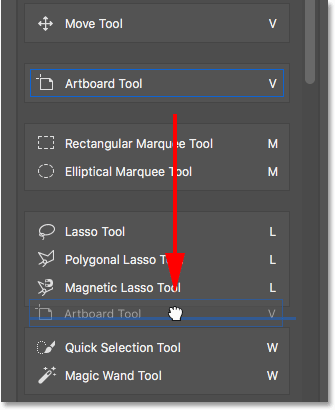
*Dragging the Artboard Tool below the Lasso Tools group.*

I'll release my mouse button to drop the Artboard Tool into place. So far, so good:

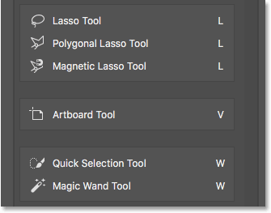
*The Artboard Tool has been moved further down the Toolbar.*

#### A Faster Way To Reorder Tools

I've moved the Artboard Tool further down the list, but not nearly far enough. I actually want to place it directly above the Hand Tool which is way down near the bottom. This means there's still a whole lot of tools between the spot where the Artboard Tool currently sits and the spot I want to move it to.

Rather than slowly dragging the Artboard Tool down across all the tools in between, what I'll do is click and drag the Artboard Tool into the Extra Tools column *temporarily*. I'm not actually making the Artboard Tool an extra tool. I'm just using the Extra Tools column as temporary storage:

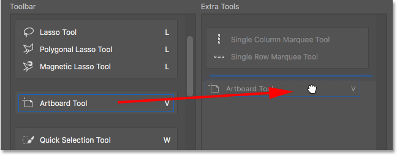
*Using the Extra Tools column to temporarily hold the Artboard Tool.*

Then, I'll use the **scroll bar** along the right of the Toolbar column to quickly scroll down to the spot where I want to place the Artboard Tool. In this case, it's above the Hand Tool:

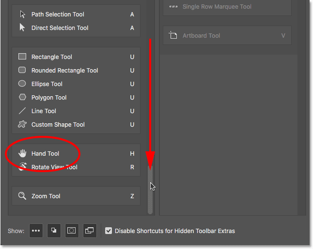
*Scrolling down to the Hand Tool in the Toolbar column.*

I'll drag the Artboard Tool back into the Toolbar column, dropping it into place above the Hand Tool:

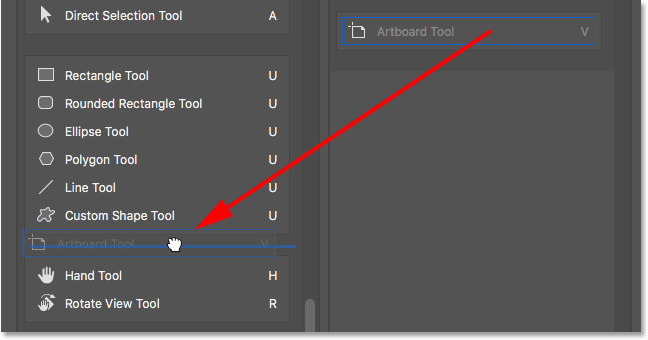
*Dragging the Artboard Tool above the Hand Tool.*

And now, the Artboard Tool is right where I wanted it:

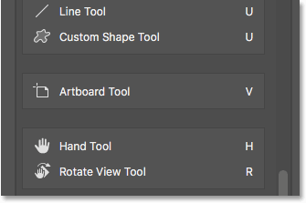
*The Artboard Tool now sits above the Hand Tool.*

Again, we can see the change I've made in the Toolbar itself. You can move entire groups up and down the toolbar just as easily. Simply move your mouse cursor over the edge of the group to highlight it. Then, drag it up or down the Toolbar as needed. Or, as I did with the Artboard Tool, drag the group into the Extra Tools column temporarily. Scroll to the spot you need in the Toolbar column, then drag the group back into the Toolbar column and drop it into place:

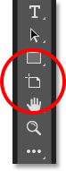
*The Toolbar showing the Artboard Tool's new home.*

### How To Disable Keyboard Shortcuts For Extra Tools

Let's look at the group made up of the Crop Tool, the Perspective Crop Tool, the Slice Tool, and the Slice Select Tool. If you look to the right of the tool names, you'll see that all four tools share the same **keyboard shortcut**. In this case, they're all selectable by pressing the letter **C**. So, if I press the letter C once on my keyboard, I'll select the first tool in the group (the Crop Tool). If I then press and hold my **Shift** key and continue pressing **C** repeatedly, I can cycle through the other tools in the group:

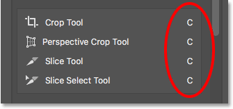
*The Crop and Slice Tools are share the same keyboard shortcut.*

I want to keep the Crop and Perspective Crop Tools in the main Toolbar but move the Slice and Slice Select Tools into the Extra Tools column. We've already learned how to do this, so I'll save us a bit of time by dragging them over quickly:

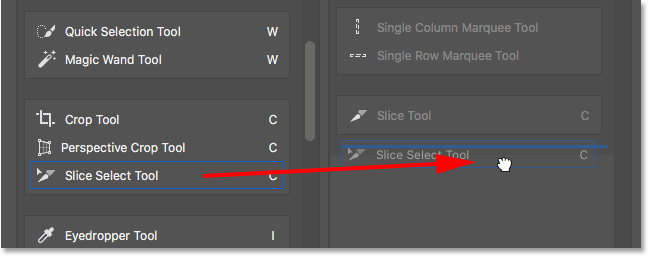
*Clicking and dragging the Slice and Slice Select Tools into the Extra Tools column.*

Notice that even though these tools have been moved out of the main Toolbar column, they're still showing the same keyboard shortcut as before. Moving them to the Extra Tools column did not remove the shortcut:

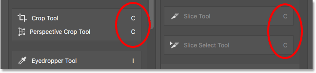
*Tools keep their keyboard shortcuts even when dragged into the Extra Tools column.*

#### The "Disable Shortcuts for Hidden Toolbar Extras" Option

If you look along the bottom of the Customize Toolbar dialog box, you'll see an option that says **Disable Shortcuts for Hidden Toolbar Extras**. By default, it's selected (checked). If you no longer want your extra tools to be selectable using their keyboard shortcuts, leave this option checked. That way, only the main tools in the Toolbar will remain selectable from the keyboard. Extra tools will need to be selected directly from the Extra Tools area.

If, on the other hand, you want to keep the keyboard shortcuts active for all of your tools regardless of whether they're in the main Toolbar or the Extra Tools section, then you'll want to uncheck this option. Personally, I leave it checked:

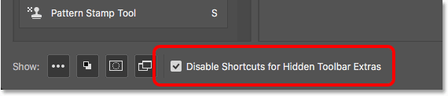
*The "Disable Shortcuts for Hidden Toolbar Extras" option.*

### How To Add Keyboard Shortcuts

We can also use the Customize Toolbar dialog box to add keyboard shortcuts to tools that didn't originally have one. For example, here we have the group made up of the Pen Tool, the Freeform Pen Tool, the Add Anchor Point Tool, the Delete Anchor Point Tool, and the Convert Point Tool:

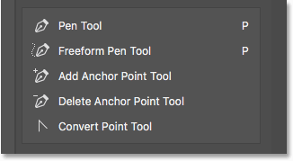
*The Pen Tool group.*

I'm going to quickly drag the Add Anchor Point and Delete Anchor Point Tools into the Extra Tools column:

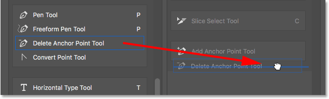
*Dragging the Add and Delete Anchor Point Tools into the Extra Tools column.*

This leaves just the Pen Tool, the Freeform Pen Tool and the Convert Point Tool in the group. Notice that both the Pen Tool and the Freeform Pen Tool share the letter **P** as their keyboard shortcut. Yet the Convert Point Tool does not. In fact, it has no keyboard shortcut at all:

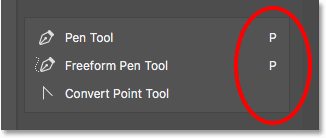
*Two of the three remaining tools in the group share the same keyboard shortcut. One does not.*

Since all three tools are part of the same group, it would make more sense if they all shared that keyboard shortcut. To add the keyboard shortcut to the Convert Point Tool, all I need to do is click on the tool to select it. A little text cursor appears in the blank spot where the keyboard shortcut would normally be:

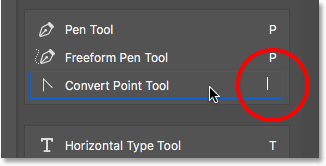
*Selecting the tool to add a keyboard shortcut.*

I'll press the letter **P** on my keyboard to set it as the new shortcut, then I'll press **Enter** (Win) / **Return** (Mac) to accept the change. And now, all three tools in the group share the same shortcut:

*Choose the letter from your keyboard, then press Enter (Win) / Return (Mac).*

### How To Clear All Tools From The Toolbar

So far, we've been spending most of our time dragging tools from the Toolbar column on the left into the Extra Tools column on the right. But if you *really* want to streamline things and keep only a few tools in the main Toolbar, click the **Clear Tools** button in the upper right of the dialog box:

*Clicking the Clear Tools button.*

This instantly moves every tool into the Extra Tools column, leaving the main Toolbar column completely empty:

*The Clear Tools button makes every tool an extra tool.*

You can then drag just the few tools (or groups) you need into the Toolbar column:

*The Clear Tools feature is a good way to save time when you only need a few tools in the main Toolbar.*

### Hiding The Other Toolbar Options

If you look below the tools, down at the very bottom of the Toolbar, you'll find a few more icons. Starting from the top, we have the **Ellipsis** icon (that we've already looked at) for choosing the Edit Toolbar command as well as for viewing our extra tools. Below that is the **Foreground/Background Colors** icon, the **Quick Mask Mode** icon, and finally, the **Screen Mode** icon:

*The additional options at the bottom of the Toolbar.*

You can turn any or all of these icons off by clicking to deselect them along the bottom of the Customize Toolbar dialog box. To turn them back on, simply click on them again. Note, though, that if you hide the Ellipsis icon from the Toolbar, you'll no longer be able to view the Extra Tools area (which means you'll lose access to any hidden tools). Also, you'll only be able to access the Customize Toolbar dialog box by going up to the **Edit** menu at the top of the screen and choosing **Toolbar**:

*Click the icons along the bottom of the dialog box to show or hide these options in the Toolbar.*

### How To Save Your Custom Toolbar Layout As A Preset

To save your custom Toolbar layout as a preset, click the **Save Preset** button:

*Clicking the Save Preset button.*

Give your preset a descriptive name, then click **Save**. You can save multiple Toolbar layouts as presets, each one customized for a specific task (like photo retouching, digital painting, web design, and so on):

*Naming and saving the preset.*

#### Loading A Custom Toolbar Preset

To load your Toolbar preset when you need it, click the **Load Preset** button:

*The Load Preset button.*

### How To Restore The Default Toolbar

To revert back to Photoshop's original, default Toolbar layout, click the **Restore Defaults** button:

*The Restore Defaults button.*

### Closing The Customize Toolbar Dialog Box

Finally, to close out of the Customize Toolbar dialog box and keep the changes you've made, click the **Done** button. To close out of it without keeping your changes, click the **Cancel** button:

*Clicking the Done button.*