# Photoshop Actions – The Default Actions

> Source: [https://www.photoshopessentials.com/basics/photoshop-actions/default-actions/](https://www.photoshopessentials.com/basics/photoshop-actions/default-actions/)
> Downloaded and converted to Markdown.

In the [**previous section**](/basics/photoshop-actions/), we looked briefly at what actions are and why you'd want to use them, and we took a quick look at Photoshop's Actions palette, which is where we do everything from recording, playing, editing, and saving actions to loading in additional action sets.

### Photoshop's Default Actions Set

When we first bring up the Actions palette, we see that Photoshop has loaded a set of actions for us, with the descriptive name "Default Actions".

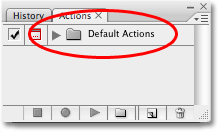
*The Actions palette.*

### The Difference Between An "Action" And An "Action Set"

Before we continue, we need to understand the difference between an *action* and an *action set*. If you look closely at the actions palette, you'll see a folder icon to the left of the words "Default Actions", and that's essentially what an action set is. It's a folder that contains your actions, just like a folder in a filing cabinet might contain various forms, receipts, and what not. In this case, the Default Actions folder (action set) contains various actions that are automatically loaded into Photoshop for us.

So where are the actions then? They're inside the folder, which brings up the question, "Okay, so how do I open the folder?" To open (and close) a folder, simply click on the triangle to the left of the folder. This will "twirl open" (I love saying that for some reason) the folder, or if the folder was already open, it will close it. Go ahead and click on the triangle. You'll see the folder open and all of the actions inside of it will appear:

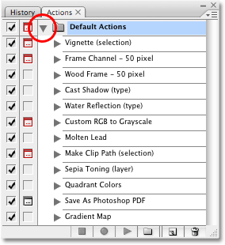
*The actions are now visible inside the action set.*

### Different Default Actions In Photoshop CS2

As I mentioned, I'm using Photoshop CS3 here, but the default actions shown above are the same default actions that Adobe has been including with Photoshop for years, with one exception. For whatever reason, when Adobe released **Photoshop CS2**, they decided to replace the usual default actions with new ones. If you're using Photoshop CS2, you'll see these default actions instead:

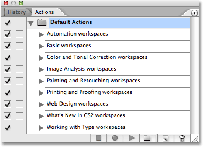
*The usual default actions were replaced with new ones in Photoshop CS2.*

Notice how the name of each action in the list contains the word "workspaces", and that's because the only thing these actions do is allow you to select from the various workspaces that Photoshop comes with. Without getting into details about what workspaces are, let's just say that these default actions in Photoshop CS2 are about as useless as they come. Obviously, the folks at Adobe felt the same way since they switched back to the classic default actions in Photoshop CS3.

Fortunately, if you're using Photoshop CS2 and you want access to those classic default actions, all you need to do is click on the small, right-pointing arrow in the top right corner of the Actions palette to bring up the fly-out menu, then click on **Sample Actions** from the list of additional action sets at the bottom of the menu:

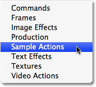
*Selecting "Sample Actions" from the list of additional actions in Photoshop CS2.*

As soon as you select "Sample Actions" from the list, you'll see the Sample Actions action set appear in the Actions palette directly below the Default Actions set. Click on the triangle to twirl open the Sample Actions folder and you'll see all of the individual actions inside of it. These are the exact same actions that ship as the Default Actions with other versions of Photoshop:

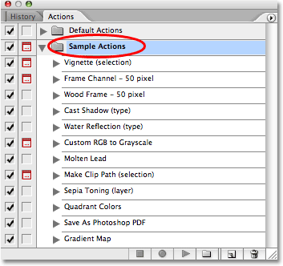
*The Sample Actions set in Photoshop CS2 contains the default actions from other versions of Photoshop.*

Again, the Sample Actions set is only available in Photoshop CS2 and only because Adobe chose to replace the default actions in CS2 with new ones. From this point on, when I say "default actions" or "Default Actions set", if you're using Photoshop CS2, just know that I'm referring to the actions in your Sample Actions set, which are the default actions in all other versions of Photoshop.

### Photoshop's Default Actions

Now that we've cleared up that little issue for Photoshop CS2 users, let's take a look at some of the default actions that Photoshop installs for us. Believe it or not, some of them are actually kind of useful, especially if you're pressed for time and just need a quick and dirty effect. There's 12 different actions that install as part of the Default Actions set, and while we won't look at all of them since you can easily do that on your own, let's check a couple of them out to see how they work.

### The "Vignette" Default Action

At the top of the list of default actions is one named **Vignette (selection)**:

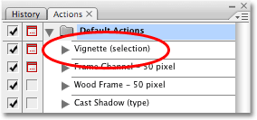
*The "Vignette (selection)" default action.*

This action was put together for us by the good folks at Adobe and contains all the steps necessary to add a classic vignette effect to a photo. The reason Adobe added "(selection)" in the name is because before we run the action, we need to first draw out a selection where we want the vignette to appear. Once we've drawn a selection, all we'll need to do is play the action and Photoshop will do the rest for us!

Here's the photo I want to add a classic vignette to:

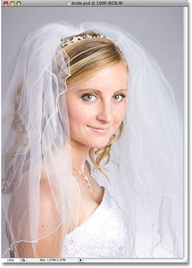
*The original photo.*

As I mentioned, we need to draw out a selection inside the image before we can run the action, so I'll select the *Elliptical Marquee Tool* from the Tools palette and I'll use it to drag out an elliptical selection in the center of the image:

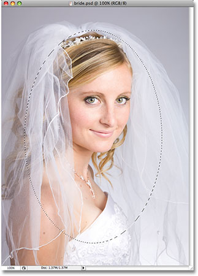
*The image after dragging out a selection with the Elliptical Marquee Tool.*

Before we run the action, let's take a quick look our Layers palette, where we can see that currently, we have only one layer, the Background layer, which contains the original photo. Nothing has been done to the image yet, with the exception of the selection I added a moment ago:

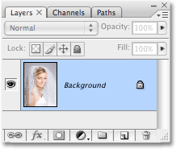
*The Layers palette showing the original image on the Background layer.*

### Playing The Action

To play the Vignette action, all we need to do is select it in the Actions palette (the currently selected action is highlighted in blue), then click on the *Play* icon at the bottom of the palette:

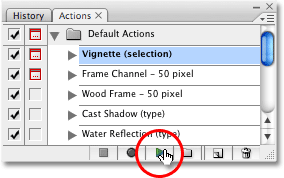
*Select the Vignette action, then click on the Play icon.*

As soon as we click Play, Photoshop begins running through all the steps necessary to complete our effect. In this case, one of the steps involves us choosing a *feather* radius for the selection we added a moment ago. Feathering a selection makes the selection edges softer. The greater the feather radius, the softer the edges. Now, Adobe could have included a specific feather radius as part of the action, which would avoid us having to choose one ourselves, but since every photo is different, it's preferable that we have the ability to set the feather radius ourselves on an image-by-image basis. We'll learn how to add the option to make changes like this with actions later on. For now, we'll just continue on with our vignette action.

Since we need to speciify a feather radius as part of the action, Photoshop automatically pops up the *Feather Selection* dialog box for us. The default feather radius is 5 pixels which is a bit too small for our vignette effect. I'm going to set my feather radius to 20 pixels, which will make my selection edges nice and soft. Depending on the size of your image, you may want to increase the radius value even further:

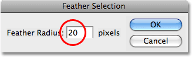
*Photoshop's Feather Selection dialog box. Higher radius values result in softer selection edges.*

Click OK when you're done to close the dialog box. The feather radius is the only option we need to set manually with this action, so Photoshop continues on at this point and completes the vignette effect for us. Here's my final result. Remember, all I had to do was drag out an initial selection and then choose a feather radius. Photoshop did everything else as part of the Vignette action:

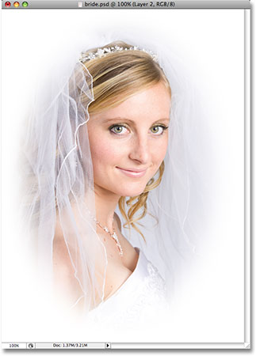
*The completed effect after running the Vignette action.*

Not bad at all, especially considering how little work I had to do myself. Now that the effect is complete, let's take another look at our Layers palette:

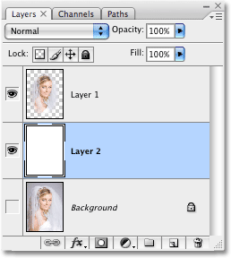
*The Layers palette after running the Vignette action.*

Before we ran the action, all we had in the Layers palette was a single layer, the Background layer. With the action and the effect now complete, we can see that Photoshop has added two more layers for us above the Background layer. We can even see by looking at the layer preview thumbnails that the middle layer, "Layer 2", has been filled with solid white and that the top layer, "Layer 1", contains only the part of the original image that was within the initial selection I made. Everything outside of the selection has been deleted. All of this was done automatically by Photoshop as part of the Vignette action.

If you recall from our look at the difference between an **action** and an **action set** in Photoshop, we learned that an action set is really nothing more than a folder, and that individual actions are placed inside the folder. We learned that we can open a folder (action set) to view the actions inside of it simply by clicking on the small triangle to the left of the folder icon. Clicking on the triangle again will close the folder.

We can do the exact same thing with actions. By default, an action is closed inside the Actions palette, hiding the individual steps that make up the action from view. To twirl open an action and see all of the steps, simply click on the triangle to the left of the action's name. Here I've clicked on the triangle for the Vignette action, and we can now see all of the steps that Photoshop runs through when creating the effect for us:

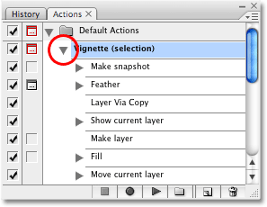
*Click on the triangle to the left of the action name to view the individual steps.*

When playing an action, Photoshop runs through each step in the list from top to bottom until it reaches the end. In the case of the Vignette action, we can see that there's 7 steps which Photoshop completes for us, beginning with "Make snapshot", which creates a snapshot in the History palette of how the image appeared just before we ran the action, and ending with "Move current layer".

### Viewing The Details Of Each Step In An Action

Notice how some of the steps also have triangles beside their name. These triangles twirl open the specific details for each step so we can see exactly what's going on. Now we're really getting down to the nitty gritty of how the action works. For example, here I've twirled open the second step in the action, "Feather":

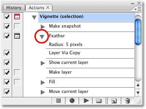
*Clicking on the triangle beside an individual step reveals the specific details.*

Being able to view specific details of a step is invaluable when trying to figure out why an action you're trying to record isn't working the way you expected, or why it works perfectly with one image but not another. With the details of the Feather step now visible, we can see that the first thing Photoshop tries to do with this step is add a feather radius of 5 pixels to the selection we made before running the action.

### Showing And Hiding Dialog Boxes When Playing An Action

Remember what happened though? Instead of automatically applying a feather radius of 5 pixels, Photoshop popped open the Feather Selection dialog box for us so we could enter in our own radius value.

Why did Photoshop do that? Why didn't it simply set the radius value to 5 pixels on its own and carry on with the rest of the action? The reason is because Photoshop allows us to decide whether or not we want certain dialog boxes to pop up when an action is playing.

"Wait a minute," you're saying, "I thought the whole point of actions was so Photoshop does all the work for me. Why the heck would I want a bunch of dialog boxes popping up on the screen all the time expecting me to enter values for this and that?" Geez, you really *are* lazy, aren't you? Well, certainly there will be plenty of times when you won't need Photoshop asking you which values to use for different commands and options. But what would happen, for example, if Photoshop hadn't asked us for a new feather radius value when we ran the Vignette action? It would simply add a 5 pixel feather radius to the selection every time we ran the action, regardless of the size of the image. Since different size images would require a different feather radius value, an action that doesn't give us the option to change the radius value wouldn't be very useful to us.

By default, Photoshop does not pop open dialog boxes when we run actions. It simply uses whatever values we used for the various commands and options when we recorded the action. If we want Photoshop to open a dialog box for us when an action plays, we need to tell it to do so, and the way we do that is by clicking on the *dialog box toggle icon * to the left of the individual step. By default, the toggle icon is hidden and all we see is an empty square. This means that the dialog box will not appear.

If we look closely at the Actions palette though, we can see that the dialog box toggle icon is appearing to the left of the Feather step (it looks like a small gray dialog box):

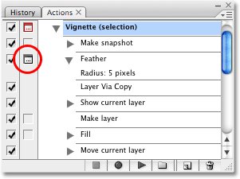
*The dialog box toggle icon is visible to the left of the Feather step.*

With the toggle icon visible, Photoshop knows that when it reaches that step, it needs to display the related dialog box and allow us to enter a new value, if needed, before carrying on with the rest of the action. If we decide we'd rather just skip past the dialog box and allow Photoshop to use whatever values were recorded with the action, all we'd need to do is click on the toggle icon to make it disappear.

### Showing Or Hiding All Dialog Boxes For An Action

If you want every step in an action to display its dialog box when the action is played (or at least, every step that *has* a related dialog box, since not every step will have one), you *could* click the toggle icon for each individual step on or off, but an easier and faster way is to click on the toggle icon beside the name of the action itself. This main toggle icon controls the toggle icons for all of the individual steps at once. If we look for a moment at the toggle icon to the left of our Vignette action's name, we can see that the icon is currently being displayed, but for some reason it appears red rather than gray:

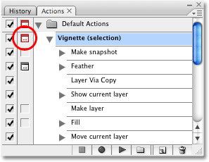
*The dialog box toggle icon beside the name of the action currently appears red.*

Photoshop occasionally likes to display things in red because it knows that red tends to make people feel uneasy, even angry, and as everyone knows, Photoshop takes great pleasure in watching us suffer.

Okay, that's not why. When an action's main dialog box toggle icon is displaying in red, it means that at least one, *but not all*, of the individual steps in the action are currently set to display their dialog box when the action is played. Some dialog boxes are turned on, some are not. That's what the red color means. See? No reason to be angry. If you want to instantly turn all the dialog boxes in the action on, just click on the action's main toggle icon. Photoshop will pop up a warning telling you what you already knew, that you're about to toggle every dialog box in the action either on or off:

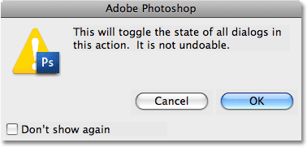
*Photoshop displays a warning that we're about to toggle every dialog box in the action on or off.*

Click OK to exit out of the dialog box. And now, if we look again at our Actions palette, we can see that the main toggle icon for the action has changed from red to gray, which now tells us that every dialog box for the action is currently turned on. We can also see all the dialog boxes appearing beside each individual step:

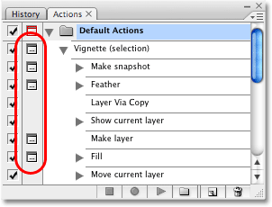
*All dialog boxes for the action are now turned on, and the main toggle icon's color has changed from red to gray.*

If you want to turn off all dialog boxes for an action at once, click on the main toggle icon once again. Photoshop will pop up the same warning box we saw a moment ago, telling us that we're about to toggle the state of all dialog boxes in the action. Click OK to close out of it, and this time, we can see that all of the toggle icons, including the main one beside the name of the action, have disappeared:

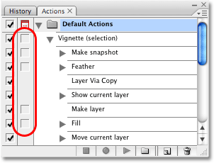
*All dialog boxes for the action are now turned off. The toggle icons, including the main toggle icon, have all disappeared.*

Okay, we've successfully ran our very first action, and we've seen how to view the individual steps that Photoshop runs through to complete the action. We've also looked at how to toggle dialog boxes on and off when an action is playing so we can make any necessary changes to a command or option. Feel free to try out the remaining default actions on your own. Remember that some of the default actions are meant to be used with type, so you'll need some type in your document before running them. If, after running an action, you want to revert back to your original image, you can either press *Ctrl+Alt+Z * (Win) / *Command+Option+Z * (Mac) a few times to undo all the steps in the action, or go up to the *File * menu at the top of the screen and choose *Revert * to revert your image back to the state it was in when you last saved it. You can quickly access the Revert command by pressing the *F12 * key on your keyboard.