# How to Make Photoshop Your Default Image Editor

> Source: [https://www.photoshopessentials.com/basics/default-image-editor-mac/](https://www.photoshopessentials.com/basics/default-image-editor-mac/)
> Downloaded and converted to Markdown.

Want to open images into Photoshop just by double-clicking on them? Here's how to make Photoshop your default image editor in Windows 10 and macOS!

In this tutorial, I show you how to make Photoshop your default image editor in both Windows and on a Mac so you can open JPEG files, PNG files and more directly into Photoshop just by double-clicking on them! We'll start by learning how to change the default image editor in Windows 10 from the Photos app to Photoshop, and then we'll move over to the Mac and change the default image editor in macOS from Preview to Photoshop!

Since this is really more of a Windows and Mac tutorial, whichever version of Photoshop is installed on your computer will work. You can [get the latest Photoshop version here](https://adobe.prf.hn/click/camref:1100lrdjJ/destination:https%3A%2F%2Fwww.adobe.com%2Fproducts%2Fphotoshop.html).

Let's get started!

## How to make Photoshop your default image editor in Windows 10

Here's how to make Photoshop your default image editor on a PC running Windows 10.

**See also:** [How to open multiple images as layers in Photoshop](/basics/open-multiple-images-as-layers-in-photoshop/)

### Step 1: Navigate to an image on your computer

First, in Windows, use the File Explorer to navigate to a folder that holds one of your images. I'll use a JPEG image but you can repeat these same steps with other file types like PNG and TIFF.

We know we're looking at a JPEG image by the `.jpg` extension after the file name:

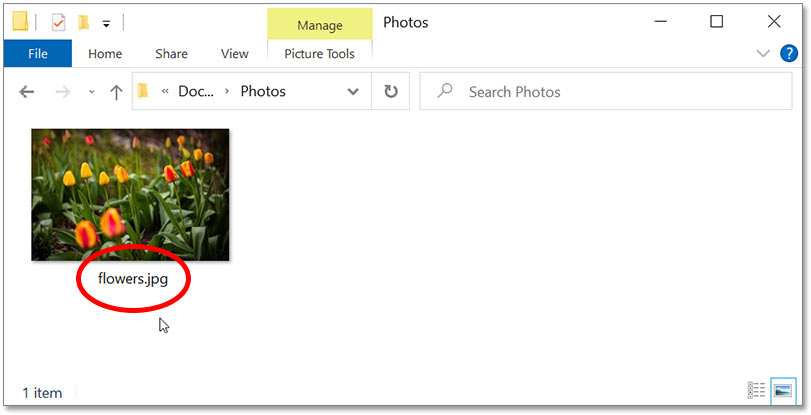
*Navigating to a JPEG image in Windows.*

#### How to turn on file extensions in Windows 10

If you're not seeing the file extension, go up to the **View** menu and turn on **File name extension**:

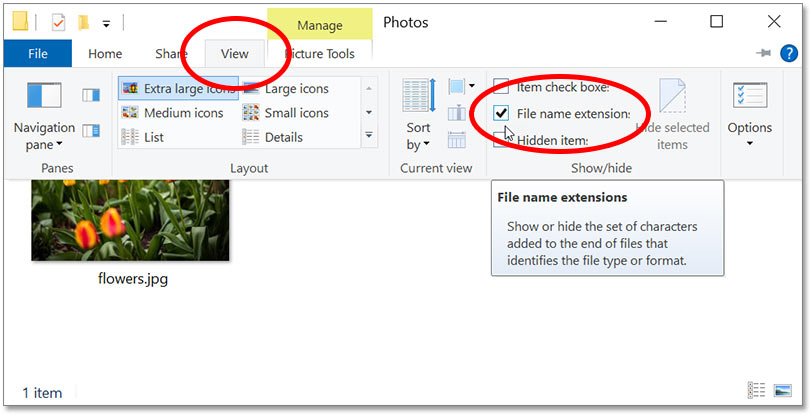
*The "File name extension" option in the View menu.*

#### The default image editor in Windows 10

By default in Windows, if we open a JPEG image by double-clicking on its thumbnail:

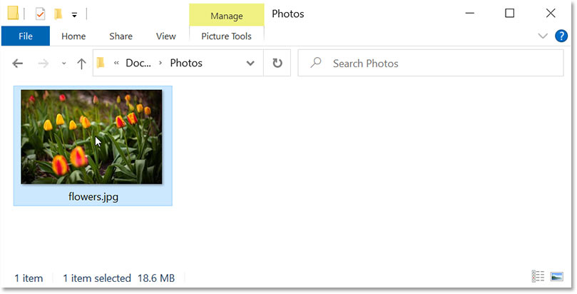
*Double-clicking the thumbnail to open the image.*

The image opens in the **Photos** app, which is not Photoshop and not what we want:

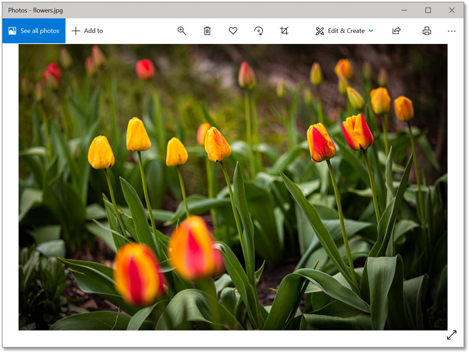
*Windows opens the image in the Photos app by default.*

If that happens, close the Photos app by clicking the **X** in the top right corner:

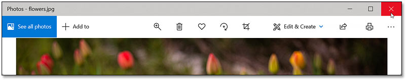
*Closing the Photos app.*

### Step 2: Right-click on the image thumbnail and choose Properties

To make Windows open all JPEG images in Photoshop, right-click on the image thumbnail:

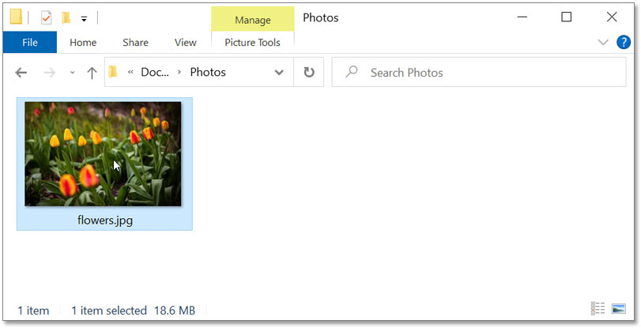
*Right-clicking on the image thumbnail.*

And choose **Properties** at the bottom of the menu:

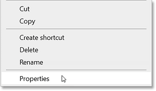
*Opening the image properties.*

### Step 3: Click the Change button and select Photoshop

In the Properties dialog box, notice that JPEG files are currently set to open with Photos.

To replace Photos with Photoshop as the default image editor for JPEG files, click the **Change** button:

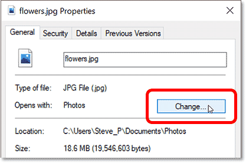
*Clicking the Change button.*

Then select the most recent version of Photoshop installed on your computer. As of now, the latest version is [Photoshop 2021](https://clk.tradedoubler.com/click?p(264303)a(2982769)g(22913540)url(https://www.adobe.com/ca/products/photoshop.html)):

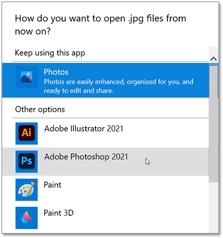
*Selecting Photoshop as the new default image editor.*

If Photoshop is not listed, scroll down to the bottom and click **More Apps**:

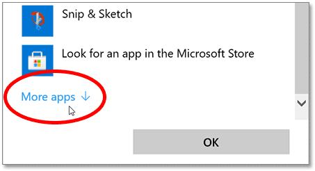
*Clicking "More apps".*

And Photoshop should appear. Click on it to select it and then click OK:

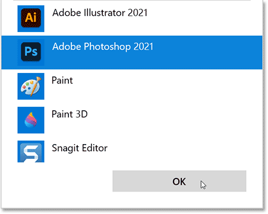
*Selecting Photoshop and clicking OK.*

### Step 4: Close the Properties

Back in the Properties dialog box, Photoshop is now set as the default image editor for JPEG files:

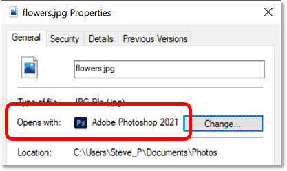
*JPEG files will now open with Photoshop.*

Click OK to close the dialog box:

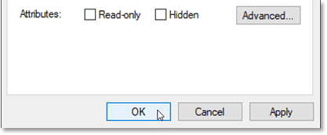
*Clicking OK to close the Properties dialog box.*

And that's all there is to it! You can now double-click on a JPEG image thumbnail in Windows:

*Double-clicking again on the JPEG image thumbnail.*

And the image will open directly into Photoshop. Simply repeat these same steps for other file types like PNG and TIFF to set Photoshop as their default editor as well:

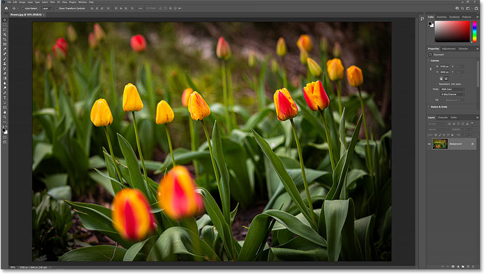
*Windows now opens JPEG images in Photoshop.*

## How to make Photoshop your default image editor on a Mac

Here's how to make Photoshop your default image editor on a Mac running macOS.

**See also:** [How to move images from one Photoshop document to another](/basics/5-ways-move-images-photoshop-documents/)

### Step 1: Navigate to an image on your computer

First, use Finder to navigate to a folder on your Mac that holds one of your images. I'm using a JPEG image here (with the `.jpg` file extension), but you can repeat these same steps with other file types like PNG and TIFF:

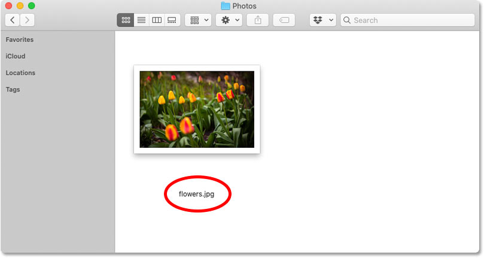
*Opening a folder that holds a JPEG image.*

#### The default image editor in macOS

By default, if we open a JPEG image on a Mac by double-clicking on its thumbnail:

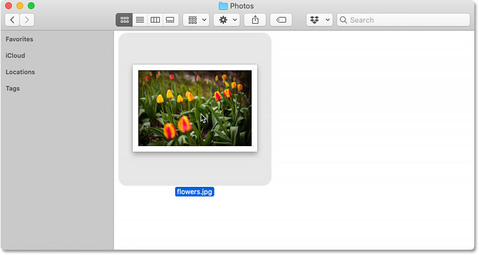
*Double-clicking the thumbnail to open the image.*

It opens in the **Preview** app, which is not what we want:

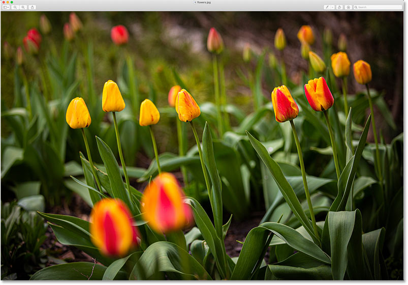
*masOS opens the image in the Preview app by default.*

If that happens, close Preview by going up to the **Preview** menu in the Menu Bar and choosing **Quit Preview**:

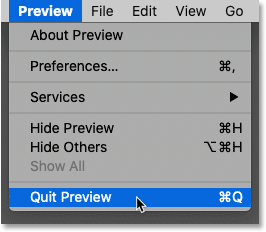
*Going to Preview > Quit Preview.*

### Step 2: Right-click on the image thumbnail and choose Get Info

To have macOS open JPEG files into Photoshop, right-click (or Control-click) on the image thumbnail:

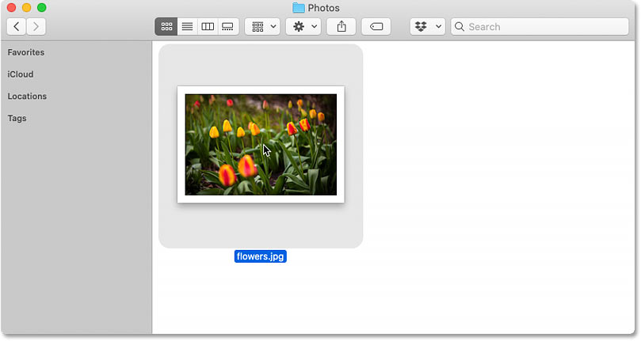
*Right-clicking (or Control-clicking) on the image thumbnail.*

And choose **Get Info** from the menu:

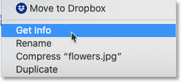
*Choosing the Get Info command.*

### Step 3: Change "Open with" to Photoshop

In the Info dialog box, notice that JPEG files are set to open with Preview. You may need to twirl the section open to view it:

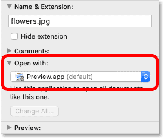
*JPEG images are set to open in Preview.*

Click on Preview and select the newest version of Photoshop installed on your Mac. As of now, the latest version is Photoshop 2021:

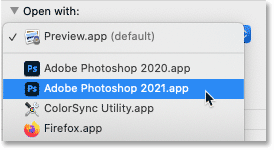
*Setting Photoshop as the new image editor.*

### Step 4: Click Change All and then Continue

Then to have all JPEG images open in Photoshop, click the **Change All** button:

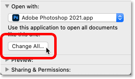
*Clicking the Change All button.*

And when macOS asks if you're sure, click **Continue**:

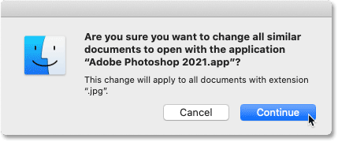
*Confirming that all JPEG files should open in Photoshop.*

### Step 5: Close the Info dialog box

Close the Info dialog box by clicking the red **x** icon in the top left:

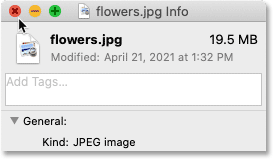
*Closing the Info dialog box.*

And that's all there is to it! You can now double-click on a JPEG image thumbnail:

*Double-clicking again on the image thumbnail.*

And macOS will open the image directly into Photoshop. Simply repeat these same steps with PNG, TIFF or other file types to set Photoshop as their default editor as well:

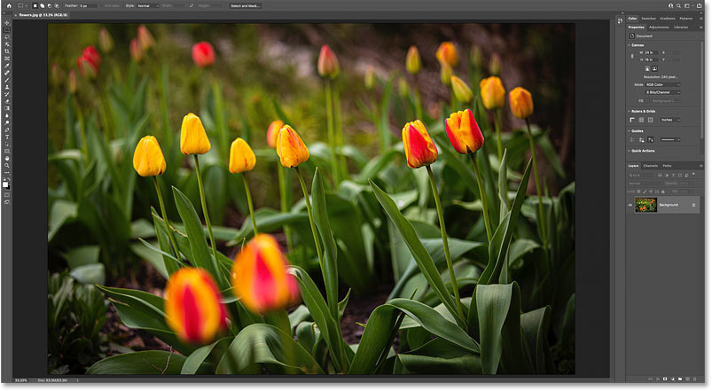
*macOS now opens JPEG images in Photoshop.*