# How To Disable The Start Workspace In Photoshop CC

> Source: [https://www.photoshopessentials.com/basics/disable-start-workspace-photoshop-cc/](https://www.photoshopessentials.com/basics/disable-start-workspace-photoshop-cc/)
> Downloaded and converted to Markdown.

In the previous tutorial, we learned all about the Start screen (the Start workspace) in Photoshop and how it serves as a great starting point for our work by letting us create new Photoshop documents, open existing images, or re-open any recent files, all from a single, convenient location.

There's no doubt that the Start screen was a great new addition back in Photoshop CC 2015 and its recent update in CC 2017 makes it even more useful, especially for beginner Photoshop users. Yet the fact is, we've been able to create new documents and open images since long before the Start screen came along, and we can still do so today without using the Start screen. Adobe knows that not everyone will want to use it, which is why they included an option to disable the Start screen, as we'll see in a moment.

Yet if we disable the Start screen, how do we create new Photoshop documents? How do we open images? How do we re-open our recent files? In this tutorial, we'll learn how to do all of these things very easily using a few old school Photoshop commands that are still available to us even in the most recent version of Photoshop.

Keep in mind that I'm in no way trying to convince you to stop using the Start screen. If you like it, great! It really is a useful feature. But if you do decide to disable it, or you're just curious to know how to create new documents or open images without the Start screen, here's how to do it. Let's get started!

## Dsiabling The Start Screen In Photoshop

By default, the Start screen appears whenever we launch Photoshop CC without first selecting an image or document to open along with it. It also appears each time we close out of a document and have no other documents open on the screen. Any recently-opened files appear as thumbnails in the center of the Start screen. I covered the Start screen in detail in our [Updated Start Workspace In Photoshop CC](/basics/updated-start-workspace-photoshop-cc/) tutorial so you'll want to check out that tutorial first if you haven't done so already. Here, we'll focus on how to disable the Start screen and work without it:

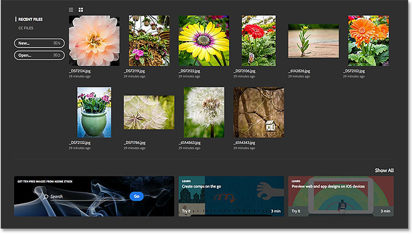
*The Start screen in Photoshop CC 2017.*

To disable the Start screen, all we need to do is deselect it in Photoshop's Preferences. On a Windows PC, go up to the **Edit** menu in the Menu Bar along the top of the screen, choose **Preferences**, and then choose **General**. On a Mac (which is what I'm using here), go up to the **Photoshop CC** menu, choose **Preferences**, then choose **General**:

*Going to Edit (Win) / Photoshop CC (Mac) > Preferences > General.*

This opens the Preferences dialog box set to the General options. Look for the option that says **Show "START" Workspace When No Documents Are Open**. By default, the option is selected (checked). To disable the Start screen, simply uncheck this option:

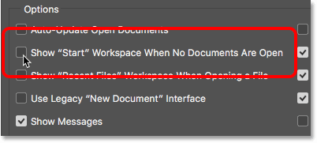
*Unchecking 'Show "START" Workspace When No Documents Are Open'.*

You'll need to quit and relaunch Photoshop for the change to take effect. To quit Photoshop, on a Windows PC, go up to the **File** menu at the top of the screen and choose **Exit**. On a Mac, go up to the **File** menu and choose **Quit Photoshop CC**:

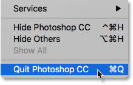
*Go to File > Exit (Win) / File > Quit Photoshop CC (Mac).*

Then, relaunch Photoshop the same way you normally would. When Photoshop opens, the Start screen will not appear. Instead, you'll see an empty workspace. This is how Photoshop opened back before the Start screen was added in Photoshop CC 2015:

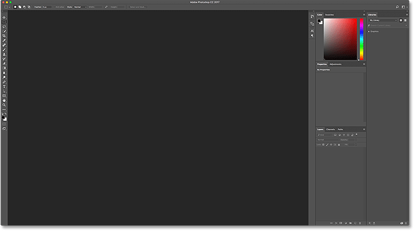
*Launching Photoshop with the Start screen disabled.*

### How To Create New Photoshop Documents

To create a brand new Photoshop document with the Start workspace disabled, go up to the **File** menu at the top of the screen and choose **New**. You could also press the keyboard shortcut, **Ctrl+N** (Win) / **Command+N** (Mac). Either way, this is the exact same command that we access by clicking the **New...** button on the Start screen:

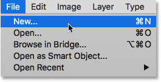
*Going to File > New.*

Photoshop will open the New Document dialog box where we can create our new document, either from a preset, a template, or by entering our own custom values. I covered the New Document dialog box briefly in our Updated Start Screen in Photoshop CC 2017 tutorial, and I cover it in more detail in the [How To Create New Documents In Photoshop CC](/basics/create-new-documents-photoshop-cc/) tutorial. So for now, I'll simply close out of it by clicking the **Close** button in the bottom right corner:

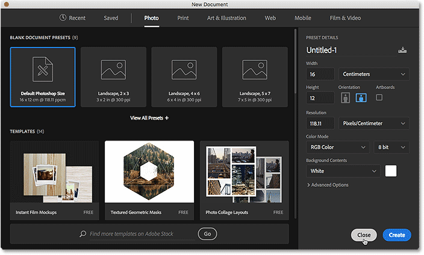
*The redesigned New Document dialog box in Photoshop CC 2017.*

### How To Open Existing Images

To open an existing image without using the Start screen, all we need to do is once again go up to the **File** menu at the top of the screen and this time, choose **Open**. Or, use the keyboard shortcut, **Ctrl+0** (Win) / **Command+0** (Mac). This is the exact same Open command that we access by clicking the **Open...** button on the Start screen:

*Going to File > Open.*

Once you click Open, use File Explorer on a Windows PC, or Finder on a Mac, to navigate to the location on your computer when your image is stored. Then, double-click on it to open it:

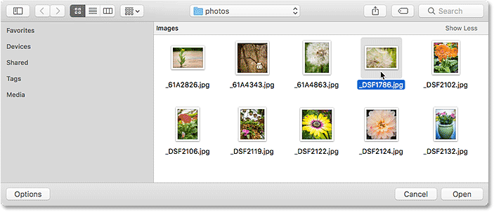
*Navigating to, and selecting, an image.*

The image will open in Photoshop, ready for editing, just as it would if we had used the Start screen:

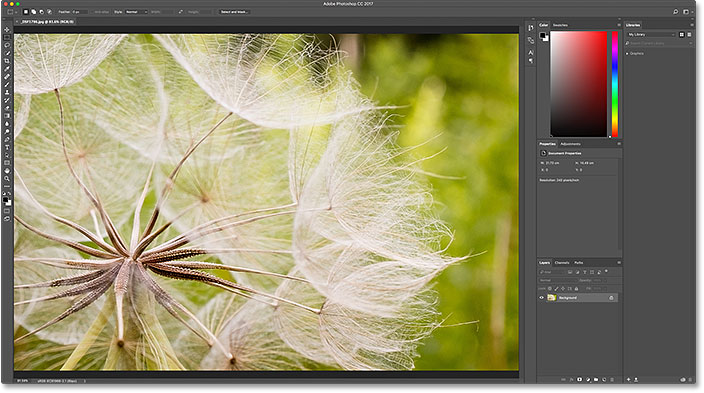
*The image opens in Photoshop. © Steve Patterson.*

I'll simply close the image for now by going up to the **File** menu and choosing **Close**:

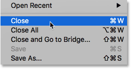
*Going to File > Close.*

### How To Re-Open A Recent File

So far, we've learned how to create new Photoshop documents and open images with the Start screen disabled. But how do we re-open a recent file? The Start screen automatically displays our recent files for us, but even with the Start screen disabled, we can still view our recent files just by going up to the **File** menu and choosing **Open Recent**. Your recently-opened files will appear in a list. Select the one you need to re-open it.

The only downside here is that the Start screen can display our recent files as thumbnails, while the Open Recent command only displays them by name. So in this case, the Start screen does end up being more convenient:

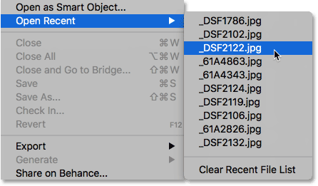
*Going to File > Open Recent, then choosing a file to re-open.*

I'll select an image from the list, and here we see that it opens in Photoshop, just as it would if I had selected it from the Start screen:

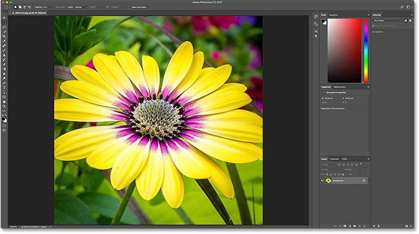
*The second image opens. © Steve Patterson.*

### Turning The Start Screen Back On

To disable the Start screen, all we had to do was uncheck the **Show "START" Workspace When No Documents Are Open** option in Photoshop's Preferences. To turn the Start workspace back on after disabling it, on a Windows PC, go back up to the **Edit** menu in the Menu Bar along the top of the screen, choose **Preferences**, and then choose **General**. On a Mac, go back up to the **Photoshop CC** menu, choose **Preferences**, then choose **General**. Then, turn the same option back on by clicking inside its checkbox:

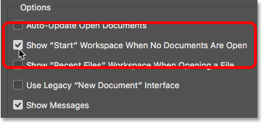
*Reselecting 'Show "START" Workspace When No Documents Are Open'.*

You'll need to quit and relaunch Photoshop for the change to take effect. When you do, the Start screen will re-appear when Photoshop opens:

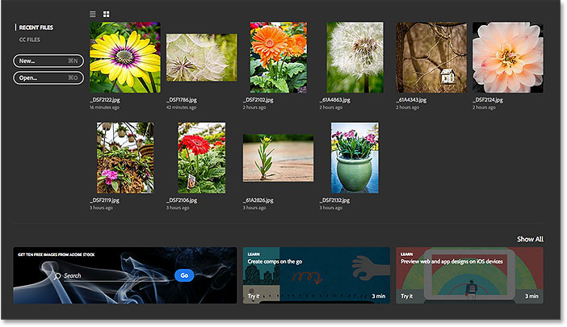
*Launching Photoshop after turning the Start workspace back on.*

### Temporarily Hiding The Start Screen

Finally, if you ever want to *temporarily* hide the Start screen without actually disabling it in Photoshop's Preferences, there's an easy way to do it. If you look up in the top right corner of the Start screen, you'll find the **Workspace** icon:

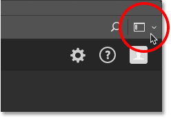
*The Workspace icon in the upper right of the Start screen.*

Clicking the icon opens a list of workspaces that we can choose from. A *workspace* is a preset collection and arrangement of panels, and can also include specific menu items and keyboard shortcuts. Adobe includes several workspaces in Photoshop, each geared to a specific type of work, like Photography, Graphic and Web, Painting, as well as others.

Notice that **Start** is also listed as a workspace, and that it has a checkmark to the left of its name, which means that it's our currently-active workspace:

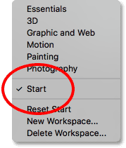
*The Start workspace is currently selected.*

To switch to a different workspace, simply choose a different one from the list. For example, the default workspace in Photoshop is known as the **Essentials** workspace. I'll switch to it by selecting it:

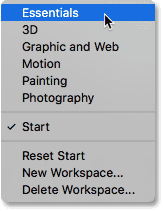
*Switching from Start to the Essentials workspace.*

As soon as I choose Essentials, the Start screen disappears and is replaced with the Essentials workspace, the same workspace we see when we launch Photoshop with the Start workspace disabled. The only difference is, I haven't actually disabled it. I've only hidden it temporarily:

*Photoshop after switching from the Start workspace to the Essentials workspace.*

To get back to the Start workspace, all I need to do is click once again on the **Workspace** icon in the upper right corner:

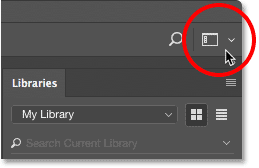
*Clicking again on the Workspace icon.*

And then reselect the **Start** workspace from the list:

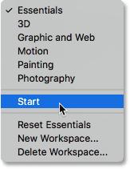
*Switching from Essentials back to the Start workspace.*

As soon as I reselect the Start workspace, the Start screen re-appears, with no need to quit and relaunch Photoshop:

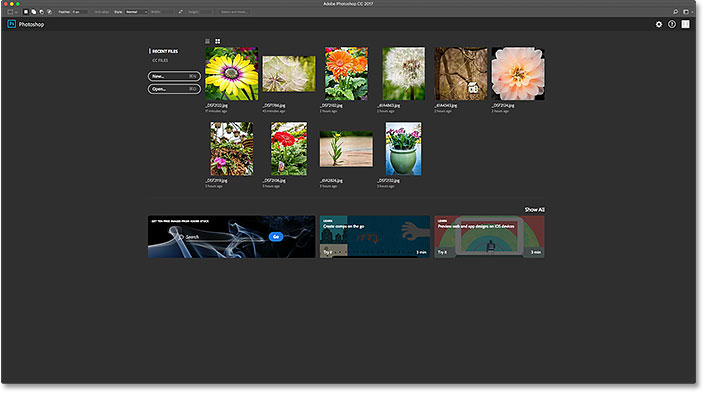
*Back once again to the Start workspace.*