# How To Download Photos From Your Digital Camera With Adobe Bridge CS5

> Source: [https://www.photoshopessentials.com/basics/download-photos-bridge-cs5/](https://www.photoshopessentials.com/basics/download-photos-bridge-cs5/)
> Downloaded and converted to Markdown.

In this Photoshop CS5 tutorial, we learn how to download photos from your digital camera to your computer using Adobe Bridge CS5.

Included and installed with every copy of Photoshop CS5, whether you purchased it on its own or as part of one of Adobe's Creative Suite 5 packages, is a separate companion program known as **Bridge CS5**, a "digital asset manager" that lets us easily locate, manage and organize our ever-growing collection of images. Of course, it helps if we have some images to manage, which is also where Bridge comes in, as it lets us quickly select and download photos from our digital camera or memory card to the computer!

It's important, though, not to think of Bridge CS5 as some sort of image database or file storage program that you're downloading the photos into, which is a common misconception. Even though we use Bridge to get photos from the camera to the computer, the photos are not stored in Bridge. They're stored in normal folders on your hard drive in whatever location you specify when you download them, no different really than if you had used your computer's operating system to copy the images from the camera to the computer.

Bridge simply makes the process easier, with features and options that wouldn't be available to us if we had just used the computer's operating system. Of course, where Bridge CS5 really shines is when it comes to managing the images after they've been downloaded, but before we get to all that good stuff, let's first get the photos on to the computer.

### Setting The Photo Downloader's Behavior

Before we download anything, there's one option in the Bridge CS5 **Preferences** we need to look at. Make sure Bridge CS5 is open on your screen, then on a Windows system, go up to the **Edit** menu at the top of the screen and choose **Preferences**. On a Mac, go up to the **Photoshop** menu and choose **Preferences**. You can also quickly access the Preferences by pressing **Ctrl+K** (Win) / **Command+K** (Mac) on your keyboard. Whichever way you choose, the Bridge CS5 Preferences dialog box appears. In the middle of the dialog box, you'll see an option that says **When a Camera is Connected, Launch Adobe Photo Downloader**:

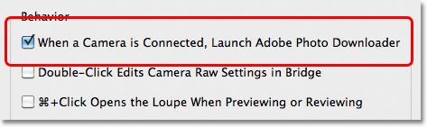
*If you don't see this option, make sure "General" is selected at the top of the Preferences categories along the left of the dialog box.*

A moment ago I said we use Bridge CS5 to download images from the camera. Technically, that's not true. Bridge itself can't download anything. Instead, it has its own companion program called the **Photo Downloader**, and if you select this option in the Preferences, Bridge will automatically launch the Photo Downloader for you when you connect your camera or memory card (using a card reader) to the computer. I recommend turning this option on by clicking inside its checkbox to save you from having to launch the Photo Downloader manually each time, but if you're not a big fan of having dialog boxes popping open on your screen unannounced, feel free to leave it unchecked. You can always come back to the Preferences later if you change your mind. Click OK to exit out of the Preferences dialog box.

### Step 1: Launch The Photo Downloader

Connect your digital camera or memory card to your computer. If you selected the option we just looked at in the Preferences, the Photo Downloader dialog box will automatically open on your screen, so you can jump to Step 2. If you didn't select the option, click on the **Get Photos from Camera** icon in the top left of the Bridge window (it's the little camera icon):

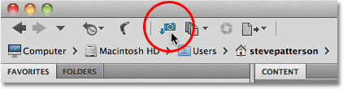
*Click on the "Get Photos from Camera" icon.*

You could also go up to the **File** menu and choose **Get Photos from Camera**, but clicking on the icon is faster.

Just before the Photo Downloader opens, Bridge will ask if you want the Photo Downloader to open automatically from now on whenever it detects that a camera or memory card has been connected. Choosing Yes or No will select or deselect the same option in the Preferences. Again, you can go back to the Preferences at any time to change your mind. Click Yes or No to close out of the dialog box, at which point the Photo Downloader will appear on your screen:

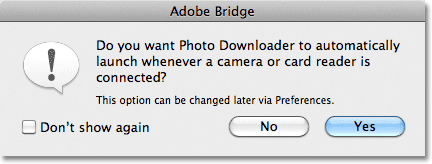
*Select "Don't show again" if you're going to choose No and don't want Bridge to keep asking.*

### Step 2: Select The Advanced Dialog Box

The Photo Downloader first appears in its **Standard Dialog** format with some basic options like choosing a folder on your computer to download the images into, renaming files if needed, and other options we'll look at in a moment. Problem is, there's no way to actually *see* the images you're about to download, so rather than being forced to blindly grab every single image off the camera or memory card whether you want them all or not, ignore all of the options in the Standard Dialog and click on the **Advanced Dialog** button in the bottom left corner:

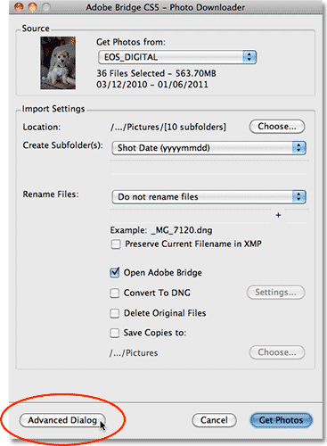
*Click on the Advanced Dialog button.*

This switches the Photo Downloader to its much more useful Advanced Dialog format, which includes the same options from the Standard Dialog and adds a large preview area where we can see thumbnails of all the images we're about to download. It also gives us the ability to add author and copyright information to our images. If you're not seeing your images, select your camera or memory card from the **Source** option above the preview area, then use the scroll bar along the right of the preview area to scroll through the thumbnails:

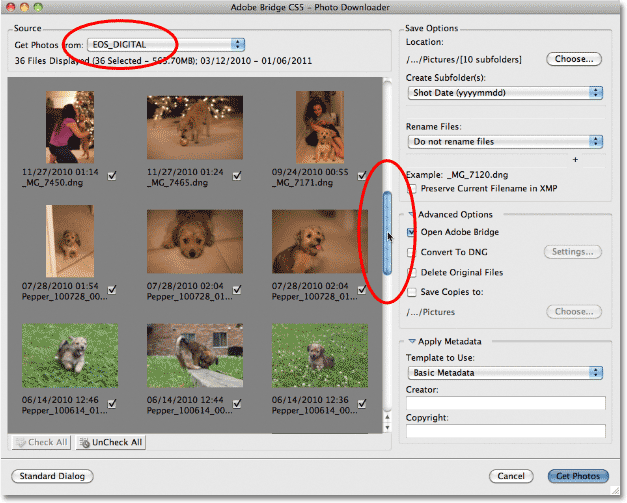
*Choose your camera or memory card from the Source option to view thumbnails of the images in the preview area.*

### Step 3: Select The Images You Need

If you look below each thumbnail in the preview area, you'll see a checkbox. Bridge CS5 assumes that every shot we take is a keeper so it goes ahead and selects them all for us by placing checkmarks in each of the checkboxes. If there's an image you don't want to download, simply click inside its checkbox to remove the checkmark.

What if, for whatever reason, only a few of the images are keepers? In that case, click on the **UnCheck All** button below the preview area to deselect them all at once, then hold down your **Ctrl** (Win) / **Command** (Mac) key and click on the thumbnails of the images you need. As you click on each image, a highlight box will appear around it. Once you've highlighted all the images you want to import, click inside the checkbox of any of the highlighted images to instantly select them all:

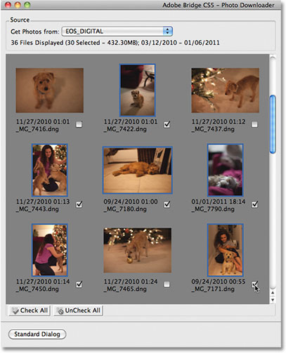
*The Photo Downloader allows us to import every image or just the ones we need.*

### Step 4: Choose A Location To Save The Files

With all of the images we want to download selected, the next task is to tell the Photo Downloader which folder we want to download the images into on our computer, and we do that using the **Save Options** in the top left corner of the dialog box. By default, it assumes we want to save them to our main Pictures folder. If you have a different location in mind, click on the **Choose** button, then navigate to the folder you want to save them to. I'll leave mine set to my Pictures directory:

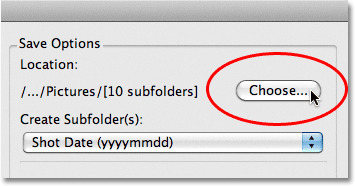
*Click the Choose button to select where you want to store your images on your computer.*

### Step 5: Create And Name A Subfolder To Store The Images In

The Photo Downloader will automatically create a subfolder inside the save location you specified a moment ago and place your imported images inside the subfolder. This is a great way to help keep your images organized, but by default, it will give the subfolder a name based only on the date the photos were taken, which I don't find particularly useful since I have a hard enough time remembering what *today's* date is. If you want to name the subfolder something more descriptive, select **Custom Name** from the drop-down list directly below where it says "Create Subfolder(s)", then type in the name you want. I'll name my folder "Pets":

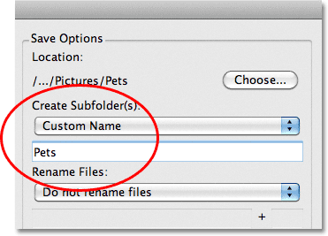
*Saving the images in a subfolder is useful, but giving the folder a descriptive name is even more useful.*

### Step 6: Rename The Files If Needed

Another option the Photo Downloader gives us is to rename the images as they're being downloaded. By default, it won't rename them, but just as with the date the photos were taken, I don't find the names my camera gives them (like "_MG_2301") all that helpful. If you click on the **Rename Files** drop-down list (directly below the Create Subfolder(s) option), you'll bring up a list with lots of renaming choices. I'm going to again choose **Custom Name**, and I'll again type "Pets" into the name field below the drop-down box. Bridge will now rename the files as they're being imported based on my custom name plus a 4-digital extension ("Pets_0001", for example). You can enter a new starting number for the 4-digit extension into the input box directly across from the name field, or leave it at its default value of 1. Select the **Preserve Current Filename in XMP** option if you want to embed the original name in with the image file. You'll probably never need it, but at least it will be there if you do:

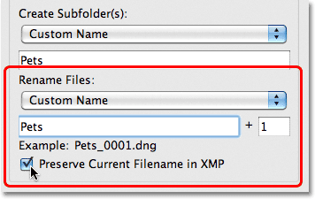
*Giving your photos descriptive names is another way to help keep them organized.*

### Step 7: Convert RAW Files To DNG

Below the Save Options are the **Advanced Options**. The first one, **Open Adobe Bridge**, is selected by default and will open the images for you in Bridge once they've finished downloading. If you uncheck this option, you'll need to manually navigate to the folder yourself to view the images, so there's really no point in unchecking it.

The option below it, **Convert To DNG**, is much more important. DNG stands for "digital negative", and if your images were saved by your camera in the raw format, it's a very good idea to select this option and convert your raw files into DNG files. This will help "future proof" your images, since there's no guarantee that your camera's specific type of raw format will always be compatible with future versions of Photoshop or with any other programs you may want to use them with. We won't get into technical details here, but DNG is a public, open standard format for raw files and if you want to keep the chances high that you'll be able to access your raw files down the road, select this option (if your images were saved as JPEG or TIFF files, you can ignore it):

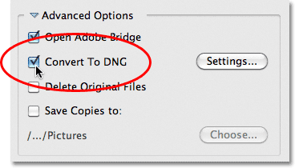
*Your camera's specific raw format may go the way of the dinosaurs one day, but the DNG format (probably) won't.*

### Step 8: Backing Up Your Images

Unless you want to risk losing your images forever, *never* select the **Delete Original Files** option. Always make sure the images have downloaded successfully into the folder you specified in the Save Options before even thinking about deleting them from your camera or memory card. If you've deleted them, then discover that some of the photos are missing or some files are corrupted, you're out of luck.

Not only should you never select the Delete Original Files option, you should *always* back up the images by saving a copy of them to a second, separate folder, and you'll want this folder to be on a separate hard drive in case the primary drive crashes. Don't just choose a separate partition on the same drive because you'll lose all of your partitions when the drive fails. Select the **Save Copies To** option, then click the **Choose** button and choose where you want to save copies of the images to, either on a separate internal hard drive or on an external USB or FireWire drive:

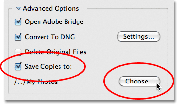
*Always save a copy of your images to a folder on a separate hard drive.*

### Step 9: Add Author And Copyright Information

Finally, below the Advanced Options is the **Apply Metadata** section. Metadata, in this case anyway, means "information about your images". Enter your name into the **Creator** field and your copyright info into the **Copyright** field. If you've created your own custom metadata template (which we'll see how to do in another tutorial), you can select it from the **Template to Use** drop-down list, but we'll just stick with the basic information for now. To add the copyright symbol, on a PC, hold down your **Alt** key and type **0169** on the numeric keypad. On a Mac, hold down your **Option** key and press the letter **G**:

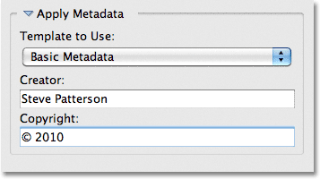
*Add your name and copyright information to the images.*

### Step 10: Download The Photos

Once you've chosen your images in the preview area, selected your options and entered your information, click the **Get Photos** button in the bottom right corner of the Photo Downloader:

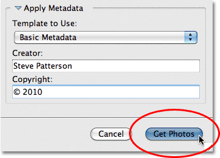
*Click the Get Photos button to start downloading the images.*

A small dialog box will appear showing the download progress. Click the **Stop** button if you need to cancel it before it finishes, or just sit back, relax and wait. If you're importing an entire day's worth of shots, all high resolution raw files, and converting them to DNG in the process, now might be a good time to take the dog outside:

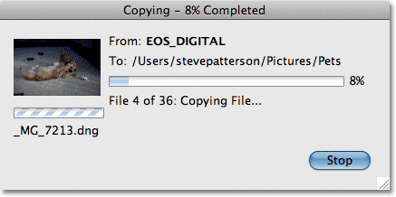
*Bridge displays the downloading progress.*

When all the images have been downloaded, they'll appear in Bridge CS5 so you can begin sorting through them:

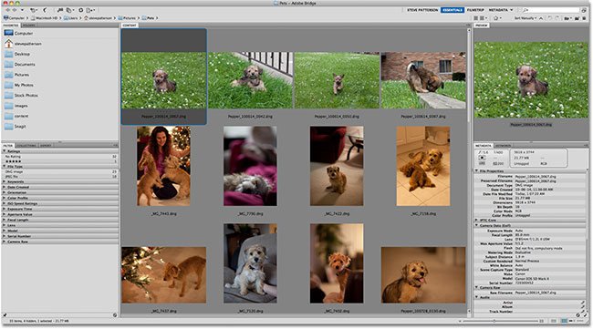
*Bridge CS5 displays the images once the download is complete.*