# Drag and Drop Color Swatches in Photoshop

> Source: [https://www.photoshopessentials.com/basics/drag-and-drop-colors-swatches-in-photoshop-cc-2020/](https://www.photoshopessentials.com/basics/drag-and-drop-colors-swatches-in-photoshop-cc-2020/)
> Downloaded and converted to Markdown.

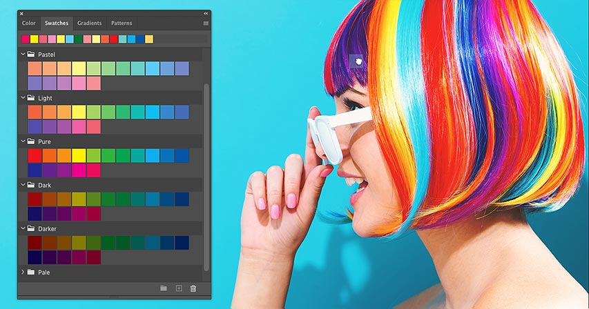

Learn how to drag and drop colors directly into your document with the improved Swatches panel in Photoshop CC 2020!

The Swatches panel in Photoshop CC 2020 has been greatly improved with a new and easy way to add colors to your document. We can now drag and drop colors from the Swatches panel directly onto a layer's contents. And we can even add the color as a Solid Color fill layer or as a Color Overlay layer effect, again just by dragging and dropping it!

In this tutorial, we'll look at the changes Adobe made to the Swatches panel in CC 2020, including the new default swatch sets and how to load legacy swatches from previous versions of Photoshop. And then I'll show you all the ways to drag and drop colors into your document, including a few new keyboard tricks!

To follow along, you'll need [Photoshop 2020 or newer](https://prf.hn/l/dlXjD2w). If you're already using Photoshop CC, make sure that your copy is up to date.

Let's get started!

### The document setup

For this tutorial, I've [created a simple document](/basics/create-new-documents-photoshop-cc/) with a couple of flower shapes and some text in front of a white background. The shapes and the text are currently filled with black, but I'll be adding color to them as we go along:

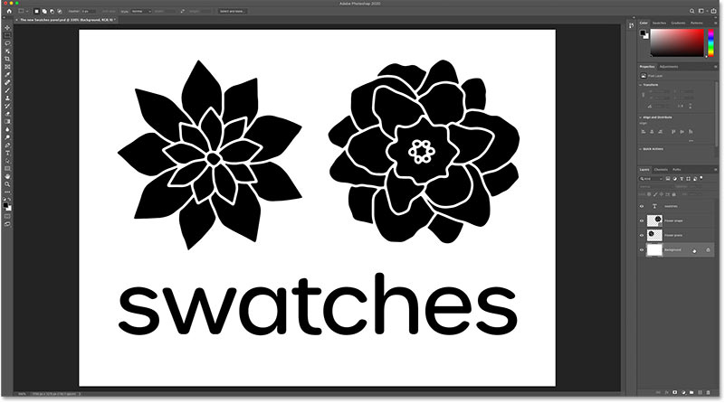

*The initial Photoshop document.*

In the [Layers panel](/basics/layers/layers-panel/), we see how my document is set up. The Background layer on the bottom is filled with white. And above the Background layer are the two flower shapes. But the difference between them is that the flower on the left (on the "Flower pixels" layer) is a pixel layer, while the flower on the right (on the "Flower shape" layer) is a shape layer. And finally, the word "swatches" is on a type layer at the top.

In other words, we have four different kinds of layers in this document (a Background layer, a pixel layer, a shape layer, and a type layer). And as we'll see, some layers behave differently than others when we drag and drop colors onto them from the Swatches panel:

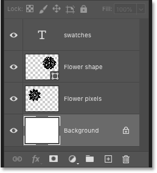

*The four different kinds of layers in the document.*

**[See our complete guide to learning Photoshop layers!](/photoshop-layers-learning-guide/)**

## A closer look at the Swatches panel in Photoshop CC 2020

But before we start dragging and dropping colors, let's look at how the Swatches panel itself has changed in Photoshop CC 2020.

### Where do I find the Swatches panel

By default, the Swatches panel is grouped in with the Color panel, along with the Gradients and Patterns panels which are both new in CC 2020:

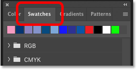

*Click the tabs to switch between panels.*

If you're not seeing the Swatches panel, you can open it by going up to the **Window** menu in the Menu Bar and choosing **Swatches**:

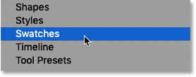

*Going to Window > Swatches.*

### The new default color swatch sets

The first thing you'll notice with the Swatches panel in CC 2020 is that the default color swatches are now grouped into sets, and each set is represented by a folder. We have sets for RGB, CMYK and Grayscale colors, along with Light and Dark colors, Pure colors, Pastels, and more:

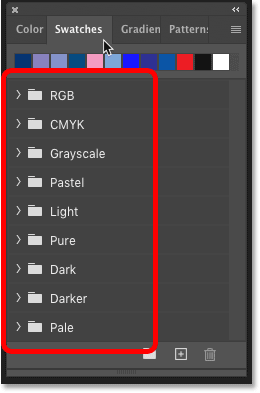

*The new default swatch sets in CC 2020.*

### How to open and close a swatch set

To twirl a set open or closed, click the **arrow** to the left of the set's folder:

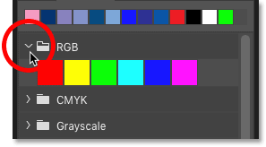

*Open and close a set by clicking its arrow.*

### How to open or close all swatch sets at once

Or to open or close all sets at once, press and hold the **Ctrl** (Win) / **Command** (Mac) key on your keyboard and then click on the arrow for any of the sets:

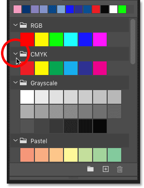

*Hold Ctrl (Win) / Command (Mac) to twirl all sets open or closed.*

### How to change the size of the swatch thumbnails

To adjust the size of the thumbnails in the Swatches panel, click the panel's **menu icon**:

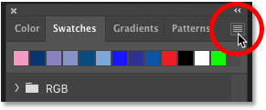

*Clicking the Swatches panel menu icon.*

And then choose **Tiny**, **Small** or **Large Thumbnail**. Or you can view the color swatches as a **Small** or **Large List**, which includes both the thumbnail and the name of each color:

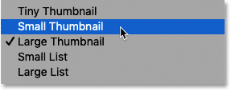

*Clicking the Swatches panel menu icon.*

### Your recently-used swatches

The row along the top of the Swatches panel lets you quickly choose from any of your recently-used swatches:

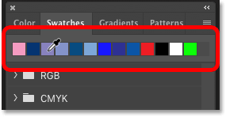

*The recently-used color swatches.*

You can hide the recent swatches by clicking the Swatches panel **menu icon**:

*Clicking the menu icon.*

And deselecting **Show Recents**. Select the same option again to turn the recent swatches back on:

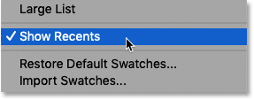

*The Show Recents option.*

### How to load the legacy swatches from previous versions of Photoshop

And finally, along with the new swatches in CC 2020, you can also load the swatches from earlier versions of Photoshop. Click the Swatches panel **menu icon**:

*Clicking the menu icon.*

And then choose **Legacy Swatches**:

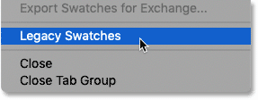

*Loading the Legacy Swatches sets.*

A Legacy Swatches folder will appear below the default folders. Click the folder's **arrow** to twirl it open and view the legacy sets inside it:

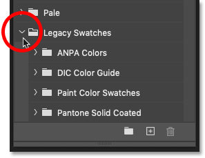

*The Legacy Swatches sets.*

In the next tutorial, I'll show you how to create your own custom swatches and swatch sets. But for now, let's learn all the ways to drag and drop colors from the Swatches panel into your document.

## How to drag and drop colors from the Swatches panel

In Photoshop CC 2020, the easiest way to add colors from the Swatches panel is to simply drag and drop the color directly onto a layer's contents. There's no need to select the layer in the Layers panel first. As long as you drop the color onto the layer's contents, Photoshop will automatically select the layer for you.

But exactly how the color is applied depends on which kind of layer it is. Let's start with the Background layer.

### Dragging color swatches onto the Background layer

To add a color to the [Background layer](/basics/background-layer-photoshop-cc/), click on a color swatch in the Swatches panel and then drag and drop it onto a spot in the document where the Background layer's content is visible.

In my case, my Background layer is filled with white, so I'll drag and drop a swatch onto any area of white:

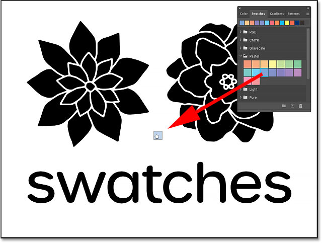

*Dragging and dropping a color swatch onto the Background layer's contents.*

Release your mouse button to apply the color to the background:

*The result after dropping the color swatch onto the background.*

#### The color is applied as a Solid Color fill layer

But in the Layers panel, notice that the Background layer is not actually filled with the new color. Instead, the color is added as a **Solid Color fill layer** *above* the Background layer:

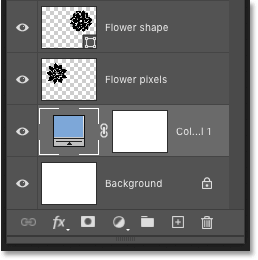

*The Layers panel showing the new fill layer.*

To change the color, simply drag and drop another color from the Swatches panel onto the background. Or with the Solid Color fill layer selected in the Layers panel, just click on a different color in the Swatches panel:

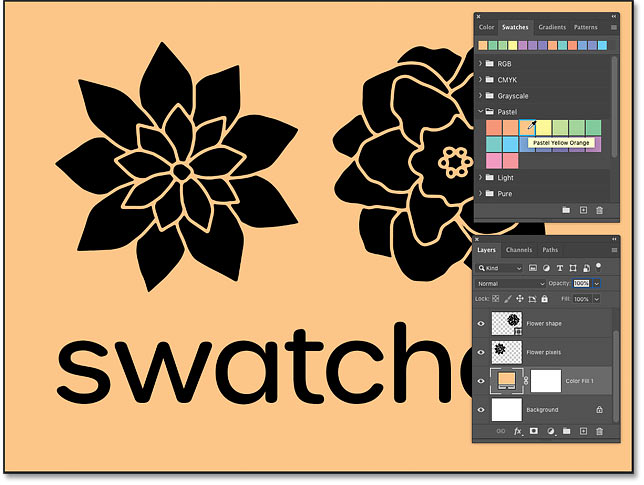

*Changing the background color by clicking on different swatches.*

### Dragging color swatches onto pixel layers

So color swatches are applied to Background layers as Solid Color fill layers. And the same is true when dragging and dropping colors onto normal pixel layers, but with one important difference.

To add a color to a pixel layer, click on a color in the Swatches panel and drag and drop it directly onto the layer's contents. Again there's no need to select the layer in the Layers panel first. As long as you drop the color onto the layer's contents, Photoshop will select the layer for you.

In my case, I'll drop the color onto the flower on the left, which is on a pixel layer:

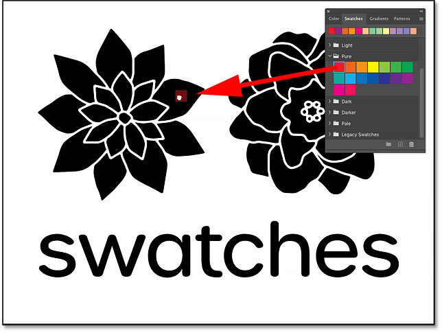

*Dragging and dropping a color swatch onto a pixel layer's content.*

Release your mouse button to apply the color to the layer:

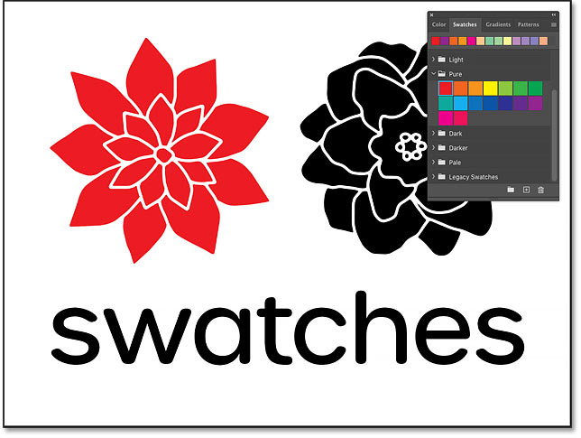

*The result after dropping the swatch onto the pixel layer's contents.*

#### The color is applied as a clipped fill layer

In the Layers panel, we again see that the color was added as a Solid Color fill layer above the pixel layer. But this time, the fill layer is *clipped* to the pixel layer below it.

Because the fill layer is clipped to the pixel layer using a [clipping mask](/basics/clipping-masks-essentials/), the new color is affecting only that one layer. The Background layer is not affected:

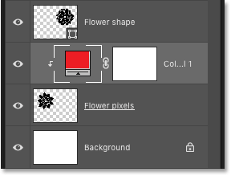

*The Layers panel showing the clipped fill layer.*

To change the color, drag and drop a different swatch from the Swatches panel onto the pixel layer's contents. Or with the fill layer selected in the Layers panel, just click on a different color in the Swatches panel:

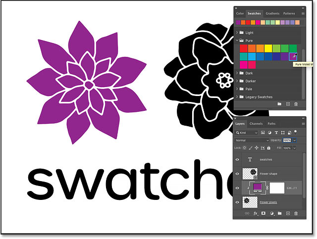

*Changing the pixel layer's color by clicking on different swatches.*

**[Learn the difference between pixel shapes and vector shapes!](/basics/vector-shapes-vs-pixel-shapes-in-photoshop/)**

### Dragging color swatches onto shape layers and type layers

While Photoshop CC 2020 applies color swatches to Background layers and pixel layers as separate fill layers, that's not the case when we drag and drop swatches onto shape layers or type layers. And since shape and type layers both behave the same way, we'll look at them together.

I'll drag and drop a color from the Swatches panel onto the flower on the right, which is on a [shape layer](/basics/how-to-draw-vector-shapes-in-photoshop-cs6/):

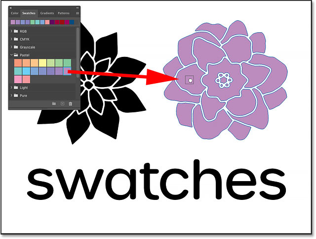

*Dragging and dropping a color swatch onto the shape layer's contents.*

And then I'll drag and drop a different color onto the text:

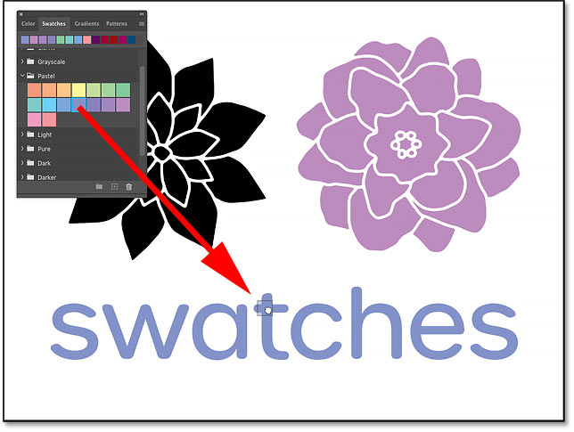

*Dragging and dropping a color swatch onto the type layer's contents.*

**[Learn how to choose text colors from images!](/basics/how-to-choose-type-colors-from-images-with-photoshop/)**

### The color is applied directly to shapes and text

Notice that this time in the Layers panel, a Solid Color fill layer does not appear above either the shape layer or the type layer. Instead, the color swatches were applied directly to the shape and to the text. The reason is that shape layers and type layers both support color fills, while Background layers and pixel layers do not.

To change the color, drag and drop a different swatch onto the shape or type layer. Or select the layer in the Layers panel and click on a different color in the Swatches panel:

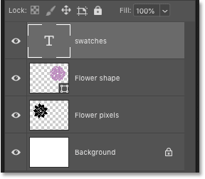

*The colors were applied directly to the shape and text.*

**[Place images in shapes with the Frame Tool in Photoshop CC](/basics/place-images-into-shapes-with-the-new-frame-tool-in-photoshop-cc-2019/)**

## The new Swatches panel keyboard tricks in Photoshop CC 2020

So far, we've seen the default ways that Photoshop applies colors to different kinds of layers when we drag and drop swatches from the Swatches panel. Colors are applied to Background layers as Solid Color fill layers. They're applied to pixel layers as fill layers that are clipped to the pixel layer below them. And when we drag and drop a color onto a shape or type layer, the new color is applied directly to the layer itself.

But the Swatches panel in Photoshop CC 2020 also includes a few keyboard shortcuts that let you change the way colors are applied. So let's finish this tutorial with a quick look at how to use them.

### How to apply swatches to shapes or text as fill layers

To apply a color swatch to a shape or type layer as a Solid Color fill layer, press and hold the **Ctrl** (Win) / **Command** (Mac) key on your keyboard as you drag and drop the color from the Swatches panel onto the layer's contents.

Here I'm holding Ctrl (Win) / Command (Mac) as I drag a swatch onto the shape layer:

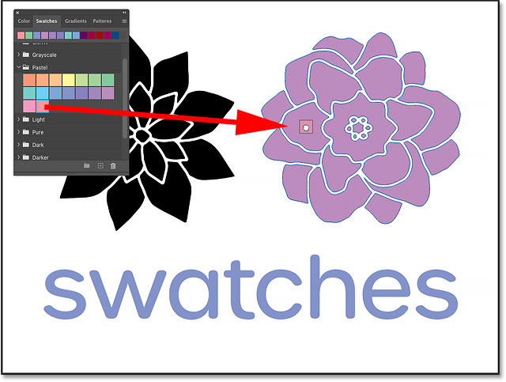

*Holding Ctrl (Win) / Command (Mac) and dragging a color swatch.*

And this time, the original color of the shape remains intact while the new color appears as a clipped Solid Color fill layer above it. Again, this same trick also works with type layers:

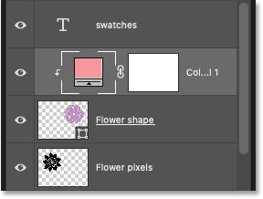

*The swatch is added to the shape as a clipped fill layer.*

### How to apply colors as non-clipped fill layers

To apply a color swatch above a pixel, shape or type layer as a Solid Color fill layer that is *not* clipped to the layer below it, hold **Alt** (Win) / **Option** (Mac) as you drag the color onto the layer's contents.

Here I'm holding Alt (Win) / Option (Mac) as I drag a swatch onto the text:

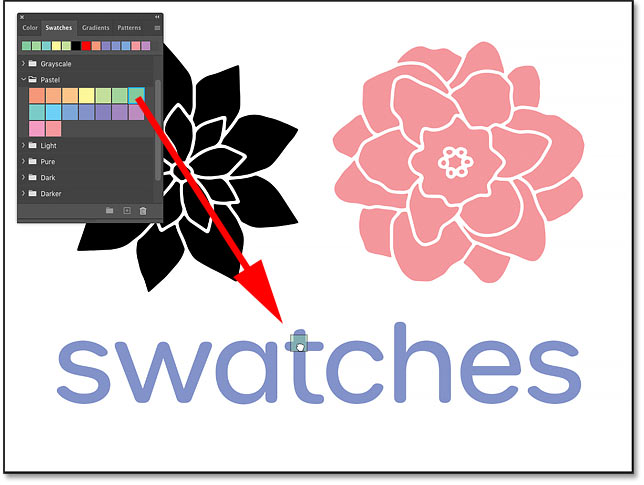

*Holding Alt (Win) / Alt (Mac) and dragging a color swatch.*

Photoshop adds the color as a Solid Color fill layer above the type layer. But because the fill layer is not clipped to the type layer, it's blocking all of the layers below it from view. This is probably not a trick you'll use very often, but it's there if you need it:

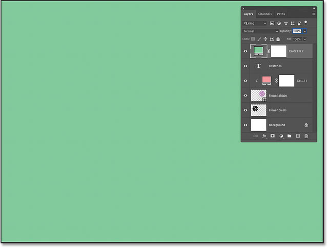

*A non-clipped fill layer blocks all layers below it from view.*

#### How to create a clipping mask manually

If you made a mistake and meant to apply the color as a clipped fill layer, make sure the fill layer is selected. Then click the Layers panel **menu icon** in the upper right:

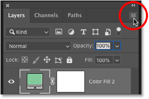

*Clicking the Layers panel menu icon.*

And choose **Create Clipping Mask**:

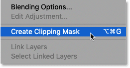

*Choosing the Create Clipping Mask command.*

And now with the fill layer clipped to the type layer, the new color is applied only to the text:

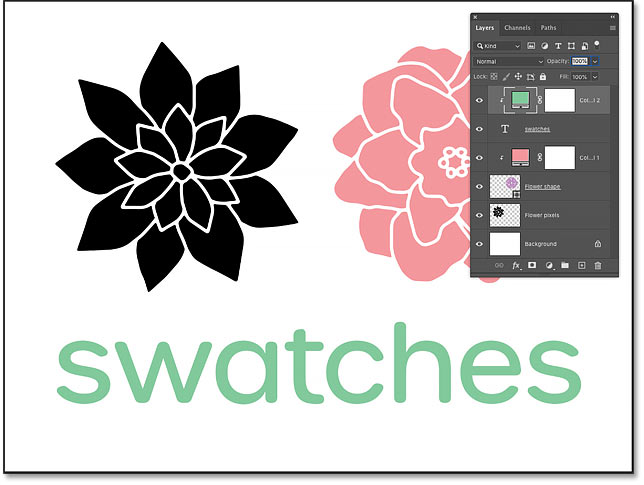

*The result after clipping the fill layer to the type layer.*

### How to apply color swatches as Color Overlay layer effects

And finally, to apply a color swatch to a pixel, shape or type layer as a Color Overlay [layer effect](/basics/using-layer-effects-and-layer-styles-in-photoshop-cc-2020-complete-guide/), hold **Ctrl+Alt** (Win) / **Command+Option** (Mac) as you drag and drop the color.

Here I'm holding Ctrl+Alt (Win) / Command+Option (Mac) as I drag a color onto the pixel layer's contents:

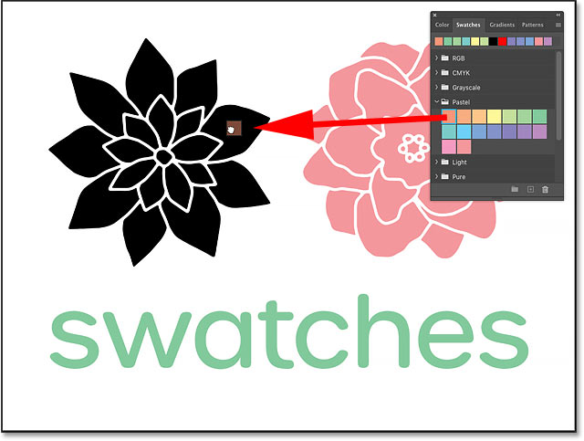

*Holding Ctrl+Alt (Win) / Command+Option (Mac) and dragging a color swatch.*

I'll release my mouse button to drop the color onto the layer:

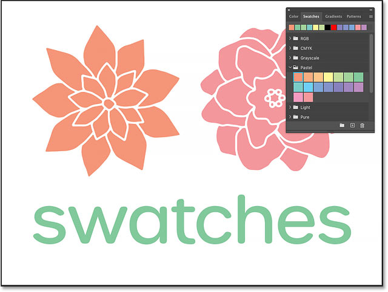

*The pixel layer updates with the new color.*

And in the Layers panel, the new color appears as a Color Overlay layer effect below the layer. The only layer that this trick will not work with is the Background layer, since Background layers do not support layer effects:

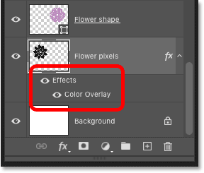

*The color swatch is added as a Color Overlay effect.*

**[See our complete guide to using Layer Effects in Photoshop CC 2020](/basics/using-layer-effects-and-layer-styles-in-photoshop-cc-2020-complete-guide/)**