# Drawing Vector vs Pixel Shapes In Photoshop CS6

> Source: [https://www.photoshopessentials.com/basics/drawing-vector-vs-pixel-shapes-in-photoshop-cs6/](https://www.photoshopessentials.com/basics/drawing-vector-vs-pixel-shapes-in-photoshop-cs6/)
> Downloaded and converted to Markdown.

In this first tutorial in our series on **drawing and working with shapes in Photoshop CS6,** we'll take a quick look at the important difference between the two main types of shapes that we can draw - **vector shapes** and **pixel shapes**.

Adobe Photoshop is well known as a *pixel-based* image editor, used by photographers and other imaging professionals for photo retouching, restoration and compositing. But it's also a powerful *vector-based* drawing program that web designers, graphic designers and other artists turn to for creating page layouts, user interface designs and other vector-based artwork.

What does "vector-based" mean? Well, unlike digital images which are made up of (usually) millions of tiny squares known as *pixels*, vector shapes are made from *mathematical points* connected together by lines and curves to create different shapes. Since they're based on math, not pixels, vector shapes are extremely flexible and do not suffer from the same limitations as pixels. We can draw vector shapes at any size we need, and no matter how much we edit and scale them, or how large we print them, they always remain crisp and sharp! Before we learn the details of how to draw vector shapes in Photoshop and all the ways we can work with them, let's take a closer look at this important way that vector shapes differ from pixel-based shapes. And why, when given a choice between the two, vector shapes are usually your best option.

This tutorial is for Photoshop CS6 users. A [Photoshop CC version](/basics/vector-shapes-vs-pixel-shapes-in-photoshop/) is also available for Adobe Creative Cloud subscribers.

### A Tale Of Two Shapes

Since I'll be covering everything we need to know about drawing vector shapes in the next tutorial, I'll save us a bit of time here by starting with a document I've already created. Here, we see a simple document containing what looks like two identical shapes. While they appear the same at the moment, they're actually very different. The shape on the left is a vector shape, while the one on the right was made with pixels:

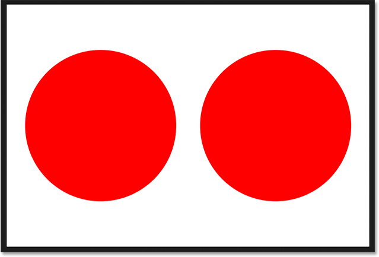
*A vector shape on the left and a pixel shape on the right.*

If we look in my **Layers panel**, we see each shape sitting on its own layer. I've gone ahead and renamed the layers to make things easier. The pixel-based shape is on the top "Pixel shape" layer and the vector-based shape is on the cleverly-named "Vector shape" layer below it:

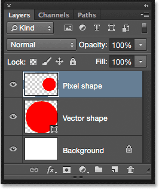
*The Layers panel showing the vector and pixel shapes on separate layers.*

### Spotting The Shape Layer

Even if I hadn't renamed them, there would still be an easy way to tell which layer holds the vector shape, and that's by looking for the small **shape icon** in the lower right of the layer's **preview thumbnail**. This icon tells us it's a **Shape layer**, not a normal pixel layer:

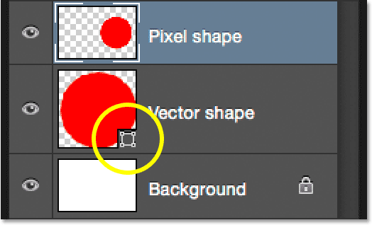
*Shape layers are easily identified by the small icon in the lower right of the preview thumbnail.*

### Scaling The Vector Shape

As I mentioned, both shapes look identical at the moment, but let's see what happens when we scale them. I'll start with the vector shape. First, I need to select it, so I'll click on the "Vector shape" layer in the Layers panel:

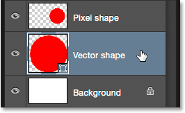
*Selecting the vector shape.*

To scale the vector shape, I'll go up to the **Edit** menu in the Menu Bar along the top of the screen and choose **Free Transform Path**:

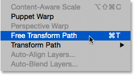
*Going to Edit > Free Transform Path.*

This places the [Free Transform](/basics/free-transform/) box and handles around the vector shape on the left:

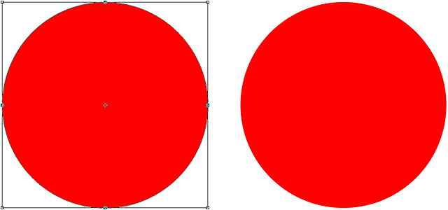
*The Free Transform box appears around the vector shape.*

I want to make sure I scale both shapes to exactly the same size, so rather than dragging the Free Transform handles manually, I'll go up to the Options Bar along the top of the screen and change both the **Width** (**W**) and **Height** (**H**) values of the shape to 10%:

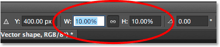
*Setting both the Width and Height of the vector shape to 10%.*

I'll press **Enter** (Win) / **Return** (Mac) on my keyboard to accept the new size, and now the vector shape on the left is much smaller:

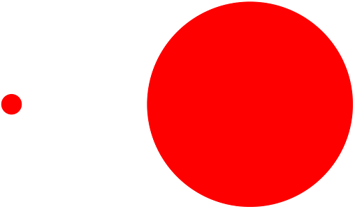
*The vector shape is now 10% the size of the pixel shape.*

Let's see what happens if I scale the vector shape back up to its original size. Rather than going back up to the **Edit** menu at the top of the screen and choosing **Free Transform Path**, this time I'll use the faster keyboard shortcut, **Ctrl+T** (Win) / **Command+T** (Mac). This places the same Free Transform box and handles around the vector shape:

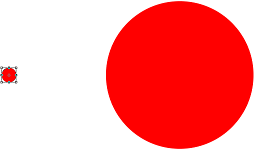
*Pressing Ctrl+T (Win) / Command+T (Mac) to quickly select Free Transform Path.*

Since I made the shape smaller by scaling it down to 10%, I'll enlarge it back to its original size by setting both the **Width** and **Height** values in the Options Bar to **1000%**:

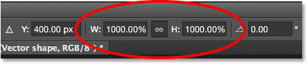
*Setting the Width and Height of the vector shape to 1000%.*

I'll again press **Enter** (Win) / **Return** (Mac) on my keyboard to accept it, and now, the vector shape is back to its original size. Notice that even though I scaled it smaller and then enlarged it, the vector shape still looks good as new. Its edges remain as crisp and sharp as they were originally:

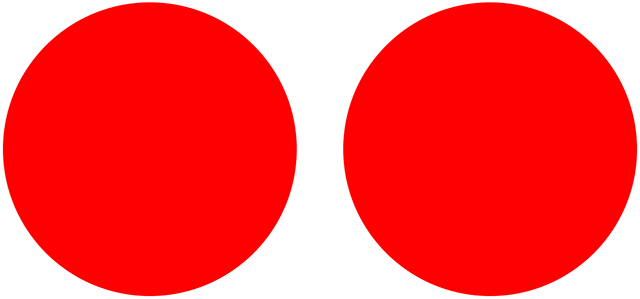
*The vector shape on the left retains its crisp, sharp edges even after being scaled.*

### Scaling The Pixel Shape

Let's try the same thing with the pixel shape on the right. First, I'll select it by clicking on the "Pixel shape" layer in the Layers panel:

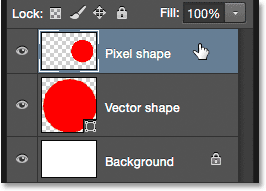
*Selecting the pixel shape.*

With the pixel shape layer selected, I'll go up to the **Edit** menu at the top of the screen and choose **Free Transform:**

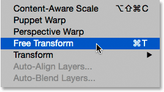
*Going to Edit > Free Transform.*

### Free Transform vs Free Transform Path

Notice that this time, the command is called Free Transform, not Free Transform *Path*. We'll look at paths in another tutorial, but essentially, a vector shape is made up of two parts; the basic outline of the shape, known as the *path*, and the color that the outline (the path) is filled with. When we edit or scale a vector shape, we're really editing and scaling the path outline. That's why, when I had the vector shape layer selected, the command was called Free Transform Path. Now that I have a normal pixel layer selected, we're editing pixels, not paths, and so the name of the command has changed to simply Free Transform. Again, we'll be covering paths in more detail later on.

This places the Free Transform box around the pixel shape on the right:

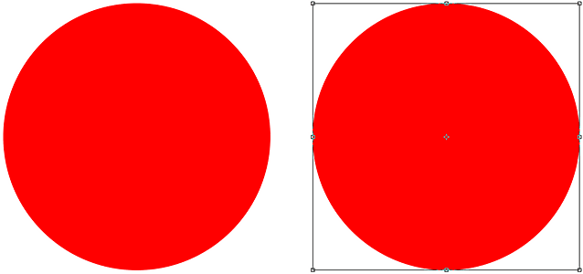
*The Free Transform box appears around the pixel shape.*

Just as I did with the vector shape, I'll scale the pixel shape down by setting the **Width** and **Height** to **10%** in the Options Bar:

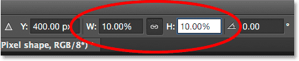
*Setting the Width and Height of the pixel shape to 10%.*

I'll press **Enter** (Win) / **Return** (Mac) on my keyboard to accept it, and now the pixel shape is much smaller. So far, so good. Even after scaling the pixel shape down to 10%, it looks just as sharp as it did originally, and we still have not seen any difference between the vector shape and the pixel shape:

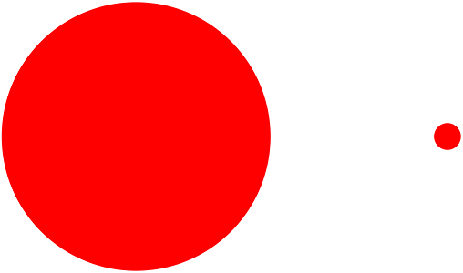
*The pixel shape after scaling it down to 10%.*

But now, the true test. What will happen when I scale the pixel shape back up to its original size? I'll press **Ctrl+T** (Win) / **Command+T** (Mac) on my keyboard to quickly select the **Free Transform** command, and to scale the pixel shape back up, I'll set the **Width** and **Height** in the Options Bar to **1000%**:

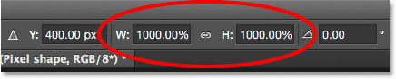
*Scaling the pixel shape back up to its original size.*

I'll press **Enter** (Win) / **Return** (Mac) to accept it and close out of the Free Transform command. And now, the difference between vector and pixel-based shapes becomes apparent. Even though I scaled both shapes by the exact same amounts, and both shapes retained their crisp edges when downsized, the pixel shape couldn't handle being scaled back up. Its once-sharp edges now appear soft, blurry and blocky:

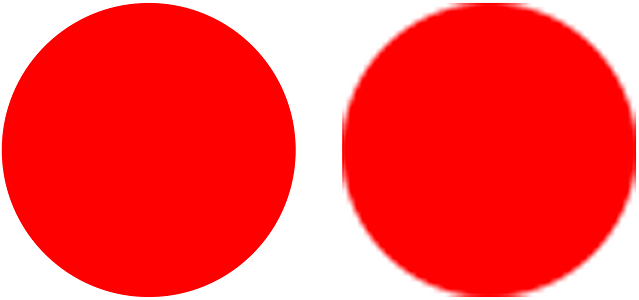
*The vector shape survived intact after being scaled up. The pixel shape? Not so much.*

Let's zoom in for a closer look. The reason the edges of the pixel shape look so much worse now is because, when I scaled it down to 10% of its original size, Photoshop had to toss away 90% of the pixels that made up the initial shape. That would have been fine *if* I did not need to scale it back up. Photoshop can't magically recreate pixels, so when I scaled it up, all Photoshop could do was take those remaining pixels and make them bigger. That's why we can actually see a stair-stepping effect along the edge of the shape. Those are the edges of the individual pixels. They look soft and blurry because that's just what happens to pixels when we make them bigger. The more we enlarge them, the softer they get. Vector shapes, on the other hand, don't have this problem. They're just points connected together by lines and curves, and we can resize them as much as we want without ever losing quality:

*A close-up of the vector and pixel shape edges.*

As we've seen in this tutorial, vector shapes and pixel shapes may look identical when we first draw them, and both look just as good when scaled down to smaller sizes. But when we need to scale them larger, vector shapes quite literally have the edge. This is true not just when viewing them on screen but also when printing. Just like digital photos, a shape drawn with pixels is *resolution-dependent*, meaning it can be printed only so large before it begins to look soft and dull, just as we saw in the above example. A vector shape, on the other hand, is *resolution-independent*. It can be printed at any size, even as large as a billboard, and will always look crisp, clean and good as new.