# Photoshop Brushes – Dual Brush Options

> Source: [https://www.photoshopessentials.com/basics/photoshop-brushes/brush-dynamics/dual-brush/](https://www.photoshopessentials.com/basics/photoshop-brushes/brush-dynamics/dual-brush/)
> Downloaded and converted to Markdown.

In the previous tutorial as we make our way through **Photoshop's dynamic brush options**, we learned how the [**Texture**](/basics/photoshop-brushes/brush-dynamics/texture/) options allow us to add a texture or pattern to our brush tip. The **Dual Brush** options, which we'll look at in this tutorial, make it possible to actually mix two different brushes together!

If you haven't yet read through the **[previous tutorials](/basics/photoshop-brushes/brush-dynamics/)** in this series, I'd recommend you go back and look through the **[Scattering](/basics/photoshop-brushes/brush-dynamics/scattering/)** tutorial first before continuing, since Dual Brush and Scattering share two of the same main controls.

Before I begin, I'm going to select a different brush tip, something a little more interesting than the standard round brush I've been using up to this point. To select a different brush tip, I'll click on the words **Brush Tip Shape** in the top left corner of the Brushes panel, then I'll scroll through the brush tip thumbnails that appear on the right until I find the one I'm looking for (or until I see one that looks interesting). I'll select the **Scattered Leaves** brush tip by clicking on its thumbnail:

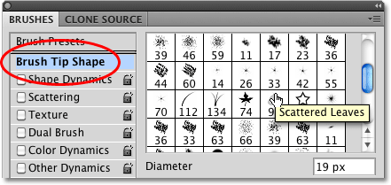
*Selecting the Scattered Leaves brush tip from the Brush Tip Shape section of the Brushes panel.*

While still in the Brush Tip Shape section, I'll increase the size of my brush by clicking on the **Diameter** slider and dragging it towards the right. I'll also increase the spacing between each brush tip by clicking on the **Spacing** slider and dragging it towards the right:

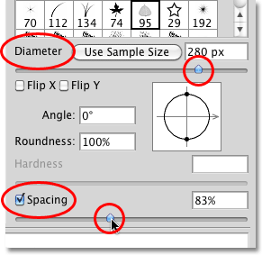
*The Diameter and Spacing controls in the Brush Tip Shape section of the Brushes panel.*

With my new brush tip selected and the size and spacing between each brush tip adjusted, I'll paint a simple brush stoke so we can see what the brush initially looks like. None of Photoshop's Brush Dynamics options are currently enabled:

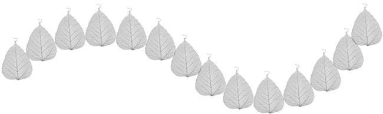
*The Scattered Leaves brush on its own with none of the Brush Dynamics selected.*

To access the Dual Brush options, click directly on the words **Dual Brush** on the left side of the Brushes panel:

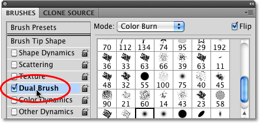
*Click directly on the words Dual Brush to access the options.*

### Choosing A Second Brush

The first thing you'll notice when the Dual Brush options appear on the right side of the Brushes panel is that we're presented with the exact same brush tip thumbnails that we saw in the Brush Tip Shape section. The difference is that this time, we're selecting a *second brush* to mix in with our initial one! I'll scroll down the list of thumbnails and click on the **Scattered Maple Leaves** brush tip to select it. Remember, I'm not changing my main brush here. I'm choosing a second brush to mix in with the one I choose initially:

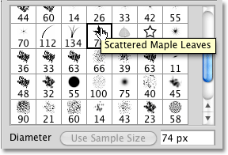
*All of the same brush tips are available in the Dual Brush options. Choose a second brush to mix in with the first.*

### Diameter And Spacing

A moment ago when I was choosing my initial brush from the Brush Tip Shape section of the Brushes panel, we saw that I was able to adjust the size of the brush by dragging the Diameter slider, and I was able to increase the spacing by dragging the Spacing slider. If we look directly below the list of thumbnails in the Dual Brush options, we see the exact same **Diameter** and **Spacing** sliders, and they work exactly the same way here as they do in the Brush Tip Shape section. The difference once again is that this time, they control our second brush, the one we're mixing in with our initial brush.

Drag the Diameter slider left or right to increase or decrease the size of your second brush, then do the same thing with the Spacing slider to increase or decrease the amount of space between each individual brush tip. Keep an eye on the **brush preview area** along the bottom of the Brushes panel to see the changes as you drag the sliders:

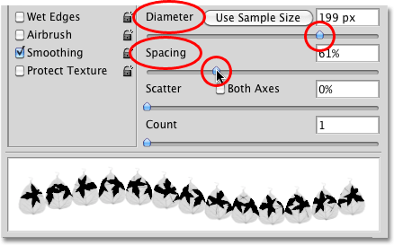
*The Diameter and Spacing sliders in the Dual Brush section control the second brush, not the initial one.*

My Scattered Maple Leaves brush (the second brush) now appears inside the shape of my initial brush as I paint a brush stroke:

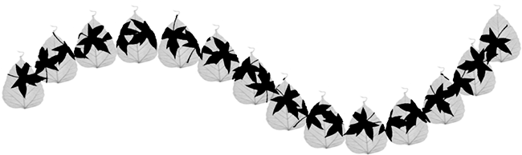
*The second brush now appears inside the first.*

**The "Cookie Cutter" Effect**

Notice that the initial brush is acting sort of like a "cookie cutter" for the second brush, meaning that the shape of the second brush never extends outside the shape of the first one. No matter how large you make your second brush, even if it's ten times as large as the main brush, it will always be constrained by the shape of the initial one.

### Scatter And Count

Also included in the Dual Brush section are **Scatter** and **Count** sliders, which work the same way as they do in the **[Scattering](/basics/photoshop-brushes/brush-dynamics/scattering/)** section, but here, they're controlling the second brush. Drag the Scatter slider towards the right to spread out the brush tips inside the shape of the initial brush as you paint. Select the **Both Axes** option to have them appear to spread out in all directions. Drag the **Count** slider towards the right to add more and more copies of the second brush tip to the stroke. Always keep an eye on the preview area along the bottom of the Brushes panel to preview the changes you're making:

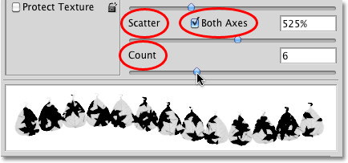
*Use Scatter to spread out the second brush inside the shape of the initial brush. Count adds additional copies of the second brush.*

Here we see the effects of increasing the Scatter and Count values for the second brush. Notice that it's still confined within the shape of the initial main brush even though we've scattered the brush tips and added more of them:

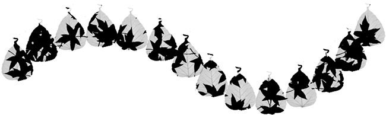
*Even after increasing the Scatter and Count values, the second brush remains confined within the shape of the initial brush.*

### Blend Mode

We can control how the two brushes blend together by trying out various **[blend modes](/photo-editing/layer-blend-modes/)** found in the **Mode** option at the top of the Brushes panel. Mine has been set to **Color Dodge** for each of the brush strokes I've painted so far in this tutorial:

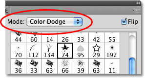
*The Mode option controls how the two brushes blend together.*

To change the blend mode, simply click on the Mode selection box and choose a different one from the list. I'll change my blend mode to **Overlay**:

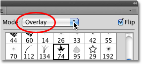
*Changing the blend mode from Color Dodge to Overlay.*

By changing the blend mode of the brushes, we get different results which will depend a lot on the brushes you're using. Here's my brush stroke with Mode set to Overlay:

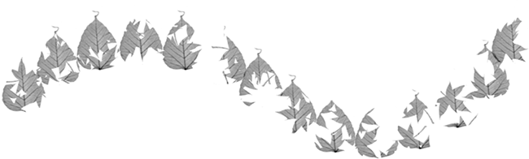
*The Overlay mode created a "cut out" effect with the brushes.*

Let's try a different blend mode. I'll choose **Hard Mix** this time:

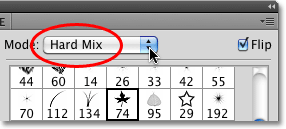
*Changing the brush mode to Hard Mix.*

Hard Mix creates a similar yet darker looking brush stroke. Again, your results will depend on the brushes you're using:

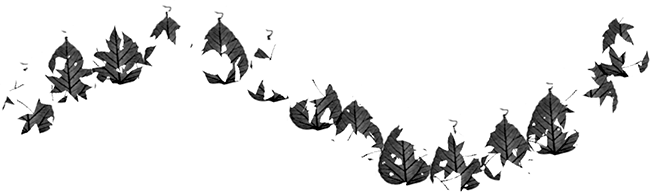
*The Hard Mix mode gives the brush stroke a darker appearance.*

Try out the various blend modes on your own and choose the one that gives you the results you're looking for.

### Flip

Finally, select the **Flip** option the top right corner of the Brushes panel to add more variety to the results by telling Photoshop to randomly flip the shape of the second brush as you paint. As with all of the other controls in the Dual Brush section, Flip has no effect on the initial, main brush:

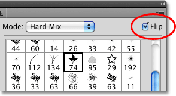
*Flip will randomly flip the second brush tip throughout the brush stroke.*

Up next, things start to get a lot more colorful with our brushes as we look at Photoshop's **[Color Dynamics](/basics/photoshop-brushes/brush-dynamics/color-dynamics/)**! Or, jump to any of the other Brush Dynamics categories using the links below. To learn about other Photoshop topics, visit our [Photoshop Basics](/basics/) section.

- [**Shape Dynamics**](/basics/photoshop-brushes/brush-dynamics/shape-dynamics/)
- [**Scattering**](/basics/photoshop-brushes/brush-dynamics/scattering/)
- [**Texture**](/basics/photoshop-brushes/brush-dynamics/texture/)
- [**Other Dynamics**](/basics/photoshop-brushes/brush-dynamics/other-dynamics/)