# Photoshop Actions – Editing An Action

> Source: [https://www.photoshopessentials.com/basics/photoshop-actions/editing-an-action/](https://www.photoshopessentials.com/basics/photoshop-actions/editing-an-action/)
> Downloaded and converted to Markdown.

Now that we've finished [stepping through the Photo Corners action](/basics/photoshop-actions/step-through/) and we know which steps we want to change, we're ready to edit the action! There's a couple of steps we'll need to edit in order to change the colors the action uses, and there's also a couple of steps we can probably get rid of altogether, or at least disable.

Whenever you're editing an action, it's always best to **make a copy of the action** first and **edit the copy**, rather than editing the original. This way, you'll always have the original if you need it. Also, since the action we want to edit is found in one of the action sets that installed with Photoshop (in this case, the Frames action set), it's a good idea for us to create a new action set and then place the copy of our action inside the new set, rather than making changes to any of Photoshop's default settings.

### Creating A New Action Set

The first thing we need to do, then, is create a new action set. As we've already learned, an action set is really just a folder of sorts that actions are stored in. It's important to note that **all actions must be placed inside action sets**. If you create a new action, or make a copy of an existing action, it *must* be placed inside an action set. You can have a single action in a set or hundreds of actions, it makes no difference. All actions must be placed in an action set. I know, it's a rule and no one likes rules, but there's just no getting around this one.

The easiest way to create a new action set is to click on the **New Action Set** icon at the bottom of the Actions palette (it's the icon that looks like a folder):

*Click on the New Action Set icon to create a new action set.*

Photoshop will pop up the *New Set* dialog box where you can enter a name for your new action set. I'll name my action set "My Actions". Of course, you can name your set whatever you like:

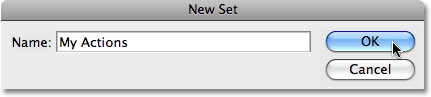
*Enter a name for your new action set in the New Set dialog box.*

Click OK once you've entered a name for your set to exit out of the dialog box. If I look at my Actions palette now, I can see my new action set, "My Actions", listed below the other action sets:

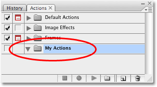
*The new action set appears in the Actions palette.*

At the moment, we have a new action set with absolutely nothing in it. Let's make a copy of the Photo Corners action, which is inside the Frames set, and place it into our new set.

### Moving Action Sets Inside The Actions Palette

To place a copy of the Photo Corners action inside my new "My Actions" set, I'm simply going to drag the action from the Frames set into the "My Actions" set while holding down my *Alt* (Win) / *Option* (Mac) key, which will create a copy of the action set as I drag. To make it easier to drag the action from one set into the other, I'm first going to move the "My Actions" set above the Frames set. To move action sets around and reposition them inside the Actions palette, simply click on an action set, then keep your mouse button held down and drag the set to its new position. Here, I'm dragging the "My Actions" set to its new location directly between the Image Effects and Frames sets. Notice the black horizontal line that appears between them indicating where the action set will be placed:

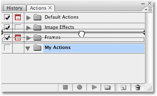
*Click and drag action sets up or down in the Actions palette to reposition them.*

Release your mouse button to drop the set into its new location:

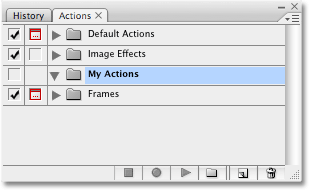
*The "My Actions" set is now sitting between the Image Effects and Frames sets.*

### Copying And Dragging An Action From One Set To Another

With my "My Actions" set now moved into place, I'll twirl open the Frames set and click on the Photo Corners action to select it. I'm going to drag this action from the Frames set into the "My Actions" set, but I don't want to move the original action. I want to create a copy of the original and move the copy into the "My Actions" set while leaving the original alone. To move the action and create a copy of it at the same time, I'll hold down my *Alt* (Win) / *Option* (Mac) key and drag the Photo Corners action into the "My Actions" set. Once again, a black horizontal line appears indicating where the action will be placed:

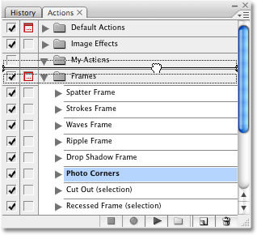
*Holding down "Alt" (Win) / "Option" (Mac) and dragging the Photo Corners action into the "My Actions" set.*

I'll release my mouse button, and I now have a copy of the action, which Photoshop has named "Photo Corners copy", in the "My Actions" set:

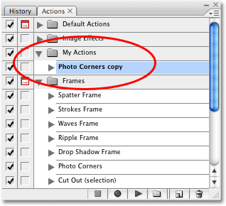
*A copy of the action, named "Photo Corners copy", has been placed inside the "My Actions" set.*

### Renaming An Action

"Photo Corners copy" doesn't seem like a very interesting name to me, and certainly not very descriptive. Since I'm hoping to improve on this action by editing it, I think I'll rename it to something like "Improved Photo Corners". To rename an action, simply *double-click directly on its name* in the Actions palette and type in a new name. Press *Enter* (Win) / *Return* (Mac) when you're done:

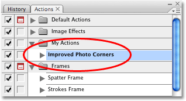
*Double-click directly on the name of an action and enter a new name to rename it.*

I now have an exact copy of the original Photo Corners action, which I've renamed "Improved Photo Corners", sitting in the new "My Actions" set that I created. We can now make any changes we want to this action without affecting either the original action or the Frames action set.

### Deleting A Step In An Action

Let's begin editing our "Improved Photo Corners" action. The first thing I'm going to do is delete the very first step, "Make snapshot". If you recall, this step takes a snapshot of the state of the image just before the action is played so that we can easily undo the action by simply clicking on the snapshot in the History palette. I'll click on this step to select it:

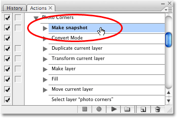
*Selecting the "Make snapshot" step.*

Since I'll most likely be running this action on an image immediately after opening it in Photoshop, I don't think there's really any need for a snapshot since I could just as easily select the *Revert* option from the *File* menu at the top of the screen to revert the image back to the way it appeared when I opened it. I'll just go ahead then and delete this step. To delete a step in an action, all you need to do is click on it and drag it down on to the *Trash Bin* icon at the bottom of the Actions palette:

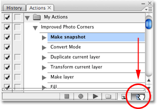
*To delete a step, click on it and drag it down on to the Trash Bin at the bottom of the Actions palette.*

The "Make snapshot" step has now been deleted:

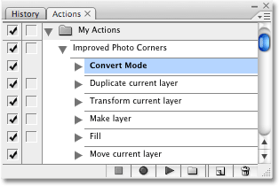
*The step has been deleted.*

I'm also going to delete the "Reset Swatches" step from the action, since we won't be needing that one either. Another way to delete a step is to click on it in the Actions palette to select then, then hold down your *Alt* (Win) / *Option* (Mac) key and simply click on the *Trash Bin* icon at the bottom of the palette:

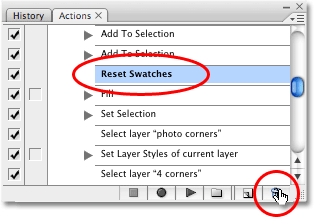
*Click on a step to select it, then hold down "Alt" (Win) / "Option" (Mac) and click on the Trash Bin to delete it.*

If you click on the Trash Bin without holding down Alt/Option, Photoshop pops up a dialog box first asking if you want to delete the step. Holding down Alt/Option avoids the dialog box.

### Turning Steps On And Off

Sometimes, rather than deleting a step entirely, you'll simply want Photoshop to ignore it. This is usually a better alternative than deleting a step unless you know for certain that the step is not and will not ever be needed. The Actions palette gives us a way to turn individual steps off without deleting them by clicking on the small *checkmark* to the left of a step. With the checkmark visible, the step will be played as part of the action. When you click on a checkmark, it disappears leaving an empty box in its place and the step will be ignored.

If I look at my action in the Actions palette, I can see that the first step is now "Convert Mode", which, if you remember from our step-by-step journey through the Photo Corners action, converts the image into the [**RGB color**](/essentials/rgb/) mode. The reason this step is included is because not all of Photoshop's commands, filters and other options are available to us when working on an image in a different color mode like CMYK or Lab. Also, colors can appear differently when working in these other modes, especially CMYK. However, since the chances are very high that any image we're working on in Photoshop will already be in the RGB color mode, this step can usually be skipped. Of course, there's always the chance that you'll be working on an image in a different color mode, so rather than deleting the step completely, let's just turn it off.

To turn off the "Convert Mode" step and tell Photoshop to skip it until I decide to turn it back on again, I'll simply click on the checkmark to the left of the step. The checkmark will disappear, leaving an empty square in its place:

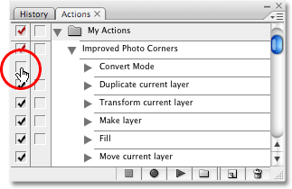
*Turn individual steps on and off by clicking on the checkmark to the left of a step. The step is turned off when the checkmark is not visible.*

The next time I run this action, Photoshop will ignore the "Convert Mode" step and carry on with the rest of the action. To turn a step back on, just click inside the empty square to make the checkmark visible once again.

### Turn All Steps On Or Off At Once

If you want to turn every step in an action on or off at once, simply click on the checkmark to the left of the action's name in the Actions palette. When the checkmark is red, as it is at the moment, it means that some of the steps in the action are currently turned on while others are turned off. In our case, the "Convert Mode" step is turned off while all other steps are turned on. When the checkmark is gray, it means that all of the steps are currently turned on. And when the checkmark is not visible, it means that all of the steps in the action are currently turned off:

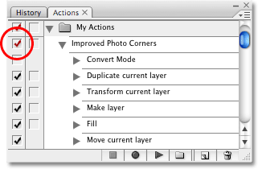
*The main checkmark to the left of the action's name is red, which means that some of the steps are turned on while others are turned off.*

### Changing An Existing Step In An Action

We've seen how to delete a step from an action, as well as how to temporarily turn steps on or off. Now let's look at how to change a step. Before we do, it's important to note that unfortunately, not all steps in an action can be easily changed. If a step involves setting options in a dialog box, which is what we'll be looking at here, then yes, you can make changes to the step by changing the options in the dialog box. If not, you'll need to delete the step, then re-record it. We'll see how to add steps to an action once we've looked at how to make changes to a step that uses a dialog box.

There's two steps in this action that I want to change. Both are named "Fill", and both control the colors used in the frame effect. If you recall from when we played through the action [**one step at a time**](/basics/photoshop-actions/step-through/), the first Fill step controls the color used for the background. Let's look at this step again. I'll twirl it open so we can view the details:

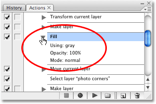
*The details of the first Fill step in the action which controls the background color.*

At the moment, this step will fill the "new background" layer with gray, using Photoshop's Fill command. I wasn't too happy with the gray that it used, so I want to choose a different color. Now, I have a couple of choices here. I can specify an exact color to use every time I run the action, or I can tell Photoshop to bring up the Fill command's dialog box when it plays the action so I can choose a different color each time. Let's try choosing a specific color first.

To edit a step in an action (again, this only works for steps that involve dialog boxes), simply *double-click* on the step in the Actions palette. I'll double-click directly on the Fill step, and as soon as I do, Photoshop pops up the Fill dialog box and we can see that it's currently set to fill the layer with 50% gray, which is the shade of gray midway between black and white:

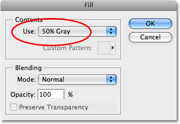
*Double-click on a step to bring up its dialog box.*

I think I want to use white for my background color with this frame effect, so I'll select *White* from the drop-down box instead:

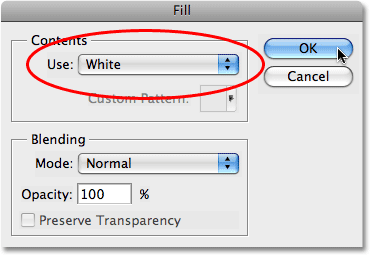
*Changing the "Use" option to "White" in the Fill dialog box.*

I'll click OK in the dialog box to accept the change and exit out of it, but as soon as I do, Photoshop actually plays the step and fills my document window with white:

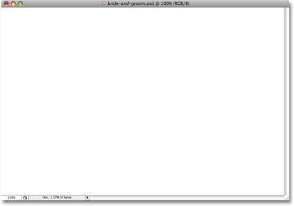
*Photoshop plays the step after making changes.*

To undo the step that Photoshop has played, all I need to do is go up to the **Edit** menu at the top of the screen and choose **Undo** (in this case, it will say **Undo Fill**), or I can use the keyboard shortcut, *Ctrl+Z* (Win) / *Command+Z* (Mac). Either way takes me back to the way the image looked before the step was played.

And now, if I look at the details of the step in the Actions palette, I can see that the layer will no longer be filled with gray. Instead, it will be filled with white:

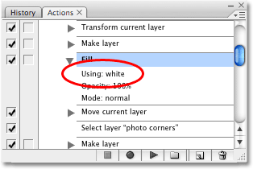
*The details of the step have now changed in the Actions palette.*

I'm going to do the same thing with the second Fill step, which controls the color used for the actual photo corners. I'll scroll down to it in the Actions palette, then twirl it open so we can see the details:

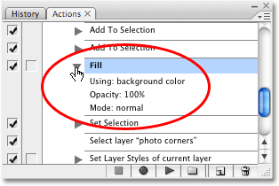
*The second Fill step controls the color of the four photo corners.*

As we see by looking at the details of the step, it's currently set to fill the four photo corners with the background color. We've already deleted the "Reset Swatches" step which would have reset the background color to white, so let's set a specific color to use. I'll **double-click** on the step in the Actions palette to edit it, and the **Fill** dialog box pops up once again, this time set to use the current background color:

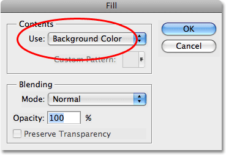
*The Fill command is currently set to fill the four photo corners with the background color.*

This time, I think I'll choose black as the color for my photo corners, so I'll select Black from the list:

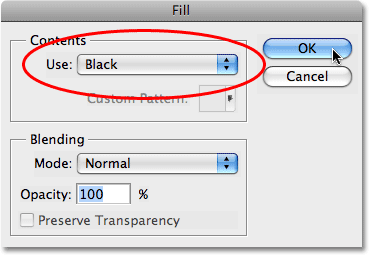
*Selecting black as the color to use for the photo corners.*

I'll click OK to accept the change and exit out of the dialog box, and once again, Photoshop plays the step, filling my document window with black:

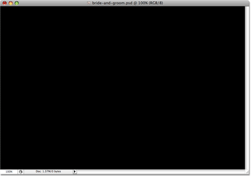
*The document window now appears filled with black.*

I'll undo the step that Photoshop played using the keyboard shortcut *Ctrl+Z* (Win) / *Command+Z* (Mac), and now if I look at the details of the step in the Actions palette, I can see that the photo corners will now be filled with black instead of the background color:

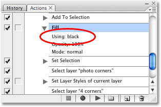
*The details of the step now show that black will be used instead of the background color.*

Let's play the action now and see what it looks like with our new colors! I'll use a different photo this time just to keep things interesting. To play the action, I'll click on it in the Actions palette to select it and then click on the *Play* icon at the bottom of the palette:

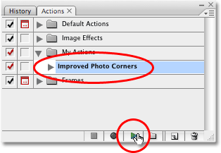
*Selecting and playing the newly edited action.*

Here's the image after running the Improved Photo Corners frame effect action. Notice how the background is now white and the photo corners are black thanks to the changes we made:

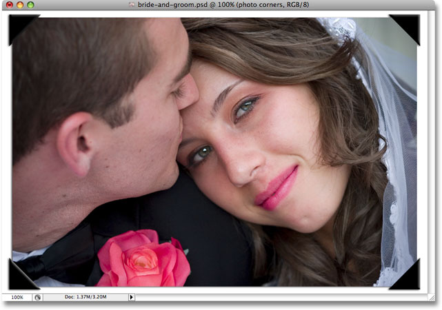
*The photo after running the new Improved Photo Corners frame effect action.*

I would say that's a definite improvement over the colors used by the original Photo Corners action. But what if I don't always want white as my background color and black as the color of the photo corners? Do I have to make a new copy of the action and edit it each time I want different colors? Of course not! We'll just tell Photoshop to pop open the Fill dialog boxes for us so we can choose a new color each time the action plays!

### Toggling Dialog Boxes On And Off In An Action

As we've already learned from back when we were looking at Photoshop's [**Default Actions set**](/basics/photoshop-actions/default-actions/), the Actions palette gives us the ability to have dialog boxes pop open for us as an action plays. This gives us a chance to customize the action on the fly each time we run it. In our case here, even though we've already seen how to edit the colors in the action and select new ones, it would be great if we could choose different colors for our Improved Photo Corners action each time we ran it, and we can certainly do that. All we need to do is toggle the dialog boxes on for our two Fill steps.

To tell Photoshop to pop open the dialog box when it reaches a certain step, simply click on the *dialog box toggle icon* to the left of the step. In my case, I want the Fill dialog box to appear when the action plays so I can choose a color for the background, so I'll click on the dialog box toggle icon to the left of the first Fill step:

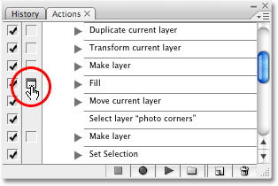
*Toggling the dialog box on for the first Fill step in the action.*

I'll scroll down to the second Fill step and do the same thing:

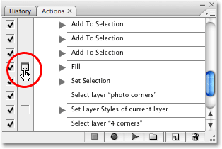
*Toggling the dialog box on for the second Fill step in the action.*

Now watch what happens when I play the action. First, I'll revert my photo back to its original state by going up to the **File** menu and choosing **Revert**. Now I'll select the action in the Actions palette and click on the *Play* icon. Photoshop begins running through the steps in the action as usual until it reaches the first Fill step. Here, instead of automatically filling the background layer with white, it pops open the Fill dialog box for me, allowing me to either accept white as the color to use or choose a different color:

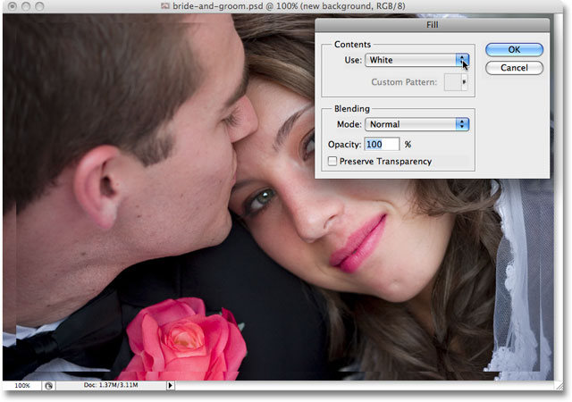
*The Fill dialog box appears when Photoshop reaches the first Fill step.*

One of my favorite ways to customize effects is to sample colors directly from the image I'm working on, and I think I'll do that here. I'll sample a color from the photo to use as the background color for the frame effect. To do that, I'll choose **Color** from the drop-down list in the Fill dialog box:

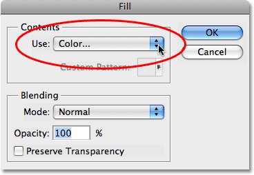
*Selecting "Color" from the drop-down list.*

This will bring up Photoshop's **Color Picker**. Rather than choosing a color from the Color Picker though, I'm going to move my mouse cursor over the image, which turns the cursor into the Eyedropper, and I'll click on the image to sample a light bluish-gray color from the bride's veil:

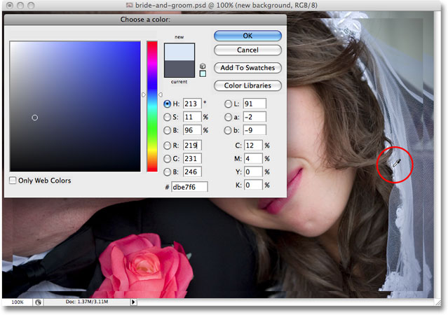
*Sampling a color directly from the image to use as the background color for the frame effect.*

I'll click OK to exit out of the Color Picker, then I'll click OK to exit out of the Fill dialog box. Photoshop fills the "new background" layer with the color I've sampled from the image and then continues on its way through the steps in the action until it reaches the second Fill step. Here, it pauses and pops open the Fill dialog box once again, allowing me to either accept black as the color to use for the photo corners or choose a different color:

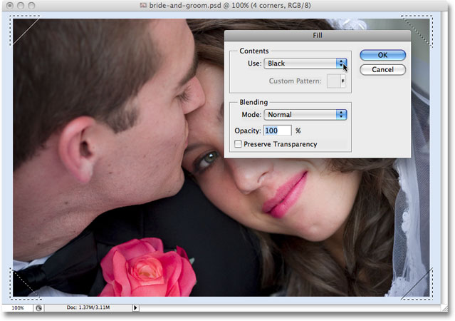
*The Fill dialog box opens once again when Photoshop reaches the second Fill step in the action.*

I'm going to sample another color directly from the image to use for the photo corners, so I'll select **Color** from the drop-down list in the Fill dialog box. Once again, this brings up Photoshop's Color Picker, but I'm not going to use it. Instead, I'll move my mouse cursor over the image and sample a darker gray color, also from the bride's veil:

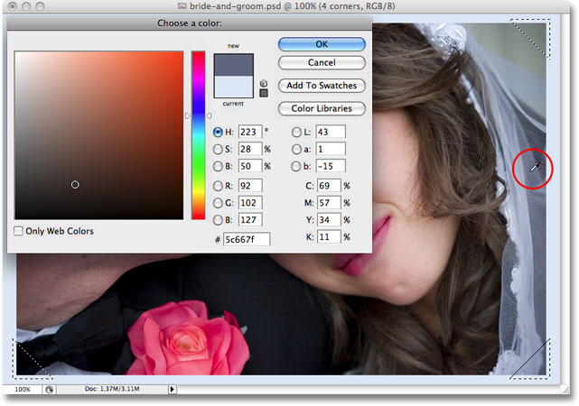
*Sampling a second color from the image, this time for the photo corners.*

I'll click OK to exit out of the Color Picker, then I'll click OK to exit out of the Fill dialog box. Photoshop fills the four photo corners with the dark gray I sampled from the image, then continues on through the remainder of the steps in the action until it reaches the end. Here is my new "Improved Photo Corners" result using the colors sampled directly from the photo:

*The same Improved Photo Corners frame effect, this time with colors sampled from the image.*

I think that looks pretty good. And now that the action will allow me to choose new colors every time I run it, I can easily customize this frame effect action for any photo I use it with!

There's only one more thing we need to look at before moving on to recording our own actions, and that's how to add a step to an action. We'll do that next!

### Adding A New Step To An Action

As I mentioned, Photoshop allows us to make changes to an existing step in an action only when the step involves using a dialog box to set various options. By double-clicking directly on the step, we tell Photoshop to pop the dialog box open for us so we can make changes, and then we simply close the dialog box when we're done. If the step we need to change does not use a dialog box, the only way we can edit it is by deleting the step and then re-recording it. We've already looked at how to delete a step from an action, which is easily done by dragging it down on to the Trash Bin at the bottom of the Actions palette. Here, we'll look at how to add a step to an action.

Remember when we [stepped through](/basics/photoshop-actions/step-through/) the original Photo Corners action? The very first step in the action was "Make snapshot", which took a snapshot of the state of the image just before the action was played and saved it in the History palette. This way, we could quickly undo all the steps in the action if needed by switching over to the History palette and clicking on the snapshot. After we dragged a copy of the action, which we renamed "Improved Photo Corners", into our new "My Actions" set so we could edit it, the first thing we did was delete that "Make snapshot" step. My reasoning for deleting the step at the time was that I would most likely be running the action on a newly opened image in Photoshop, and since we can easily revert an image back to the way it looked when we opened it (or at least to the way it looked when we last saved it) by going up to the *File* menu and choosing *Revert*, I didn't think the "Make snapshot" step was necessary, so I deleted it.

Well, as is often the case, it's not until you've tossed something away that you realize how much it really meant to you. After a bit more thought, I realize now that deleting that step was a mistake. What if I wanted to run the "Improved Photo Corners" action on an image that I had already done a considerable amount of photo retouching work on? Sure, I could save the image first before running the action, but what if I forgot to save it first? If I tried to undo the action by selecting Revert from the File menu, not only would I be undoing all the steps in the action, I'd also be undoing everything else I had done to the image! Suddenly, having that "Make snapshot" step there doesn't sound like such a bad idea. But what to do? I've already deleted it! Do I have to re-record the entire action again, or edit another copy of the original just to get that one step back? Thankfully, no. All I need to do is re-record that one step.

To add a step to an action, the first thing we need to do is select the step that comes just before the spot where we need to insert the step. For example, if the step you're adding needs to be the third step in the action, click on the second step in the action to select it before you begin recording. This way, when you record the new step, Photoshop will automatically place it immediately after the step you had selected. Keep in mind that you'll most likely need to play all the steps in the action up to that point in order to add the new step, otherwise Photoshop may not understand what you're trying to do and will throw you an error message, which makes sense. After all, if you tried telling someone to "turn left at the next intersection" while the two of you are still standing beside the car deciding where to go for lunch, they probably won't have any idea what you're talking about and may start wondering if going anywhere at all with you is such a good idea.

Remember, to play steps in an action one at a time, hold down your *Ctrl* (Win) / *Command* (Mac) key and *double-click* on each step. You'll probably need to do this from the beginning of the action until you reach the point where you want to insert your new step.

In my case, I have a bit of a problem. I want to insert a new step at the very beginning of the action, which means, obviously, that there are no steps that come before it for me to select, and that means there's no way for me to have Photoshop automatically place my new step at the beginning of the action. No worries though, since we can easily rearrange the order of the steps, as we'll see in a moment. For now, I'll simply select the step that's currently the first step, "Convert Mode":

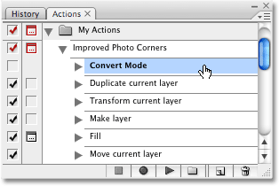
*Selecting the first step in the action.*

To record a new step, simply click on the **Record** icon at the bottom of the Actions palette:

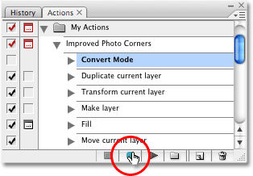
*Click the Record icon to begin recording your new step.*

You'll see the little "button" turn red, letting you know that you're now in Record mode:

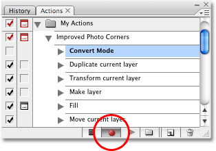
*The record button turns red when in Record mode.*

Now, remember what we said at the very [beginning](/basics/photoshop-actions/). There's no reason to panic just because the little record button is red. Yes, we're technically in Record mode, but we can take as much time as we want recording our step because actions are not recorded in real time. All Photoshop records are the steps themselves. I want to have the action take a snapshot of my image before any further steps are run, so with Photoshop recording what I'm doing, I'm going to switch over to my **History palette**, which by default is sitting right next to the Actions palette, and I'll click on the **New Snapshot** icon at the bottom of the palette (it's the icon that looks like a camera):

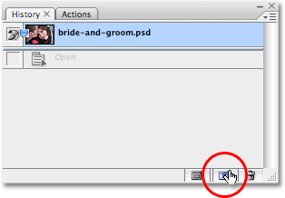
*Clicking on the "New Snapshot" icon at the bottom of the History palette.*

This adds a snapshot of the current state of my image to the top of the History palette:

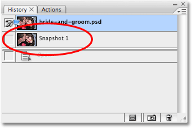
*The History palette showing the new snapshot.*

I'll switch back over to my Actions palette now, and we can see that a new step named "Make snapshot" has been added directly below the "Convert Mode" step, which is the step I selected before clicking the Record icon:

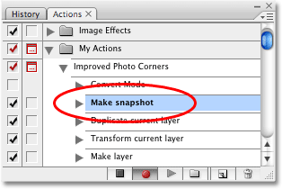
*A new "Make snapshot" step now appears below the "Convert Mode" step.*

I've finished recording my step, so I can now stop recording. To do that, I'll click on the *Stop* icon to the left of the Record icon:

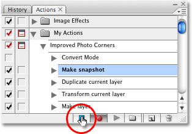
*Click on the Stop icon to finish recording the step.*

And there we go! I've successfully added a new "Make snapshot" step to my "Improved Photo Corners" action. The only problem is that I want this new step to be the first step in the action, and at the moment, it's the second step. Let's fix that.

### Changing The Order Of Steps In An Action

To change the order of steps in an action, simply click on a step to select it, then drag into into place. I want to move my "Make snapshot" step above the "Convert Mode" step, so I'll click on it to select it in the Actions palette, then I'll drag it up above the "Convert Mode" step. Notice the black horizontal line that appears where I'm about to drop the step:

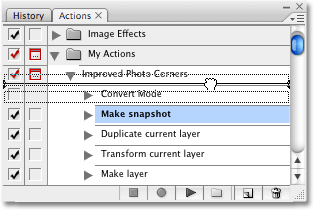
*Simply click and drag steps above or below each other in the Actions palette if you need to change their order.*

I'll release my mouse button to drop the step into its new position, and we can see that it now appears as the very first step in the action, right where I wanted it:

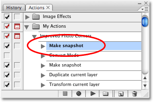
*The "Make snapshot" step has been successfully moved into place.*