# The Elliptical Marquee Tool In Photoshop

> Source: [https://www.photoshopessentials.com/basics/selections/elliptical-marquee-tool/](https://www.photoshopessentials.com/basics/selections/elliptical-marquee-tool/)
> Downloaded and converted to Markdown.

Before we begin... This tutorial was originally written for Photoshop CS4 but is fully compatible with newer versions including Photoshop CS6 and CC.

In a previous tutorial, we learned how Photoshop's [**Rectangular Marquee Tool**](../rectangular-marquee-tool/) allows us to quickly and easily select objects or areas in a photo based on simple rectangular or square shapes. The **Elliptical Marquee Tool**, which is what we'll be looking at here, is another of Photoshop's basic selection tools. It's nearly identical to the Rectangular Marquee Tool and works much the same way.

In fact, the only real difference is that the Elliptical Marquee Tool allows us to draw oval or circular selections! If you already know how to use the Rectangular Marquee Tool, think of the Elliptical Marquee Tool as being the same thing, just with extremely rounded corners.

This tutorial is from our [How to make selections in Photoshop](/basics/make-selections-photoshop/ "How to use Photoshop selection tools") series.

By default, the Elliptical Marquee Tool is hiding behind the Rectangular Marquee Tool in the Tools panel. To access it, simply click on the Rectangular Marquee Tool, then hold your mouse button down for a second or two until a fly-out menu appears showing you the other tools that are nested behind it. Click on the Elliptical Marquee Tool in the fly-out menu to select it:

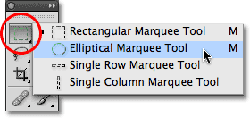
*Many of Photoshop's tools are located behind other tools in the Tools panel.*

Once you've chosen the Elliptical Marquee Tool, it will appear in place of the Rectangular Marquee Tool in the Tools panel. To get back to the Rectangular Marquee Tool, you'll need to click and hold on the Elliptical Marquee Tool, then select the Rectangular Marquee Tool from the fly-out menu:

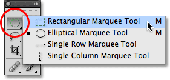
*Whichever Marquee Tool you selected previously appears in the Tools panel.*

You can easily switch between the Rectangular and Elliptical Marquee Tools from your keyboard, although exactly how you do it will depend on how you have things set up in Photoshop's Preferences. Every tool in the Tools panel can be accessed by pressing a certain letter on your keyboard. Both the Rectangular and Elliptical Marquee Tools can be selected by pressing the letter **M**, and to switch between them, you either press **M** again by itself or you'll need to press **Shift+M**. Again, this depends on how you have it set up in the Preferences.

On a PC, you'll find the **Preferences** option under the **Edit** menu at the top of the screen. On a Mac, you'll find it under the **Photoshop** menu. In the **General** section (the **Tools** section in Photoshop CS6 and CC), look for the option called **Use Shift Key for Tool Switch**. With this option checked, you'll need to add the Shift key to switch between the two Marquee tools (as well as other tools in the Tools panel that share the same keyboard shortcut). Uncheck the option if you'd rather just use the M key by itself to switch between them. It's completely up to you:

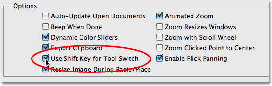
*The "Use Shift Key for Tool Switch" option in Photoshop's Preferences allows you to control how you switch between nested tools in the Tools panel.*

### Drawing Oval Selections

To draw an oval selection with the Elliptical Marquee Tool, simply click at the point where you want to begin the selection, then hold your mouse button down and drag in the direction you need until you have the object or area surrounded by the selection outline. Release your mouse button to complete the selection. Here's a wedding photo that I have open in Photoshop:

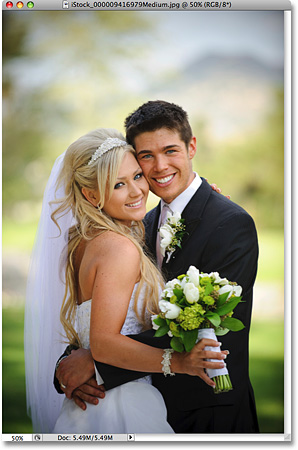
*A smiling bride and groom, happy to be helping us learn about selections.*

I want to add a classic white vignette effect to this photo, and the Elliptical Marquee Tool will make it easy. First, I'll add a new blank layer so I can create my effect without damaging the original image. I'll do that by clicking on the **New Layer** icon at the bottom of the Layers panel:

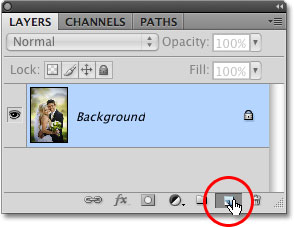
*Add a new blank layer by clicking on the New Layer icon in the Layers panel.*

This adds a new blank layer named "Layer 1" above the Background layer:

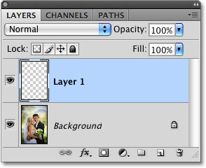
*Photoshop always gives new layers generic names like "Layer 1".*

I'm going to fill this new layer with white using Photoshop's Fill command. To select it, I'll go up to the **Edit** menu at the top of the screen and choose **Fill**:

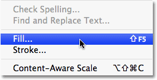
*The Fill command is found under the Edit menu.*

This brings up the Fill dialog box. I'll select **White** in the **Contents** section in the top half of the dialog box, then I'll click OK to exit out of the dialog box and fill "Layer 1" with white:

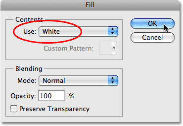
*The Fill command allows us to fill layers or selections with color.*

At this point, my entire document window is filled with white, blocking the photo of the wedding couple from view. To temporarily hide "Layer 1" so I can see the original photo again, I'll click on the **Layer Visibility** icon (also known as the "eyeball") to the left of "Layer 1" in the Layers panel:

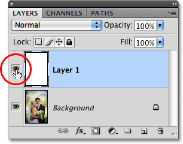
*You can temporarily turn layers on or off by clicking the Layer Visibility icon.*

Now that I can see the original image, I'll begin my vignetting effect by drawing an oval selection around the wedding couple. I'll select the Elliptical Marquee Tool from the Tools panel as we saw earlier and I'll click somewhere in the top left corner of the photo to mark the spot where I want to begin my selection. Then, while still holding down my mouse button, I'll drag down towards the bottom right corner of the photo. As I drag, an oval selection outline appears around the couple in the center of the image:

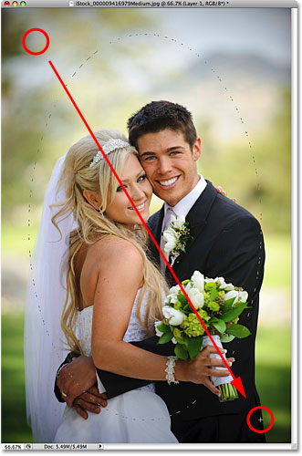
*Click and hold on the spot where you want to begin the oval selection, then drag in the direction you need to draw the selection outline.*

### Repositioning Selections As You're Drawing Them

If you're following along with your own photo, you probably just noticed one of the big differences between using the Rectangular and Elliptical Marquee Tools. With the Rectangular Marquee Tool, the corner of the selection always remains at the exact spot you clicked on to begin the selection, no matter how large of a selection you drag out. With the Elliptical Marquee Tool, things get a bit trickier. Since elliptical shapes are rounded without any corners, the selection outline moves further and further away from the spot you initially clicked on as you drag out the selection. This can make it next to impossible to begin the selection at exactly the right spot you needed.

Fortunately, the same trick for repositioning selections as you're drawing them with the Rectangular Marquee Tool works with the Elliptical Marquee Tool. Simply hold down your **spacebar** as you're drawing the oval selection and drag with your mouse to move it back into position, then release your spacebar and continue dragging it out. You'll most likely find that you need to move the selection several times as you're drawing it, so just hold down your spacebar each time, drag the selection outline back into place, then release the spacebar and continue dragging out the selection.

When you're happy with the size, shape and location of your oval selection, release your mouse button to complete it. We can now see an elliptical selection outline surrounding the couple in the photo:

*An oval selection outline appears around the wedding couple.*

### Feathering A Selection

In a moment, I'm going to use the oval selection I created with the Elliptical Marquee Tool to knock out the center of the solid white layer, creating my vignette effect. The only problem is that by default, selection edges are hard, and what I really need to create my vignette effect is a soft, smooth transition between the selected and unselected areas of the photo. We can soften selection edges in Photoshop by "feathering" them, and we do that by going up to the **Select** menu at the top of the screen, choosing **Modify**, and then choosing **Feather**:

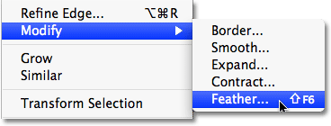
*You'll find various ways to alter selections under the Select menu.*

This brings up Photoshop's Feather Selection dialog box. I'm going to set my **Feather Radius** value to around 30 pixels, which should be large enough to give me a smooth transition area between the white vignette edges and the couple in the center of the photo. The exact value you use for your image will depend on the size of your photo and will probably require some trial and error before you get it exactly right:

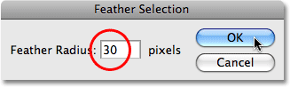
*Feathering a selection softens the selection edges.*

I'll click OK to exit out of the dialog box. Photoshop feathers the selection edges for me, although we won't actually see the effect of the feathering until we do something with the selection, as we're about to do. I'm going to click back on the Layer Visibility icon on "Layer 1" to bring back the solid white fill:

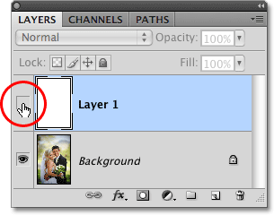
*When a layer is currently hidden, the eyeball inside the Layer Visibility icon is also hidden.*

This fills the document window with white once again, making it easy to see the selection outline we created:

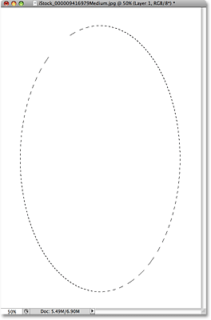
*Turning "Layer 1" back on fills the document window once again with solid white.*

Finally, to complete the vignette effect, I'll simply press **Delete** (Win) / **Backspace** (Mac) on my keyboard to delete the area of white inside the selection outline. To remove the selection outline since I no longer need it, I'll click anywhere inside the document window with the Elliptical Marquee Tool. Notice the soft transition between the white edges and the photo in the center thanks to the feathering we applied:

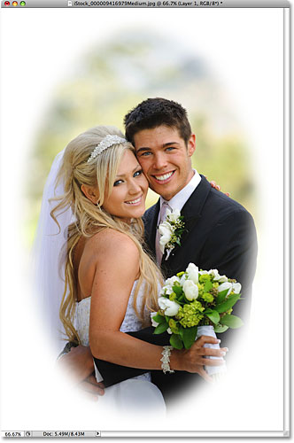
*The Elliptical Marquee Tool made it easy to create this classic photo effect.*

The Elliptical Marquee Tool made drawing the oval selection and creating the vignette effect easy. But what if we need to draw a circular selection? We'll look at that next!

### Drawing Circular Selections

The Elliptical Marquee Tool also allows us to easily draw selections in the shape of a perfect circle. In fact, just as we saw with the Rectangular Marquee Tool when we constrained it to a perfect square, there's two ways to draw a circle with the Elliptical Marquee Tool. One way is by setting some options in the **Options Bar** at the top of the screen.

Here's a photo I have open of the moon. Let's say I want to select the moon so I can add it to a different photo. Since the shape of the moon is circular (at least as it appears to us earthlings in a 2D photo), the Elliptical Marquee Tool is an obvious choice for selecting it:

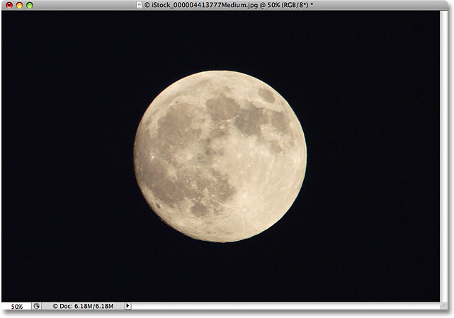
*The Elliptical Marquee Tool is the tool of choice for selecting moons, planets and other round celestial bodies.*

Whenever you have the Elliptical Marquee Tool selected, the Options Bar will display options specifically for this tool, and for the most part, the options are the same as what you'll find with the Rectangular Marquee Tool. One of the options is called **Style**, and by default, it's set to Normal, which allows us to draw any elliptical shape we want. To constrain the shape of the selection to a perfect circle, change the Style option to **Fixed Ratio**. By default, Photoshop will set the **Width** and **Height** values in the Options Bar to **1**, which constrains the width-to-height aspect ratio of the selection to 1:1, creating a perfect circle:

*The options for both the Rectangular and Elliptical Marquee Tools are nearly identical.*

To draw a circular selection around the moon, I'll click and hold my mouse button down somewhere above the top left of the moon to set my starting point, then I'll drag down towards the bottom right until I have the moon selected. As I drag out the selection, it will be constrained to a perfect circle thanks to the options we set in the Options Bar. Unfortunately, I'll run into the same problem here with the selection outline moving further and further away from my starting point as I drag out the selection, so I'll need to hold down my **spacebar** a few times to reposition the selection as I draw it. When I'm done, I'll release my mouse button to complete the selection:

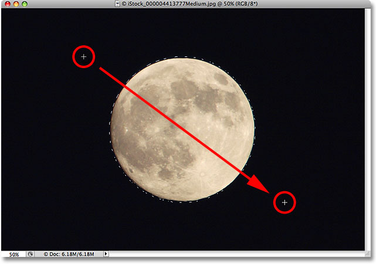
*The spacebar is your friend when trying to select objects with the Elliptical Marquee Tool. Hold it down to reposition selections as you draw them.*

**The Keyboard Shortcut**
While there's technically nothing wrong with changing the settings in the Options Bar to constrain the selection outline to a circle, it can quickly become frustrating because Photoshop does not automatically set the Style option back to Normal when you're done, which means you'll have to remember to always change it back yourself, otherwise you'll still be in Fixed Ratio mode the next time you try to draw an elliptical selection.

A better way to constrain the selection to a circle is to simply hold down your **Shift** key as you're drawing it. Just as adding the Shift key will constrain a rectangular selection to a square when using the Rectangular Marquee Tool, it will force the selection into a perfect circle with the Elliptical Marquee Tool.

Keep in mind, though, that the order in which you do things is important. Click and begin dragging out your selection, then hold down the Shift key to constrain the selection to a circle and continue dragging. When you're done, release your mouse button to complete the selection, then release the Shift key. If you don't follow the correct order, you could get unexpected results.

### Drawing Selections From The Center

You can also draw elliptical selections from the center outward, which is often an easier way to work with the Elliptical Marquee Tool. Simply click in the center of the object or area you need to select, then hold down your **Alt** (Win) / **Option** (Mac) key and continue dragging. As soon as you press and hold the Alt / Option key, the spot you initially clicked on will become the center point of the selection, and as you continue dragging, the selection will extend out in all directions from that point.

Again, the order in which you do things in important. Click and drag to begin the selection, then press and hold Alt / Option to constrain the selection to a circle and continue dragging. When you're done, release your mouse button to complete the selection, then release the Alt / Option key.

You can drag out a circular selection from its center as well. Just add the **Shift** key to the keyboard shortcut. Click and drag to begin the selection, then press and hold **Shift+Alt** (Win) / **Shift+Option** (Mac) to constrain the selection to a circle and force the selection out from its center. Continue dragging out the selection, and when you're done, release your mouse button to complete it, then release your Shift and Alt / Option keys:

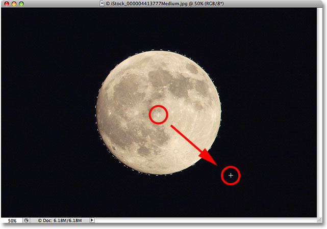
*Use Shift+Alt (Win) / Shift+Option (Mac) to draw a circular selection from its center with the Elliptical Marquee Tool.*

Now that I have the moon selected, I'll open up a second photo, this time of a city at night, and with both images open in separate document windows, I'll select Photoshop's **Move Tool** from the Tools panel:

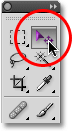
*Selecting the Move Tool.*

With the Move Tool selected, I'll hold down my **Alt** (Win) / **Option** (Mac) key, then I'll click inside the selection and drag the moon into the second image. Holding down the Alt / Option key here tells Photoshop to create a copy of the moon rather than cutting it out of the photo:

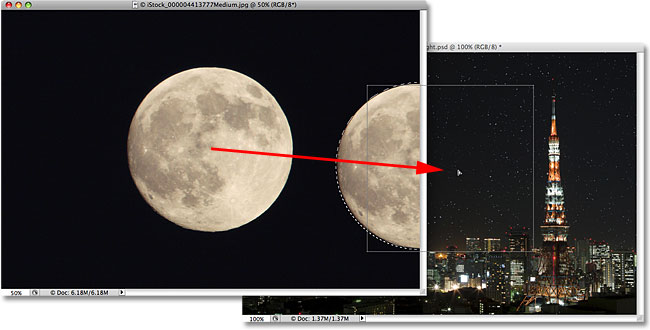
*With the moon selected, I can use the Move Tool to drag it into another photo.*

Since the moon is looking a little too big for the second image, I'll press **Ctrl+T** (Win) / **Command+T** (Mac) to bring up Photoshop's **Free Transform** command to resize it, holding the **Shift** key down as I drag the corner handles inward. This constrain the moon's width-to-height ratio so I don't accidentally distort the shape of it as I'm resizing it:

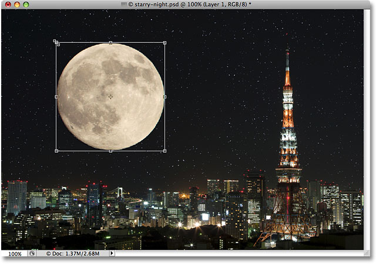
*Dragging the Free Transform handles to resize the moon.*

You can also use the Free Transform command to move objects around inside the document window simply by clicking inside of the Free Transform bounding box and dragging the object to a new location. I think I'll move the moon over to the top right side of the tower. To exit out of the Free Transform command, I'll press **Enter** (Win) / **Return** (Mac) on my keyboard:

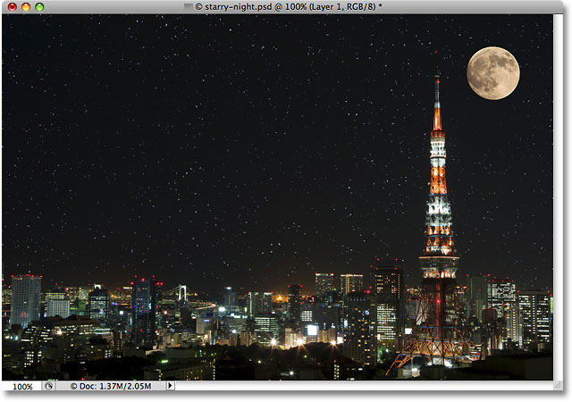
*Adding the moon to the second image was easy once it was selected with the Elliptical Marquee Tool.*

The stars in the night sky were added using our [**Create A Starry Sky In Photoshop**](/photo-effects/starry-sky/) tutorial.

### Removing A Selection

When you're done with a selection that you've created with the Elliptical Marquee Tool and you no longer you need it, there's three ways to remove it. You can go up to the **Select** menu at the top of the screen and choose **Deselect**:

*The Deselect command under the Select menu can be used to remove selections.*

You can also use the faster keyboard shortcut **Ctrl+D** (Win) / **Command+D** (Mac). Or, with the Elliptical Marquee Tool still selected, simply click anywhere inside the document window to remove the selection.

Up next in our [How to make selections in Photoshop](/basics/make-selections-photoshop/ "Learn how to use the Photoshop selection tools") series, we'll continue our journey through Photoshop's many selection tools with one that allows us to draw freehand selections around objects in a photo as if we were outlining them on paper with a pen or pencil - the **[Lasso Tool](/basics/lasso-tool/)**!