# Essential Layers Panel Preferences

> Source: [https://www.photoshopessentials.com/basics/layers/essential-layers-panel-preferences/](https://www.photoshopessentials.com/basics/layers/essential-layers-panel-preferences/)
> Downloaded and converted to Markdown.

In this third tutorial in our Layers Learning Guide, we look at the Layers Panel Options dialog box in Photoshop and the settings that let us customize the look of the Layers panel and keep us working more efficiently.

In this tutorial, we'll take a quick look at a few simple ways you may not be aware of for customizing your Layers panel in Photoshop to keep it free of unwanted clutter and create a cleaner, more efficient workspace. I'll be using [Photoshop CC](https://prf.hn/l/dlXjD2w) here, but these tips will work with any recent version of Photoshop.

This tutorial is Part 3 of our [Photoshop Layers Learning Guide](/photoshop-layers-learning-guide/).

Let's get started!

Here's the image I currently have open on my screen ([woman with flower wreath photo](http://www.shutterstock.com/pic.mhtml?id=126006677) from Shutterstock):

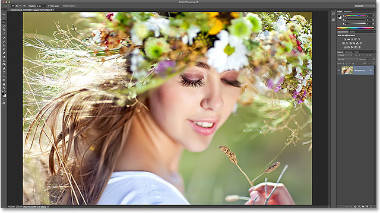
*An image open in Photoshop CC.*

### Changing The Preview Thumbnail Size

If we look in my [Layers panel](/basics/layers/layers-panel/), we see the image sitting on the [Background layer](/basics/layers/background-layer/). We know it's on the Background layer because Photoshop provides us with a **preview thumbnail** of the layer's contents:

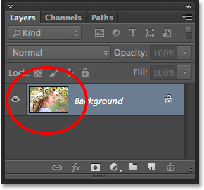
*The preview thumbnail in the Layers panel.*

We can change the size of the preview thumbnail depending on what's more important to us. Larger thumbnails make it easier for us to see the contents of each layer, while smaller thumbnails keep the Layers panel clean and tidy. One way to change the thumbnail size is from the Layers panel menu. Click on the small **menu icon** in the top right corner of the Layers panel:

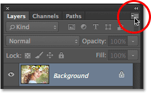
*Clicking the menu icon.*

Then choose **Panel Options** from the menu that appears:

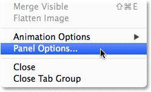
*Selecting Panel Options.*

This opens the Layers Panel Options dialog box, and at the very top of the panel are the **Thumbnail Size** choices. We can choose **Small**, **Medium** or **Large** size, represented by the three different size images, or **None** if you don't want to see the preview thumbnail at all. Personally, I like to see a nice big preview of my layer contents, so I'll choose the Large option by selecting the larger of the three images:

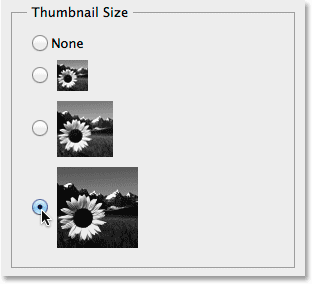
*Choosing the Large thumbnail size.*

I'll click OK to close out of the Layers Panel Options dialog box, and now my Layers panel is showing the largest preview thumbnail size possible:

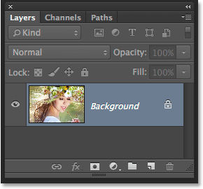
*Larger thumbnails make it easier to see the layer contents, but do take up more room.*

Another way to change the thumbnail size is to simply **right-click** (Win) / **Control-click** (Mac) anywhere in the empty space below the bottom layer in the Layers panel, then choose either **Small**, **Medium**, **Large**, or **No Thumbnails** from the top of the menu that appears. Note, though, that while this method is faster, depending on how many Layers you currently have in your Layers panel, there may not be any empty space below the bottom layer. In that case, you'll need to use the first method we looked at (selecting Panel Options from the main Layers panel menu) to change your thumbnail size:

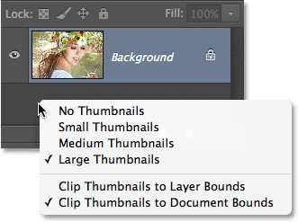
*Right-clicking (Win) / Control-clicking (Mac) below the Background layer to change thumbnail size.*

### Turning Off Default Layer Masks

While larger preview thumbnails can make it easier for us to see the contents of our layers, **layer mask thumbnails** can often clutter up our Layers panel for no good reason, especially when it comes to Photoshop's **Fill and Adjustment layers**. By default, every time we add a new Fill or Adjustment layer to a document, Photoshop includes a [layer mask](/basics/layers/layer-masks/) with it in case we need to target only a specific area of the image. For example, we may add a Levels or Curves adjustment layer specifically to [brighten someone's eyes](/photo-editing/lighten-eyes/) or [whiten their teeth](/photo-editing/whiten-teeth/), and in that case, we'd need the layer mask to target only the areas that need to be affected.

Other times, though, maybe more often than not, we want the Fill or Adjustment layer to apply to the entire image as a whole, which means the layer mask isn't needed and its thumbnail in the Layers panel is just taking up space. Here, I've added a Levels adjustment layer to my document to adjust the overall brightness and contrast of the image. I don't need a layer mask for my adjustment layer in this case, but Photoshop added one anyway, and it's already making my Layers panel look cluttered and messy. I can't even see the name of my adjustment layer thanks to the mask thumbnail blocking it from view:

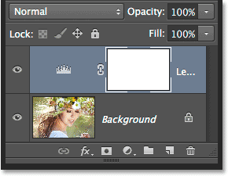
*Layer preview thumbnails serve a purpose, but mask thumbnails? Not always.*

Many Photoshop users prefer to turn off the default layer mask for both Fill and Adjustment layers and simply add a layer mask manually when it's needed. If you're wondering what the difference is between a *Fill* and an *Adjustment* layer, if we click on the **New Fill or Adjustment Layer** icon at the bottom of the Layers panel:

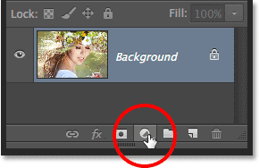
*Clicking the New Fill or Adjustment Layer icon.*

The Fill layers are the first three at the top of the list - **Solid Color**, **Gradient** and **Pattern**. Everything below these three is an Adjustment layer:

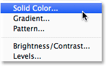
*The Solid Color, Gradient and Pattern Fill layers.*

To turn off the default layer mask for the three Fill layers, click once again on the **menu icon** in the top right corner of the Layers panel and choose **Panel Options** from the list, just as we did earlier. Then, down near the bottom of the Layers Panel Options dialog box, uncheck the option that says **Use Default Masks on Fill Layers**:

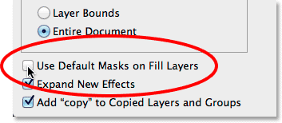
*Unchecking "Use Default Masks on Fill Layers".*

To turn off the default mask for the Adjustment layers, we actually have to switch from the Layers panel over to the **Adjustments panel**. Click on the **menu icon** in the top right corner of the Adjustments panel:

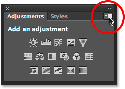
*Clicking the Adjustments panel menu icon.*

Then, in the menu that appears, you'll see an option that says **Add Mask by Default**. The checkmark beside its name tells us the option is currently enabled. Click on the option to disable it:

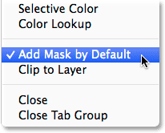
*Selecting the "Add Mask by Default" option to turn it off.*

And now, the next time we add either a Fill or Adjustment layer, it will appear without a layer mask, and more importantly, without that unwanted mask thumbnail taking up space in the Layers panel:

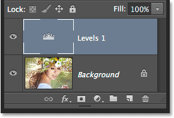
*Adding another Levels adjustment layer, this time without the default mask.*

We can easily add a layer mask to a Fill or Adjustment layer manually when we need one simply by clicking the **Add Layer Mask** icon at the bottom of the Layers panel:

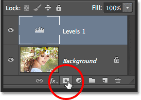
*Adding a layer mask manually to the Levels adjustment layer.*

We'll still be back to having a layer mask thumbnail taking up space, but this time, it'll be there because we need it:

*The mask thumbnail is back, but by our own choice, not Photoshop's.*

### Turning Off The "copy" In Copied Layers

One final preference we can set for the Layers panel to help keep it clutter-free is to tell Photoshop not to add the word "copy" to the names of our copied layers. By default, whenever we copy a layer, Photoshop adds "copy" to the end of its name. It gets worse when we start making copies of our copied layers, as we end up with highly informative layer names like "Layer 1 copy 2", "Layer 1 copy 3", and so on:

*Does seeing the word "copy" so many times really tell us anything useful? Probably not.*

To turn off this default behavior, once again click on the Layers panel **menu icon** and choose **Panel Options** from the menu. Then, down near the bottom of the Panel Options dialog box, uncheck the option that says **Add "copy" to Copied Layers and Groups**:

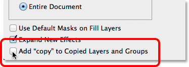
*Unchecking 'Add "copy" to Copied Layers and Groups*

With this option disabled, the next time you make copies of a layer (or a layer group), the word "copy" will not be added to the names:

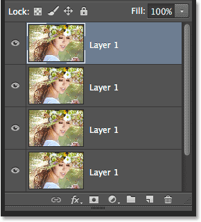
*Renaming layers is still a good idea, but at least the Layers panel now looks cleaner.*

### Where to go from here...

And there we have it! In the next lesson, we'll learn all about a special type of layer in Photoshop, the [Background layer](/basics/background-layer-photoshop-cc/). We'll learn why the Background layer is different from other layers, the limitations we need to be aware of, and the easy way to get around them!

You can jump to any of the other lessons in this [Photoshop Layers series](/photoshop-layers-learning-guide/). Or visit our [Photoshop Basics](/basics/) section for more topics!