# Essential Photoshop Preferences For Beginners

> Source: [https://www.photoshopessentials.com/basics/essential-photoshop-preferences-beginners/](https://www.photoshopessentials.com/basics/essential-photoshop-preferences-beginners/)
> Downloaded and converted to Markdown.

Learn how to improve Photoshop's performance, customize the interface, save backups of your work, and more with the important options you need to know about in the Photoshop Preferences! Covers both Photoshop CC and CS6.

In this tutorial, we'll look at some essential Preferences in Photoshop that every beginner should know about. The Preferences are where we find all sorts of options that control Photoshop's appearance, behavior and performance. There are more options in the Photoshop Preferences than we could possibly cover in one tutorial, but that's okay because most of the default settings are fine. Here, we're just going to look the options that are worthy of your attention right when you first start learning Photoshop. Some of the options allow you to customize Photoshop's interface. Others will speed up your workflow. And some help to keep Photoshop and your computer running smoothly. There are other important Preferences as well, but we'll save them for future lessons when it makes more sense to talk about them.

I'll be using Photoshop CC but this tutorial is also compatible with Photoshop CS6. All but one of the Preferences we'll look at are available in both versions. As we'll learn, Photoshop's Preferences are divided into categories. In some cases, an option will be located in a different category depending on which version of Photoshop you're using. I'll point out these differences as we go along.

This is lesson 7 of 8 in [Chapter 1 - Getting Started with Photoshop](/basics/getting-started-photoshop/).

Let's get started!

## How To Access The Photoshop Preferences

As I mentioned, Photoshop's Preferences are divided into various categories. Let's start with the General category. To access the Preferences, on a Windows PC, go up to the **Edit** menu in the Menu Bar along the top of the screen. From there, choose **Preferences** down near the bottom of the list, and then **General**. On a Mac (which is what I'm using here), go up to the **Photoshop** menu in the Menu Bar. Choose **Preferences**, and then choose **General**:

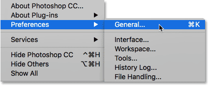

*Go to Edit (Win) / Photoshop (Mac) > Preferences > General.*

### The Preferences Dialog Box

This opens the Photoshop Preferences dialog box. The categories we can choose from are listed in the column along the left. Options for the currently-selected category appear in the main area in the center. At the moment, the **General** category is selected. Note that in Photoshop CC, Adobe added several new categories to the Preferences, like Workspace, Tools and History Log. While the categories themselves are only available in Photoshop CC, most of the options within these new categories can be found in other categories in CS6:

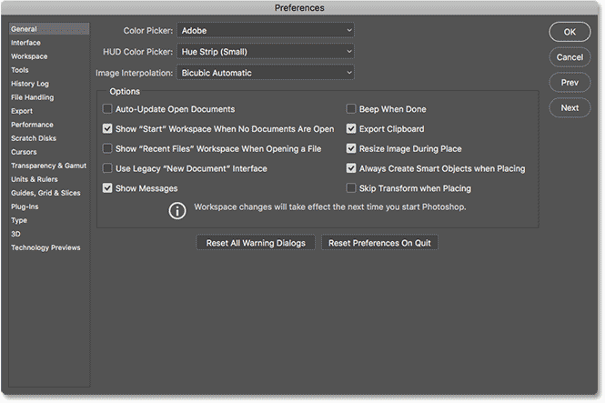

*The Preferences dialog box in Photoshop CC.*

## The General Preferences

### Export Clipboard

The first option we'll look at, found in the General preferences, is **Export Clipboard**. This option can affect the overall performance of your computer. When we copy and paste images or layers in Photoshop, the copied items are placed into Photoshop's clipboard. The *clipboard* is the part of your computer's memory (its RAM) that's set aside for Photoshop to use. Your computer's operating system also has its own clipboard (its own section of memory).

When "Export Clipboard" is enabled, any items stored in Photoshop's clipboard are also exported to your operating system's clipboard. This allows you to then paste the copied items into a different app, like Adobe Illustrator or InDesign. But Photoshop's file sizes can be *huge*. Exporting huge files into your operating system's memory can cause errors and performance problems.

By default, "Export Clipboard" is enabled (checked). To help keep your computer running smoothly, disable (uncheck) this option. If you do need to move files from Photoshop into another app, it's better to just save the file in Photoshop. Then, open the saved file in the other program:

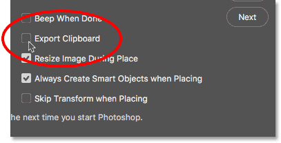

*Disable "Export Clipboard" to improve performance.*

## Interface Preferences

Next, let's look at a few options that let us customize Photoshop's interface. Click on the **Interface** category on the left:

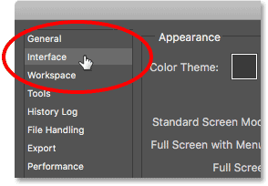

*Switching from General to the Interface category.*

### Color Theme

The first option we'll look at is **Color Theme**. This option controls the overall color of Photoshop's interface. In this case, "color" just means different shades of gray. Adobe gives us four different color themes to choose from. Each theme is represented by a swatch. The default color theme is the second swatch from the left:

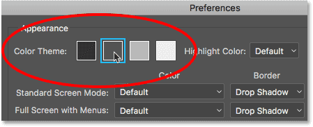

*The Color Theme swatches.*

Adobe began using this darker theme in Photoshop CS6. Photoshop CC also uses this darker theme by default. Prior to CS6, the interface was much lighter (photo from [Adobe Stock](https://prf.hn/l/5Njb1xo)):

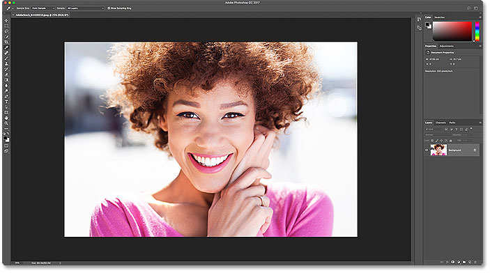

*The default color theme in Photoshop CC (and CS6). Photo credit: Adobe Stock.*

To choose a different color theme, click on its swatch. There's one theme that's darker than the default and two that are lighter. I'll choose the lightest of the four themes. Notice that the theme also controls the color of Photoshop's dialog boxes:

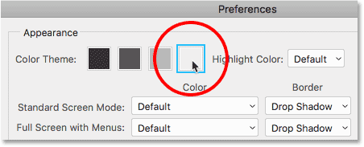

*Choosing the lightest color theme.*

And here we see that Photoshop's interface is now much lighter. Adobe's idea behind the darker theme was that it's less intrusive, allowing us to focus more easily on our images. Personally, I agree, which is why I stick with the default theme. But some people prefer the lighter interface. Choose the theme you're most comfortable with. You can change Photoshop's color theme in the Preferences at any time:

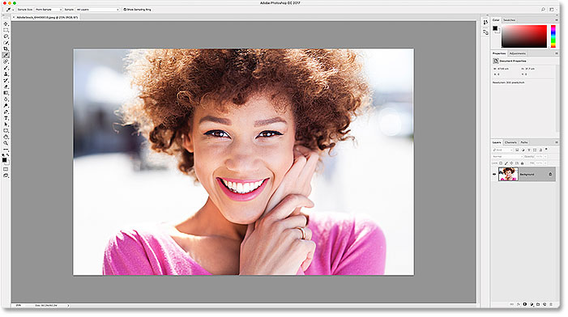

*The lightest of the four interface color themes.*

### Highlight Color (Photoshop CC)

In Photoshop CC, Adobe added a new **Highlight Color** option to the Interface preferences. This option is not available in CS6. "Highlight Color" refers to the color Photoshop uses to highlight the currently-selected layer in the Layers panel:

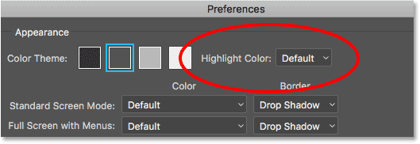

*The Highlight Color option in the Interface preferences.*

By default, the highlight color is a shade of gray which matches the overall color theme. Here, we see Photoshop's [Layers panel](/basics/layers/essential-layers-panel-preferences/) with the [Background layer](/basics/background-layer-photoshop-cc/) highlighted in the default gray. We'll be learning all about layers in our [Photoshop Layers](/photoshop-layers-learning-guide/) section:

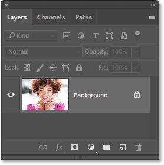

*The Layers panel showing the gray highlight color.*

The other highlight color we can choose is blue:

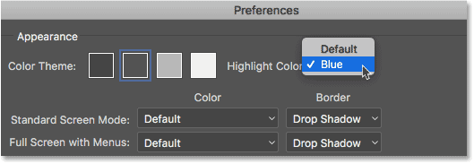

*Changing the highlight color to blue.*

And now, we see that my Background layer is highlighted in blue. I prefer the default gray because again, it's less intrusive. Like the color theme, you can change the highlight color, along with any of Photoshop's Preferences, at any time:

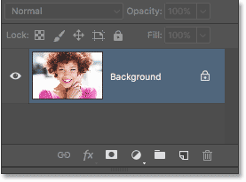

*The Layers panel after changing the highlight color to blue.*

### UI Font Size

Another option worth looking at in the Interface preferences is **UI Font Size**. This option is available in both CC and CS6. "UI Font Size" controls the size of the text in Photoshop's interface ("UI" stands for "User Interface"). Adobe sets the default font size to **Small**:

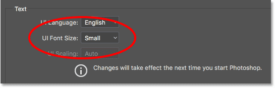

*The UI Font Size option.*

If you have trouble reading small print, you can increase the size. To make the text bigger, choose either **Medium** or **Large**. There's also a **Tiny** option if you hate your eyes and want them to suffer. Personally, I set "UI Font Size" to Large to help minimize eye strain during long hours at the computer:

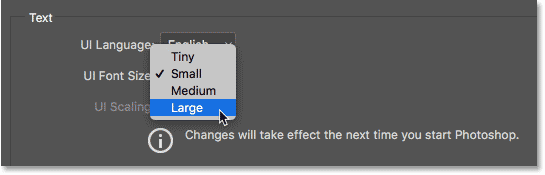

*Changing the UI Font Size from Small to Large.*

You'll need to close and restart Photoshop for the change to take effect. For comparison, let's look again at my Layers panel. On the left, we see the Layers panel using the default text size (Small). On the right is the same panel after changing the size to Large (and restarting Photoshop):

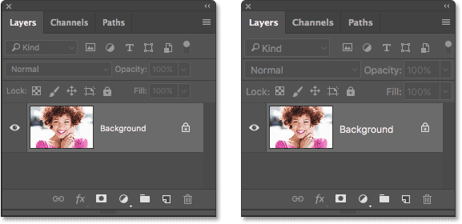

*The default UI font size (left) and the Large size (right).*

## Tools Preferences (Photoshop CC)

Next, if you're using Photoshop CC, click on the **Tools** category on the left to open Photoshop's tool-related preferences. The Tools category is new in Photoshop CC. CS6 users should remain in the Interface category for now:

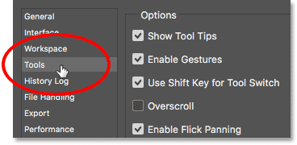

*Switching from Interface to the Tools category (in Photoshop CC).*

### Show Tool Tips

The first option to look at in the Tools preferences is **Show Tool Tips** (in CS6, "Show Tool Tips" is found in the Interface category). A "Tool Tip" is a helpful message that pops up when you hover your mouse cursor over a tool or option in Photoshop. Tool Tips offer a short description of what the tool or option is used for:

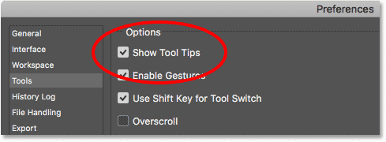

*The "Show Tool Tips" option.*

For example, if you hover your mouse cursor over the "Show Tool Tips" option, a Tool Tip will appear in yellow explaining that this option determines whether or not to show Tool Tips:

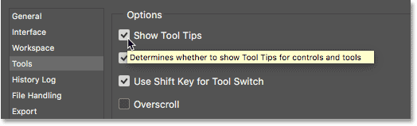

*Tool Tips are great for learning about different options in Photoshop.*

And here, we see that when I hover my cursor over a tool icon in Photoshop's **Toolbar**, a Tool Tip lets me know which tool I'm selecting:

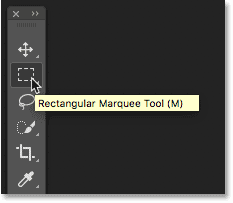

*Tool Tips make it easier to learn the tools in the Toolbar.*

Tool Tips are enabled by default. If you're new to Photoshop, they're a great way to help you learn. But once you know your way around Photoshop, Tool Tips can start getting in the way. When you feel you no longer need them, simply uncheck "Show Tool Tips" in the Preferences.

### Use Shift Key for Tool Switch

Another option in the Tools category in Photoshop CC is **Use Shift Key for Tool Switch**. In Photoshop CS6, you'll find it in the General preferences. This option affects how we select Photoshop's tools when using keyboard shortcuts. By default, "Use Shift Key for Tool Switch" is enabled (checked):

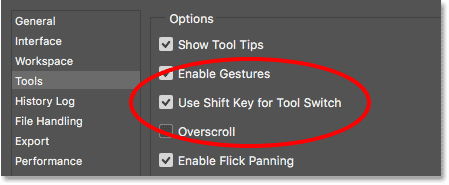

*The "Use Shift Key for Tool Switch" option.*

Photoshop's tools are all found in the [Toolbar](/basics/the-new-customizable-toolbar-in-photoshop-cc-2015/) along the left of the interface. Adobe groups related tools together to save space. If I click and hold on the [Lasso Tool](/basics/selections/lasso-tool/), for example, a fly-out menu appears showing me that the [Polygonal Lasso Tool](/basics/selections/polygonal-lasso-tool/) and the [Magnetic Lasso Tool](/basics/selections/magnetic-lasso-tool/) are also available in that same spot. Notice that all three tools share the same keyboard shortcut (the letter "L"):

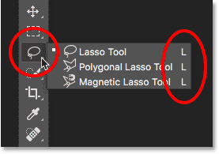

*Some tools, like the lasso tools, share the same keyboard shortcut.*

With "Use Shift Key for Tool Switch" enabled, pressing "L" on your keyboard will select the Lasso Tool. But no matter how many times you press "L", you will *only* select the Lasso Tool. To cycle through to the Polygonal or Magnetic Lasso Tool, you need to press and hold your **Shift key** and press "L". This is true for any tools in the Toolbar that share the same keyboard shortcut. To save time and avoid needing to press and hold your Shift key, uncheck the "Use Shift Key for Tool Switch" option. With the option turned off, you can cycle through all tools that share the same keyboard shortcut just by pressing the letter itself.

## File Handling Preferences

Next, let's move on to the File Handling preferences. Choose the **File Handling** category on the left:

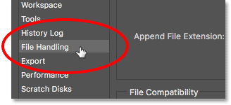

*Opening the File Handling preferences.*

### Auto Save

The first option we'll look at here is **Auto Save**. Auto Save was first introduced to Photoshop in CS6. This option tells Photoshop to automatically save a backup copy of your work at regular intervals. I can say from experience that Auto Save has saved my you-know-what on several occasions, especially on my aging laptop.

By default, Auto Save is set to back up your work every 10 minutes. That's usually fine. But depending on how quickly you work, and the reliability of your computer, you may want to shorten the interval from 10 minutes to 5 minutes instead. You can also choose a longer interval if the backups are causing performance issues, but doing so increases the risk of losing your work:

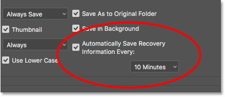

*By default, Auto Save will save a backup every 10 minutes.*

### Recent File List Contains

Another important option in the File Handling preferences is **Recent File List Contains**. This option determines how many of your previously-opened files Photoshop will keep track of. In Photoshop CC, your recent files appear as thumbnails on the [Start screen](/basics/open-images-photoshop-cc/) each time you launch Photoshop. In CS6, you can access your recent files by going up to the **File** menu in the Menu Bar and choosing **Open Recent** (this also works in Photoshop CC).

By default, Photoshop will keep track the last 20 files you worked on. You can increase the value all the way to 100. Or, if you don't want anyone to know what you've been working on, set the value to 0 to disable this option:

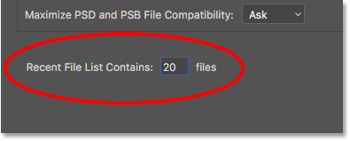

*The "Recent File List Contains" option.*

## Performance Preferences

Next, let's look at some settings that have to do with Photoshop's performance. Choose the **Performance** category on the left:

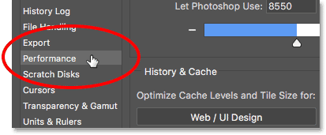

*Opening the Performance preferences.*

### Memory Usage

The **Memory Usage** option in the Performance category controls how much of your computer's memory is reserved for Photoshop. Photoshop loves memory and will generally run better the more memory it gets. By default, Adobe reserves 70% of your computer's memory for Photoshop. If Photoshop is struggling when you're working on large files, try increasing the memory usage value.

You can increase memory usage all the way to 100%. Keep in mind, though, that if you have other apps open as well, they each require memory. Whenever possible, close all other apps when you're working in Photoshop. If you do need other apps to be open, try not to increase the memory usage value much beyond 90%. Lower it if you run into problems. You'll need to restart Photoshop for the change to take effect:

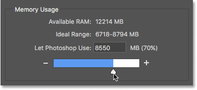

*The "Memory Usage" option.*

### History States

Another option that can directly impact Photoshop's performance is **History States**. "History States" refers to the number of steps that Photoshop keeps track of as we work. The more steps it remembers, the more steps we can undo to get back to an earlier state. History states are stored in memory, so too many states can slow Photoshop down.

In Photoshop CS6, the default number of history states was 20. Back then, I recommended increasing the value to 30. In Photoshop CC, Adobe has increased the default value all the way to 50. I wouldn't recommend increasing it much beyond 50 unless you really need that many undo's. If you run into performance problems, try lowering the value. Again, you'll need to restart Photoshop for the change to take effect:

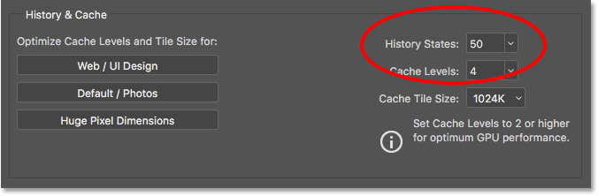

*The "History States" option.*

## Scratch Disks Preferences (Photoshop CC)

There's one more performance option to look at. In Photoshop CC, choose the **Scratch Disks** category on the left. In Photoshop CS6, stay in the Performance category:

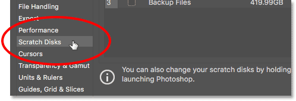

*Choosing the "Scratch Disks" category in Photoshop CC.*

### Scratch Disks

A *scratch disk* is a section of your computer's hard drive that Photoshop uses as additional memory if it runs out of system memory. As long as your computer has enough memory, Photoshop won't need to use the scratch disk. If it *does* need the scratch disk, it will use whatever hard drive(s) you've selected in the Scratch Disks option.

The main hard drive in your computer is known as the *Startup* disk. This may be the only hard drive you have. If that's the case, it will be selected by default and there's really nothing more you need to do. But if you have two or more hard drives, choose a drive that is *not* your Startup disk. Your operating system uses your Startup disk a lot, so you'll get better performance from Photoshop by choosing a different drive. Also, if you happen to know the speed of your hard drives, again you'll get better performance by choosing the fastest drive.

#### Use SSD's For Best Performance

Lastly, if one of the hard drives in your computer is an **SSD** (Solid State Drive), choose the SSD as your scratch disk. SSD's are much faster than traditional hard drives and can greatly improve performance. Even if your SSD is also your Startup disk, it's still the best choice. In my case, my Startup disk is an SSD drive so I've selected it as my primary scratch disk. I also have a fast secondary drive as a backup scratch disk. However, as I mentioned, Photoshop will only use your scratch disk if it runs out of system memory. If Photoshop is routinely running out of system memory, adding additional memory (RAM) to your computer will give you the best results:

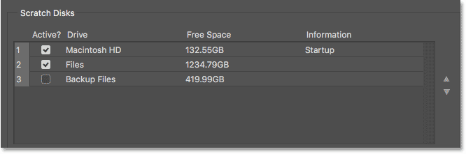

*Select the drive(s) you want Photoshop to use if it runs out of system memory.*

## Closing The Preferences Dialog Box

To accept your changes, click **OK** to close the Preferences dialog box. Remember that some of the changes you've made will only take effect after you restart Photoshop:

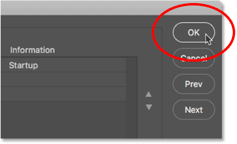

*Click OK to close the Preferences dialog box.*