# Faking A Layer Mask In Photoshop Elements

> Source: [https://www.photoshopessentials.com/basics/elements/fake-layer-mask/](https://www.photoshopessentials.com/basics/elements/fake-layer-mask/)
> Downloaded and converted to Markdown.

By far, the most commonly asked question we receive here at Photoshop Essentials.com goes a little something like this:

"Hi, I'm trying to work through one of your tutorials but it's telling me to click on the *layer mask* icon in the Layers palette and, well, I don't see it! I'm using *Photoshop Elements*. How do I add a layer mask in Elements?"

In a perfect world, Photoshop Elements would come bundled with every new consumer-level digital camera. It is, without a doubt, the best deal going in photo editing, and it's what I like to call "Photoshop for normal people". You get everything the average person would need to do extraordinary things with their digital photos at a fraction of the cost of the full-blown, professional version of Photoshop!

Of course, the smaller price tag does come with its own cost. Many of the more professional-level features of Photoshop are not included in Photoshop Elements, and unfortunately, the layer mask feature is one of them. The official answer from Adobe on "how do I add a layer mask in Elements?" is "You can't. Layer masks are not included as part of Photoshop Elements". But with you and me being as clever as we are, we're not going to let a little old "official answer" stop us!

The truth is, Photoshop Elements *does* support layer masks, but only with *adjustment layers*. An adjustment layer always comes with its own built-in layer mask, which is one of the reasons why they're so useful. Well, what if we could "borrow" a layer mask from an adjustment layer somehow, or maybe "share" its layer mask with a normal layer? It sounds crazy, I know, but is there some way to do that?

Why yes, there is!

Would that work though?

Yep, it sure would!

Let's see how to do it. We're going to look at a simple example of how to blend two photos together in Photoshop Elements, just to see how easy it is to share an adjustment layer's mask with a normal layer. I'll be using Photoshop Elements 5 for this tutorial.

Before we begin, I should point out that we're not going to be covering the details of how layer masks work. If you need to know more about them, be sure to read through our [Understanding Layer Masks](/basics/layers/layer-masks/) tutorial in the [Photoshop Basics](/basics/) section of the website.

### Step 1: Open Two Images That You Want To Blend Together

In order to blend a couple of photos together in Photoshop Elements, we first need to open them, so go ahead and open the photos you want to use. Here's my first one:

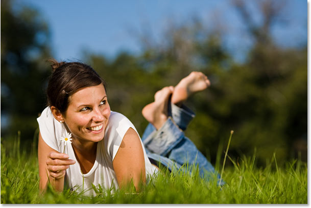

*The first photo.*

And here's the photo I'm going to blend it with:

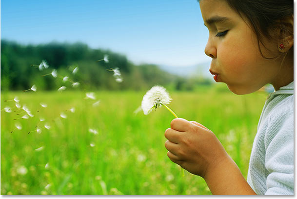

*The second photo.*

Make sure you have *Maximize Mode* turned off so that both images are appearing in a document window. To turn it off, go up to the *Window* menu at the top of the screen, choose *Images*, and then make sure that *Maximize Mode* doesn't have a checkmark beside it. If it does, click on the option to turn it off. Both images should now be appearing in their own document window.

### Step 2: Drag One Image Into The Document Window Of The Other Image

To blend our two photos together, we need to get them both into the same document, and the easiest way to do that is to simply drag one image into the document window of the other image. To do that, select the *Move Tool* from the top of the Tools palette:

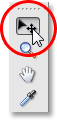

*Selecting the Move Tool in the Tools palette.*

You can also press *V* on your keyboard to select the Move Tool with the keyboard shortcut. Then click anywhere inside one of the photos and drag it into the other photo:

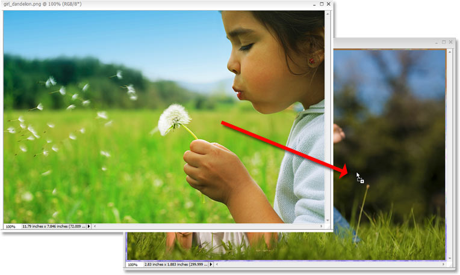

*With the Move Tool selected, click anywhere inside one image and drag it into the document window of the other image.*

Before you release your mouse button, hold down your *Shift* key and *then* release the mouse button. This will center the image inside the document window. If I look in my Layers palette again, I can see that both photos are now in the same document, with one photo on the bottom Background layer, and the other one above it on "Layer 1":

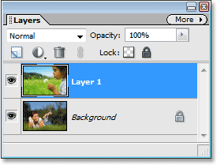

*Both images are now inside the same document, and each one is on its own separate layer.*

### Step 3: Add An Adjustment Layer Between The Two Layers

As I mentioned at the beginning of the tutorial, Photoshop Elements supports layer masks only with adjustment layers. So, since we need a layer mask, let's add an adjustment layer! Photoshop Elements gives us several different types of adjustment layers to choose from, but it doesn't really matter which one we choose here since we're not actually going to do anything with it. We only need one for its layer mask, and we need to add it between our two existing layers, so first click on the Background layer in the Layers palette to select it. It will turn blue, letting us know that it's selected:

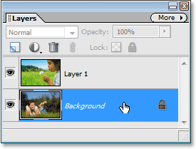

*Click on the Background layer to select it in the Layers palette.*

Then click on the *New Adjustment Layer* icon at the top of the Layers palette and choose a *Levels* adjustment layer from the list. As I said, it makes no difference which type of adjustment layer you choose since we won't be doing anything with it, but for the sake of keeping us both on the same page, choose Levels:

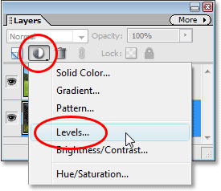

*Click on the "New Adjustment Layer" icon and choose "Levels" from the list.*

When the Levels dialog box appears, just click OK in the top right corner to exit out of it:

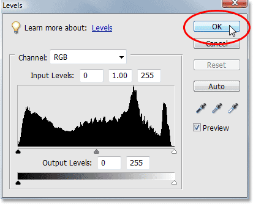

*Click OK to exit out of the Levels dialog box without making any changes.*

If we look again in the Layers palette, we can see that we now have our Levels adjustment layer (or whichever adjustment layer you chose) between the two layers containing our photos, and we can see the *layer mask thumbnail* for the adjustment layer (circled in red), which we're going to use to blend our two photos together:

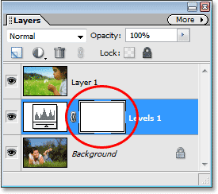

*The Layers palette showing the new Levels adjustment layer along with its layer mask.*

### Step 4: Group "Layer 1" With The Adjustment Layer

We have our layer mask. So far, so good. Problem is, the layer mask is on the adjustment layer, and what we need is for it to be on "Layer 1" so we can use it to blend the photo on "Layer 1" with the photo on the Background layer. There's no way for us to add a layer mask to anything other than an adjustment layer in Photoshop Elements, so we need some way of sharing that layer mask on the adjustment layer with "Layer 1" above it.

Fortunately, not only are adjustment layers incredibly useful, but it's a little-known fact that they also happen to be pretty easy going, and they have no problem at all with the idea of sharing their layer mask with any other layer that needs it! All we need to do is *group* the adjustment layer and "Layer 1" together! First, click on "Layer 1" in the Layers palette to select it:

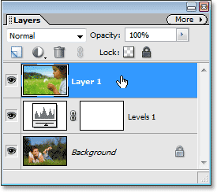

*Select "Layer 1" in the Layers palette.*

Then go up to the *Layer* menu at the top of the screen and choose *Group with Previous*, or use the keyboard shortcut *Ctrl+G*:

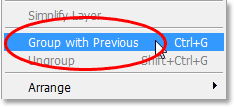

*Selecting "Group with Previous" from the "Layer" menu.*

Either way will group "Layer 1" with the adjustment layer below it. Nothing will seem to have happened in the document window, but if we look in the Layers palette, we can see that "Layer 1" is now indented to the right, with a small arrow pointing down at the adjustment layer, letting us know that it is now grouped with the adjustment layer below it:

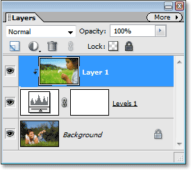

*The Layers palette showing "Layer 1" now grouped with the adjustment layer below it.*

At this point, with the two layers now grouped together, anything we do to the layer mask on the adjustment layer is going to affect "Layer 1" in exactly the same way as if the mask was actually on "Layer 1". We've now effectively added a layer mask to a normal layer in Photoshop Elements, and we can now use the layer mask to blend the two photos together!

### Step 5: Select The Layer Mask

We need to have our layer mask selected, so click on the layer mask thumbnail in the Layers palette to select it. You'll know that the layer mask is selected because its thumbnail will have a white highlight border around it:

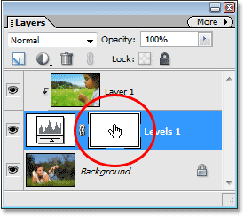

*Click on the layer mask thumbnail in the Layers palette to select the layer mask.*

### Step 6: Select The Gradient Tool

Select the *Gradient Tool* from the Tools palette, or simply press *G* on your keyboard to quickly select it:

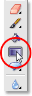

*Selecting the Gradient Tool from the Tools palette.*

### Step 7: Choose The Black To White Gradient

*Right-click* anywhere inside the document window to bring up the *Gradient Picker*, then choose the *Black to White* gradient, third one from the left, top row:

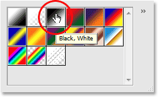

*Select the black to white gradient from the Gradient Picker.*

### Step 8: Drag Out A Gradient On The Layer Mask

With the Gradient Tool and the black to white gradient selected, click inside your image and drag out a gradient where you want the transition area between the two photos to appear. Remember that you're not actually dragging the gradient on the photo itself, you're dragging it out on the layer mask. The longer the gradient, the larger the transition area between the two photos will be. I want a fairly quick transition between my two images, with the photo on "Layer 1" appearing on the right and then blending into the other photo on the left. I also want my blend to appear diagonally to give the final effect a bit more interest, so I'm going to drag out a small, diagonal gradient somewhere in the center of my image:

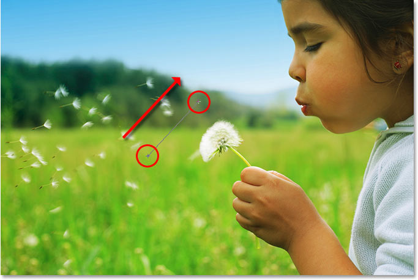

*Dragging a short, diagonal gradient to define the area where the two photos will blend together.*

When you release your mouse button, Photoshop Elements will draw the gradient on the layer mask. If we look at the layer mask thumbnail in the Layers palette, we can see the black to white gradient that was drawn:

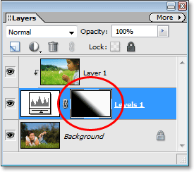

*The layer mask thumbnail in the Layers palette showing the gradient that was drawn.*

The area filled with white in the top right of the layer mask thumbnail is the area where the photo on "Layer 1" will appear, and the area filled with black in the bottom left is the area where the photo on the Background layer will appear. The narrow gradient area in between is the area where the two photos will now blend together, and if we look at the image itself in the document window, we can see that the two photos have in fact been blended together nicely thanks to the layer mask on the adjustment layer:

*The two photos are now blending together thanks to the layer mask on the adjustment layer.*

As we've now seen, even though Photoshop Elements doesn't officially support layer masks, at least not to the full extent of the professional version of Photoshop, it does allow us to use layer masks with adjustment layers. All we need to do then is add any adjustment layer below the layer we would normally want to add the layer mask to and group the two layers together! It's a couple of extra steps, but it works!