# Feather Selections In Photoshop With Quick Mask

> Source: [https://www.photoshopessentials.com/basics/selections/feather-quick-mask/](https://www.photoshopessentials.com/basics/selections/feather-quick-mask/)
> Downloaded and converted to Markdown.

In this tutorial in our series on [making selections in Photoshop](/basics/make-selections-photoshop/), we'll look at a great way to **feather**, or soften, selection outlines using Photoshop's **Quick Mask** mode!

Photoshop refers to softening the edges of a selection as "feathering" the selection, and there are plenty of times when we need to feather our selection edges since not everything we need to select has edges that are sharp and clearly defined. We may be trying to select an object that's slightly out of focus in an image, causing its edges to appear soft and blurred, or we may be creating a vignette effect where our selection needs to transition smoothly and gradually into the surrounding background color.

Many Photoshop users head straight to the **Feather** command under the Select menu in the Menu Bar (Select > Modify > Feather) when they need to soften a selection, but the Feather command has a serious drawback in that it gives us no way to preview what we're doing. As we'll learn in this tutorial, there's a much better way to feather selections, one that isn't quite as obvious as the Feather command but is every bit as simple to use and has the added advantage of giving us a live preview of the result!

I want to apply a vignette effect to this photo of a young couple:

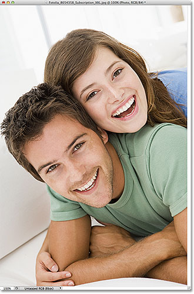
*The original image.*

If we look in my [Layers panel](/basics/layers/layers-panel/), we see that my photo is sitting on a layer that I've creatively named "Photo", and the photo layer is sitting above a white-filled "Background color" layer which will serve as the background for my vignette effect. The photo layer is selected and active:

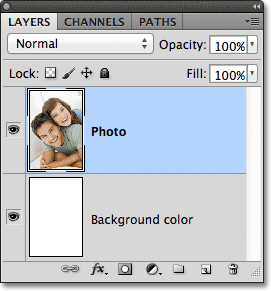
*The Layers panel showing the photo sitting above a white-filled background.*

I'll grab my [Elliptical Marquee Tool](/basics/selections/elliptical-marquee-tool/) from the Tools panel by clicking and holding my mouse button down on the [Rectangular Marquee Tool](/basics/selections/rectangular-marquee-tool/), then selecting the Elliptical Marquee Tool from the fly-out menu that appears:

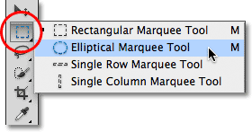
*Selecting the Elliptical Marquee Tool.*

With the Elliptical Marquee Tool in hand, I'll drag out an elliptical selection outline around the area in the center of the photo that I want to keep:

*An elliptical selection outline has been drawn around the couple in the center of the photo.*

The Elliptical Marquee Tool, as with most of Photoshop's selection tools, draws hard edge selections, so to create my vignette effect, I'll need to soften the edges quite a bit. Before we look at the better way to soften the edges, let's take a quick look at Photoshop's Feather command. I'll select the Feather command by going up to the **Select** menu in the Menu Bar along the top of the screen, then from there I'll choose **Modify**, and then **Feather**:

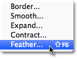
*Going to Select > Modify > Feather.*

This opens the **Feather Selection** dialog box where we can enter a **Feather Radius** value, in pixels, to specify the amount of feathering we want to apply to the selection edges. Problem is, how we know what value to enter? In my case, what's the exact feathering value I need here to create an ideal transition between the selection and the white background behind it? The correct answer is, I have no idea. All I can do is guess at a value. Since the Feather Selection dialog box gives me no other choice, I'll play along and enter a value of 30 pixels, which is nothing more than a guess:

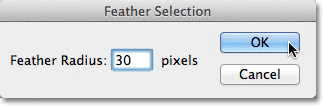
*The Feather Selection dialog box makes feathering the selection edges a guessing game.*

I'll click OK to close out of the Feather Selection dialog box, and now if we look again at my elliptical selection in the document window, we see that it looks... hmm, pretty much the same as it did before I feathered it:

*The selection outline doesn't look much different than it did before.*

In truth, the selection edges are now softer, but Photoshop's standard "marching ants" selection outline has no way of indicating that the edge is feathered. It still looks like a solid, hard edge. The reason is that the standard selection outline only appears around pixels that are **at least 50% selected**. It does not appear around pixels that are less than 50% selected. So basically, Photoshop is looking at us right now and saying "The most I can tell you is that any pixels inside the selection outline are at least 50% selected, and anything outside the selection outline is less than 50% selected. I wish I could be of more help."

Photoshop shouldn't feel too bad, though, because it actually *can* be of more help. In fact, it can give us a full preview of what our feathered edges look like. It just can't do it using the Feather command and the standard selection outline. What we need, then, is another way - a better way - to feather selection edges, and that way is with Photoshop's **Quick Mask** mode.

### The Quick Mask Mode

I'll press **Ctrl+Z** (Win) / **Command+Z** (Mac) on my keyboard to undo the feathering I applied a moment ago. Then, I'll click on the **Quick Mask** icon at the very bottom of the Tools panel. Clicking the icon once switches us into Quick Mask mode. Clicking it again switches us back to normal mode. Or, another way to enter Quick Mask mode is by pressing the letter **Q** on your keyboard. Press it once to switch to Quick Mask mode, press it again to switch back to normal mode:

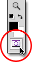
*Clicking the Quick Mask icon at the bottom of the Tools panel.*

In Quick Mask mode, the standard selection outline is replaced by a red overlay. The overlay represents areas that are currently being protected. In other words, they're not part of the selection. Areas that are fully visible, not covered by the overlay, *are* selected. We can see this clearly in my document window. The area in the center of the image, which was inside the selection I drew with the Elliptical Marquee Tool, is fully visible which means it's currently selected. The rest of the image is covered by the overlay because it was not part of my selection:

*In Quick Mask mode, the red overlay indicates areas that are not selected.*

Photoshop's Quick Mask mode doesn't just give us a different way to view selections. It also lets us edit selections in ways that are not possible with the standard selection outline. For example, we can run any of Photoshop's filters on the overlay! At the moment, the transition between the area covered by the overlay and the area not covered by the overlay is very sharp and abrupt, which means my selection still has hard edges. To soften them, I can simply blur them using the **Gaussian Blur** filter.

I'll select the Gaussian Blur filter by going up to the **Filter** menu at the top of the screen, then from there I'll choose **Blur** and then **Gaussian Blur**:

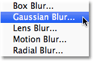
*Going to Filter > Blur > Gaussian Blur.*

This opens the Gaussian Blur dialog box. Click on the **Radius slider** at the bottom of the dialog box, then keep an eye on your document window as you begin dragging the slider towards the right. As you drag the slider, you'll see the edges of the Quick Mask overlay begin to soften. The further you drag the Radius slider, the more blurring you'll apply to the overlay and the softer the edges will appear. Thanks to Quick Mask mode and the Gaussian Blur filter, we now have a live preview of the amount of feathering we're applying to our selection edges! No more guess work needed because we can see exactly what's happening to the edges as we drag the slider:

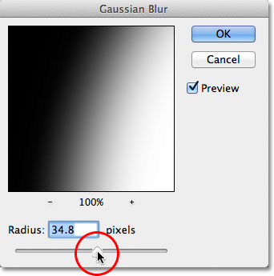
*Blur the overlay edges by dragging the Radius slider towards the right.*

When you're happy with the way things looks, click OK to close out of the Gaussian Blur dialog box. Here, we can see the effect the Gaussian Blur filter had on my Quick Mask overlay. The transition between the fully visible and overlay-covered areas is now much softer, which means my selection edges are now softer:

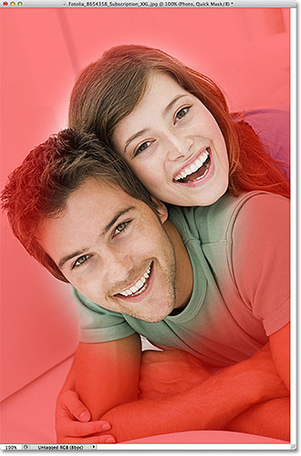
*Softer overlay edges mean softer selection edges.*

Now that we've softened our selection edges, we can switch out of Quick Mask mode and back into normal mode by clicking again on the **Quick Mask icon** at the bottom of the Tools panel or by pressing the letter **Q** on the keyboard:

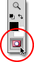
*Click again on the Quick Mask icon to switch back to normal mode.*

This brings us back to our standard selection outline, which again gives us no indication that we just feathered the selection in Quick Mask mode. That's okay, though. The feathering is still there whether we can see it at the moment or not:

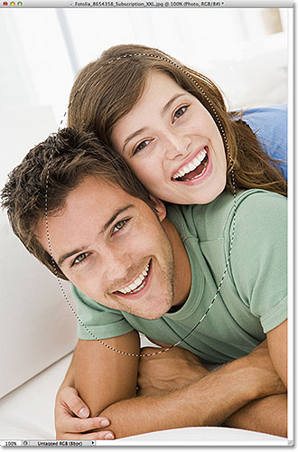
*Back to normal mode.*

The only remaining problem is that I currently have the wrong part of the image selected. I want to keep the area I've selected in the center of the image and delete the area around it, which means I'll first need to **invert** my selection by going up to the **Select** menu at the top of the screen and choosing **Inverse**. This will deselect the area that was previously selected and select the area that was not previously selected, effectively swapping the selection:

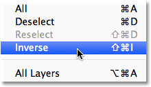
*Going to Select > Inverse.*

With the selection now inverted, I'll delete the area around the couple by pressing **Backspace** (Win) / **Delete** (Mac) on my keyboard, then I'll press **Ctrl+D** (Win) / **Command+D** (Mac) on my keyboard to quickly remove the selection outline from the document since we no longer need it. Thanks to the selection edges being softened in Quick Mask mode with its live preview, we get the smooth transition we expected between the couple in the center of the image and the white background surrounding them:

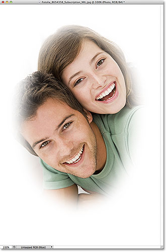
*The final vignette effect.*