# Custom Shapes As Text Frames In Photoshop

> Source: [https://www.photoshopessentials.com/basics/fill-shapes-with-text/](https://www.photoshopessentials.com/basics/fill-shapes-with-text/)
> Downloaded and converted to Markdown.

In this **Photoshop Basics** tutorial, we'll learn how to create some interesting text layouts using **custom shapes as text frames**! In other words, we'll be drawing a shape using one of the custom shapes that ship with Photoshop, but rather than filling the shape with color as we normally would, we'll fill it with text!

Here's an example of the effect we'll be learning to create:

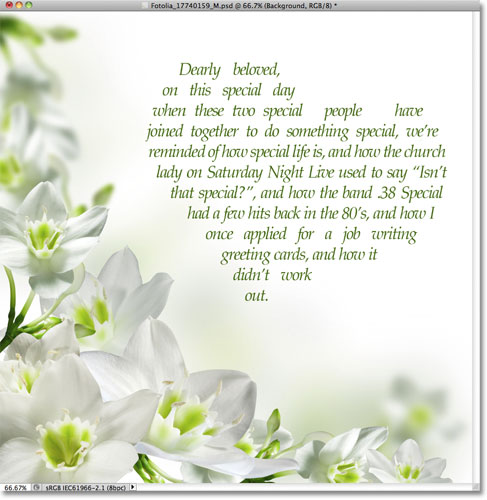
*A heart shape, rotated slightly and filled with text.*

Let's get started!

### Step 1: Select The Custom Shape Tool

Select Photoshop's **Custom Shape Tool** from the Tools panel. By default, it's hiding behind the Rectangle Tool, so click on the Rectangle Tool's icon and hold your mouse button down for a second or two until a fly-out menu appears showing a list of the other tools available in that spot, then select the Custom Shape Tool from the list:

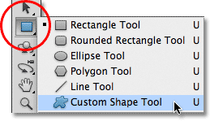
*Click and hold on the Rectangle Tool, then choose the Custom Shape Tool from the menu.*

### Step 2: Choose A Shape

With the Custom Shape Tool selected, click on the shape **preview thumbnail** in the Options Bar along the top of the screen:

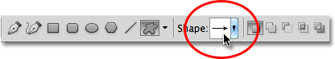
*The preview thumbnail displays the shape that's currently selected.*

This opens Photoshop's **Shape Picker**, which displays small thumbnails of all the custom shapes we can choose from. To select a shape, just click on its thumbnail. I'm going to choose the heart shape. Once you've chosen a shape, press **Enter** (Win) / **Return** (Mac) to close out of the Shape Picker:

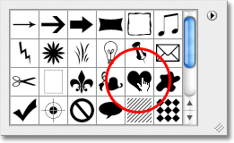
*Selecting the heart shape by clicking on its thumbnail.*

### Step 3: Select The "Paths" Option

Near the far left of the Options Bar is a row of three icons, each one representing a different type of shape we can draw. Photoshop gives us a choice of drawing normal shapes, paths, or pixel-based shapes. To use a shape as a container for our text, we want to draw a path, which is essentially an outline of the shape. We'll be placing our text inside the outline. Click on the middle of the three icons to select the **Paths** option:

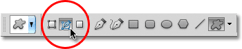
*Click on the Paths option (the middle of the three icons).*

### Step 4: Draw Your Shape

With the Paths option selected in the Options Bar, click inside your document and drag out your shape. You'll see your shape appearing as a thin outline as you drag. You can hold down your **Shift** key as you drag to force the shape to keep its original appearance while you're drawing it. If you need to reposition the shape as you're drawing it, hold down your **spacebar**, drag the shape to where you need it in the document, then release your spacebar and continue dragging. Here, I've drawn my heart shape in the top right section of the image:

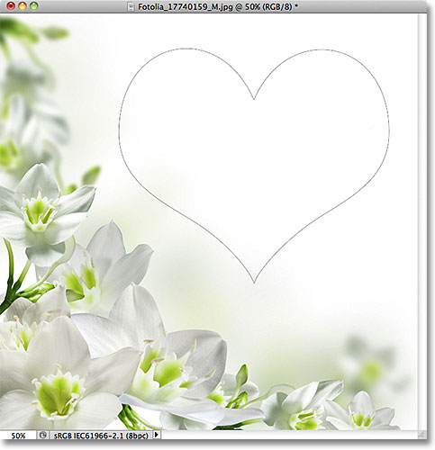
*Click and drag out your shape in the document. It will appear as an outline.*

### Step 5: Reshape, Rotate Or Move The Path (Optional)

If you need to reshape or rotate the path (the shape outline), or move it to a different spot, the easiest way to do it is by going up to the **Edit** menu in the Menu Bar along the top of the screen and choosing **Free Transform Path**. You could also press **Ctrl+T** (Win) / **Command+T** (Mac) to quickly select the same command with the keyboard shortcut:

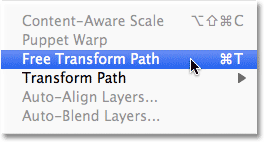
*Go to Edit > Free Transform Path.*

This places the Free Transform Path handles and bounding box around the shape. To reshape it, simply click on any of the **handles** (the small squares) around the bounding box and drag them. To resize the shape, hold down your **Shift** key and drag any of the four **corner handles**. To rotate it, move your cursor anywhere outside the bounding box, then click and drag with your mouse. Finally, to move the shape, click anywhere inside the bounding box and drag.

I'm going to rotate my heart shape a little so the curve down the left side flows better with the layout of the flowers:

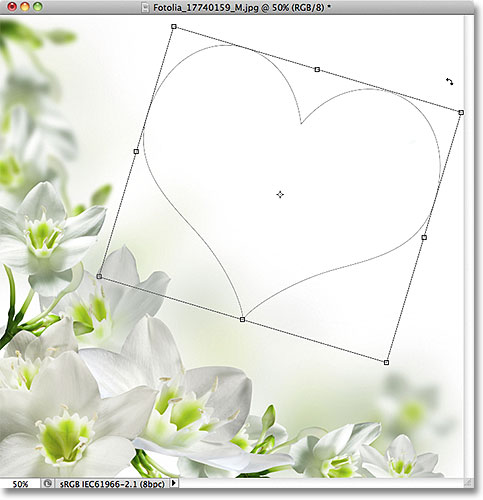
*Rotating the shape with Free Transform Path.*

Press **Enter** (Win) / **Return** (Mac) when you're done to accept the changes and exit out of the Free Transform Path command:

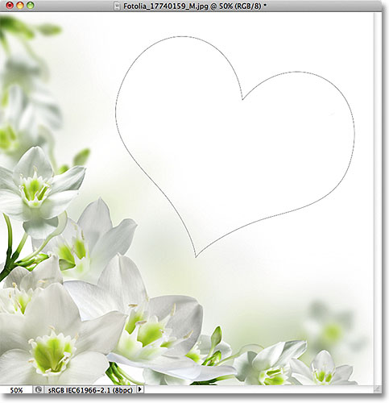
*The outline now appears rotated.*

### Step 6: Select The Type Tool

Now that we have our path, we're ready to add our text! Select the **Type Tool** from the Tools panel:

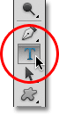
*Select the Type Tool.*

### Step 7: Choose Your Font

Select the font you want to use for your text in the Options Bar. For my design, I'll use Palatino Italic set to 12 pt:

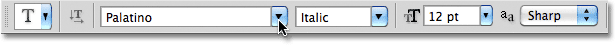
*Choose your font from the Options Bar.*

To choose a color for my text, I'll click on the **color swatch** in the Options Bar:

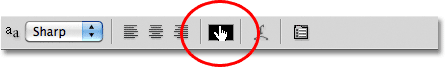
*Click on the color swatch to choose a color for your text.*

This opens Photoshop's **Color Picker**. I'll choose a dark green from the Color Picker to match the color from the flowers in my image. Once you've chosen a color, click OK to close out of the Color Picker:

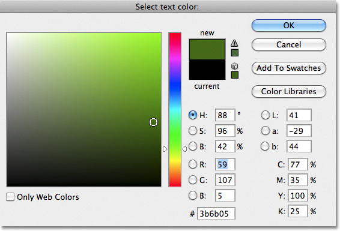
*Choose a color for your text from the Color Picker.*

### Step 8: Open The Paragraph Panel

Click on the **Character / Paragraph panel toggle** icon to the right of the color swatch in the Options Bar:

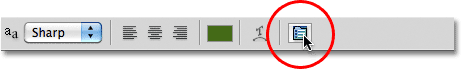
*The toggle icon opens and closes the Character and Paragraph panels.*

This opens Photoshop's **Character** and **Paragraph** panels which are hidden by default. Select the **Paragraph** panel by clicking on its name tab at the top of the panel group:

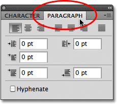
*Click on the Paragraph panel's tab.*

### Step 9: Choose The "Justify Centered" Option

With the Paragraph panel now open, click on the **Justify Centered** option to select it. This will make it easier for the text we're about to add to fill the entire width of the shape. When you're done, click again on the **toggle icon** in the Options Bar to hide the Character and Paragraph panels since we no longer need them:

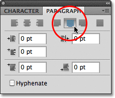
*Select the "Justify Centered" option.*

### Step 10: Add Your Text

At this point, all that's left to do is add our text. Move the Type Tool's cursor anywhere inside the shape. You'll see a **dotted ellipse** appear around the cursor icon, which is Photoshop's way of telling us that we're about to add our text inside the path:

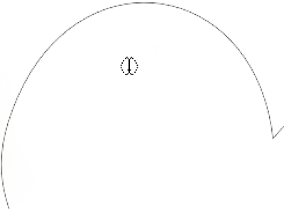
*A dotted ellipse appears around the cursor icon when you move it inside the shape.*

Click anywhere inside the shape and begin typing your text. As you type, you'll see that the text is constrained to the area inside the path:

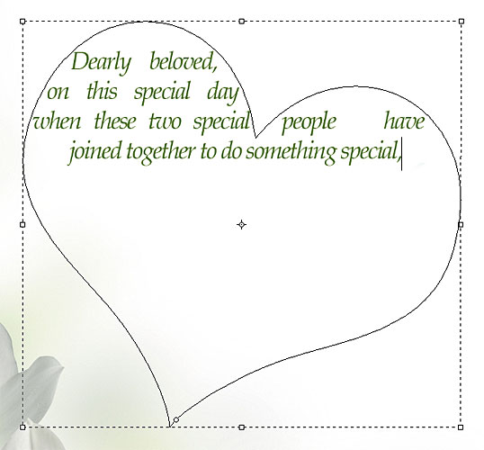
*As you type, the text stays within the boundaries of the shape.*

Continue adding more text until you've filled the shape area:

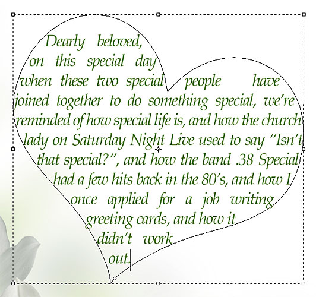
*The shape is now filled with text.*

### Step 11: Click On The Checkmark To Accept Your Text

When you're done adding your text, click on the **checkmark** in the Options Bar to accept it and exit out of Photoshop's text editing mode:

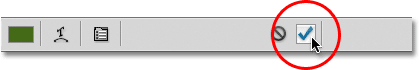
*Click on the checkmark to accept the text.*

The text has now been added and fills the shape area nicely, but we can still see the path outline around it:

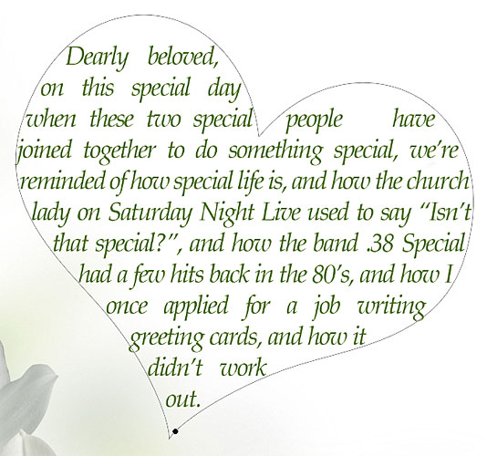
*The path around the text remains visible.*

To hide the path outline, simply click on a different layer in the Layers panel. In my case, my document only contains two layers - the Type layer that holds my text (which is currently selected) and the Background layer below it that holds my background image, so I'll click on the Background layer to select it:

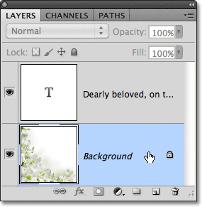
*The path will be visible when the text layer is active. To hide it, select a different layer.*

And with that, we're done! The text I added may not win me any literary awards, but we've now seen how easy it is to use Photoshop's custom shapes as containers for text:

*The final result.*