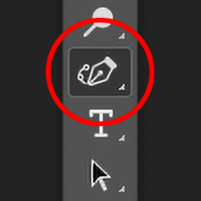
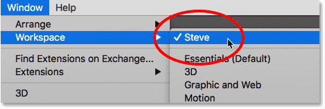
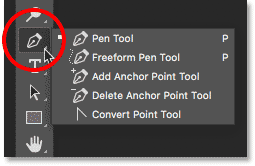
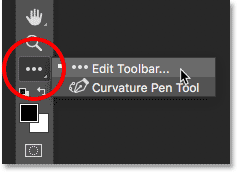
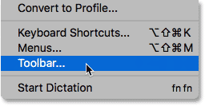
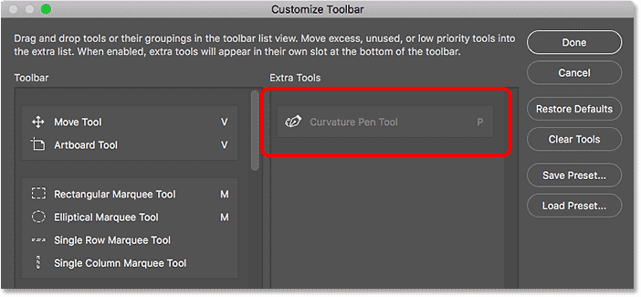
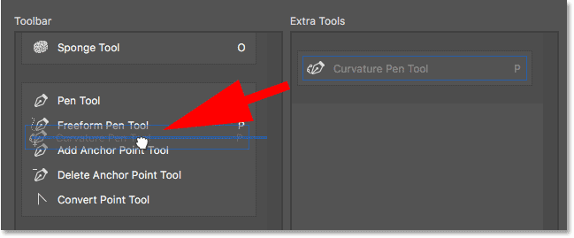
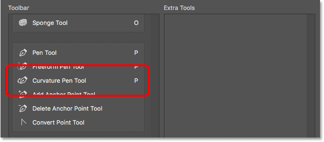
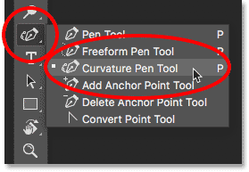

# How To Find The Missing Curvature Pen Tool In Photoshop CC 2018

> Source: [https://www.photoshopessentials.com/basics/find-missing-curvature-pen-tool-photoshop-cc-2018/](https://www.photoshopessentials.com/basics/find-missing-curvature-pen-tool-photoshop-cc-2018/)
> Downloaded and converted to Markdown.

Upgraded to Photoshop CC 2018 but can't find the Curvature Pen Tool in the Toolbar? Chances are it's because you're using a custom workspace. This tutorial shows you how to find and restore the missing Curvature Pen Tool using the Customize Toolbar feature in Photoshop.

In a previous tutorial, we learned how to use the brand new **Curvature Pen Tool** in Photoshop CC 2018 to easily draw shapes and paths. Normally, the Curvature Pen Tool is found with Photoshop's standard Pen Tool in the Toolbar. But if you've upgraded to CC 2018 from an earlier version of Photoshop, and you're using a custom workspace that was created in that earlier version, you may not see the Curvature Pen Tool listed anywhere. That's because Photoshop CC 2018 does not automatically add the Curvature Pen Tool to your custom workspace. To use it, you'll need to add the tool manually. In this quick tutorial, we'll learn how to restore the Curvature Pen Tool using the **Customize Toolbar** feature in Photoshop. Let's see how it works!

As with the previous [Curvature Pen Tool](/basics/use-curvature-pen-tool-photoshop-cc-2018/) tutorial, this one is only for [Photoshop CC 2018](https://prf.hn/l/dlXjD2w) users (or later if you're reading this in the future). If you're an Adobe Creative Cloud subscriber and have not yet updated to Photoshop CC 2018, see [How To Keep Photoshop CC Up To Date](/basics/update-photoshop-cc/) for everything you need to know. Let's get started!

## The Missing Curvature Pen Tool

If you created a [custom workspace](/basics/photoshop-workspaces/) in Photoshop CC 2017 or earlier and you're using that same workspace in CC 2018, you may find that the new Curvature Pen Tool is missing from your Toolbar. To see the workspace you're currently using, go up to the **Window** menu in the Menu Bar and choose **Workspace**. Here, we see that I'm using a custom workspace named **Steve**. Even though I'm using this custom workspace in Photoshop CC 2018, the workspace itself was created and saved back in CC 2017. This means it was created before the Curvature Pen Tool was added to Photoshop:

*Using a custom workspace from a previous version of Photoshop.*

As I mentioned, the new Curvature Pen Tool is normally found nested behind the standard Pen Tool in the [Toolbar](/basics/photoshop-tools-toolbar-overview/). Yet when I click and hold on the [Pen Tool](/basics/selections/pen-tool-selections/) icon to view the additional tools behind it, the Curvature Pen Tool is not there:

*The Curvature Pen Tool is missing from the list.*

## How To Restore The Curvature Pen Tool

### Step 1: Open The Customize Toolbar Dialog Box

If your Curvature Pen Tool is missing from the Toolbar, all you need to do is add it manually using Photoshop's Customize Toolbar feature. Click on the **Edit Toolbar** icon (the three little dots) near the bottom of the Toolbar. Then choose **Edit Toolbar** from the menu:

*Clicking the "Edit Toolbar" icon.*

If you're not seeing the icon, you can also open the Customize Toolbar dialog box by going up to the **Edit** menu in the Menu Bar and choosing **Toolbar**. Either way works:

*Choosing "Toolbar" from under the Edit menu.*

### Step 2: Drag The Curvature Pen Tool Into The Toolbar

This opens Photoshop's [Customize Toolbar](/basics/custom-toolbar-photoshop/) dialog box. The **Toolbar** column on the left shows you the tools that are currently found in your Toolbar, along with how those tools are grouped together. The **Extra Tools** column on the right shows any additional tools that are available but are not part of your current Toolbar layout. In my case, we see the Curvature Pen Tool sitting in that Extra Tools column on the right:

*The Customize Toolbar dialog box showing the Curvature Pen Tool as an Extra Tool.*

To add the Curvature Pen Tool to your Toolbar, simply drag it from the Extra Tools column on the right into the Toolbar column on the left. To add it where it would normally appear (nested in with the Pen Tool), scroll down through the list of tools in the Toolbar column until you get to the group that starts with the **Pen Tool** at the top. The Curvature Pen Tool is normally found directly below the Freeform Pen Tool in the group, so drag it between the **Freeform Pen Tool** and the **Add Anchor Point Tool**. Of course, you're free to place the Curvature Pen Tool anywhere you like. The **blue horizontal bar** shows you exactly where the tool will appear:

*Drag the Curvature Pen Tool from the Extra Tools column into the Toolbar column.*

Release your mouse button, and Photoshop drops the Curvature Pen Tool into place:

*The Curvature Pen Tool has been added to the current Toolbar layout.*

### Step 3: Select The Curvature Pen Tool From The Toolbar

Click **Done** to close the Customize Toolbar dialog box. And now, if we click and hold on the Pen Tool slot in the Toolbar, we see that the Curvature Pen Tool appears exactly where it should be:

*The Curvature Pen Tool now appears in the Toolbar.*

And there we have it! That's a quick tip on how to find and restore the missing Curvature Pen Tool when you're using custom workspaces in Photoshop CC 2018! Be sure to check out our [Curvature Pen Tool](/basics/use-curvature-pen-tool-photoshop-cc-2018/) tutorial to learn all about this great new feature. Or visit our [Photoshop Basics](/basics/) section for similar tutorials!